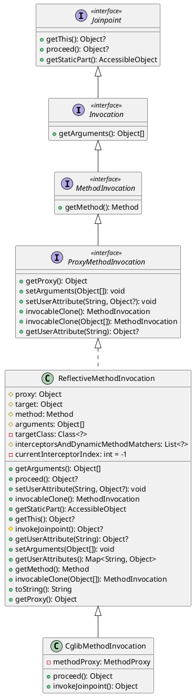
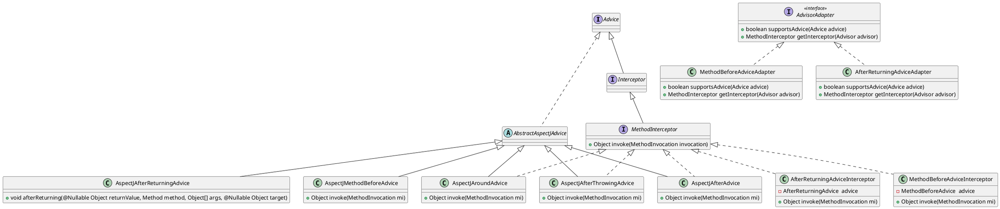

# 入门示例

> Hello Docsify!

## tabs选项卡示例
<!-- tabs:start -->

#### **English**

Hello!

```java
public class LazyDoubleCheckSingleton {
    private static volatile LazyDoubleCheckSingleton INSTANCE;

    private LazyDoubleCheckSingleton() {
        // 私有构造函数
    }

    public static LazyDoubleCheckSingleton getInstance() {
        if (INSTANCE == null) {
            synchronized (LazyDoubleCheckSingleton.class) {
                if (INSTANCE == null) {
                    INSTANCE = new LazyDoubleCheckSingleton();
                }
            }
        }
        return INSTANCE;
    }
}
```

#### **French**

Bonjour!

#### **Italian**

Ciao!

<!-- tabs:end -->

## alerts示例

> [!NOTE]
> An alert of type 'note' using global style 'callout'.

> [!TIP]
> An alert of type 'tip' using global style 'callout'.

> [!WARNING]
> An alert of type 'warning' using global style 'callout'.

> [!ATTENTION|style:flat]
> An alert of type 'attention' using special style 'flat'.

> [!important]
> An alert of type 'important' using global style 'callout'.


## PlantUML示例





## 任务列表

* [ ] 每天记得喝八杯水
* [x] ~每天运动一小时~
* [x] 每天看书两小时

## FAQ问答示例

+ 问题1? +

  答案1

+ 问题2? +

  答案2