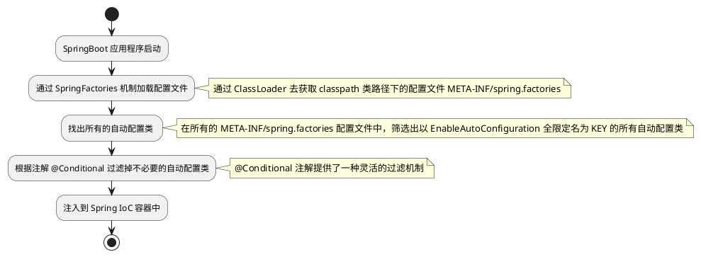

# SPI机制

## 概念
SPI(Service Provider Inteface)，它是从 Java6 开始引入的，是一种基于 ClassLoader 来**发现并加载服务**的机制。<br />一个标准的 SPI，由 3 个组件构成，分别是：

1. **Service**：是一个公开的**接口**或者**抽象类**，定义了一个抽象的功能模块
2. **Service Provider**：则是 Service 接口的一个**实现类**
3. **ServiceLoader**：是 SPI 机制中的**核心组件**，负责**在运行时发现并加载** **Service Provider**

## 原理

Application 应用程序先调用 ServiceLoader 中的 load() 方法，Service 接口作为参数传入，此时就会去加载当前应用中有关于这个接口的所有 ServiceProvider 实现类，获取到 ServiceProvider 之后就可进行下一步操作了。<br />

> [!ATTENTION]
>
> Application 应用程序并不关心 Service 接口的具体实现，它只与 Service 接口打交道即可。

## 在 JDBC 中的应用
JDBC，全称是 Java DataBase Connectivity。

- JDBC 即使用 Java 语言来访问数据库的一套 API
- 每个数据库厂商会提供各自的 JDBC 实现


JDBC 的调用流程：

```java
public static void main(String[] args) throws ClassNotFoundException {
    Class.forName("com.mysql.cj.jdbc.Driver");
    try (Connection connection = DriverManager.getConnection(URL, USERNAME, PASSWORD);
         Statement st = connection.createStatement();
         ResultSet rs = st.executeQuery("SELECT * FROM `user` LIMIT 1")) {
        while (rs.next()) {
            System.out.println(rs.getInt("id"));
        }
    } catch (SQLException e) {
        throw new RuntimeException(e);
    }
}
```


在 Java SPI 出现之前，使用 Class.forName 来加载数据库驱动，如下所示：
```java
// 加载 MySQL8 数据库驱动
Class.forName("com.mysql.cj.jdbc.Driver");

// 加载 Oracle 数据库驱动
Class.forName("oracle.jdbc.driver.OracleDriver");

// 加载 SqlServer 数据库驱动
Class.forName("com.microsoft.sqlserver.jdbc.SQLServerDriver");
```
看着这些硬编码的类名，一个有素养的程序员，自然而然就会想到。<br />细 B：咦！？这些类名是不是可以写到配置文件中呢？这样我更换数据库驱动时，就不用修改代码了。如：
```yaml
dirver-name: com.mysql.cj.jdbc.Driver
```
细 B：不过，这好像还是不够完美。。。我还需要记住不同的数据库厂商提供的 Driver 的类名，这也太麻烦了吧！本来头发就已经不多了啦~<br />细 B：能不能和数据库厂商商量一下，干脆让他们把配置文件也一并提供得了？这样一来，程序员省事，数据库厂商也省事，程序员不用了解具体的驱动类名，而厂商也可以启动升级驱动。<br />大 A：听起来是个好主意！问题是如果由厂商提供配置文件，那么应该如何去读取它呢？<br />细 B：还记得 **ClassLoader**吗？它除了可以加载类之外，还提供了方法 getResource() / getResources() 方法，可以**根据指定的路径，读取 classpath 下对应的文件**。可以用它来读取厂商放在 jar 包中的配置文件，当然咱们要**事先约定好配置文件的路径和格式**才行。<br />大 A：你 TM 的还真是个天才！！！这套机制，我们就叫它 SPI 吧！

> [!IMPORTANT]
>
> **使用 Java SPI 机制来加载数据库驱动**，这样做的好处就是**无需再使用 Class.forName 来加载数据库驱动，只需引入所需的数据库驱动 jar 包即可**；即使更换数据库，也只需要更换依赖的 jar 包即可，而不需要修改代码。

Q：那么具体该怎样实现的呢？<br />A：以 MySQL 驱动为例，当第一次主动调用 DriverManager.getConnection(url, user, password); 时，会先调用 DriverManager 类中的静态方法 ensureDriversInitialized()，在该静态方法中会使用 SPI 机制来加载数据库驱动，来看看 ensureDriversInitialized() 方法中最关键的两部分代码：

1. 第 601 行代码：使用 SPI 机制加载 Driver 接口的实现类

   ```java
   ServiceLoader<Driver> loadedDrivers = ServiceLoader.load(Driver.class);
   ```
2. 第 635 行代码：使用反射机制创建驱动类的实例对象，

   ```java
   Class.forName(aDriver, true, ClassLoader.getSystemClassLoader());
   ```

JDBC 要求 Driver 实现类在类加载的时候，能将自身的实例对象自动注册到 DriverManager 中，从而实现加载数据库驱动。例如：在 MySQL 的 Driver 类的静态代码块中，使用 DriverManager.registerDriver(new Driver()); 往 DriverManager 中注册 Driver 本身。即在创建 Driver 实例对象的同时会执行静态代码块中的代码将 Driver 实例对象注册到 DriverManager 中。
```java
public class Driver extends NonRegisteringDriver implements java.sql.Driver {  
    public Driver() throws SQLException {  
    }  
  
    static {  
        try {  
            DriverManager.registerDriver(new Driver());  
        } catch (SQLException var1) {  
            throw new RuntimeException("Can't register driver!");  
        }  
    }  
}
```
## 三大规范要素

1. 规范的配置文件
   1. **文件路径**：必须在 **jar** 包中的 **META-INF/services** 目录下
   2. **文件名称**：Service **接口的全限定名**
   3. **文件内容**：Service **实现类的全限定名**。如果 **有多个实现类**，那么 **每一个实现类在文件中单独占据一行**

   以 MySQL 为例，查看 mysql-connector-java 的 jar 包，可以看到在 resources 目录的 META-INF/services 下确实存在一个名称为 java.sql.Driver 接口的全限定名的配置文件，而文件内容则是 MySQL 的数据库驱动类的全限定名 com.mysql.cj.jdbc.Driver。<br />

2. Service Provider 类必须具备无参构造方法

   Service **接口的实现类**，即 ServiceProvider 类，**必须具备无参构造方法**，因为随后会通过**反射**技术 Class.forName() 进行实例化，使用的是不带参数的无参构造。<br />以 MySQL 驱动为例，确实存在一个无参构造方法。

   ```java
   public class Driver extends NonRegisteringDriver implements java.sql.Driver {  
       public Driver() throws SQLException {  
       }  
     
       static {  
           try {  
               DriverManager.registerDriver(new Driver());  
           } catch (SQLException var1) {  
               throw new RuntimeException("Can't register driver!");  
           }  
       }  
   }
   ```

3. 保证能加载到配置文件和 ServiceProvider 类，有以下三种方式可以实现：

   - [x] 将 ServiceProvider 的 jar 包放到 classpath 下 

   - [ ] 将 jar 包安装到 JRE 的扩展目录当中
   - [ ] 自定义一个 ClassLoader

   以 MySQL 为例，我们只需通过 maven 将 MySQL 的驱动 jar 包作为依赖引入后，JDBC 就会自动加载 MySQL 的数据库驱动。

   ```xml
   <dependency>  
       <groupId>mysql</groupId>  
       <artifactId>mysql-connector-java</artifactId>  
       <version>8.0.28</version>  
   </dependency>
   ```

## 总结

- 作用：提供一种**组件发现与注册**的方式，可以用于实现各种插件，或者灵活替换框架所使用的组件。
- 优点：基于面向接口编程，优雅地实现模块之间的**解耦**。
- 设计思想：**面向接口** + **配置文件** + **反射技术**，YYDS！！！
- 应用场景：JDBC、SLF4J、Servlet 容器初始化...

## 手撕一个 SPI 应用实例

从0开始手撸一个 SPI 应用，在正式撸码之前，首先介绍一下背景：<br />假设有一家公司A，它需要连接互联网。它定义了一个连接网络的API，由中国移动和中国联通来提供网络服务。那么这个场景涉及到三方：公司A、中国移动、中国联通。<br />其中公司A负责开发 simple-company 和 simple-api 项目，simpl-company 代表的是业务应用程序，simple-api 代表的是 SPI 中的 Service 接口，而移动和联通则以 jar 包的形式分别提供各自的联网服务。<br /><br />项目关系图如下：simple-company 调用 simple-api，而 simple-isp-mobile 和 simple-isp-unicom 则实现了 simple-api。<br /><br />代码实现：

1. simple-api：整个模块仅定义一个 InternetService 接口，作为 SPI 机制中的 Service；

   ```java
   public interface InternetService {
       /** 连接网络 */
       void connectInternet();
   }
   ```
2. simple-isp-mobile 模块实现步骤如下所示：

   1. 依赖于 simple-api 模块；

      ```xml
      <dependencies>
          <dependency>
              <groupId>fun.xiaorang</groupId>
              <artifactId>simple-api</artifactId>
              <version>1.0-SNAPSHOT</version>
          </dependency>
      </dependencies>
      ```

   2. 定义 ChinaMobile 和 BeijingChinaMobile 两个类都实现 InternetService 接口，作为 SPI 机制中的 ServiceProvider；

      ```java
      public class ChinaMobile implements InternetService {
          @Override
          public void connectInternet() {
              System.out.println("connect internet by [Beijing China Mobile]");
          }
      }
      ```

      ```java
      public class BeijingChinaMobile implements InternetService {
          @Override
          public void connectInternet() {
              System.out.println("connect internet by [Beijing China Mobile]");
          }
      }
      ```

   3. 在 resources 目录的 META-INF/services 下创建一个名称为 InternetService 接口的全限定名的配置文件，文件内容为 ChinaMobile 和 BeijingChinaMobile 两个 ServiceProvider 的全限定名，存在多个 ServiceProvider 时多行表示；

      ```
      fun.xiaorang.spi.mobile.ChinaMobile
      fun.xiaorang.spi.mobile.BeijingChinaMobile
      ```
3. simple-isp-unicom 模块实现步骤如下所示，与 simple-isp-mobile 模块实现步骤非常相似，唯一不同的是本模块只提供了一个 ServiceProvider
   1. 同样依赖于 simple-api 模块；

      ```xml
      <dependencies>
          <dependency>
              <groupId>fun.xiaorang</groupId>
              <artifactId>simple-api</artifactId>
              <version>1.0-SNAPSHOT</version>
          </dependency>
      </dependencies>
      ```

   2. 定义 ChinaUnicom 类实现 InternetService 接口，作为 SPI 机制中的 ServiceProvider；

      ```java
      public class ChinaUnicom implements InternetService {
          @Override
          public void connectInternet() {
              System.out.println("connect internet by [China Unicom]");
          }
      }
      ```

   3. 在 resources 目录的 META-INF/services 下创建一个名称为 InternetService 接口的全限定名的配置文件，文件内容为 ChinaUnicom 的全限定名；

      ```
      fun.xiaorang.spi.unicom.ChinaUnicom
      ```
4. simple-company：使用 ServiceLoader 的 load() 方法发现并加载 InternetService 服务，面向 Service 接口编程！

   ```java
   public class ApiTest {
       @Test
       public void test_00() {
           for (InternetService internetService : ServiceLoader.load(InternetService.class)) {
               internetService.connectInternet();
           }
       }
   }
   ```

   对于 simple-company 模块先只引入 simple-isp-mobile 模块，运行结果如下所示：表示通过中国移动和北京移动联网成功！<br /><br />接着我们将网络服务商替换成联通，也就是将依赖的模块换成 simple-isp-unicom，代码不需要改动，运行结果如下所示：表示更换为中国联通联网成功了！<br />

## SPI 与 SpringBoot 自动配置
最后，让我们触类旁通，举一反三，以 SpringBoot 框架的自动配置为例，一起探讨一下 SPI 设计思想的发散和延伸。<br />SpringBoot 自动配置，即大名鼎鼎的 Auto-Configuration：

- 它是指基于你引入的依赖 jar 包，对 SpringBoot 应用进行自动配置
- 它提供了自动配置功能的依赖 jar 包，通常被称为 Starter，如官方的：spring-boot-starter-redis，非官方的：mybatis-spring-boot-starter 等等

SpringBoot 项目启动的时候默认会自动扫描当前项目的 package，然后将其中的配置类注入到 IoC 容器中。但是，当我们与其他框架进行集成的时候，如 mybatis、rabbitmq 框架等等，SpringBoot 是不支持直接扫描其他框架的 package 的，这个时候则需要使用 Auto-Configuration 机制，基于引入的依赖 jar 包对 SpringBoot 应用进行自动配置，换言之呢，就是将其他 jar 包的配置类注入到 IOC 容器中。<br /><br />如果你作为 SpringBoot 的开发人员，你会怎样实现 Auto-Configuration 机制呢？<br />大 A：作为 Leader，我先提几点要求：首先，不能脱离 SpringBoot 框架，我可不想重复造轮子！<br />细 B：同意。我们可以继续使用 @Configuration 等已有注解，然后将自动配置类注入到 Spring 的 IOC 容器中。 <br />大 A：作为 Leader，我再提个问题，SpringBoot 框架默认是扫描当前项目的 package 的，那么如何将其他 jar 包中的配置类也注入到 IOC 容器中呢？<br />细 B：让用户使用注解 @ComponentScan 来扫描第三方的 package 吧！ <br />大 A：听起来对用户很不友好啊！用户只想引入依赖的 jar 包就行。既然我们叫“自动配置”，那么能否实现全自动，而不要是半自动呢？<br />细 B：让我想想，这个需求听起来很耳熟。。。要不我们参考参考 Java SPI 的设计思想？<br /><br />以 [mybatis-spring-boot-autoconfigure](https://github.com/mybatis/spring-boot-starter/tree/master/mybatis-spring-boot-autoconfigure/src/main/java/org/mybatis/spring/boot/autoconfigure) 为例来分析一下 SpringBoot 自动配置：<br /><br />由上图可知，在 mybatis-spring-boot-autoconfigure 中存在两个自动配置类，分别是 MybatisAutoConfiguration 和 MybatisLanguageDriverAutoConfiguration，然后在 resources 目录下的 META-INF 中确实存在一个 spring.factories 配置文件 ，里面的内容是 KEY-VALUE 的格式，其中 KEY 是 EnableAutoConfiguration 的全限定类名，VALUE 则是两个自动配置类的全限定名，两个类名直接用逗号隔开。<br />简单总结一下 SpringBoot 自动配置的核心流程：



以上，就是 SpringBoot 自动配置的原理，它是不是和 SPI 的设计思想有着异曲同工之妙呢？
