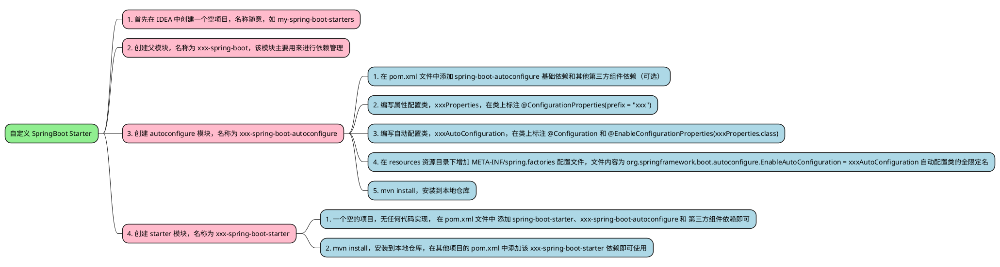

# 自定义 SpringBoot Starter

## 何为 SpringBoot Starter？

SpringBoot Starter 是一个提供了 " 一站式服务（one-stop）" 的依赖 Jar 包。它主要有如下两个优点：

- 提供了自动配置的功能，遵从 " 约定大于配置 " 的原则，开发人员可以在少量配置甚至不配置的情况下 " 开箱即用 " 某个组件；
- 提供了良好的依赖管理，当需要某个组件时，只需要引入相关的 Starter 即可，不需要再手动引入各种依赖 Jar 包，从而避免了包遗漏、版本冲突等不必要的问题；

一个标准的 Starter，通常由两个模块构成，分别是 <u>starter</u> 模块和 <u>autoconfigure</u> 模块。

- starter 模块：
  - 通常是一个空的 Jar 包，它的主要作用是对依赖进行集中管理，构建了一个统一的依赖视图，方便用户使用
  - 它会依赖 autoconfigure 模块以及第三方组件的 Jar 包；
- autoconfigure 模块：
  - 自动配置的核心模块，其中包括了自动配置类、`META-INF/spring.factories` 配置文件以及所需的配置项，配置项通常是通过 `@ConfigurationProperties` 注解从 SpringBoot 应用的配置文件 `application.yml` 中读取对应的配置值，然后再通过 `@EnableConfigurationProperties` 注解将其注入到 IoC 容器中
  - 它会依赖必要的 SpringBoot 核心 Starter 和可选依赖于第三方组件的 Jar 包，从而使得该模块更容易扩展，增加更多的可选功能

Starter 结构图如下所示：<br /><br />以官方的 spring-boot-starter-data-redis 举例：<br /><br />如上图所示：Redis 的自动配置类有 3 个，分别为 RedisAutoConfiguration、RedisReactiveAutoConfiguration 和 RedisRepositoriesAutoConfiguration，而且在配置文件 spring.factories 中也有对应的配置内容。最后，在 Redis 的自动配置模块中也定义了与 Redis 相关的配置项，咱们可以在 SpringBoot 应用程序中的配置文件 application.yml 配置文件中来配置 Redis 服务器的连接信息。<br />可选依赖（Optional) 在 Starter 中很重要，咱们花一点时间来了解一下，用以下两个例子来说明一下可选依赖的作用是什么。

- 案例一：假设有一个项目 A 可选依赖项目 B，那么在使用 Maven 编译项目 A 时，会将项目 B 添加到项目 A 的 classpath 中。此时，可选依赖和普通依赖表现是一致的。<br />
- 案例二：假设有一个项目 X，它依赖项目 A， 而项目 A 又可选依赖项目 B，那么在使用 Maven 编译项目 X 时，项目 B 是不会被添加到项目 X 的 classpath 中的，除非，项目 X 直接声明依赖项目 B；<br /><br />总的来说，可选依赖的作用就是<strong style="font-size:19px;background-color: rgb(251, 228, 231);">阻断依赖传递</strong>。

## 如何自定义一个 SpringBoot Starter？

根据官方文档 [SpringBoot-Creating Your Own Starter](https://docs.spring.io/spring-boot/docs/3.0.6/reference/htmlsingle/#features.developing-auto-configuration.custom-starter) 所述，实现步骤如下图所示：<br />命名规范：官方提供的 Starter 以 spring-boot-starter-xxx 的形式命名，为了与官方提供的 Starter 进行区分，官方建议第三方开发者或技术厂商自定义的 Starter 以 xxx-spring-boot-starter 的形式命名，如 [mybatis-spring-boot-starter](https://github.com/mybatis/spring-boot-starter/tree/master/mybatis-spring-boot-starter)、[druid-spring-boot-starter](https://github.com/alibaba/druid/tree/master/druid-spring-boot-starter)、[dynamic-datasource-spring-boot-starter](https://github.com/baomidou/dynamic-datasource-spring-boot-starter) 等等；<br />模块规范：官方建议在自定义 Starter 时，需要创建两个模块：autoconfigure 和 starter 模块，其中，starter 模块会依赖 autoconfigure 模块。当然，这只是官方的建议，并不是硬性规定，如果自动配置相对简单并且没有可选功能的话，可以将这两个模块合并为一个模块 xxx-spring-boot-starter。



现在从 0 开始，手撸一个基于 Amazon S3 协议可适配市面上大部分对象存储服务（OSS - Object Storage Service）的 SpringBoot Starter。

## 实现一个基于 Amazon S3 协议的对象存储服务的 SpringBoot Starter

- 什么是 Amazon S3 协议？

  Amazon Simple Storage Service（Amazon S3）是一种对象存储服务，提供行业领先的可扩展性、数据可用性、安全性和性能。各种规模和行业的客户都可以使用 Amazon S3 存储和保护任意数量的数据，用于数据湖、网站、移动应用程序、备份和恢复、归档、企业应用程序、IoT 设备和大数据分析。Amazon S3 提供了管理功能，使您可以优化、组织和配置对数据的访问，以满足您的特定业务、组织和合规性要求。

- 为什么要基于 Amazon S3 协议进行开发？

  由于目前市面上大部分 OSS 对象存储服务都兼容 Amazon S3 协议，如阿里云 OSS，腾讯 COS、七牛云 OSS、Minio 等等；正因如此，为了使自己封装的 Starter 可适配、可扩展、易于迁移，所以才使用 AmazonS3 协议进行开发，即使是将来更换产品，也不需要调整代码，仅修改配置文件即可！

### oss-spring-boot 父模块

创建一个空项目，名称随意，如 `my-spring-boot-starters` <br />

创建父模块，名称为 `oss-spring-boot`，该模块主要用来进行<u>**依赖管理**</u> <br /><br />其 pom.xml 配置文件如下所示：

```xml
<?xml version="1.0" encoding="UTF-8"?>
<project xmlns:xsi="http://www.w3.org/2001/XMLSchema-instance"
         xmlns="http://maven.apache.org/POM/4.0.0"
         xsi:schemaLocation="http://maven.apache.org/POM/4.0.0 http://maven.apache.org/xsd/maven-4.0.0.xsd">
    <modelVersion>4.0.0</modelVersion>

    <groupId>fun.xiaorang</groupId>
    <artifactId>oss-spring-boot</artifactId>
    <version>1.0-SNAPSHOT</version>
    <packaging>pom</packaging>
    <modules>
        <module>oss-spring-boot-autoconfigure</module>
        <module>oss-spring-boot-starter</module>
        <module>oss-spring-boot-starter-test</module>
    </modules>

    <properties>
        <maven.compiler.source>15</maven.compiler.source>
        <maven.compiler.target>8</maven.compiler.target>
        <project.build.sourceEncoding>UTF-8</project.build.sourceEncoding>
        <spring-boot.version>2.6.7</spring-boot.version>
        <aws.s3.version>1.12.466</aws.s3.version>
    </properties>

    <dependencyManagement>
        <dependencies>
            <dependency>
                <groupId>org.springframework.boot</groupId>
                <artifactId>spring-boot-dependencies</artifactId>
                <version>${spring-boot.version}</version>
                <type>pom</type>
                <scope>import</scope>
            </dependency>
            <dependency>
                <groupId>com.amazonaws</groupId>
                <artifactId>aws-java-sdk-s3</artifactId>
                <version>${aws.s3.version}</version>
            </dependency>
            <dependency>
                <groupId>fun.xiaorang</groupId>
                <artifactId>oss-spring-boot-autoconfigure</artifactId>
                <version>${project.version}</version>
            </dependency>
            <dependency>
                <groupId>fun.xiaorang</groupId>
                <artifactId>oss-spring-boot-starter</artifactId>
                <version>${project.version}</version>
            </dependency>
        </dependencies>
    </dependencyManagement>
</project>
```

### oss-spring-boot-autoconfigure 自动配置模块

创建 autoconfigure 模块，名称为 `oss-spring-boot-autoconfigure` <br />

在 `pom.xml` 文件中添加如下依赖，其中包括必要的编译依赖、亚马逊对象存储服务 SDK 和 SpringBoot 注解处理器等依赖；

```xml
<?xml version="1.0" encoding="UTF-8"?>
<project xmlns:xsi="http://www.w3.org/2001/XMLSchema-instance"
         xmlns="http://maven.apache.org/POM/4.0.0"
         xsi:schemaLocation="http://maven.apache.org/POM/4.0.0 http://maven.apache.org/xsd/maven-4.0.0.xsd">
    <modelVersion>4.0.0</modelVersion>
    <parent>
        <groupId>fun.xiaorang</groupId>
        <artifactId>oss-spring-boot</artifactId>
        <version>1.0-SNAPSHOT</version>
    </parent>

    <artifactId>oss-spring-boot-autoconfigure</artifactId>

    <dependencies>
        <!-- 编译依赖 -->
        <dependency>
            <groupId>org.springframework.boot</groupId>
            <artifactId>spring-boot-autoconfigure</artifactId>
        </dependency>
        <!-- 可选的、但是强烈推荐的注解处理器 -->
        <dependency>
            <groupId>org.springframework.boot</groupId>
            <artifactId>spring-boot-configuration-processor</artifactId>
            <optional>true</optional>
        </dependency>
        <dependency>
            <groupId>org.springframework.boot</groupId>
            <artifactId>spring-boot-autoconfigure-processor</artifactId>
            <optional>true</optional>
        </dependency>
        <!-- 日志 -->
        <dependency>
            <groupId>org.slf4j</groupId>
            <artifactId>slf4j-api</artifactId>
            <optional>true</optional>
        </dependency>
        <!-- lombok -->
        <dependency>
            <groupId>org.projectlombok</groupId>
            <artifactId>lombok</artifactId>
            <optional>true</optional>
        </dependency>
        <!-- 亚马逊对象存储服务SDK -->
        <dependency>
            <groupId>com.amazonaws</groupId>
            <artifactId>aws-java-sdk-s3</artifactId>
            <optional>true</optional>
        </dependency>
    </dependencies>
</project>
```

#### 两个注解处理器

强烈推荐在 pom.xml 文件中添加以下这两个注解处理器，所谓的注解处理器是 SpringBoot 提供的功能，它们的作用是在编译阶段通过分析特定的注解从而生成相关的元数据。

`spring-boot-configuration-processor`：它的作用是分析 `@ConfigurationProperties` 注解生成配置项的描述信息并存放在配置文件 `META-INF/spring-configuration-metadata.json` 中，从而使得 IDEA 可以进行自动提示，方便开发人员的使用，如下所示：<br /><br />配置文件 `META-INF/spring-configuration-metadata.json` 中的内容如下所示：<br />

`spring-boot-autoconfigure-processor`：则是在编译阶段分析注解 `@EnableAutoConfiguration` 生成所有自动配置类的过滤条件的元数据，然后存放在配置文件 `META-INF/spring-autoconfigure-metadata.properties` 中，从而使得 SpringBoot 在启动时能快速的过滤掉不符合条件的自动配置类，加快 SpringBoot 应用的启动速度

配置文件 `META-INF/spring-autoconfigure-metadata.properties` 中的内容如下所示：<br />

#### 操作模板类

编写 `OssTemplate` 操作模板类，如果以后想对文件操作加入更多的功能，只需修改该类即可！以下内容参考自官方文档 [Amazon Simple Storage Service](https://docs.aws.amazon.com/zh_cn/AmazonS3/latest/userguide) [使用 AWS SDK for Java 的 Amazon S3 示例 - AWS SDK for Java1.x](https://docs.aws.amazon.com/zh_cn/sdk-for-java/v1/developer-guide/examples-s3.html)

```java
/**  
 * @author liulei  
 * @description <p style = " font-weight:bold ; ">参考自 <a href="https://docs.aws.amazon.com/zh_cn/sdk-for-java/v1/developer-guide/welcome.html">开发者指南-AWS SDK for Java 1.x</a> 以及 <a href="https://docs.aws.amazon.com/zh_cn/AmazonS3/latest/userguide/Welcome.html">用户指南</a><p/>  
 * @github <a href="https://github.com/xihuanxiaorang/java-study">java-study</a>  
 * @Copyright 博客：<a href="https://blog.xiaorang.fun">小让的糖果屋</a>  - show me the code  
 * @date 2023/10/31 15:38  
 */@Slf4j  
@RequiredArgsConstructor  
public class OssTemplate {  
    private final AmazonS3 s3Client;  
    private final OssProperties ossProperties;  
  
    /**  
     * 如果默认的桶不存在，并且配置了自动创建，则在初始化时创建默认的桶，否则抛出异常  
     */  
    @PostConstruct  
    public void init() {  
        String bucketName = ossProperties.getBucketName();  
        boolean existed = this.doesBucketExists(bucketName);  
        if (!existed) {  
            boolean createBucketIfNotExist = ossProperties.isCreateBucketIfNotExist();  
            if (!createBucketIfNotExist) {  
                throw new IllegalStateException(bucketName + "bucket does not exist!");  
            }  
            this.createBucket(bucketName);  
        }  
    }  
  
    /**  
     * 检查是否存在指定的桶  
     *  
     * @param bucketName 桶名称  
     * @return true 存在，false 不存在  
     */  
    public boolean doesBucketExists(String bucketName) {  
        return s3Client.doesBucketExistV2(bucketName);  
    }  
  
    /**  
     * 根据指定的桶名称创建一个桶  
     *  
     * @param bucketName 桶名称  
     * @param policyText 访问策略  
     * @return 桶  
     */  
    public Bucket createBucket(String bucketName, String policyText) {  
        if (doesBucketExists(bucketName)) {  
            log.info("Bucket {} already exists.", bucketName);  
            return getBucket(bucketName);  
        }  
        Bucket bucket = s3Client.createBucket(new CreateBucketRequest(bucketName));  
        this.setBucketPolicy(bucketName, policyText);  
        log.info("create bucket {} success!", bucketName);  
        return bucket;  
    }  
  
    /**  
     * 根据指定的桶名称创建一个桶  
     *  
     * @param bucketName 桶名称  
     * @param policyType 访问策略类型  
     * @return 桶  
     */  
    public Bucket createBucket(String bucketName, PolicyType policyType) {  
        return this.createBucket(bucketName, policyType.getPolicy(bucketName));  
    }  
  
    /**  
     * 根据指定的桶名称创建一个桶，使用配置的访问策略，默认为只读  
     *  
     * @param bucketName 桶名称  
     * @return 桶  
     */  
    public Bucket createBucket(String bucketName) {  
        return this.createBucket(bucketName, ossProperties.getPolicyType());  
    }  
  
    /**  
     * 设置桶的访问策略  
     *  
     * @param bucketName 桶名称  
     * @param policyText 访问策略  
     */  
    public void setBucketPolicy(String bucketName, String policyText) {  
        s3Client.setBucketPolicy(bucketName, policyText);  
    }  
  
    /**  
     * 设置桶的访问策略  
     *  
     * @param bucketName 桶名称  
     * @param policyType 访问策略类型  
     */  
    public void setBucketPolicy(String bucketName, PolicyType policyType) {  
        this.setBucketPolicy(bucketName, policyType.getPolicy(bucketName));  
    }  
  
    /**  
     * 获取所有存储桶  
     *  
     * @return 存储桶列表  
     */  
    public List<Bucket> listBuckets() {  
        return s3Client.listBuckets();  
    }  
  
    /**  
     * 根据指定的桶名称获取桶  
     *  
     * @param bucketName 桶名称  
     * @return 桶  
     */  
    public Bucket getBucket(String bucketName) {  
        return listBuckets().stream()  
                .filter(bucket -> bucket.getName().equals(bucketName))  
                .findAny()  
                .orElseThrow(() -> new IllegalStateException(bucketName + "bucket does not exist!"));  
    }  
  
    /**  
     * 根据指定的桶名称删除桶，参考自 <a href="https://docs.aws.amazon.com/zh_cn/AmazonS3/latest/userguide/delete-bucket.html">删除桶</a>  
     *     * @param bucketName 桶名称  
     * @return true 删除成功，false 删除失败  
     */  
    public boolean deleteBucket(String bucketName) {  
        try {  
            // Delete all objects from the bucket. This is sufficient  
            // for unversioned buckets. For versioned buckets, when you attempt to delete objects, Amazon S3 inserts            // delete markers for all objects, but doesn't delete the object versions.            // To delete objects from versioned buckets, delete all of the object versions before deleting            // the bucket (see below for an example).            ObjectListing objectListing = s3Client.listObjects(bucketName);  
            while (true) {  
                for (S3ObjectSummary s3ObjectSummary : objectListing.getObjectSummaries()) {  
                    s3Client.deleteObject(bucketName, s3ObjectSummary.getKey());  
                }  
                // If the bucket contains many objects, the listObjects() call  
                // might not return all of the objects in the first listing. Check to                // see whether the listing was truncated. If so, retrieve the next page of objects                // and delete them.                if (objectListing.isTruncated()) {  
                    objectListing = s3Client.listNextBatchOfObjects(objectListing);  
                } else {  
                    break;  
                }  
            }  
  
            // Delete all object versions (required for versioned buckets).  
            VersionListing versionList = s3Client.listVersions(new ListVersionsRequest().withBucketName(bucketName));  
            while (true) {  
                for (S3VersionSummary vs : versionList.getVersionSummaries()) {  
                    s3Client.deleteVersion(bucketName, vs.getKey(), vs.getVersionId());  
                }  
                if (versionList.isTruncated()) {  
                    versionList = s3Client.listNextBatchOfVersions(versionList);  
                } else {  
                    break;  
                }  
            }  
  
            // After all objects and object versions are deleted, delete the bucket.  
            s3Client.deleteBucket(bucketName);  
            log.info("delete bucket {} success!", bucketName);  
            return true;  
        } catch (AmazonServiceException e) {  
            // The call was transmitted successfully, but Amazon S3 couldn't process  
            // it, so it returned an error response.            log.error("delete bucket error!", e);  
        } catch (SdkClientException e) {  
            // Amazon S3 couldn't be contacted for a response, or the client couldn't  
            // parse the response from Amazon S3.            log.error("delete bucket error!", e);  
        }  
        return false;  
    }  
  
    /**  
     * 获取文件外链，参考自 <a href="https://docs.aws.amazon.com/zh_cn/AmazonS3/latest/userguide/ShareObjectPreSignedURL.html">使用预签名 URL 共享对象</a>  
     *     * @param bucketName        桶名称  
     * @param objectKey         对象名称  
     * @param expires           过期时间，请注意该值必须小于7天  
     * @param httpMethod        文件操作方法：GET（下载）、PUT（上传）  
     * @param requestParameters 请求参数  
     * @return 预签名的 URL  
     */    public URL getObjectUrl(String bucketName, String objectKey, Duration expires, HttpMethod httpMethod, Map<String, String> requestParameters) {  
        GeneratePresignedUrlRequest generatePresignedUrlRequest = new GeneratePresignedUrlRequest(bucketName, objectKey)  
                .withMethod(httpMethod)  
                .withExpiration(Date.from(Instant.now().plus(expires)));  
        if (requestParameters != null) {  
            requestParameters.forEach(generatePresignedUrlRequest::addRequestParameter);  
        }  
        return s3Client.generatePresignedUrl(generatePresignedUrlRequest);  
    }  
  
    /**  
     * 获取文件外链  
     *  
     * @param bucketName        桶名称  
     * @param objectKey         对象名称  
     * @param minutes           过期时间，请注意该值必须小于7天，单位：分钟  
     * @param httpMethod        文件操作方法：GET（下载）、PUT（上传）  
     * @param requestParameters 请求参数  
     * @return 预签名的 URL  
     */    public URL getObjectUrl(String bucketName, String objectKey, int minutes, HttpMethod httpMethod, Map<String, String> requestParameters) {  
        if (minutes > 7 * 24 * 60 || minutes <= 0) {  
            throw new IllegalArgumentException("minutes must be less than 7 days and greater than 0");  
        }  
        return getObjectUrl(bucketName, objectKey, Duration.ofMinutes(minutes), httpMethod, requestParameters);  
    }  
  
    /**  
     * 获取文件外链，只用于下载  
     *  
     * @param bucketName 桶名称  
     * @param objectKey  对象名称  
     * @param minutes    过期时间，请注意该值必须小于7天，单位：分钟  
     * @return 预签名的 URL  
     */    public String getObjectUrl(String bucketName, String objectKey, int minutes) {  
        boolean existed = s3Client.doesObjectExist(bucketName, objectKey);  
        if (!existed) {  
            throw new IllegalStateException("object " + objectKey + " does not exist in " + bucketName + " bucket!");  
        }  
        return getObjectUrl(bucketName, objectKey, minutes, HttpMethod.GET, null).toString();  
    }  
  
    /**  
     * 获取文件外链，只用于下载，默认过期时间为 10 分钟  
     *  
     * @param bucketName 桶名称  
     * @param objectKey  对象名称  
     * @return 预签名的 URL  
     */    public String getObjectUrl(String bucketName, String objectKey) {  
        return getObjectUrl(bucketName, objectKey, ossProperties.getUrlExpirationTime());  
    }  
  
    /**  
     * 从默认的桶中获取文件外链，只用于下载，默认过期时间为 10 分钟  
     *  
     * @param objectKey 对象名称  
     * @return 预签名的 URL  
     */    public String getObjectUrl(String objectKey) {  
        return getObjectUrl(ossProperties.getBucketName(), objectKey);  
    }  
  
    /**  
     * 获取文件上传外链，只用于上传  
     *  
     * @param bucketName        桶名称  
     * @param objectKey         对象名称  
     * @param minutes           过期时间，请注意该值必须小于7天，单位：分钟  
     * @param requestParameters 请求参数  
     * @return 预签名的 URL  
     */    public URL getPutObjectUrl(String bucketName, String objectKey, int minutes, Map<String, String> requestParameters) {  
        return getObjectUrl(bucketName, objectKey, minutes, HttpMethod.PUT, requestParameters);  
    }  
  
    /**  
     * 获取文件上传外链，只用于上传，默认过期时间为 10 分钟  
     *  
     * @param bucketName        桶名称  
     * @param objectKey         对象名称  
     * @param requestParameters 请求参数  
     * @return 预签名的 URL  
     */    public URL getPutObjectUrl(String bucketName, String objectKey, Map<String, String> requestParameters) {  
        return getPutObjectUrl(bucketName, objectKey, ossProperties.getUrlExpirationTime(), requestParameters);  
    }  
  
    /**  
     * 从默认的桶中获取文件上传外链，只用于上传，默认过期时间为 10 分钟  
     *  
     * @param objectKey 对象名称  
     * @return 预签名的 URL  
     */    public URL getPutObjectUrl(String objectKey) {  
        return getPutObjectUrl(ossProperties.getBucketName(), objectKey, null);  
    }  
  
    /**  
     * 上传文件到指定的桶中，参考自 <a href="https://docs.aws.amazon.com/zh_cn/AmazonS3/latest/userguide/upload-objects.html">上传对象</a>  
     *     * @param bucketName  桶名称  
     * @param objectKey   文件名称，例如：test/1.txt  
     * @param inputStream 要上传文件的输入流  
     * @param contextType 文件类型  
     * @return 上传结果  
     */  
    public PutObjectResult putObject(String bucketName, String objectKey, InputStream inputStream, int size, String contextType) {  
        ObjectMetadata objectMetadata = new ObjectMetadata();  
        objectMetadata.setContentType(contextType);  
        objectMetadata.setContentLength(size);  
        PutObjectRequest putObjectRequest = new PutObjectRequest(bucketName, objectKey, inputStream, objectMetadata);  
        PutObjectResult putObjectResult = s3Client.putObject(putObjectRequest);  
        // Setting the read limit value to one byte greater than the size of stream will reliably avoid a ResetException  
        putObjectRequest.getRequestClientOptions().setReadLimit(size + 1);  
        log.info("put object success! bucketName:{}, objectKey:{}", bucketName, objectKey);  
        return putObjectResult;  
    }  
  
    /**  
     * 上传文件到指定的桶中  
     *  
     * @param bucketName  桶名称  
     * @param objectKey   文件名称，例如：test/1.txt  
     * @param inputStream 要上传文件的输入流  
     * @param contextType 文件类型  
     * @return 上传结果  
     * @throws IOException IO异常  
     */  
    public PutObjectResult putObject(String bucketName, String objectKey, InputStream inputStream, String contextType) throws IOException {  
        return putObject(bucketName, objectKey, inputStream, inputStream.available(), contextType);  
    }  
  
    /**  
     * 上传文件到指定的桶中  
     *  
     * @param bucketName  桶名称  
     * @param objectKey   文件名称，例如：test/1.txt  
     * @param inputStream 要上传文件的输入流  
     * @return 上传结果  
     * @throws IOException IO异常  
     */  
    public PutObjectResult putObject(String bucketName, String objectKey, InputStream inputStream) throws IOException {  
        return putObject(bucketName, objectKey, inputStream, "application/octet-stream");  
    }  
  
    /**  
     * 上传文件到默认的桶中  
     *  
     * @param objectKey   文件名称，例如：test/1.txt  
     * @param inputStream 要上传文件的输入流  
     * @return 上传结果  
     * @throws IOException IO异常  
     */  
    public PutObjectResult putObject(String objectKey, InputStream inputStream) throws IOException {  
        return putObject(ossProperties.getBucketName(), objectKey, inputStream);  
    }  
  
    /**  
     * 判断指定的桶中是否存在指定的文件  
     *  
     * @param bucketName 桶名称  
     * @param objectKey  对象名称  
     * @return true 存在，false 不存在  
     */  
    public boolean doesObjectExist(String bucketName, String objectKey) {  
        return s3Client.doesObjectExist(bucketName, objectKey);  
    }  
  
    /**  
     * 判断默认的桶中是否存在指定的文件  
     *  
     * @param objectKey 对象名称  
     * @return true 存在，false 不存在  
     */  
    public boolean doesObjectExist(String objectKey) {  
        return this.doesObjectExist(ossProperties.getBucketName(), objectKey);  
    }  
  
    /**  
     * 从指定的桶中获取文件  
     *  
     * @param bucketName 桶名称  
     * @param objectKey  对象名称  
     * @return 文件  
     */  
    public S3Object getObject(String bucketName, String objectKey) {  
        boolean existed = this.doesObjectExist(bucketName, objectKey);  
        if (!existed) {  
            throw new IllegalStateException("object " + objectKey + " does not exist in " + bucketName + " bucket!");  
        }  
        return s3Client.getObject(bucketName, objectKey);  
    }  
  
    /**  
     * 从默认的桶中获取文件  
     *  
     * @param objectKey 对象名称  
     * @return 文件的输入流  
     */  
    public S3Object getObject(String objectKey) {  
        return this.getObject(ossProperties.getBucketName(), objectKey);  
    }  
  
    /**  
     * 从指定的桶中删除文件  
     *  
     * @param bucketName 桶名称  
     * @param fileName   文件名称  
     */  
    public void deleteObject(String bucketName, String fileName) {  
        s3Client.deleteObject(bucketName, fileName);  
        log.info("delete object success! bucketName:{}, fileName:{}", bucketName, fileName);  
    }  
  
    /**  
     * 从默认的桶中删除文件  
     *  
     * @param fileName 文件名称  
     */  
    public void deleteObject(String fileName) {  
        this.deleteObject(ossProperties.getBucketName(), fileName);  
    }  
  
    /**  
     * 初始化分片上传，参考自 <a href="https://docs.aws.amazon.com/zh_cn/AmazonS3/latest/userguide/mpuoverview.html#mpu-process">使用分段上传来上传和复制对象-分段上传流程-分段上传开始</a> 以及 <a href="https://docs.aws.amazon.com/zh_cn/AmazonS3/latest/userguide/mpu-upload-object.html">使用分段上传上传对象</a>  
     * 返回具有上传 ID 的响应，此 ID 是分段上传的唯一标识符。无论您何时上传分段、列出分段、完成上传或停止上传，您都必须包括此上传 ID。  
     *  
     * @param bucketName  桶名称  
     * @param objectKey   对象名称  
     * @param contentType 文件类型  
     * @return 初始化分片上传结果  
     */  
    public InitiateMultipartUploadResult initiateMultipartUpload(String bucketName, String objectKey, String contentType) {  
        ObjectMetadata objectMetadata = new ObjectMetadata();  
        objectMetadata.setContentType(contentType);  
        InitiateMultipartUploadRequest initiateMultipartUploadRequest = new InitiateMultipartUploadRequest(bucketName, objectKey, objectMetadata);  
        return s3Client.initiateMultipartUpload(initiateMultipartUploadRequest);  
    }  
  
    /**  
     * 初始化分片上传  
     *  
     * @param objectKey   对象名称  
     * @param contentType 文件类型  
     * @return 初始化分片上传结果  
     */  
    public InitiateMultipartUploadResult initiateMultipartUpload(String objectKey, String contentType) {  
        return this.initiateMultipartUpload(ossProperties.getBucketName(), objectKey, contentType);  
    }  
  
  
    /**  
     * 初始化分片上传  
     *  
     * @param objectKey 对象名称  
     * @return 初始化分片上传结果  
     */  
    public InitiateMultipartUploadResult initiateMultipartUpload(String objectKey) {  
        return this.initiateMultipartUpload(ossProperties.getBucketName(), objectKey, "application/octet-stream");  
    }  
  
    /**  
     * 上传分片  
     *  
     * @param uploadId    上传 ID，需要先调用 {@link #initiateMultipartUpload(String, String)} 方法获取  
     * @param bucketName  桶名称  
     * @param objectKey   对象名称  
     * @param partNumber  分片编号  
     * @param partSize    分片大小，单位：字节，最小为 5MB，最大为 5GB，未对最后一个分片大小做限制；例如，分片大小为 5MB，文件大小为 16MB，则分为 4 个分片，分片编号分别为 1、2、3、4，最后一个分片大小为 1MB；参考自 <a href="https://docs.aws.amazon.com/zh_cn/AmazonS3/latest/userguide/qfacts.html">Amazon S3 分段上传限制</a>  
     * @param inputStream 分片的输入流  
     * @return 上传分片结果  
     */  
    public UploadPartResult uploadPart(String uploadId, String bucketName, String objectKey, int partNumber, long partSize, InputStream inputStream) {  
        UploadPartRequest uploadPartRequest = new UploadPartRequest()  
                .withUploadId(uploadId)  
                .withBucketName(bucketName)  
                .withKey(objectKey)  
                .withPartNumber(partNumber)  
                .withPartSize(partSize)  
                .withInputStream(inputStream);  
        return s3Client.uploadPart(uploadPartRequest);  
    }  
  
    /**  
     * 上传分片  
     *  
     * @param uploadId    上传 ID，需要先调用 {@link #initiateMultipartUpload(String, String)} 方法获取  
     * @param objectKey   对象名称  
     * @param partNumber  分片编号  
     * @param partSize    分片大小，单位：字节，最小为 5MB，最大为 5GB，未对最后一个分片大小做限制；例如，分片大小为 5MB，文件大小为 16MB，则分为 4 个分片，分片编号分别为 1、2、3、4，最后一个分片大小为 1MB；参考自 <a href="https://docs.aws.amazon.com/zh_cn/AmazonS3/latest/userguide/qfacts.html">Amazon S3 分段上传限制</a>  
     * @param inputStream 分片的输入流  
     * @return 上传分片结果  
     */  
    public UploadPartResult uploadPart(String uploadId, String objectKey, int partNumber, long partSize, InputStream inputStream) {  
        return this.uploadPart(uploadId, ossProperties.getBucketName(), objectKey, partNumber, partSize, inputStream);  
    }  
  
    /**  
     * 列出已上传完成的分片，参考自 <a href="https://docs.aws.amazon.com/zh_cn/AmazonS3/latest/userguide/list-mpu.html">列出分段上传</a>  
     *     * @param uploadId   上传 ID，需要先调用 {@link #initiateMultipartUpload(String, String)} 方法获取  
     * @param bucketName 桶名称  
     * @param objectKey  对象名称  
     * @return 已上传完成的分片  
     */  
    public PartListing listParts(String uploadId, String bucketName, String objectKey) {  
        ListPartsRequest listPartsRequest = new ListPartsRequest(bucketName, objectKey, uploadId);  
        return s3Client.listParts(listPartsRequest);  
    }  
  
    /**  
     * 列出已上传完成的分片  
     *  
     * @param uploadId  上传 ID，需要先调用 {@link #initiateMultipartUpload(String, String)} 方法获取  
     * @param objectKey 对象名称  
     * @return 已上传完成的分片  
     */  
    public PartListing listParts(String uploadId, String objectKey) {  
        return this.listParts(uploadId, ossProperties.getBucketName(), objectKey);  
    }  
  
    /**  
     * 合并分片，参考自 <a href="https://docs.aws.amazon.com/zh_cn/AmazonS3/latest/userguide/mpuoverview.html#mpu-process">使用分段上传来上传和复制对象-分段上传流程-分段上传完成</a>  
     *     * @param uploadId      上传 ID，需要先调用 {@link #initiateMultipartUpload(String, String)} 方法获取  
     * @param bucketName    桶名称  
     * @param objectKey     对象名称  
     * @param partSummaries 分片列表  
     * @return 合并分片结果  
     */  
    public CompleteMultipartUploadResult completeMultipartUpload(String uploadId, String bucketName, String objectKey, List<PartSummary> partSummaries) {  
        List<PartETag> partETags = partSummaries.stream()  
                .map(partSummary -> new PartETag(partSummary.getPartNumber(), partSummary.getETag()))  
                .collect(Collectors.toList());  
        CompleteMultipartUploadRequest completeMultipartUploadRequest = new CompleteMultipartUploadRequest(bucketName, objectKey, uploadId, partETags);  
        return s3Client.completeMultipartUpload(completeMultipartUploadRequest);  
    }  
  
    /**  
     * 合并分片  
     *  
     * @param uploadId   上传 ID，需要先调用 {@link #initiateMultipartUpload(String, String)} 方法获取  
     * @param bucketName 桶名称  
     * @param objectKey  对象名称  
     * @return 合并分片结果  
     */  
    public CompleteMultipartUploadResult completeMultipartUpload(String uploadId, String bucketName, String objectKey) {  
        PartListing partListing = this.listParts(uploadId, bucketName, objectKey);  
        return this.completeMultipartUpload(uploadId, bucketName, objectKey, partListing.getParts());  
    }  
  
    /**  
     * 合并分片  
     *  
     * @param uploadId  上传 ID，需要先调用 {@link #initiateMultipartUpload(String, String)} 方法获取  
     * @param objectKey 对象名称  
     * @return 合并分片结果  
     */  
    public CompleteMultipartUploadResult completeMultipartUpload(String uploadId, String objectKey) {  
        return this.completeMultipartUpload(uploadId, ossProperties.getBucketName(), objectKey);  
    }  
  
    /**  
     * 取消分片上传，参考自 <a href="https://docs.aws.amazon.com/zh_cn/AmazonS3/latest/userguide/abort-mpu.html">中止分段上传</a>  
     *     * @param uploadId   上传 ID，需要先调用 {@link #initiateMultipartUpload(String, String)} 方法获取  
     * @param bucketName 桶名称  
     * @param objectKey  对象名称  
     */  
    public void abortMultipartUpload(String uploadId, String bucketName, String objectKey) {  
        AbortMultipartUploadRequest abortMultipartUploadRequest = new AbortMultipartUploadRequest(bucketName, objectKey, uploadId);  
        s3Client.abortMultipartUpload(abortMultipartUploadRequest);  
    }  
  
    /**  
     * 取消分片上传  
     *  
     * @param uploadId  上传 ID，需要先调用 {@link #initiateMultipartUpload(String, String)} 方法获取  
     * @param objectKey 对象名称  
     */  
    public void abortMultipartUpload(String uploadId, String objectKey) {  
        this.abortMultipartUpload(uploadId, ossProperties.getBucketName(), objectKey);  
    }  
  
    /**  
     * 列出正在进行中的分片，参考自 <a href="https://docs.aws.amazon.com/zh_cn/AmazonS3/latest/userguide/list-mpu.html">列出分段上传</a>  
     *     * @param bucketName 桶名称  
     * @return 正在进行中的分片  
     */  
    public MultipartUploadListing listMultipartUploads(String bucketName) {  
        ListMultipartUploadsRequest listMultipartUploadsRequest = new ListMultipartUploadsRequest(bucketName);  
        return s3Client.listMultipartUploads(listMultipartUploadsRequest);  
    }  
  
    /**  
     * 列出正在进行中的分片  
     *  
     * @return 正在进行中的分片  
     */  
    public MultipartUploadListing listMultipartUploads() {  
        return this.listMultipartUploads(ossProperties.getBucketName());  
    }  
  
    /**  
     * 获取文件地址，格式为：endpoint/bucketName/objectKey，例如：<a href="http://127.0.0.1:9000/test/1.txt">http://127.0.0.1:9000/test/1.txt</a>  
     *     * @param bucketName 桶名称  
     * @param objectKey  对象名称  
     * @return 文件地址  
     */  
    public String getPath(String bucketName, String objectKey) {  
        return String.format("%s/%s/%s", ossProperties.getEndpoint(), bucketName, objectKey);  
    }  
  
    /**  
     * 获取文件地址，格式为：endpoint/bucketName/objectKey，例如：<a href="http://127.0.0.1:9000/test/1.txt">http://127.0.0.1:9000/test/1.txt</a>  
     *     * @param objectKey 对象名称  
     * @return 文件地址  
     */  
    public String getPath(String objectKey) {  
        return this.getPath(ossProperties.getBucketName(), objectKey);  
    }  
}
```

#### 属性配置类

```java
@Data  
@ConfigurationProperties(prefix = "oss")  
public class OssProperties implements InitializingBean {  
    /**  
     * 是否启用 oss，默认为 true  
     */    private boolean enable = true;  
  
    /**  
     * 对象存储服务的URL，具体取决于您使用的对象存储服务提供商  
     * 例如，阿里云：<a href="https://oss-cn-hangzhou.aliyuncs.com">...</a>，参考自 <a href="https://help.aliyun.com/zh/oss/how-to-handle-the-secondleveldomainforbidden-error-message-when-you-request-oss-resources">...</a>  
     * 亚马逊：<a href="https://s3.cn-north-1.amazonaws.com.cn">...</a>，参考自 <a href="https://docs.aws.amazon.com/zh_cn/AmazonS3/latest/userguide/using-accelerate-endpoints.html">...</a>  
     */    private String endpoint;  
  
    /**  
     * 表示对象存储服务的地理区域或区域代码。不同的对象存储服务提供商可能使用不同的区域标识。例如，阿里云使用区域代码来标识不同的地理区域，如 oss-cn-hangzhou。  
     * 阿里云 region 对应表 <a href="https://help.aliyun.com/document_detail/31837.htm?spm=a2c4g.11186623.0.0.695178eb0nD6jp">...</a>  
     */    private String region;  
  
    /**  
     * 账户  
     */  
    private String accessKey;  
  
    /**  
     * 密码  
     */  
    private String accessSecret;  
  
    /**  
     * true path-style nginx 反向代理和 S3 默认支持 <br/>  
     * 返回 url 如：https://{endpoint}/{bucketName} <br/>  
     * <br/>     * false virtual-host-style 阿里云、七牛云等云厂商 OSS 需要配置 <br/>  
     * 返回 url 如：https://{bucketName}.{endpoint}  
     */    private boolean pathStyleAccess = true;  
  
    /**  
     * 默认的存储桶名称  
     */  
    private String bucketName;  
  
    /**  
     * 当桶不存在时，是否自动创建桶，默认为 true  
     */    private boolean createBucketIfNotExist = true;  
  
    /**  
     * 文件外链有效期，单位：分钟，默认为 10 分钟  
     */  
    private int urlExpirationTime = 10;  
  
    /**  
     * 存储桶策略，默认为只读  
     */  
    private PolicyType policyType = PolicyType.READ_ONLY;  
  
    @Override  
    public void afterPropertiesSet() {  
        Assert.hasText(endpoint, "oss.endpoint 不能为空");  
        Assert.hasText(accessKey, "oss.accessKey 不能为空");  
        Assert.hasText(accessSecret, "oss.accessSecret 不能为空");  
        Assert.hasText(bucketName, "oss.bucketName 不能为空");  
    }  
}
```

#### 自动配置类

```java
@Slf4j  
@Configuration(proxyBeanMethods = false)  
@EnableConfigurationProperties(OssProperties.class)  
@ConditionalOnWebApplication  
@ConditionalOnClass(AmazonS3.class)  
@ConditionalOnProperty(prefix = "oss", value = "enable", matchIfMissing = true)  
public class OssAutoConfiguration {  
    @Bean  
    @ConditionalOnMissingBean    public AmazonS3 ossClient(OssProperties ossProperties) {  
        AWSCredentialsProvider awsCredentialsProvider = new AWSStaticCredentialsProvider(new BasicAWSCredentials(ossProperties.getAccessKey(),  
                ossProperties.getAccessSecret()));  
        AwsClientBuilder.EndpointConfiguration endpointConfiguration = new AwsClientBuilder.EndpointConfiguration(ossProperties.getEndpoint(),  
                ossProperties.getRegion());  
        return AmazonS3Client.builder()  
                .withEndpointConfiguration(endpointConfiguration)  
                .withCredentials(awsCredentialsProvider)  
                .withPathStyleAccessEnabled(ossProperties.isPathStyleAccess())  
                .disableChunkedEncoding()  
                .build();  
    }  
  
    @Bean  
    @ConditionalOnMissingBean(OssTemplate.class)  
    @ConditionalOnBean(AmazonS3.class)  
    public OssTemplate ossTemplate(AmazonS3 amazonS3, OssProperties ossProperties) {  
        return new OssTemplate(amazonS3, ossProperties);  
    }  
}
```

#### 配置文件 (spring.factories)

在 `resources` 资源目录下增加 `META-INF/spring.factories` 配置文件

```properties
org.springframework.boot.autoconfigure.EnableAutoConfiguration=\
fun.xiaorang.oss.OssAutoConfiguration
```

### oss-spring-boot-starter 模块

创建 starter 模块，名称为 `oss-spring-boot-starter`；<br />

在 `pom.xml` 文件中添加如下依赖，其中包括 `spring-boot-starter` 基础依赖、`oss-spring-boot-autoconfigure` 自动配置模块以及第三方组件 jar 包

```xml
<?xml version="1.0" encoding="UTF-8"?>
<project xmlns:xsi="http://www.w3.org/2001/XMLSchema-instance"
         xmlns="http://maven.apache.org/POM/4.0.0"
         xsi:schemaLocation="http://maven.apache.org/POM/4.0.0 http://maven.apache.org/xsd/maven-4.0.0.xsd">
    <modelVersion>4.0.0</modelVersion>
    <parent>
        <groupId>fun.xiaorang</groupId>
        <artifactId>oss-spring-boot</artifactId>
        <version>1.0-SNAPSHOT</version>
    </parent>

    <artifactId>oss-spring-boot-starter</artifactId>

    <dependencies>
        <!-- 必要的依赖，SpringBoot核心Starter -->
        <dependency>
            <groupId>org.springframework.boot</groupId>
            <artifactId>spring-boot-starter</artifactId>
        </dependency>
        <!-- 自动配置模块 -->
        <dependency>
            <groupId>fun.xiaorang</groupId>
            <artifactId>oss-spring-boot-autoconfigure</artifactId>
        </dependency>
        <!-- 亚马逊对象存储服务SDK -->
        <dependency>
            <groupId>com.amazonaws</groupId>
            <artifactId>aws-java-sdk-s3</artifactId>
        </dependency>
    </dependencies>

</project>
```

执行 `mvn install` 命令，将 `oss-spring-boot-starter` 模块安装到本地仓库，或者使用 IDEA 中的操作按钮进行安装，如下所示：<br /><br />

### oss-spring-boot-starter-test 测试模块

创建一个测试模式，名称为 `oss-spring-boot-starter-test` <br />

#### 依赖

在 `pom.xml` 文件中添加如下依赖，其中包括 `oss-spring-boot-starter` 和 `spring-boot-starter-web` 依赖

```xml
<?xml version="1.0" encoding="UTF-8"?>
<project xmlns:xsi="http://www.w3.org/2001/XMLSchema-instance"
         xmlns="http://maven.apache.org/POM/4.0.0"
         xsi:schemaLocation="http://maven.apache.org/POM/4.0.0 http://maven.apache.org/xsd/maven-4.0.0.xsd">
    <modelVersion>4.0.0</modelVersion>
    <parent>
        <groupId>fun.xiaorang</groupId>
        <artifactId>oss-spring-boot</artifactId>
        <version>1.0-SNAPSHOT</version>
    </parent>

    <artifactId>oss-spring-boot-starter-test</artifactId>

    <dependencies>
        <dependency>
            <groupId>fun.xiaorang</groupId>
            <artifactId>oss-spring-boot-starter</artifactId>
        </dependency>
        <dependency>
            <groupId>org.springframework.boot</groupId>
            <artifactId>spring-boot-starter-web</artifactId>
        </dependency>
        <dependency>
            <groupId>org.projectlombok</groupId>
            <artifactId>lombok</artifactId>
        </dependency>
    </dependencies>

</project>
```

#### 配置文件 (application.yml)

```yaml
oss:
  access-key: tackIrdbOzfpltFVHpCu
  access-secret: DCErOHD4EVUMucnqCnQQSg5hqAUwVpsk7vlZtHc9
  endpoint: http://120.78.177.161:9000

spring:
  servlet:
    multipart:
      max-file-size: 10MB
      max-request-size: 100MB
```

#### 控制器

```java
@RequiredArgsConstructor
@RestController
@RequestMapping("/oss")
public class OssController {
    private final OssTemplate ossTemplate;

    /**
     * 根据指定的桶名称创建一个桶
     *
     * @param bucketName 桶名称
     */
    @PostMapping("/bucket/{bucketName}")
    public void createBucket(@PathVariable String bucketName) {
        ossTemplate.createBucket(bucketName);
    }

    /**
     * 根据指定的桶名称创建一个桶
     *
     * @param bucketName 桶名称
     */
    @PostMapping("/object/{bucketName}")
    public void upload(@PathVariable String bucketName, MultipartFile file) throws IOException {
        ossTemplate.putObject(bucketName, file.getOriginalFilename(), file.getInputStream());
    }
}
```

#### 启动类

```java
@SpringBootApplication
public class SampleApplication {
    public static void main(String[] args) {
        SpringApplication.run(SampleApplication.class, args);
    }
}
```

#### 测试

启动 SpringBoot 应用，开始测试

1. 使用 ApiFox 发送 POST 请求 http://localhost:8080/oss/bucket/{bucketName} ，请求参数为 "test"，测试能否成功创建一个名称为 "test" 的文件夹目录 <br /><br />
2. 使用 ApiFox 发送 POST 请求 http://localhost:8080/oss/object/{bucketName} ，请求参数为 "test" 和文件，测试能否成功将文件上传到刚创建的文件目录中 <br /><br />

至此，一个基于 Amazon S3 协议可适配市面上大部分对象存储服务（OSS - Object Storage Service）的 SpringBoot Starter 就圆满成功啦！🍺🍺🍺
