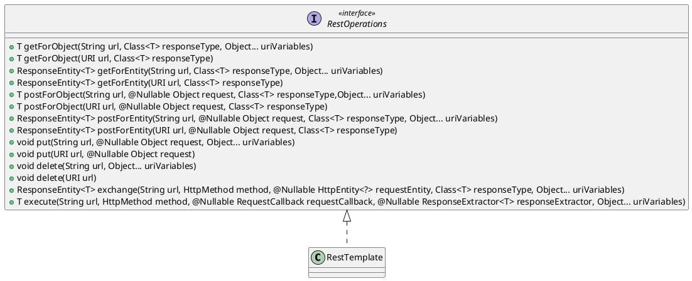
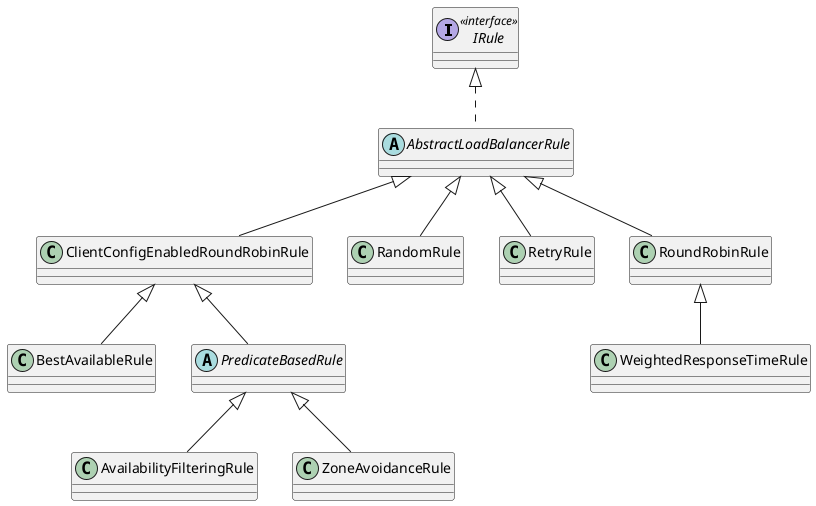

---
tags:
  - SpringCloudAlibaba
  - RestTemplate
  - Ribbon
---
# RestTemplate&Ribbon

## RestTemplate

在上一篇文章 [Nacos-Discovery&Config](./Nacos-Discovery&Config.md) 中，`nacos-discovery-consumer` 模块中其实已经使用到了 Ribbon，通过在 `RestTemplate` 组件上标注 `@LoadBalanced` 注解使得 `RestTemplate` 具备 `LoadBalanced` 负载均衡能力。如下所示：

```java
@Bean
@LoadBalanced
public RestTemplate restTemplate() {
    return new RestTemplate();
}
```

### 简介

RestTemplate 是 Spring Web 模块提供的一个基于 REST 规范提供 HTTP 请求的工具。在应用中如果需要访问第三方提供的 REST 接口，可以使用 RestTemplate 操作将非常方便。RestTemplate 中提供了一系列的 GET、POST、PUT、DELETE 方法以及更加通用的 exchange 和 execute 方法。方法详情可以参考具体的 API 文档 [RestTemplate (Spring Framework 6.0.11 API)](https://docs.spring.io/spring-framework/docs/current/javadoc-api/org/springframework/web/client/RestTemplate.html)。

`RestTemplate` 继承自 `InterceptingHttpAccessor` 并实现了 `RestOperations` 接口，在该接口中定义了基本的 RESTful 操作，这些操作在 `RestTemplate` 中都得到了实现。



### 环境搭建

#### 父模块

`spring-cloud-alibaba-rest-study` 模块的父模块为 `spring-cloud-alibaba-study` 模块，其 pom.xml 配置文件如下所示：

```xml
<?xml version="1.0" encoding="UTF-8"?>
<project xmlns:xsi="http://www.w3.org/2001/XMLSchema-instance"
         xmlns="http://maven.apache.org/POM/4.0.0"
         xsi:schemaLocation="http://maven.apache.org/POM/4.0.0 http://maven.apache.org/xsd/maven-4.0.0.xsd">
    <modelVersion>4.0.0</modelVersion>
    <parent>
        <groupId>fun.xiaorang</groupId>
        <artifactId>spring-cloud-alibaba-study</artifactId>
        <version>1.0-SNAPSHOT</version>
    </parent>

    <artifactId>spring-cloud-alibaba-rest-study</artifactId>
    <packaging>pom</packaging>
    <modules>
        <module>rest-provider</module>
        <module>rest-consumer</module>
        <module>rest-common</module>
    </modules>

    <dependencyManagement>
        <dependencies>
            <dependency>
                <groupId>fun.xiaorang</groupId>
                <artifactId>rest-provider</artifactId>
                <version>${project.version}</version>
            </dependency>
            <dependency>
                <groupId>fun.xiaorang</groupId>
                <artifactId>rest-consumer</artifactId>
                <version>${project.version}</version>
            </dependency>
            <dependency>
                <groupId>fun.xiaorang</groupId>
                <artifactId>rest-common</artifactId>
                <version>${project.version}</version>
            </dependency>
        </dependencies>
    </dependencyManagement>

    <dependencies>
        <dependency>
            <groupId>org.springframework.boot</groupId>
            <artifactId>spring-boot-starter-web</artifactId>
        </dependency>
        <dependency>
            <groupId>org.springframework.boot</groupId>
            <artifactId>spring-boot-starter-actuator</artifactId>
        </dependency>
        <dependency>
            <groupId>com.alibaba.cloud</groupId>
            <artifactId>spring-cloud-starter-alibaba-nacos-discovery</artifactId>
        </dependency>
        <dependency>
            <groupId>com.alibaba.cloud</groupId>
            <artifactId>spring-cloud-starter-alibaba-nacos-config</artifactId>
        </dependency>
    </dependencies>
</project>
```

#### 公共模块

创建一个 `rest-common` 模块，其父模块为 `spring-cloud-alibaba-rest-study` 模块，其 pom.xml 配置文件如下所示：

```xml
<?xml version="1.0" encoding="UTF-8"?>
<project xmlns:xsi="http://www.w3.org/2001/XMLSchema-instance"
         xmlns="http://maven.apache.org/POM/4.0.0"
         xsi:schemaLocation="http://maven.apache.org/POM/4.0.0 http://maven.apache.org/xsd/maven-4.0.0.xsd">
    <modelVersion>4.0.0</modelVersion>
    <parent>
        <groupId>fun.xiaorang</groupId>
        <artifactId>spring-cloud-alibaba-rest-study</artifactId>
        <version>1.0-SNAPSHOT</version>
    </parent>

    <artifactId>rest-common</artifactId>

</project>
```

该模块主要用于提供一个公共的 `User` 实体类，如下所示：

```java
public class User {
    private Integer id;
    private String username;
    private Integer age;

    public User() {
    }

    public User(Integer id, String username, Integer age) {
        this.id = id;
        this.username = username;
        this.age = age;
    }

    public Integer getId() {
        return id;
    }

    public void setId(Integer id) {
        this.id = id;
    }

    public String getUsername() {
        return username;
    }

    public void setUsername(String username) {
        this.username = username;
    }

    public Integer getAge() {
        return age;
    }

    public void setAge(Integer age) {
        this.age = age;
    }

    @Override
    public String toString() {
        return "User{" +
                "id=" + id +
                ", username='" + username + '\'' +
                ", age=" + age +
                '}';
    }
}
```

#### 启动一个 Provider 应用

创建一个 `rest-provider` 模块，其父模块为 `spring-cloud-alibaba-rest-study` 模块，其 pom.xml 配置文件如下所示：依赖于 `rest-common` 模块。

```xml
<?xml version="1.0" encoding="UTF-8"?>
<project xmlns:xsi="http://www.w3.org/2001/XMLSchema-instance"
         xmlns="http://maven.apache.org/POM/4.0.0"
         xsi:schemaLocation="http://maven.apache.org/POM/4.0.0 http://maven.apache.org/xsd/maven-4.0.0.xsd">
    <modelVersion>4.0.0</modelVersion>
    <parent>
        <groupId>fun.xiaorang</groupId>
        <artifactId>spring-cloud-alibaba-rest-study</artifactId>
        <version>1.0-SNAPSHOT</version>
    </parent>

    <artifactId>rest-provider</artifactId>
    <description>服务提供者</description>

    <dependencies>
        <dependency>
            <groupId>fun.xiaorang</groupId>
            <artifactId>rest-common</artifactId>
        </dependency>
    </dependencies>
</project>
```

bootstrap.yml 配置如下所示：

```yaml
server:
  port: 8084
spring:
  application:
    name: rest-provider
  cloud:
    nacos:
      server-addr: localhost:8848
      config:
        file-extension: yaml
  profiles:
    active: dev
management:
  endpoints:
    web:
      exposure:
        include: '*'
```

启动 Provider 实例，如下所示：

```java
@SpringBootApplication
@EnableDiscoveryClient
public class RestProviderApplication {
    public static void main(String[] args) {
        SpringApplication.run(RestProviderApplication.class);
    }
}
```

#### 启动一个 Consumer 应用

创建一个 `rest-consumer` 模块，其父模块为 `spring-cloud-alibaba-rest-study` 模块，其 pom.xml 配置文件如下所示：依赖于 `rest-common` 模块。

```xml
<?xml version="1.0" encoding="UTF-8"?>
<project xmlns:xsi="http://www.w3.org/2001/XMLSchema-instance"
         xmlns="http://maven.apache.org/POM/4.0.0"
         xsi:schemaLocation="http://maven.apache.org/POM/4.0.0 http://maven.apache.org/xsd/maven-4.0.0.xsd">
    <modelVersion>4.0.0</modelVersion>
    <parent>
        <groupId>fun.xiaorang</groupId>
        <artifactId>spring-cloud-alibaba-rest-study</artifactId>
        <version>1.0-SNAPSHOT</version>
    </parent>

    <artifactId>rest-consumer</artifactId>
    <description>服务消费者</description>

    <dependencies>
        <dependency>
            <groupId>fun.xiaorang</groupId>
            <artifactId>rest-common</artifactId>
        </dependency>
    </dependencies>
</project>
```

bootstrap.yml 配置如下所示：

```yaml
server:
  port: 8085
spring:
  application:
    name: rest-consumer
  cloud:
    nacos:
      server-addr: localhost:8848
      config:
        file-extension: yaml
  profiles:
    active: dev
management:
  endpoints:
    web:
      exposure:
        include: '*'
```

启动 Consumer 实例，如下所示：

```java
@SpringBootApplication
@EnableDiscoveryClient
public class RestConsumerApplication {
    public static void main(String[] args) {
        SpringApplication.run(RestConsumerApplication.class);
    }

    @Bean
    @LoadBalanced
    public RestTemplate restTemplate() {
        return new RestTemplate();
    }
}
```

### GET 请求

`RestTemplate` 中与 GET 请求相关的方法有 `getForEntity` 和 `getForObject`，这两个方法之间的区别在于返回值不一样，`getForObject()` 方法会直接返回结果，而 `getForEntity()` 方法会返回 `ResponseEntity` 对象，该对象包含了报文头、报文体和状态码等信息。

- `getForEntity`存在如下三个重载方法：
   - `public <T> ResponseEntity<T> getForEntity(String url, Class<T> responseType, Object... uriVariables);`
   - `public <T> ResponseEntity<T> getForEntity(String url, Class<T> responseType, Map<String, ?> uriVariables);`
   - `public <T> ResponseEntity<T> getForEntity(URI url, Class<T> responseType);`
- `getForObject`存在如下三个重载方法：
   - `public <T> T getForObject(String url, Class<T> responseType, Object... uriVariables);`
   - `public <T> T getForObject(String url, Class<T> responseType, Map<String, ?> uriVariables);`
   - `public <T> T getForObject(URI url, Class<T> responseType);`

其中，第一个参数为 URL，第二个参数为返回值类型，第三个参数为请求参数。

演示 GET 请求示例的具体实现步骤如下所示：

1. 在 Provider 端提供 REST 服务；

   ```java
   @RestController
   @RequestMapping("/user")
   public class UserController {
       private final List<User> users = Stream.of(
               new User(1, "xiaorang", 28),
               new User(2, "xiaobai", 18),
               new User(3, "xiaohei", 16)).collect(Collectors.toList());
   
       @GetMapping("/{id}")
       public User getUserById(@PathVariable Integer id) {
           return users.stream().filter(user -> user.getId().equals(id)).findFirst().orElseThrow(() -> new RuntimeException("哦吼~没有找到对应的用户信息！"));
       }
   
       @GetMapping
       public List<User> getUsers() {
           return users;
       }
   }
   ```

2. 在 Consumer 端使用具备负载均衡能力的 `RestTemplate` 去调用 Provider 端提供的 REST 服务；

   ```java
   @RestController
   @RequestMapping("/user")
   public class UserController {
       private final RestTemplate restTemplate;
   
       public UserController(RestTemplate restTemplate) {
           this.restTemplate = restTemplate;
       }
   
       @GetMapping("/{id}")
       public User getUserById(@PathVariable Integer id) {
           URI uri = UriComponentsBuilder.fromHttpUrl("http://rest-provider/user/{id}").build(id);
           return restTemplate.getForObject(uri, User.class);
       }
   
       @GetMapping
       public List<User> getUsers() {
           URI uri = UriComponentsBuilder.fromHttpUrl("http://rest-provider/user").build().toUri();
           // 当返回的数据类型为 List 并且明确指定泛型类型时，可以使用 exchange 方法
           ResponseEntity<List<User>> responseEntity = restTemplate.exchange(uri, HttpMethod.GET, null, new ParameterizedTypeReference<List<User>>() {
           });
           return responseEntity.getBody();
       }
   }
   ```

3. 访问 GET 请求 [http://localhost:8085/user/1](http://localhost:8085/user/1)，返回 1 号用户的信息，如下所示：<br />
4. 访问 GET 请求 [http://localhost:8085/user](http://localhost:8085/user)，返回全部的用户信息，如下所示：<br />

> [!CODE|label:对于请求中的参数该如何赋值可以参考如下示例]
>
> 1. 在 Provider 端提供 REST 服务；
>
>    ```java
>    @RestController
>    @RequestMapping("/echo")
>    public class EchoController {
>        @GetMapping("/{name}/1/{age}")
>        public String echo(@PathVariable String name, @PathVariable Integer age, @RequestParam String sex, @RequestParam String address) {
>            return name + "-" + age + "-" + sex + "-" + address;
>        }
>    }
>    ```
>
> 2. 在 Consumer 端使用带有负载均衡能力的 `RestTemplate` 去调用 Provider 端提供的 REST 服务；
>
>    ```java
>    @RestController
>    @RequestMapping("/echo")
>    public class EchoController {
>        private final RestTemplate restTemplate;
>    
>        public EchoController(RestTemplate restTemplate) {
>            this.restTemplate = restTemplate;
>        }
>    
>        @GetMapping("/{name}")
>        public String echo(@PathVariable String name) {
>            URI uri = UriComponentsBuilder.fromHttpUrl("http://rest-provider/echo/{name}/1/{age}?sex={sex}&address={address}")
>                    .build(name, 28, "男", "长沙");
>            String result = restTemplate.getForObject(uri, String.class);
>            return "Hello RestTemplate：" + result;
>        }
>    }
>    ```
>
> 3. 访问 GET 请求 [http://localhost:8085/echo/xiaorang](http://localhost:8085/echo/xiaorang)，输出 "Hello RestTemplate：xiaorang-28-男-长沙" 字样。<br />

### POST 请求

演示 POST 请求示例的具体实现步骤如下所示：

1. 在 Provider 端提供 REST 服务；

   ```java
   @RestController
   @RequestMapping("/user")
   public class UserController {
       private final List<User> users = Stream.of(
               new User(1, "xiaorang", 28),
               new User(2, "xiaobai", 18),
               new User(3, "xiaohei", 16)).collect(Collectors.toList());
   
       @GetMapping("/{id}")
       public User getUserById(@PathVariable Integer id) {
           return users.stream().filter(user -> user.getId().equals(id)).findFirst().orElseThrow(() -> new RuntimeException("哦吼~没有找到对应的用户信息！"));
       }
   
       @GetMapping
       public List<User> getUsers() {
           return users;
       }
   
       @PostMapping
       public String addUser(@RequestBody User user) {
           users.add(user);
           return "添加成功！";
       }
   }
   ```

2. 在 Consumer 端使用带有负载均衡能力的 `RestTemplate` 去调用 Provider 端提供的 REST 服务；

   ```java
   @RestController
   @RequestMapping("/user")
   public class UserController {
       private final RestTemplate restTemplate;
   
       public UserController(RestTemplate restTemplate) {
           this.restTemplate = restTemplate;
       }
   
       @GetMapping("/{id}")
       public User getUserById(@PathVariable Integer id) {
           URI uri = UriComponentsBuilder.fromHttpUrl("http://rest-provider/user/{id}").build(id);
           return restTemplate.getForObject(uri, User.class);
       }
   
       @GetMapping
       public List<User> getUsers() {
           URI uri = UriComponentsBuilder.fromHttpUrl("http://rest-provider/user").build().toUri();
           ResponseEntity<List<User>> responseEntity = restTemplate.exchange(uri, HttpMethod.GET, null, new ParameterizedTypeReference<List<User>>() {
           });
           return responseEntity.getBody();
       }
   
       @PostMapping
       public String addUser(@RequestBody User user) {
           URI uri = UriComponentsBuilder.fromHttpUrl("http://rest-provider/user").build().toUri();
           return restTemplate.postForObject(uri, user, String.class);
       }
   }
   ```

3. 访问 POST 请求 [http://localhost:8085/user](http://localhost:8085/user) 添加用户信息，输出 "添加成功！" 字样，如下所示：<br />
4. 访问 GET 请求 [http://localhost:8085/user](http://localhost:8085/user) 查询全部用户数据，可以查询到刚才的添加的用户信息，如下所示：<br />

关于 PUT 和 DELETE 请求就不再赘叙！

## Ribbon

### 简介

Ribbon 是 Netflix 公司开发的一个**客户端负载均衡组件**，诞生于 2013 年 1 月，一直是 Netflix 活跃度较高的项目，由 Pivotal 公司将其整合进 Spring Cloud 生态。Ribbon 是一个基于 HTTP 和 TCP 的客户端负载均衡工具，通过 Spring Cloud 的封装， 可以**轻松地将面向服务的 REST 模板请求自动转换成客户端负载均衡的服务调用**。 此外，Ribbon 拥有丰富的**负载均衡策略**、重试机制、支持多协议的异步与响应式模型、容错、缓存与批次处理等功能。Ribbon 虽然只是一个工具类框架，它不像服务注册中心、配置中心、API 网关那样需要独立部署，但是它几乎存在于每一个 Spring Cloud 构建的微服务和基础设施中。 因为微服务间的调用，API 网关的请求转发等内容实际上都是通过 Ribbon 来实现的，Nacos 和 Feign 已经集成了 Ribbon，更多介绍可参考：[Ribbon 项目](https://github.com/Netflix/ribbon)、[Spring Cloud 官方英文文档](https://cloud.spring.io/spring-cloud-static/Dalston.SR5/multi/multi_spring-cloud-ribbon.html)、[Spring Cloud Ribbon 官方中文文档](https://www.springcloud.cc/spring-cloud-dalston.html#spring-cloud-ribbon)。

> [!IMPORTANT]
>
> Ribbon 会定期从服务注册中心（如 Eureka 或 Nacos）或其他配置源中获取服务列表信息，以确保它总是了解可用的服务实例。然后，**当需要发送请求到某个服务时，Ribbon 会使用其负载均衡算法从服务列表中选择一个合适的服务实例，分发请求到选中的实例上**。这个服务列表的机制使得系统可以更灵活、可伸缩地与不同的服务实例进行通信，以应对负载均衡和高可用性的需求。

### 环境搭建

#### 父模块

`spring-cloud-alibaba-nacos-ribbon-study` 模块的父模块为 `spring-cloud-alibaba-study` 模块，其 pom.xml 配置文件如下所示：

```xml
<?xml version="1.0" encoding="UTF-8"?>
<project xmlns:xsi="http://www.w3.org/2001/XMLSchema-instance"
         xmlns="http://maven.apache.org/POM/4.0.0"
         xsi:schemaLocation="http://maven.apache.org/POM/4.0.0 http://maven.apache.org/xsd/maven-4.0.0.xsd">
    <modelVersion>4.0.0</modelVersion>
    <parent>
        <groupId>fun.xiaorang</groupId>
        <artifactId>spring-cloud-alibaba-study</artifactId>
        <version>1.0-SNAPSHOT</version>
    </parent>

    <artifactId>spring-cloud-alibaba-nacos-ribbon-study</artifactId>
    <packaging>pom</packaging>
    <modules>
        <module>cloud-ribbon-server-order</module>
        <module>cloud-ribbon-server-user</module>
        <module>cloud-ribbon-consumer</module>
    </modules>

    <dependencies>
        <dependency>
            <groupId>org.springframework.boot</groupId>
            <artifactId>spring-boot-starter-web</artifactId>
        </dependency>
        <dependency>
            <groupId>org.springframework.boot</groupId>
            <artifactId>spring-boot-starter-actuator</artifactId>
        </dependency>
        <!-- Nacos Discovery，内部已经集成了 Ribbon -->
        <dependency>
            <groupId>com.alibaba.cloud</groupId>
            <artifactId>spring-cloud-starter-alibaba-nacos-discovery</artifactId>
        </dependency>
        <dependency>
            <groupId>com.alibaba.cloud</groupId>
            <artifactId>spring-cloud-starter-alibaba-nacos-config</artifactId>
        </dependency>
    </dependencies>
</project>
```

#### 订单服务提供方

创建一个 `cloud-ribbon-server-order` 模块，其父模块为 `spring-cloud-alibaba-nacos-ribbon-study` 模块，其 pom.xml 配置文件如下所示：

```java
<?xml version="1.0" encoding="UTF-8"?>
<project xmlns:xsi="http://www.w3.org/2001/XMLSchema-instance"
         xmlns="http://maven.apache.org/POM/4.0.0"
         xsi:schemaLocation="http://maven.apache.org/POM/4.0.0 http://maven.apache.org/xsd/maven-4.0.0.xsd">
    <modelVersion>4.0.0</modelVersion>
    <parent>
        <groupId>fun.xiaorang</groupId>
        <artifactId>spring-cloud-alibaba-nacos-ribbon-study</artifactId>
        <version>1.0-SNAPSHOT</version>
    </parent>

    <artifactId>cloud-ribbon-server-order</artifactId>
    <description>订单服务提供者</description>
    
</project>
```

`bootstrap.yml ` 配置如下所示：

```yaml
server:
  port: ${port:8080}
spring:
  application:
    name: cloud-ribbon-server-order
  cloud:
    nacos:
      server-addr: localhost:8848
      config:
        file-extension: yaml
  profiles:
    active: dev
management:
  endpoints:
    web:
      exposure:
        include: '*'
```

REST 服务 `OrderController` 如下所示：

```java
@RestController
@RequestMapping("/order")
public class OrderController {
    @Value("${server.port}")
    private String serverPort;

    @GetMapping
    public String orderInfo() {
        return "ribbon server order: " + serverPort + "\t" + UUID.randomUUID();
    }
}
```

启动类如下所示：

```java
@SpringBootApplication
@EnableDiscoveryClient
public class CloudRibbonServerOrderApplication {
    public static void main(String[] args) {
        SpringApplication.run(CloudRibbonServerOrderApplication.class, args);
    }
}
```

在上述代码中，为了测试 Ribbon 负载均衡的能力，要求服务提供者可以选择启动多个实例，并且在每个实例中有一个标识（例如端口）来识别每次的调用是到了不同的服务实例上。因此需要**修改运行配置：勾选<u>允许多个实例</u> & <u>添加虚拟机选项</u>（用于指定实例运行时的端口号）**，然后采取改变端口号的方式启动多次，这样就能启动多个服务实例，如下所示：<br />

#### 用户服务提供方

创建一个 `cloud-ribbon-server-user` 模块，其父模块为 `spring-cloud-alibaba-nacos-ribbon-study` 模块，其 pom.xml 配置文件如下所示：

```xml
<?xml version="1.0" encoding="UTF-8"?>
<project xmlns:xsi="http://www.w3.org/2001/XMLSchema-instance"
         xmlns="http://maven.apache.org/POM/4.0.0"
         xsi:schemaLocation="http://maven.apache.org/POM/4.0.0 http://maven.apache.org/xsd/maven-4.0.0.xsd">
    <modelVersion>4.0.0</modelVersion>
    <parent>
        <groupId>fun.xiaorang</groupId>
        <artifactId>spring-cloud-alibaba-nacos-ribbon-study</artifactId>
        <version>1.0-SNAPSHOT</version>
    </parent>

    <artifactId>cloud-ribbon-server-user</artifactId>
    <description>用户服务提供者</description>

</project>
```

`bootstrap.yml ` 配置如下所示：

```yaml
server:
  port: ${port:8090}
spring:
  application:
    name: cloud-ribbon-server-user
  cloud:
    nacos:
      server-addr: localhost:8848
      config:
        file-extension: yaml
  profiles:
    active: dev
management:
  endpoints:
    web:
      exposure:
        include: '*'
```

REST 服务 `UserController` 如下所示：

```java
@RestController
@RequestMapping("/user")
public class UserController {
    @Value("${server.port}")
    private String serverPort;

    @GetMapping
    public String userInfo() {
        return "ribbon server user: " + serverPort + "\t" + UUID.randomUUID();
    }
}
```

启动类如下所示：

```java
@SpringBootApplication
@EnableDiscoveryClient
public class CloudRibbonServerUserApplication {
    public static void main(String[] args) {
        SpringApplication.run(CloudRibbonServerUserApplication.class, args);
    }
}
```

#### 服务消费方

创建一个 `cloud-ribbon-consumer` 模块，其父模块为 `spring-cloud-alibaba-nacos-ribbon-study` 模块，其 pom.xml 配置文件如下所示：

```java
<?xml version="1.0" encoding="UTF-8"?>
<project xmlns:xsi="http://www.w3.org/2001/XMLSchema-instance"
         xmlns="http://maven.apache.org/POM/4.0.0"
         xsi:schemaLocation="http://maven.apache.org/POM/4.0.0 http://maven.apache.org/xsd/maven-4.0.0.xsd">
    <modelVersion>4.0.0</modelVersion>
    <parent>
        <groupId>fun.xiaorang</groupId>
        <artifactId>spring-cloud-alibaba-nacos-ribbon-study</artifactId>
        <version>1.0-SNAPSHOT</version>
    </parent>

    <artifactId>cloud-ribbon-consumer</artifactId>
    <description>服务消费者</description>

</project>
```

bootstrap.yml 配置如下所示：

```yaml
server:
  port: 9000
spring:
  application:
    name: cloud-ribbon-consumer
  cloud:
    nacos:
      server-addr: localhost:8848
      config:
        file-extension: yaml
  profiles:
    active: dev
management:
  endpoints:
    web:
      exposure:
        include: '*'
```

REST 服务 `OrderController` 如下所示：

```java
@RestController
@RequestMapping("/order")
public class OrderController {
    private final RestTemplate restTemplate;

    public OrderController(RestTemplate restTemplate) {
        this.restTemplate = restTemplate;
    }

    @GetMapping
    public String orderInfo() {
        URI uri = UriComponentsBuilder.fromHttpUrl("http://cloud-ribbon-server-order/order").build().toUri();
        return restTemplate.getForObject(uri, String.class);
    }
}
```

REST 服务 `UserController` 如下所示：

```java
@RestController
@RequestMapping("/user")
public class UserController {
    private final RestTemplate restTemplate;

    public UserController(RestTemplate restTemplate) {
        this.restTemplate = restTemplate;
    }

    @GetMapping
    public String orderInfo() {
        URI uri = UriComponentsBuilder.fromHttpUrl("http://cloud-ribbon-server-user/user").build().toUri();
        return restTemplate.getForObject(uri, String.class);
    }
}
```

启动类如下所示：

```java
@SpringBootApplication
@EnableDiscoveryClient
public class CloudRibbonConsumerApplication {
    public static void main(String[] args) {
        SpringApplication.run(CloudRibbonConsumerApplication.class, args);
    }

    @Bean
    @LoadBalanced
    public RestTemplate restTemplate() {
        return new RestTemplate();
    }
}
```

启动服务消费方（端口号：`9000`），订单服务提供方（端口号：`8080` 和 `8081`），用户提供方（端口号：`8090` 和 `8091`），如下所示：<br />

在控制台中输入如下命令进行测试，可以发现，当某个服务提供者存在多个服务实例时，Ribbon 默认会使用**轮询**的方式进行访问。

- `curl http://localhost:9000/order ` 命令，测试结果如下所示：<br />
- `curl http://localhost:9000/user ` 命令，测试结果如下所示：<br />

### 负载均衡策略

Ribbon 按照不同的需求，已经提供七种实现了 `IRule` 接口的实现类，包含了常用的负载均衡策略，默认的策略是区域权衡策略 `ZoneAvoidanceRule`。内置的策略能够适用大部分负载均衡需求的应用场景，若有更复杂的需求，可以自己实现 `IRule` 接口。



| 策略类                    | 命名             | 描述                                                         |
| ------------------------- | ---------------- | ------------------------------------------------------------ |
| RandomRule                | 随机策略         | 从服务实例清单中随机选择一个服务实例的功能                   |
| RoundRobinRule            | 轮询策略         | 以轮询的方式从服务实例清单中依次选择服务实例                 |
| RetryRule                 | 重试策略         | 该策略实现了具备重试机制的实例选择功能                       |
| BestAvailableRule         | 最低并发策略     | 选择一个并发请求量最少的服务实例                             |
| AvailabilityFilteringRule | 可用过滤策略     | 过滤掉一直连接失败并被标记为 circuit tipped 的服务实例，过滤掉那些高并发连接的服务实例（active connections 超过配置的阀值，该阈值可以通过客户端的 `<clientName>.<nameSpace>.ActiveConnectionsLimit` 属性进行配置） |
| WeightedResponseTimeRule  | 响应时间加权策略 | 根据服务实例的响应时间分配权重。响应时间越长，权重越低，被选择到的概率越低；响应时间越短，权重越高，被选择到的概率就越高。这个策略很贴切，综合了各种因素，如：网络、磁盘、CPU 等，这些因素都直接影响着响应时间 |
| ZoneAvoidanceRule         | 区域权衡策略     | 综合判断服务实例所在区域的性能和服务实例的可用性来轮询选择服务实例，并且判断一个 Zone 的运行性能是否可用，剔除不可用的 Zone 中的所有服务实例 |

#### 全局负载均衡策略的配置

使用 Ribbon 的时候若想要**全局**更改默认的负载均衡策略，只需添加如下所示的配置类即可，加上之后凡是通过 Ribbon 的请求都会按照配置的策略来进行负载均衡。

```java
@Configuration
public class RibbonConfiguration {
    @Bean
    public IRule myRule() {
        return new RandomRule();
    }
}
```

在控制台输入 `curl http://localhost:9000/order ` 命令进行测试，测试结果如下所示：可以发现，Ribbon 会以随机的方式选择一个订单服务实例，多次测试的结果没有任何规律。<br />

#### 基于注解的方式指定负载均衡策略

若想针对某一个服务提供方设置其特有的负载均衡策略，可以通过使用 `@RibbonClient` 注解来实现。如下所示：在服务消费者的启动类上标注 `@RibbonClient` 注解，指定针对某个特定服务提供者（如 `cloud-ribbon-server-order`订单服务提供者）使用的负载均衡策略（如 `RandomRule` 随机策略）。

```java
@SpringBootApplication
@EnableDiscoveryClient
@RibbonClient(name = "cloud-ribbon-server-order", configuration = RibbonConfiguration.class)
public class CloudRibbonConsumerApplication {
    public static void main(String[] args) {
        SpringApplication.run(CloudRibbonConsumerApplication.class, args);
    }

    @Bean
    @LoadBalanced
    public RestTemplate restTemplate() {
        return new RestTemplate();
    }
}
```

根据咱们的配置，预测测试结果如下：

- 对于订单服务，Ribbon 会以随机的方式选择一个订单服务实例，多次测试的结果没有任何规律；
- 对于用户服务，Ribbon 仍然会以轮询的方式选择一个用户服务实例，标识不同服务实例的端口号作为结果交替输出；

理想很丰满，现实很骨感！咱们认为 Ribbon 仍然会以轮询的方式选择一个用户服务实例，标识不同服务实例的端口号作为结果交替输出，可是测试结果却并非如此😞，如下所示：<br />

这是为什么呢？其实在官方文档中已给出答案，参考自 [Client Side Load Balancer: Ribbon (spring.io) - Customizing the Ribbon Client](https://cloud.spring.io/spring-cloud-netflix/multi/multi_spring-cloud-ribbon.html#_customizing_the_ribbon_client)

> [!NOTE]
>
> The `CustomConfiguration` clas must be a `@Configuration` class, but take care that it is not in a `@ComponentScan` for the main application context. Otherwise, it is shared by all the `@RibbonClients`. If you use `@ComponentScan` (or `@SpringBootApplication`), you need to take steps to avoid it being included (for instance, you can put it in a separate, non-overlapping package or specify the packages to scan explicitly in the `@ComponentScan`).

翻译过来的大致意思是：`CustomConfiguration` 类必须是一个 `@Configuration` 类，但请注意不要将它包含在主应用程序上下文的 `@ComponentScan` 中。**否则，它将被所有的 `@RibbonClients` 共享**。如果你使用 `@ComponentScan`（或 `@SpringBootApplication`），你需要采取措施来避免它被包括在其中（例如，你可以将它放在一个独立的、不重叠的包中，或者在 `@ComponentScan` 中明确指定要扫描的包）。

> [!TIP]
>
> 经过本人的测试，即使 `RibbonConfiguration` 不标注 `@Configuration` 注解也可以通过 `@RibbonClient` 注解加载为 Ribbon Client 的配置，而且因为没有标注 `@Configuration` 注解，也就不会被包扫描到，正好可以解决这种情况！具体使用哪种方案，自行选择。

默认情况下，Spring 会扫描启动类（`@SpringBootApplication`）所在包及其子包下的所有组件，因此，咱们需要想办法将 `RibbonConfiguration` 配置类从包扫描中排除掉，官方文档中已经提到一种解决方案，将该类移到不在启动类所在包及其子包下。不过咱们可以使用另外一种解决方案，利用 `@ComponentScan` 注解排除被自定义注解 `@AvoidScan` 标注的组件，因此咱们只需要在 `RibbonConfiguration` 配置类上标注 `@AvoidScan` 注解，这样在包扫描的时候就不会扫描到该组件，然后在该配置类中的负载均衡策略也就不会注册到 Spring 容器中，这样的话该配置就只会针对订单服务起作用。具体实现步骤如下所示：

1. 自定义注解 `@AvoidScan`

   ```java
   @Target({ElementType.TYPE})
   @Retention(RetentionPolicy.RUNTIME)
   @Documented
   public @interface AvoidScan {
   }
   ```

2. 在 `RibbonConfiguration` 配置类上标注 `@AvoidScan` 注解

   ```java
   @AvoidScan
   @Configuration
   public class RibbonConfiguration {
       @Bean
       public IRule myRule() {
           return new RandomRule();
       }
   }
   ```

3. 在启动类上添加 `@ComponentScan` 注解，用于排除被 `@AvoidScan` 注解标注的 `RibbonConfiguration` 配置类

   ```java
   @SpringBootApplication
   @EnableDiscoveryClient
   @RibbonClient(name = "cloud-ribbon-server-order", configuration = RibbonConfiguration.class)
   @ComponentScan(excludeFilters = {@ComponentScan.Filter(type = FilterType.ANNOTATION, value = AvoidScan.class)})
   public class CloudRibbonConsumerApplication {
       public static void main(String[] args) {
           SpringApplication.run(CloudRibbonConsumerApplication.class, args);
       }
   
       @Bean
       @LoadBalanced
       public RestTemplate restTemplate() {
           return new RestTemplate();
       }
   }
   ```

再次进行测试，可以发现测试结果终于符合咱们的预期！👍

- 对于订单服务，Ribbon 会以随机的方式选择一个订单服务实例，多次测试的结果没有任何规律；<br />
- 对于用户服务，Ribbon 仍然会以轮询的方式选择一个用户服务实例，标识不同服务实例的端口号作为结果交替输出；<br />

若想对多个服务提供方指定对应的负载均衡策略，可以使用 `@RibbonClients` 注解，并且可以通过 `@RibbonClients` 注解中的 `defaultConfiguration` 属性来注册默认配置。

```java
@RibbonClients(value = {
        @RibbonClient(name = "cloud-ribbon-server-user", configuration = UserRibbonConfiguration.class),
        @RibbonClient(name = "cloud-ribbon-server-order", configuration = OrderRibbonConfiguration.class)},
        defaultConfiguration = DefaultRibbonConfiguration.class)
```

#### 基于配置文件的方式指定负载均衡策略

可以使用配置文件来对源服务的负载均衡策略进行配置，配置格式：`<clientName>.<nameSpace>.<propertyName>=<value>`，默认情况下，namespace = ribbon ➡️ `<clientName>.ribbon.<propertyName>=<value>`。如下所示配置是针对 `cloud-ribbon-server-user` 用户服务指定使用随机策略。

```yaml
cloud-ribbon-server-user:
  ribbon:
    NFLoadBalancerRuleClassName: com.netflix.loadbalancer.RandomRule
```

> [!TIP]
>
> 其中 `NFLoadBalancerRuleClassName` Key 来源于 `CommonClientConfigKey` 类中的静态常量，在该类中声明了 Ribbon 客户端可以配置的其他选项。

在控制台输入 `curl http://localhost:9000/user` 命令进行测试，测试结果如下所示：可以发现，Ribbon 会以随机的方式选择一个用户服务实例，多次测试的结果没有任何规律。<br />

Ribbon 从 1.2.0 版本开始，Spring Cloud Netflix 支持使用配置文件来自定义 Ribbon 客户端，其实质就是使用配置文件来指定一些默认加载类，从而更改 Ribbon 客户端的默认行为。以下列表显示了支持的属性：参考自 [Client Side Load Balancer: Ribbon (spring.io) - Customizing the Ribbon Client by Setting Properties](https://cloud.spring.io/spring-cloud-netflix/multi/multi_spring-cloud-ribbon.html#_customizing_the_ribbon_client_by_setting_properties)

- `<clientName>.ribbon.NFLoadBalancerClassName`: Should implement `ILoadBalancer`
- `<clientName>.ribbon.NFLoadBalancerRuleClassName`: Should implement `IRule`
- `<clientName>.ribbon.NFLoadBalancerPingClassName`: Should implement `IPing`
- `<clientName>.ribbon.NIWSServerListClassName`: Should implement `ServerList`
- `<clientName>.ribbon.NIWSServerListFilterClassName`: Should implement `ServerListFilter`

> [!NOTE]
>
> 这种方式的优先级是最高的，优先级高于使用注解 `@RibbonClient` 指定的配置和 Spring Cloud Netflix 提供的默认值定义的 Bean。
>
> **经过我的测试为什么是注解 `@RibbonClient` 指定的配置优先级更高？**

### 饥饿加载

默认情况下，Ribbon 在进行客户端负载均衡的时候，**并不是启动时就加载上下文的，而是在第一次请求的时候才去创建**，因此这个特性往往会让第一次调用显得疲软乏力，严重的时候会引起调用超时。此时可用通过指定 Ribbon 具体的客户端的名称来开启饥饿加载，即在启动的时候便加载所有配置项的应用程序上下文。

```yaml
ribbon:
  eager-load:
    enabled: true # 开启饥饿加载
    clients: cloud-ribbon-server-user # 指定饥饿加载的服务名，多个服务名用逗号分隔，如：cloud-ribbon-server-user,cloud-ribbon-server-order
```

## 参考资料🎁

- Template
  - 官方文档地址 [Integration-RestTemplate](https://docs.spring.io/spring-framework/docs/5.3.29/reference/html/integration.html#rest-resttemplate)
  - [Complete Guide to Spring RestTemplate](https://reflectoring.io/spring-resttemplate/)
  - [Spring之RestTemplate介绍](https://elim168.github.io/spring/bean/30.Spring%E4%B9%8BRestTemplate%E4%BB%8B%E7%BB%8D.html)
- Ribbon
  - [Spring Cloud Dalston 中文文档 参考手册 中文版](https://www.springcloud.cc/spring-cloud-dalston.html#spring-cloud-ribbon)
  - [Ribbon 入门教程 - 基础篇 | Clay 的技术空间 (techgrow.cn)](https://www.techgrow.cn/posts/76f2eddc.html)
  - [Spring Cloud Ribbon客户端负载均衡 | MrBird](https://mrbird.cc/Spring-Cloud-Ribbon-LoadBalance.html)
