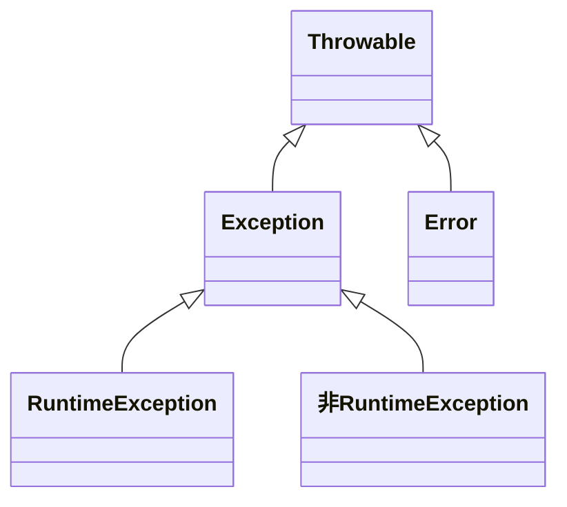

# 杂记

## foreach 循环

`foreach` 循环只不过是个**语法糖**，让咱们在遍历集合时代码更简洁明了。其实`foreach`的背后是`Iterator`**迭代器**，为什么这么说呢？请看如下示例代码：

```java
List<String> names = new ArrayList();
names.add("marry");
names.add("jack");
names.add("tom");
for (String name : names) {
    System.out.println(name);
}
```

反编译之后的代码如下所示：

```java
List<String> names = new ArrayList();
names.add("marry");
names.add("jack");
names.add("tom");
Iterator var5 = names.iterator();
while(var5.hasNext()) {
    String name = (String)var5.next();
    System.out.println(name);
}
```

可以看到 `foreach` 循环的底层使用的就是 `Iterator` 迭代器。

## reduce()

> `reduce()`方法对数组中的每个元素按序执行一个提供的 **reducer** 函数，每一次运行 **reducer** 会将先前元素的计算结果作为参数传入，最后将其结果汇总为单个返回值。

语法：[Array.prototype.reduce() - JavaScript | MDN (mozilla.org)](https://developer.mozilla.org/zh-CN/docs/Web/JavaScript/Reference/Global_Objects/Array/reduce)

```javascript
reduce()
reduce(callbackFn, initialValue)
```

参数：

- `callbackFn`：为数组中每个元素执行的函数。其返回值将作为下一次调用`callbackFn`函数时的`accumulator` 参数。对于最后一次调用，返回值将作为整个`reduce()`方法的返回值。该函数被调用时将传入以下参数：

- - `accumulator`：累加器，上一次调用`callbackFn`函数的结果。在第一次调用`callbackFn()`函数时，如果指定了`initialValue`参数的话，则`accumulator`为指定的初始值，否则的话为数组第一个元素`array[0]`的值；
  - `currentValue`：当前元素的值。在第一次调用`callbackFn()`函数时，如果指定了`initialValue`参数的话，则`currentValue`为数组第一个元素`array[0]`的值，否则的话为数组第二个元素`array[1]`的值；
  - `currentIndex`：当前元素在数组中的索引位置。在第一次调用`callbackFn()`函数时，如果指定了`initialValue`参数的话，则`currentIndex`的值为 0，否则的话为 1；
  - `array`：调用了`reduce()`方法的数组本身；

- `initialValue`可选：第一次调用`callbackFn`回调函数时初始化`accumulator`的值。如果指定了`initialValue`参数的话，则`callbackFn`函数从数组中的第一个元素`array[0]`的值作为`currentValue`开始执行。如果没有指定 `initialValue`参数的话，则`accumulator`初始化为数组中的第一个元素`array[0]`的值，并且`callbackFn`函数从数组中第二个元素`array[1]`的值作为`currentValue`开始执行。在这种情况下，如果数组为空（没有第一个元素`array[0]`的值可以作为`accumulator`返回），则会抛出错误；

几种常见的用法如下所示：<span style="font-size: 12px;">可直接拷贝到控制台中运行查看执行结果！</span>

1. 数组求和

   ```javascript
   const array = [15, 16, 17, 18, 19];
   
   const sum = array.reduce((accumulator, currentValue, currentIndex) => {
     const returns = accumulator + currentValue;
     console.log(`accumulator: ${accumulator}, currentValue: ${currentValue}, index: ${currentIndex}, returns: ${returns}`);
     return returns;
   });
   
   console.log(sum);
   ```

2. 分组

   ```javascript
   const people = [
     { name: "Alice", age: 21 },
     { name: "Max", age: 20 },
     { name: "Jane", age: 20 },
   ];
   
   const grouped = people.reduce((obj, current) => {
     let array = obj[current.age] || [];
     array.push(current);
     obj[current.age] = array;
     return obj;
   }, {});
   
   console.log(grouped);
   ```

3. 去重

   ```javascript
   const array = ["a", "b", "a", "b", "c", "e", "e", "c", "d", "d", "d", "d"];
   
   const arrayWithNoDuplicates = array.reduce((accumulator, current) => {
     if (!accumulator.includes(current)) {
       return [...accumulator, current];
     }
     return accumulator;
   }, []);
   
   console.log(arrayWithNoDuplicates);
   ```

## 利用 IntelliJ IDEA 生成可运行的 JAR 包

具体步骤如下所示：

1. 配置项目输出路径：确保你的项目的输出路径正确配置为 `out` 或 `target` 目录。这将是生成 JAR 文件的位置。<br />
   - 在项目窗口中，右键单击项目的根文件夹，然后选择 "Open Module Settings"（或者使用快捷键 `F4`）；
   - 在弹出的窗口中，选择 "Project" 标签；
   - 在 "Project compiler output" 部分，确保输出路径设置正确；

1. 编译项目：在 IntelliJ IDEA 中，使用以下步骤编译项目：

   - 点击菜单栏中的 "Build" 或 "Build Project"；
   - 或者使用快捷键，通常是 `Ctrl + F9`（Windows/Linux）或 `Cmd + F9`（macOS）；

   这将触发项目的编译，将编译输出放置在配置的输出路径中。

2. **创建可运行 JAR 文件**：在 IntelliJ IDEA 中，使用以下步骤创建可运行的 JAR 文件：

   - 打开 "File" 菜单，选择 "Project Structure"；
   - 在左侧面板中，选择 "Artifacts"；
   - 点击右侧的 "+" 图标，然后选择 "JAR" > "From modules with dependencies..."；<br />
   - 在弹出窗口中，选择项目的主类（包含 `public static void main(String[] args)` 方法的类）；<br />
   - 在 "JAR files from libraries" 部分，确保所有依赖项都被包含在 JAR 文件中（默认情况下应该已经勾选了）；<br />
   - 点击 "OK"；

3. **构建 JAR 文件**：在 IntelliJ IDEA 中，使用以下步骤构建 JAR 文件：

   - 点击菜单栏中的 "Build" > "Build Artifacts"；<br />
   - 选择你刚刚创建的 JAR 配置（通常是项目的名称）；<br />
   - 这将触发 JAR 文件的构建，并将生成的 JAR 文件放置在输出路径中；

4. 查找可执行 JAR 文件：生成的可执行 JAR 文件将被放置在输出路径中，可以在 `out` 或 `target` 目录下找到该 JAR 文件。<br />

5. 运行可执行 JAR 文件：在终端中使用以下命令来运行生成的可执行 JAR 文件：

   ```bash
   java -jar your-project-name.jar
   ```

   替换 `your-project-name` 为实际的 JAR 文件名即可！

如此，即可在 IntelliJ IDEA 中直接生成和运行可执行的 JAR 文件，而无需使用其他 Maven 插件。

## Java 异常体系




- `Throwable`：Java 异常体系的根类，它是所有异常类的超类，其主要有如下两个子类：

  - `Error`：**错误**表示严重的问题，通常是虚拟机或系统本身的问题，不太可能由程序员处理。错误不应该捕获或处理，通常用于表示系统资源耗尽、虚拟机内部错误等情况。常见的有：
    - `StackOverflowError`：表示方法调用栈溢出，通常是由于无限递归或方法调用引起的；
    - `OutOfMemoryError`：表示应用程序耗尽了可用的内存资源，无法继续执行；

  - `Exception`：是程序本身可以捕获并且可以处理的异常。可以分为如下两类：
    - **运行时异常**（RuntimeException）：aka 不受检异常（Unchecked Exception）
      - 运行时异常是不受编译器强制检查的异常，通常表示**编程错误**、**逻辑错误**或其他无法合理预测或处理的情况；
      - 运行时异常是 `RuntimeException` 类及其子类的实例，通常不需要显式处理；
      - 常见的运行时异常有：`ClassCastException`、`ArithmeticException`、`IndexOutOfBoundsException`、`NullPointerException` 等等；
    - 非运行时异常，aka **受检异常**（Checked Exception）
      - 是指 `Exception` 类中除了 `RuntimeException` 及其子类之外的所有异常；
      - 受检查异常是在**编译时**由编译器强制检查的异常，**必须在代码中明确对该异常进行处理，要么使用 `try-catch` 捕获，要么使用 `throws` 语句抛出，否则的话编译不通过**；
      - 常见的受检异常有：`IOException`、`SQLException`、`ClassNotFoundException`、`NoSuchFieldException` 等等；
