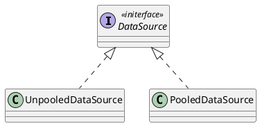
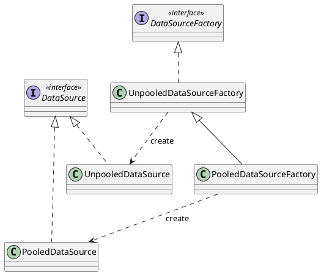
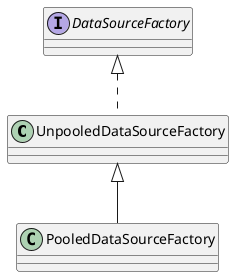
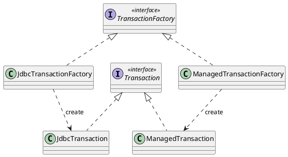

# Mybatis 整体架构

MyBatis 分为三层架构，分别是**基础支撑层**、**核心处理层**和**接口层**，如下图所示：<br />


## 基础支撑层

- **日志模块**。日志是咱们生产实践中排查问题、定位 Bug、锁定性能瓶颈的主要线索来源，在任何一个成熟的系统中都会有级别合理、信息翔实的日志模块，Mybatis 也不例外。Mybatis 提供了日志模块来集成 Java 生态中的第三方日志框架，该模块目前可以集成 slf4j、Log4j2、Log4j 等优秀的日志框架。
- **数据源模块**。持久层框架核心组件之一就是**数据源**，一款性能出众的数据源可以成倍提升系统的性能。MyBatis 自身提供了一套不错的数据源实现，也是 MyBatis 的默认实现。另外，在 Java 生态中，就有很多优异开源的数据源（如 [druid](https://github.com/alibaba/druid)、[HikariCP](https://github.com/brettwooldridge/HikariCP)）可供选择，MyBatis 的数据源模块中也提供了与第三方数据源集成的相关接口，这也为用户提供了更多的选择空间，提升了数据源切换的灵活性。
- **事务管理模块**。持久层框架一般都会提供一套事务管理机制实现数据库的事务控制，MyBatis 对数据库中的事务进行了一层简单的抽象，提供了简单易用的事务接口和实现。一般情况下，Java 项目都会集成 Spring，并由 Spring 框架管理事务。在后面的源码分析文章中，会深入分析 MyBatis 与 Spring 集成的原理，其中就包括事务管理相关的集成。

### 日志模块

> [!TIP]
>
> 在分析 Mybatis 中的日志模块之前，对于适配器模式和代理模式还不太清楚的小伙伴，建议先阅读 [适配器模式](../../研磨设计模式/适配器模式.md) 和 [代理模式](../../研磨设计模式/代理模式.md) 这两篇文章！

Java 开发中常用的几款日志框架：Apache Commons Logging、Log4j、Log4j2、java.util.logging，这些日志框架来源于不同的开源组织，给用户暴露的接口也有很多不同之处，所以很多开源框架会自定义一套统一的日志接口，兼容上述的第三方日志框架，供上层使用。一般的实现方式是使用**适配器模式**，**将各个第三方日志框架接口转换为框架内部自定义的日志接口**。

在 Mybatis 中也提供了类似的实现。Mybatis 使用的日志接口是自定义的 `Log` 接口，但是 Apache Commons Logging、Log4j、Log4j2、java.util.logging 等开源日志框架提供给用户的都是自定义的 `Logger` 接口，因此为了统一这些第三方的日志框架，**Mybatis 使用适配器模式添加了针对不同日志框架的 Adapter 实现**，使得第三方日志框架的 `Logger` 接口转换成 Mybatis 中的 `Log` 接口，从而实现集成第三方日志框架打印日志的功能。

Mybatis 中的日志模块位于 `org.apache.ibatis.logging` 包中，该模块的具体实现如下所示：

- 日志接口：`Log`，定义了自己的日志级别，该接口实现如下所示：

  ```java
  public interface Log {
  
    boolean isDebugEnabled();
  
    boolean isTraceEnabled();
  
    void error(String s, Throwable e);
  
    void error(String s);
  
    void debug(String s);
  
    void trace(String s);
  
    void warn(String s);
  
  }
  ```

  其类图如下所示：

  ```plantuml
  @startuml
  interface Log <<interface>> {}
  
  class Slf4jImpl {}
  
  class JakartaCommonsLoggingImpl {}
  
  class Log4j2Impl {}
  
  class Log4j2LoggerImpl {}
  
  class Log4jImpl{}
  
  class Jdk14LoggingImpl {}
  
  class NoLoggingImpl {}
  
  class StdOutImpl {}
  
  Log <|.. Slf4jImpl
  Log <|.. JakartaCommonsLoggingImpl
  Log <|.. Log4j2Impl
  Log <|.. Log4j2LoggerImpl
  Log <|.. Log4jImpl
  Log <|.. Jdk14LoggingImpl
  Log <|.. NoLoggingImpl
  Log <|.. StdOutImpl
  
  @enduml
  ```

- 日志工厂：`LogFactory`，它主要负责创建 `Log` 对象。在该类中存在一段**静态代码块**，其中会依次加载各个第三方日志框架的适配器。在静态代码块执行的 `tryImplementation()` 方法中，首先会检测 `logConstructor` 属性是否为空，如果不为空的话，则表示已经成功确定当前使用的日志框架，直接返回；如果为空的话，则在当前线程中执行传入的 `Runnable` 中的 `run()` 方法，尝试确定当前使用的日志框架。静态代码块实现如下所示：

  ```java
  static {
      // 依次尝试使用不同的日志框架 SLF4J > LOG4J2 > LOG4J > JDK > NO LOGGING
      // 在使用日志框架时，可以通过在类路径下放置相应的日志框架的实现类，来切换日志框架
      tryImplementation(LogFactory::useSlf4jLogging);
      tryImplementation(LogFactory::useCommonsLogging);
      tryImplementation(LogFactory::useLog4J2Logging);
      tryImplementation(LogFactory::useLog4JLogging);
      tryImplementation(LogFactory::useJdkLogging);
      tryImplementation(LogFactory::useNoLogging);
  }
  ```

  以 JDK Logging 的加载流程（`useJdkLogging()` 方法）为例，其具体代码实现和注释如下所示：

  ```java
  public static synchronized void useJdkLogging() {
  	setImplementation(org.apache.ibatis.logging.jdk14.Jdk14LoggingImpl.class);	
  }
  
  private static void setImplementation(Class<? extends Log> implClass) {
      try {
        // 获取 Log 接口的实现类（适配器）的构造方法
        Constructor<? extends Log> candidate = implClass.getConstructor(String.class);
        // 尝试加载当前使用的日志框架的适配器类，如果加载失败，则抛出异常
        Log log = candidate.newInstance(LogFactory.class.getName());
        if (log.isDebugEnabled()) {
          // 如果开启 DEBUG 日志，则打印当前使用的日志框架的名称
          log.debug("Logging initialized using '" + implClass + "' adapter.");
        }
        // 加载成功，则更新 logConstructor 属性，记录适配器的构造方法
        logConstructor = candidate;
      } catch (Throwable t) {
        throw new LogException("Error setting Log implementation.  Cause: " + t, t);
      }
  }
  ```

- 日志实现类（**适配器**）：以 `Jdk14LoggingImpl` 为例介绍一下 `Log` 接口的实现， `Jdk14LoggingImpl` 作为 Java Logging 的适配器，在实现 `Log` 接口的同时，在其内部持有一个 `java.util.logging.Logger` 类型的引用，会将日志输出操作委托给持有的 `java.util.logging.Logger` 对象的相应方法，实现与典型的类适配器模式完全一致。 `Jdk14LoggingImpl` 中的核心实现以及代码注释如下所示：

  ```java
  public class Jdk14LoggingImpl implements Log {
  
    /**
     * JDK 的 Logger 对象
     */
    private final Logger log;
  
    public Jdk14LoggingImpl(String clazz) {
      // 实例化 JDK 的 Logger 对象
      log = Logger.getLogger(clazz);
    }
  
    @Override
    public boolean isDebugEnabled() {
      return log.isLoggable(Level.FINE);
    }
  
    @Override
    public void error(String s, Throwable e) {
      // 委托给 JDK 的 Logger 对象进行日志记录
      log.log(Level.SEVERE, s, e);
    }
  
    // 省略其他级别的日志输出方法
  
  }
  ```

在 Mybatis 的 `org.apache.ibatis.logging` 包中，除了集成第三方日志框架的适配器实现之外，还有一个 `jdbc` 包，该包的功能不是将日志写入数据库中，而是将 JDBC 操作涉及的信息通过指定的 `Log` 进行输出到控制台（或保存到日志文件中），咱们可以通过这个包，将执行的 SQL 语句、SQL 绑定的参数、SQL 执行之后影响的行数等信息，统统输出到控制台，该功能主要是在测试环境进行调试时使用，很少会在线上开启，因为会产生非常多的日志，拖慢系统性能。咱们接下来就好好分析一下 `org.apache.ibatis.logging.jdbc` 包中的内容，

- `BaseJdbcLogger`：最基础的抽象类，是 `org.apache.ibatis.logging.jdbc` 包下其他 `Logger` 的父类，其继承关系如下图所示：

  ```plantuml
  @startuml
  abstract class BaseJdbcLogger {
  	# statementLog: Log
  	# queryStack: int
  }
  
  class ConnectionLogger {
  	- connection: Connection
  	+ newInstance(Connection conn, Log statementLog, int queryStack): Connection
  	+ invoke(Object proxy, Method method, Object[] params): Object
  }
  
  class PreparedStatementLogger {
  	- statement: PreparedStatement
  	+ newInstance(PreparedStatement stmt, Log statementLog, int queryStack): PreparedStatement
  	+ invoke(Object proxy, Method method, Object[] params): Object
  }
  
  class ResultSetLogger {
  	- rs: ResultSet
  	+ newInstance(ResultSet rs, Log statementLog, int queryStack): ResultSet
  	+ invoke(Object proxy, Method method, Object[] params): Object
  }
  
  interface InvocationHandler <<interface>> {
  	+ invoke(Object proxy, Method method, Object[] args): Object
  }
  
  BaseJdbcLogger <|-- ConnectionLogger
  BaseJdbcLogger <|-- PreparedStatementLogger
  BaseJdbcLogger <|-- ResultSetLogger
  InvocationHandler <|.. ConnectionLogger
  InvocationHandler <|.. PreparedStatementLogger
  InvocationHandler <|.. ResultSetLogger
  
  @enduml
  ```

  在 `BaseJdbcLogger` 抽象父类中，定义了如下两个静态常量：

  - SET_METHODS：该集合用于存储 `PreparedStatement` 中所有 `set*()` 方法的名称，例如：setString、setInt、setLong 等；
  - EXECUTE_METHODS：该集合用于存储 `PreparedStatement` 中所有 `execute*()` 方法的名称，例如：execute、executeUpdate、executeQuery、addBatch 等；

- `ConnectionLogger`：负责创建 `Connection` 数据库连接对象的<u>**代理对象**</u>。

  - 其中的 `newInstance()` 方法用于创建并返回 `Connection` 数据库连接对象的<u>**代理对象**</u>，这样在调用 `Connection` 代理对象中的方法时，就会进行日志记录；

    ```java
    /**
    * 创建并返回 Connection 数据库连接对象的代理对象
    *
    * @param conn         原始的 Connection 数据库连接对象
    * @param statementLog StatementLog 日志对象
    * @param queryStack   查询堆栈
    * @return Connection 数据库连接对象的代理对象，带有日志记录功能
    */
    public static Connection newInstance(Connection conn, Log statementLog, int queryStack) {
        InvocationHandler handler = new ConnectionLogger(conn, statementLog, queryStack);
        ClassLoader cl = Connection.class.getClassLoader();
        // 创建 Connection 数据库连接对象的代理对象
        return (Connection) Proxy.newProxyInstance(cl, new Class[]{Connection.class}, handler);
    }
    ```

  - 重写 `InvocationHandler` 接口中的 `invoke()` 方法，在该方法中，会判断当前执行的是 `Connection` 中的哪一个方法？存在如下几种情况：⬇️

    1. 如果当前方法是 `Object` 类中的方法的话，则直接调用，不做其他任何处理；
    2. 如果当前方法是 `prepareStatement()` 方法的话，则会打印出 SQL 语句并使用 `PreparedStatementLogger` 中的 `newInstance()` 方法创建并返回 `PreparedStatement` 数据库操作对象的<u>**代理对象**</u>；
    3. 如果当前方法是 `createStatement()` 方法的话，则使用 `StatementLogger` 中的 `newInstance()` 方法创建并返回 `Statement` 数据库操作对象的<u>**代理对象**</u>，这样在调用 `Statement` 对象中的方法时，同样会进行日志记录；
    4. 如果当前方法是 `Connection` 中的其他方法，则直接调用原始 `Connection` 对象中对应的方法。

    ```java
    public Object invoke(Object proxy, Method method, Object[] params) throws Throwable {
        try {
          // 如果当前方法是 Object 类中的方法，则直接调用，不做其他任何处理
          if (Object.class.equals(method.getDeclaringClass())) {
            return method.invoke(this, params);
          }
          // 如果当前方法是 Connection 中的 prepareStatement 或 prepareCall 方法，则进行日志记录
          if ("prepareStatement".equals(method.getName()) || "prepareCall".equals(method.getName())) {
            if (isDebugEnabled()) {
              // 如果开启 DEBUG 日志，则打印 SQL 语句，格式类似于：==>  Preparing: select * from user where id = ?
              debug(" Preparing: " + removeExtraWhitespace((String) params[0]), true);
            }
            // 使用 Connection 数据库连接对象创建 PreparedStatement 对象
            PreparedStatement stmt = (PreparedStatement) method.invoke(connection, params);
            // 创建并返回 PreparedStatement 数据库操作对象的代理对象，这样在调用 PreparedStatement 对象中的方法时，就会进行日志记录
            return PreparedStatementLogger.newInstance(stmt, statementLog, queryStack);
          }
          // 如果当前方法是 Connection 中的 createStatement 方法
          if ("createStatement".equals(method.getName())) {
            // 使用 Connection 数据库连接对象创建 Statement 对象
            Statement stmt = (Statement) method.invoke(connection, params);
            // 创建并返回 Statement 数据库操作对象的代理对象，这样在调用 Statement 对象中的方法时，就会进行日志记录
            return StatementLogger.newInstance(stmt, statementLog, queryStack);
          } else {
            // 如果当前方法是 Connection 中的其他方法，则直接调用
            return method.invoke(connection, params);
          }
        } catch (Throwable t) {
          throw ExceptionUtil.unwrapThrowable(t);
        }
    }
    ```

- `PreparedStatementLogger`：负责创建 `PreparedStatement` 数据库操作对象的<u>**代理对象**</u>。

  - 其中的 `newInstance()` 方法用于创建并返回 `PreparedStatement` 数据库操作对象的<u>**代理对象**</u>，这样在调用 `PreparedStatement` 代理对象中的方法时，就会进行日志记录；

    ```java
    public static PreparedStatement newInstance(PreparedStatement stmt, Log statementLog, int queryStack) {
        InvocationHandler handler = new PreparedStatementLogger(stmt, statementLog, queryStack);
        ClassLoader cl = PreparedStatement.class.getClassLoader();
        // 创建 PreparedStatement 数据库操作对象的代理对象
        return (PreparedStatement) Proxy.newProxyInstance(cl, new Class[]{PreparedStatement.class, CallableStatement.class}, handler);
    }
    ```

  - 重写 `InvocationHandler` 接口中的 `invoke()` 方法，在该方法中，会判断当前执行的是 `PreparedStatement` 中的哪一个方法？存在如下几种情况：⬇️

    1. 如果当前方法是 `Object` 类中的方法的话，则直接调用，不做其他任何处理；
    2. 如果当前方法在 `EXECUTE_METHODS` 集合中，则会打印出参数信息，并且进一步判断当前方法是不是 `executeQuery()` 方法？
       - 如果当前方法是 `executeQuery()` 方法的话，则会调用原始 `PreparedStatement` 对象中的 `executeQuery()` 方法，得到 `ResultSet` 结果集对象，如果 `ResultSet` 结果集对象不为空的话，则会使用 `ResultSetLogger` 中的 `newInstance()` 方法创建并返回 ResultSet 结果集对象的<u>**代理对象**</u>；
       - 如果当前方法是其他三个方法 `execute()`、`executeUpdate()`、`addBatch()` 中的一个，则直接调用原始 `PreparedStatement` 对象中对应的方法。
    3. 如果当前方法在 `SET_METHODS` 集合中，则会进行参数记录，然后再直接调用原始 `PreparedStatement` 对象中对应的 `set*()` 方法；
    4. 如果当前方法是 `getResultSet()` 方法的话，则会调用原始 `PreparedStatement` 对象中的 `getResultSet()` 方法，得到 `ResultSet` 结果集对象，如果 `ResultSet` 结果集对象不为空的话，则会使用 `ResultSetLogger` 中的 `newInstance()` 方法创建并返回 ResultSet 结果集对象的<u>**代理对象**</u>；
    5. 如果当前方法是 `getUpdateCount()` 方法的话，则会调用原始 `PreparedStatement` 对象中的 `getUpdateCount()` 方法，得到更新的行数，如果更新的行数不为 -1 的话，则打印更新的行数，最后返回更新的行数；
    6. 如果当前方法是 `PreparedStatement` 中的其他方法，则直接调用原始 `PreparedStatement` 对象中对应的方法。

    ```java
    public Object invoke(Object proxy, Method method, Object[] params) throws Throwable {
        try {
          // 如果当前方法是 Object 类中的方法，则直接调用，不做其他任何处理
          if (Object.class.equals(method.getDeclaringClass())) {
            return method.invoke(this, params);
          }
          // 如果当前方法是 PreparedStatement 接口中的 execute、executeUpdate、executeQuery、addBatch 方法，则进行日志记录
          if (EXECUTE_METHODS.contains(method.getName())) {
            if (isDebugEnabled()) {
              // 如果开启 DEBUG 日志，则打印参数信息，格式类似于：==>  Parameters: 1(String)
              debug("Parameters: " + getParameterValueString(), true);
            }
            // 清空 column* 集合
            clearColumnInfo();
            if ("executeQuery".equals(method.getName())) {
              // 如果当前方法是 executeQuery 方法，则会调用原始 PreparedStatement 对象中的 executeQuery 方法，得到 ResultSet 结果集对象
              ResultSet rs = (ResultSet) method.invoke(statement, params);
              // 如果 ResultSet 结果集对象不为空，则创建并返回 ResultSet 结果集对象的代理对象，这样在调用 ResultSet 对象中的方法时，就会进行日志记录
              return rs == null ? null : ResultSetLogger.newInstance(rs, statementLog, queryStack);
            } else {
              // 如果当前方法是其他三个方法 execute、executeUpdate、addBatch 中的一个，则直接调用原始 PreparedStatement 对象中对应的方法
              return method.invoke(statement, params);
            }
          }
          // 如果当前方法是 PreparedStatement 接口中的 set 方法，则进行参数记录
          if (SET_METHODS.contains(method.getName())) {
            if ("setNull".equals(method.getName())) {
              setColumn(params[0], null);
            } else {
              // 记录参数信息，第一个参数是 key = 参数的索引位置，第二个参数是 value = 参数的值
              setColumn(params[0], params[1]);
            }
            // 直接调用原始 PreparedStatement 对象的 set 方法
            return method.invoke(statement, params);
          } else if ("getResultSet".equals(method.getName())) {
            // 如果当前方法是 getResultSet 方法，则调用原始 PreparedStatement 对象的 getResultSet 方法，得到 ResultSet 结果集对象
            ResultSet rs = (ResultSet) method.invoke(statement, params);
            // 如果 ResultSet 结果集对象不为空，则创建并返回 ResultSet 结果集对象的代理对象，这样在调用 ResultSet 对象中的方法时，就会进行日志记录
            return rs == null ? null : ResultSetLogger.newInstance(rs, statementLog, queryStack);
          } else if ("getUpdateCount".equals(method.getName())) {
            // 如果当前方法是 getUpdateCount 方法，则调用原始 PreparedStatement 对象的 getUpdateCount 方法，得到更新的行数
            int updateCount = (Integer) method.invoke(statement, params);
            if (updateCount != -1) {
              // 如果更新的行数不为 -1，则打印更新的行数，格式类似于：   Updates: 1
              debug("   Updates: " + updateCount, false);
            }
            // 返回更新的行数
            return updateCount;
          } else {
            // 如果当前方法是 PreparedStatement 接口中的其他方法，则直接调用原始 PreparedStatement 对象中对应的方法
            return method.invoke(statement, params);
          }
        } catch (Throwable t) {
          throw ExceptionUtil.unwrapThrowable(t);
        }
    }
    ```

- `ResultSetLogger`：负责创建 `ResultSet` 结果集对象的<u>**代理对象**</u>，其中会针对 `ResultSet` 中的 `next()` 方法进行后置处理，主要是打印结果集中的每一行数据以及统计结果集总行数等信息。

  - 其中的 `newInstance()` 方法用于创建并返回 `ResultSet` 结果集对象的<u>**代理对象**</u>，这样在调用 `ResultSet` 代理对象中的方法时，就会进行日志记录；

    ```java
    public static ResultSet newInstance(ResultSet rs, Log statementLog, int queryStack) {
        InvocationHandler handler = new ResultSetLogger(rs, statementLog, queryStack);
        ClassLoader cl = ResultSet.class.getClassLoader();
        // 创建 ResultSet 结果集对象的代理对象
        return (ResultSet) Proxy.newProxyInstance(cl, new Class[]{ResultSet.class}, handler);
    }
    ```

  - 重写 `InvocationHandler` 接口中的 `invoke()` 方法，在该方法中，会判断当前执行的是 `ResultSet` 中的哪一个方法？存在如下几种情况：⬇️

    1. 如果当前方法是 `Object` 类中的方法的话，则直接调用，不做其他任何处理；
    2. 如果当前方法属于 `ResultSet` 类中的方法，则直接调用原始 `ResultSet` 对象中对应的方法。不过会额外针对 `next()` 方法进行后置处理，判断 `next()` 方法的返回值是否为真？
       - 如果为真的话，则表示存在下一行数据，`rows++`，并且如果开启 TRACE 日志，则打印 `ResultSet` 结果集中的列名称和每一行数据；
       - 如果为假的话，则表示已完成结果集的遍历，打印总行数；

    ```java
    public Object invoke(Object proxy, Method method, Object[] params) throws Throwable {
        try {
          // 如果当前方法是 Object 类中的方法，则直接调用，不做其他任何处理
          if (Object.class.equals(method.getDeclaringClass())) {
            return method.invoke(this, params);
          }
          // 直接调用原始 ResultSet 对象中对应的方法
          Object o = method.invoke(rs, params);
          // 针对 next 方法进行后置处理
          if ("next".equals(method.getName())) {
            // 检测 next 方法的返回值，确定是否还有下一行数据，如果方法返回 true 的话，则打印 ResultSet 结果集中的列名称和每一行数据
            if ((Boolean) o) {
              // 记录结果集中的行数
              rows++;
              // 如果开启 TRACE 日志，则打印 ResultSet 结果集中的列名称和每一行数据
              if (isTraceEnabled()) {
                // 获取 ResultSet 结果集中的列元数据
                ResultSetMetaData rsmd = rs.getMetaData();
                // 获取 ResultSet 结果集中的列数量
                final int columnCount = rsmd.getColumnCount();
                if (first) {
                  first = false;
                  // 打印 ResultSet 结果集中的列名称，格式类似于：   Columns: id, name, age
                  printColumnHeaders(rsmd, columnCount);
                }
                // 打印 ResultSet 结果集中的每一行数据，格式类似于：       Row: 1, 张三, 18
                printColumnValues(columnCount);
              }
            } else {
              // 如果 next 方法返回 false，则表示没有下一行数据了，打印总共查询到的行数，格式类似于：     Total: 1
              debug("     Total: " + rows, false);
            }
          }
          // 清空 column* 集合
          clearColumnInfo();
          return o;
        } catch (Throwable t) {
          throw ExceptionUtil.unwrapThrowable(t);
        }
    }
    ```

### 数据源模块

数据源是持久层框架中最核心的组件之一，在实际工作中比较常见的数据源有 [druid](https://github.com/alibaba/druid)、[HikariCP](https://github.com/brettwooldridge/HikariCP) 等。作为一款成熟的持久化框架，MyBatis 不仅自己提供了一套数据源实现，而且还能够方便地集成第三方数据源。

`javax.sql.DataSource` 是 Java 语言中用来抽象数据源的接口，其中定义了所有数据源实现的公共行为，MyBatis 自身提供的数据源实现也需要实现该接口。MyBatis 提供了两种类型的数据源实现，分别是 `PooledDataSource` 和 `UnpooledDataSource`，继承关系如下图所示：



针对不同的 `DataSource` 实现，MyBatis 提供了不同的工厂实现来进行创建，如下图所示，这是[工厂方法模式](../../研磨设计模式/工厂方法模式.md)的一个典型应用场景。



#### 数据源工厂

MyBatis 的数据源模块也是用到了**工厂方法模式**，如果需要扩展新的数据源实现时，只需要添加对应的 Factory 实现类，新的数据源就可以被 MyBatis 使用。具体实现如上一篇文章 [Mybatis-源码环境搭建](./Mybatis-源码环境搭建.md?id=配置类) 中的代码示例为了使用`druid`作为数据源，自定义数据源工厂类，继承自 `PooledDataSourceFactory`。

`DataSourceFactory` 接口就扮演了 MyBatis 数据源实现中的 Factory 接口角色。`UnpooledDataSourceFactory` 和 `PooledDataSourceFactory` 实现了 `DataSourceFactory` 接口，也就是 Factory 接口实现类的角色。三者的继承关系如下图所示：



`DataSourceFactory` 接口中最核心的方法是 `getDataSource()` 方法，该方法用来生成一个 `DataSource` 对象。

在 `UnpooledDataSourceFactory` 这个实现类的初始化过程中，会直接创建 `UnpooledDataSource` 对象，其中的 `dataSource` 字段会指向该 `UnpooledDataSource` 对象。

```java
public UnpooledDataSourceFactory() {
    // 设置当前数据源为未池化数据源 UnpooledDataSource
    this.dataSource = new UnpooledDataSource();
}
```

接下来调用的 `setProperties()` 方法会根据传入的配置信息，完成对该 `UnpooledDataSource` 对象相关属性的设置。

```java
public void setProperties(Properties properties) {
    Properties driverProperties = new Properties();
    // 创建 dataSource 的元信息对象
    MetaObject metaDataSource = SystemMetaObject.forObject(dataSource);
    // 遍历 properties 集合
    for (Object key : properties.keySet()) {
      // 获取属性名
      String propertyName = (String) key;
      if (propertyName.startsWith(DRIVER_PROPERTY_PREFIX)) {
        // 如果属性名以 driver. 开头，则将属性名的 driver. 前缀去掉，作为 driverProperties 的键
        String value = properties.getProperty(propertyName);
        driverProperties.setProperty(propertyName.substring(DRIVER_PROPERTY_PREFIX_LENGTH), value);
      } else if (metaDataSource.hasSetter(propertyName)) {
        // 如果 dataSource 有该属性的 setter 方法，则调用该 setter 方法，设置属性值
        String value = (String) properties.get(propertyName);
        Object convertedValue = convertValue(metaDataSource, propertyName, value);
        metaDataSource.setValue(propertyName, convertedValue);
      } else {
        // 如果不满足上述两种情况，则抛出异常！
        throw new DataSourceException("Unknown DataSource property: " + propertyName);
      }
    }
    if (!driverProperties.isEmpty()) {
      // 如果 driverProperties 集合不为空，则设置 driverProperties 属性
      metaDataSource.setValue("driverProperties", driverProperties);
    }
}
```

`UnpooledDataSourceFactory` 对于 `getDataSource()` 方法的实现就相对简单了，其中直接返回了上面创建的 `UnpooledDataSource` 对象。

```java
public DataSource getDataSource() {
    return dataSource;
}
```

从前面介绍的 `DataSourceFactory` 继承关系图中可以看到，**其中 `PooledDataSourceFactory` 是通过继承 `UnpooledDataSourceFactory` 间接实现了 `DataSourceFactory` 接口**。在 `PooledDataSourceFactory` 中并没有覆盖 `UnpooledDataSourceFactory` 中的任何方法，唯一的变化就是将 `dataSource` 字段指向的 `DataSource` 对象类型改为 `PooledDataSource` 类型。

```java
public PooledDataSourceFactory() {
    // 设置当前数据源为池化数据源 PooledDataSource
    this.dataSource = new PooledDataSource();
}
```

#### 数据源

JDK 提供的 `javax.sql.DataSource` 接口在 MyBatis 数据源中扮演了 Product 接口的角色。MyBatis 提供的数据源实现有两个，一个 `UnpooledDataSource` 实现，另一个 `PooledDataSource` 实现，它们都是 Product 具体实现类的角色。

##### UnpooledDataSource

咱们先来看下 `UnpooledDataSource` 的具体实现，其中核心字段有如下所示：

- driverClassLoader：数据库驱动类加载器；
- driverProperties：数据库连接驱动的相关配置；
- registeredDrivers：用于缓存所有已注册的数据库连接驱动实例，类型为 `ConcurrentHashMap` 集合，是<u>线程安全</u>的；
- defaultTransactionIsolationLevel：默认的事务隔离级别；

在 Java 世界中，**几乎所有数据源实现的底层都是依赖 JDBC 操作数据库的**，而使用 JDBC 的第一步就是**向 `DriverManager` 注册 JDBC 驱动类**，之后才能创建数据库连接。

`DriverManager` 中定义了 `registeredDrivers` 字段用于记录注册的 JDBC 驱动，这是一个 `CopyOnWriteArrayList` 类型的集合，是<u>线程安全</u>的。

在 `UnpooledDataSource` 实现中定义了如下所示静态代码块，从而在 `UnpooledDataSource` 加载时，将已在 `DriverManager` 中注册的 JDBC 驱动器实例复制一份到 `registeredDrivers` 集合中。

```java
static {
    // 获取所有已在 DriverManager 中注册的 JDBC 驱动器实例
    Enumeration<Driver> drivers = DriverManager.getDrivers();
    while (drivers.hasMoreElements()) {
      Driver driver = drivers.nextElement();
      // 将已注册的 JDBC 驱动器实例复制一份到当前类的 registeredDrivers 集合中
      registeredDrivers.put(driver.getClass().getName(), driver);
    }
}
```

对于 `getConnection()` 方法，`UnpooledDataSource` 最终会调用 `doGetConnection()` 方法获取数据库连接，具体实现如下：

```java
private Connection doGetConnection(Properties properties) throws SQLException {
    // 初始化数据库驱动，如果当前驱动未注册，则进行注册
    initializeDriver();
    // 通过 DriverManager 获取数据库连接
    Connection connection = DriverManager.getConnection(url, properties);
    // 配置数据库连接，包括连接超时时长、事务是否自动提交以及事务隔离级别
    configureConnection(connection);
    return connection;
}
```

此处需要注意两个方法：

- 在 `initializeDriver()` 方法中，完成了 JDBC 驱动的初始化，其中会创建配置中指定的 `Driver` 对象，并将其注册到 `DriverManager` 以及上面介绍的 `registeredDrivers` 集合中保存；

  ```java
   private synchronized void initializeDriver() throws SQLException {
      // 如果配置中指定的驱动未注册，则进行注册，如果已经注册的话，则直接返回
      if (!registeredDrivers.containsKey(driver)) {
        Class<?> driverType;
        try {
          if (driverClassLoader != null) {
            // 如果 driverClassLoader 不为空，则通过 driverClassLoader 加载驱动
            driverType = Class.forName(driver, true, driverClassLoader);
          } else {
            // 通过其他 ClassLoader 加载驱动
            driverType = Resources.classForName(driver);
          }
          // DriverManager requires the driver to be loaded via the system ClassLoader.
          // https://www.kfu.com/~nsayer/Java/dyn-jdbc.html
          // 通过反射创建 Driver 对象
          Driver driverInstance = (Driver) driverType.getDeclaredConstructor().newInstance();
          // 创建 DriverProxy 对象，并注册到 DriverManager 中
          DriverManager.registerDriver(new DriverProxy(driverInstance));
          // 将当前驱动实例添加到 registeredDrivers 集合中
          registeredDrivers.put(driver, driverInstance);
        } catch (Exception e) {
          throw new SQLException("Error setting driver on UnpooledDataSource. Cause: " + e);
        }
      }
  }
  ```

- 在 `configureConnection()` 方法中，会对创建的数据库连接进行一系列配置，包括数据库连接超时时长、事务是否自动提交以及事务隔离级别。

##### PooledDataSource

JDBC 连接的创建是非常耗时的，从数据库这一侧看，能够建立的连接数也是有限的，所以在绝大多数场景中，我们都需要**使用数据库连接池来缓存、复用数据库连接**。

使用**池化技术**缓存数据库连接会带来很多好处，例如：

- 在空闲时段**缓存**一定数量的数据库连接备用，防止被突发流量冲垮；
- 实现数据库连接的**复用**，从而提高系统的响应速度；
- **控制**数据库连接上限，防止连接过多造成数据库假死；
- **统一管理**数据库连接，避免连接泄漏。

数据库连接池在初始化时，一般会**同时初始化特定数量的数据库连接，并缓存在连接池中备用**。当我们需要操作数据库时，会从池中获取连接；当使用完一个连接的时候，会将其释放（这里需要说明的是，在使用连接池的场景中，并不会真正将连接关闭，而是将连接返回到池中缓存，等待下次使用）。

数据库连接池中缓存的连接总量是有上限的，不仅如此，连接池中维护的空闲连接数也是有上限的，下面是使用数据库连接池时几种特殊场景的描述。

- 如果连接池中维护的**总连接数达到上限，且所有连接都已经被调用方占用**，则后续获取数据库连接的线程将会被**阻塞**（进入阻塞队列中等待），直至连接池中出现可用的数据库连接，这个可用的连接是由其他使用方释放得到的。
- 如果连接池中**空闲连接数达到了配置上限**，则后续返回到池中的空闲连接不会进入连接池缓存，而是**直接关闭释放掉**，这主要是为了减少维护空闲数据库连接带来的压力，同时减少数据库的资源开销。
- 如果将连接总数的上限值设置得过大，可能会导致数据库因连接过多而僵死或崩溃，影响整个服务的可用性；而如果设置得过小，可能会无法完全发挥出数据库的性能，造成数据库资源的浪费。
- 如果将空闲连接数的上限值设置得过大，可能会造成服务资源以及数据库资源的浪费，毕竟要维护这些空闲连接；如果设置得过小，当出现瞬间峰值请求时，服务的响应速度就会比较慢。

因此，在设置数据库连接池的最大连接数以及最大空闲连接数时，需要进行折中和权衡，当然也要执行一些性能测试来辅助我们判断。

介绍完了数据库连接池的基础知识之后，咱们再来看看 `PooledDataSource` 实现中提供的数据库连接池的相关实现。

在 `PooledDataSource` 中并没有直接维护数据库连接的集合，而是维护了一个 `PooledState` 类型的字段 `state`，而**这个 `PooledState` 才是真正管理连接的地方**。在 `PooledState` 中维护的数据库连接并不是真正的数据库连接（`java.sql.Connection` 对象），而是 `PooledConnection` 对象（该对象属于`java.sql.Connection` 连接对象的代理对象，主要用于拦截连接的关闭方法 `close()`，当执行连接的关闭方法时，并不是真正将连接关闭，而是将连接返回到池中缓存，等待下次使用）。

###### PooledConnection

`PooledConnection` 是 MyBatis 中定义的一个 `InvocationHandler` 接口实现类，其中封装了真正的 `java.sql.Connection` 对象以及相关的代理对象，此处的代理对象是通过 [JDK 动态代理](../../研磨设计模式/代理模式.md?id=jdk) 的方式产生的。

下面来看下 `PooledConnection` 中的核心字段。

- **dataSource**：`PooledDataSource` 类型，用于记录当前 `PooledConnection` 对象归属的 `PooledDataSource` 对象。也就是说，当前的 `PooledConnection` 是由该 `PooledDataSource` 对象创建的；在准备通过 `close()` 方法关闭当前 `PooledConnection` 的时候，当前 `PooledConnection` 会被返还给该 `PooledDataSource` 对象。
- **realConnection**：`Connection` 类型，当前 `PooledConnection` 底层真正的数据库连接对象。
- **proxyConnection**：`Connection` 类型，指向了 `realConnection` 数据库连接的**代理对象**。
- checkoutTimestamp：`long` 类型，当前连接从连接池中获取的时间戳。
- createdTimestamp：`long` 类型，当前连接创建的时间戳。
- lastUsedTimestamp：`long` 类型，当前连接最后一次被使用的时间戳。
- connectionTypeCode：`int` 类型，数据库连接的标识。该标识是由数据库 URL、username 和 password 三部分组合计算出来的 hash 值，主要用于连接对象确认归属的连接池。
- **valid**：`boolean` 类型，用于标识当前 `PooledConnection` 对象是否有效。该字段的主要目的是**防止使用方将连接归还给连接池之后，依然保留该 `PooledConnection` 对象的引用并继续通过该 `PooledConnection` 对象操作数据库**。

下面来看下 `PooledConnection` 的构造方法，其中会初始化上述字段，此处尤其关注 `proxyConnection` 这个 `Connection` **代理对象**的初始化，使用的是 **JDK 动态代理**的方式实现的，其中传入的 `InvocationHandler` 实现正是当前 `PooledConnection` 自身实例对象。

```java
public PooledConnection(Connection connection, PooledDataSource dataSource) {
    this.hashCode = connection.hashCode();
    this.realConnection = connection;
    this.dataSource = dataSource;
    this.createdTimestamp = System.currentTimeMillis();
    this.lastUsedTimestamp = System.currentTimeMillis();
    this.valid = true;
    // 创建代理连接
    this.proxyConnection = (Connection) Proxy.newProxyInstance(Connection.class.getClassLoader(), IFACES, this);
}
```

其中，`PooledConnection` 由于实现 `InvocationHandler` 接口，因此需要实现 `invoke()` 方法，而在 `invoke()` 方法中只对连接的 `close()` 方法进行了拦截，具体实现如下：

```java
public Object invoke(Object proxy, Method method, Object[] args) throws Throwable {
    String methodName = method.getName();
    // 如果当前方法是 close 方法，则将当前连接归还给连接池
    if (CLOSE.equals(methodName)) {
      dataSource.pushConnection(this);
      return null;
    }
    try {
      // 只要当前方法不是 Object 类中的方法，都需要先检查当前连接是否有效
      if (!Object.class.equals(method.getDeclaringClass())) {
        // issue #579 toString() should never fail
        // throw an SQLException instead of a Runtime
        checkConnection();
      }
      // // 通过反射的方式，调用真实数据库连接的对应方法
      return method.invoke(realConnection, args);
    } catch (Throwable t) {
      throw ExceptionUtil.unwrapThrowable(t);
    }
}
```

###### PoolState

接下来看下 `PoolState` 这个类，它**负责管理连接池中所有 `PooledConnection` 对象的状态**，维护了两个 `ArrayList<PooledConnection>` 集合，按照 `PooledConnection` 对象的状态分类存储，其中 `idleConnections` 集合用来存储空闲状态的 `PooledConnection` 对象，`activeConnections` 集合用来存储活跃状态的 `PooledConnection` 对象。

另外，`PoolState` 中还定义了多个 `long` 类型的统计字段。

- requestCount：请求数据库连接的次数。
- accumulatedRequestTime：获取连接的累积耗时。
- accumulatedCheckoutTime：所有连接的 checkoutTime 累加。`PooledConnection` 中有一个 checkoutTime 属性，表示的是**使用方从连接池中取出连接到归还连接的总时长**，也就是**连接被使用的时长**。
- claimedOverdueConnectionCount：当连接长时间未归还给连接池时，会被认为该连接超时，该字段记录了超时的连接个数。
- accumulatedCheckoutTimeOfOverdueConnections：记录了累积超时时间。
- accumulatedWaitTime：当连接池全部连接已经被占用之后，新的请求会阻塞等待，该字段就记录了累积的阻塞等待总时间。
- hadToWaitCount：记录了阻塞等待总次数。
- badConnectionCount：无效的连接数。

###### 获取连接

在了解了 `PooledConnection` 和 `PooledState` 的核心实现之后，咱们再来看下 `PooledDataSource` 实现，此处按照使用方的逻辑依次分析 `PooledDataSource` 的核心方法。

首先是 `getConnection()` 方法，其中先是依赖 `popConnection()` 方法获取 `PooledConnection` 对象，然后从 `PooledConnection` 对象中获取数据库连接的**代理对象**（即前面介绍的`proxyConnection` 字段）。

```java
public Connection getConnection() throws SQLException {
    return popConnection(dataSource.getUsername(), dataSource.getPassword()).getProxyConnection();
}
```

这里调用的 `popConnection()` 方法是从连接池中获取数据库连接的核心，具体实现步骤如下所示：

1. 检测当前连接池中是否有空闲的有效连接，如果有，则直接返回连接；如果没有，则继续执行下一步；
2. 检查连接池当前的活跃连接数是否已经达到上限值，如果未达到，则尝试创建一个新的数据库连接，并在创建成功之后，返回新建的连接；如果已达到最大上限，则继续往下执行；
3. 检查活跃连接中是否有连接超时，如果有，则将超时的连接从活跃连接集合中移除并标记该连接为无效状态，然后创建一个新的数据库连接，返回新建的连接；如果没有，则继续执行下一步；
4. 当前请求数据库连接的线程进行阻塞等待，直至等待超时或者有其他线程释放连接被唤醒；

```java
private PooledConnection popConnection(String username, String password) throws SQLException {
    boolean countedWait = false;
    PooledConnection conn = null;
    long t = System.currentTimeMillis();
    int localBadConnectionCount = 0;

    // 循环，直到获取到可用的连接，或者抛出异常
    while (conn == null) {
      /*
        获取锁，同步代码块，保证线程安全，防止多个线程同时操作 state 对象，导致数据不一致，出现问题，
        比如：超过最大连接数，但是还是创建了新的连接，导致连接数超过最大连接数
       */
      lock.lock();
      try {
        // 如果当前连接池中有空闲的连接，则直接从空闲连接池中获取一个连接
        if (!state.idleConnections.isEmpty()) {
          // Pool has available connection
          conn = state.idleConnections.remove(0);
          if (log.isDebugEnabled()) {
            log.debug("Checked out connection " + conn.getRealHashCode() + " from pool.");
          }
        }
        // 如果当前连接池中没有空闲的连接，且活跃连接数未达到最大连接数，则创建一个新的连接
        else if (state.activeConnections.size() < poolMaximumActiveConnections) {
          // Pool does not have available connection and can create a new connection
          conn = new PooledConnection(dataSource.getConnection(), this);
          if (log.isDebugEnabled()) {
            log.debug("Created connection " + conn.getRealHashCode() + ".");
          }
        }
        /*
          如果当前连接池中没有空闲的连接，且活跃连接数已达到最大连接数，则不能创建新的连接，只能从活跃连接中获取一个连接，
          或者等待，直到有连接被释放，或者等待超时，抛出异常，结束循环
         */
        else {
          // Cannot create new connection
          // 获取最早的一个活跃连接
          PooledConnection oldestActiveConnection = state.activeConnections.get(0);
          // 获取该连接的使用时长
          long longestCheckoutTime = oldestActiveConnection.getCheckoutTime();
          // 检测该连接是否使用超时，如果超时，则将该连接标记为无效状态，然后创建一个新的连接，返回新建的连接
          if (longestCheckoutTime > poolMaximumCheckoutTime) {
            // Can claim overdue connection
            // 对超时连接的统计
            state.claimedOverdueConnectionCount++;
            state.accumulatedCheckoutTimeOfOverdueConnections += longestCheckoutTime;
            state.accumulatedCheckoutTime += longestCheckoutTime;
            // 从活跃连接中移除超时连接
            state.activeConnections.remove(oldestActiveConnection);
            // 如果超时连接未提交，则进行回滚
            if (!oldestActiveConnection.getRealConnection().getAutoCommit()) {
              try {
                oldestActiveConnection.getRealConnection().rollback();
              } catch (SQLException e) {
                /*
                 * Just log a message for debug and continue to execute the following statement like nothing happened.
                 * Wrap the bad connection with a new PooledConnection, this will help to not interrupt current
                 * executing thread and give current thread a chance to join the next competition for another valid/good
                 * database connection. At the end of this loop, bad {@link @conn} will be set as null.
                 */
                log.debug("Bad connection. Could not roll back");
              }
            }
            // 创建一个新的连接，返回新建的连接
            conn = new PooledConnection(oldestActiveConnection.getRealConnection(), this);
            conn.setCreatedTimestamp(oldestActiveConnection.getCreatedTimestamp());
            conn.setLastUsedTimestamp(oldestActiveConnection.getLastUsedTimestamp());
            // 标记超时连接为无效状态
            oldestActiveConnection.invalidate();
            if (log.isDebugEnabled()) {
              log.debug("Claimed overdue connection " + conn.getRealHashCode() + ".");
            }
          } else {
            // Must wait
            try {
              // 对等待连接的统计
              if (!countedWait) {
                state.hadToWaitCount++;
                countedWait = true;
              }
              if (log.isDebugEnabled()) {
                log.debug("Waiting as long as " + poolTimeToWait + " milliseconds for connection.");
              }
              long wt = System.currentTimeMillis();
              // 等待指定的时间，直到超时，或者有连接被释放
              condition.await(poolTimeToWait, TimeUnit.MILLISECONDS);
              // 统计等待连接的时间
              state.accumulatedWaitTime += System.currentTimeMillis() - wt;
            } catch (InterruptedException e) {
              // set interrupt flag
              Thread.currentThread().interrupt();
              break;
            }
          }
        }
        // 如果获取到连接，则对连接进行初始化操作
        if (conn != null) {
          // ping to server and check the connection is valid or not
          // 检测连接是否有效
          if (conn.isValid()) {
            // 如果连接有效，并且未自动提交，则进行回滚操作
            if (!conn.getRealConnection().getAutoCommit()) {
              conn.getRealConnection().rollback();
            }
            // 设置连接的相关属性
            conn.setConnectionTypeCode(assembleConnectionTypeCode(dataSource.getUrl(), username, password));
            conn.setCheckoutTimestamp(System.currentTimeMillis());
            conn.setLastUsedTimestamp(System.currentTimeMillis());
            // 将连接添加到活跃连接集合中
            state.activeConnections.add(conn);
            state.requestCount++;
            state.accumulatedRequestTime += System.currentTimeMillis() - t;
          } else {
            if (log.isDebugEnabled()) {
              log.debug("A bad connection (" + conn.getRealHashCode()
                + ") was returned from the pool, getting another connection.");
            }
            // 对无效连接的统计
            state.badConnectionCount++;
            localBadConnectionCount++;
            conn = null;
            // 如果无效连接数超过最大允许的坏连接数，则抛出异常，结束循环
            if (localBadConnectionCount > poolMaximumIdleConnections + poolMaximumLocalBadConnectionTolerance) {
              if (log.isDebugEnabled()) {
                log.debug("PooledDataSource: Could not get a good connection to the database.");
              }
              throw new SQLException("PooledDataSource: Could not get a good connection to the database.");
            }
          }
        }
      } finally {
        // 释放锁
        lock.unlock();
      }

    }

    // 如果获取不到连接，则抛出异常！
    if (conn == null) {
      if (log.isDebugEnabled()) {
        log.debug("PooledDataSource: Unknown severe error condition.  The connection pool returned a null connection.");
      }
      throw new SQLException(
        "PooledDataSource: Unknown severe error condition.  The connection pool returned a null connection.");
    }

    return conn;
}
```

###### 释放连接

前面在介绍 `PooledConnection` 的时候，咱们提到当调用 proxyConnection **代理对象**的 `close()` 方法时，连接并没有真正关闭，而是**通过 `PooledDataSource` 的 `pushConnection()` 方法将 `PooledConnection` 归还给了所属的 `PooledDataSource` 连接池**。其中 `pushConnection()` 方法的关键步骤如下所示：

1. 从活跃连接集合（即前面提到的 `activeConnections` 集合）中移除传入的 `PooledConnection` 对象。
2. 检测该 `PooledConnection` 对象是否有效。如果连接已不可用，则递增 `badConnectionCount` 字段进行统计。如果连接依旧可用，则继续执行下一步。
3. 检测当前 `PooledDataSource` 连接池中的空闲连接是否已经达到上限值。如果已达到上限值，则 `PooledConnection` 无法放回到池中，正常关闭其底层的数据库连接即可。如果未达到上限值，则继续执行下一步。
4. 将底层连接重新封装成一个新的 `PooledConnection` 对象，并添加到空闲连接集合（也就是前面提到的 `idleConnections` 集合），然后**唤醒所有阻塞等待空闲连接的线程**。

```java
protected void pushConnection(PooledConnection conn) throws SQLException {
    // 获取锁，同步代码块，保证线程安全，防止多个线程同时操作 state 对象，导致数据不一致，出现问题
    lock.lock();
    try {
      // 从活跃连接集合中移除指定的连接
      state.activeConnections.remove(conn);
      // 检测连接是否有效
      if (conn.isValid()) {
        // 检测空闲连接数是否已达到上限
        if (state.idleConnections.size() < poolMaximumIdleConnections
          && conn.getConnectionTypeCode() == expectedConnectionTypeCode) {
          // 累计连接的使用时长
          state.accumulatedCheckoutTime += conn.getCheckoutTime();
          // 如果连接未设置自动提交，则进行回滚操作
          if (!conn.getRealConnection().getAutoCommit()) {
            conn.getRealConnection().rollback();
          }
          // 将底层连接重新封装成 PooledConnection 对象，并添加到空闲连接集合中
          PooledConnection newConn = new PooledConnection(conn.getRealConnection(), this);
          state.idleConnections.add(newConn);
          // 设置新连接的创建时间和最后使用时间
          newConn.setCreatedTimestamp(conn.getCreatedTimestamp());
          newConn.setLastUsedTimestamp(conn.getLastUsedTimestamp());
          // 将旧的连接标记为无效状态
          conn.invalidate();
          if (log.isDebugEnabled()) {
            log.debug("Returned connection " + newConn.getRealHashCode() + " to pool.");
          }
          // 唤醒阻塞等待的线程，通知其已有空闲连接
          condition.signal();
        } else {
          // 统计连接的使用时长
          state.accumulatedCheckoutTime += conn.getCheckoutTime();
          // 如果连接未设置自动提交，则进行回滚操作
          if (!conn.getRealConnection().getAutoCommit()) {
            conn.getRealConnection().rollback();
          }
          // 直接关闭真正的数据库连接
          conn.getRealConnection().close();
          if (log.isDebugEnabled()) {
            log.debug("Closed connection " + conn.getRealHashCode() + ".");
          }
          // 将旧的连接标记为无效状态
          conn.invalidate();
        }
      } else {
        if (log.isDebugEnabled()) {
          log.debug("A bad connection (" + conn.getRealHashCode()
            + ") attempted to return to the pool, discarding connection.");
        }
        // 无效连接数 +1
        state.badConnectionCount++;
      }
    } finally {
      // 释放锁
      lock.unlock();
    }
}
```

###### 检测连接可用性

通过对上述 `pushConnection()` 方法和 `popConnection()` 方法的分析，咱们大致了解了 `PooledDataSource` 的核心实现。正如咱们看到的那样，**这两个方法都需要检测一个数据库连接是否可用，这是通过 `PooledConnection` 中的 `isValid()` 方法实现的**，在该方法中会检测三个方面：

- `valid` 字段值为 true；
- `realConnection` 字段值不为空；
- 执行 `PooledDataSource` 中的 `pingConnection()` 方法，返回值为 true。

只有这三个条件都成立，才认为这个 `PooledConnection` 对象可用。其中，`PooledDataSource` 中的 `pingConnection()` 方法会尝试请求数据库，并执行一条测试 SQL 语句，检测是否真的能够访问到数据库，该方法的核心代码如下所示：

```java
protected boolean pingConnection(PooledConnection conn) {
    // 标识位，记录连接是否仍然有效
    boolean result = true;

    try {
      // 检测真实的数据库连接是否已经关闭，如果已经关闭，则返回 false
      result = !conn.getRealConnection().isClosed();
    } catch (SQLException e) {
      if (log.isDebugEnabled()) {
        log.debug("Connection " + conn.getRealHashCode() + " is BAD: " + e.getMessage());
      }
      result = false;
    }

    /*
      如果连接未关闭并且开启侦测查询，
      另外，ping 操作不能频繁执行，只有超过一定时长 (超过 poolPingConnectionsNotUsedFor 指定的时长)未使用的连接，才需要 ping 操作来检测数据库连接是否正常
     */
    if (result && poolPingEnabled && poolPingConnectionsNotUsedFor >= 0
      && conn.getTimeElapsedSinceLastUse() > poolPingConnectionsNotUsedFor) {
      try {
        if (log.isDebugEnabled()) {
          log.debug("Testing connection " + conn.getRealHashCode() + " ...");
        }
        // 获取真实的数据库连接
        Connection realConn = conn.getRealConnection();
        // 执行 poolPingQuery 字段中记录的测试 SQL 语句
        try (Statement statement = realConn.createStatement()) {
          statement.executeQuery(poolPingQuery).close();
        }
        // 如果连接未设置自动提交，则进行回滚操作
        if (!realConn.getAutoCommit()) {
          realConn.rollback();
        }
        // 不抛异常，即为成功
        result = true;
        if (log.isDebugEnabled()) {
          log.debug("Connection " + conn.getRealHashCode() + " is GOOD!");
        }
      } catch (Exception e) {
        log.warn("Execution of ping query '" + poolPingQuery + "' failed: " + e.getMessage());
        try {
          conn.getRealConnection().close();
        } catch (Exception e2) {
          // ignore
        }
        // 抛异常，即为失败
        result = false;
        if (log.isDebugEnabled()) {
          log.debug("Connection " + conn.getRealHashCode() + " is BAD: " + e.getMessage());
        }
      }
    }
    return result;
}
```

### 事务管理模块

介绍完 MyBatis 对数据源的实现之后，咱们接下来看与数据源紧密关联的另一个概念——**事务**。

当咱们从数据源中得到一个可用的数据库连接之后，就可以开启一个数据库事务了，事务成功开启之后，咱们才能修改数据库中的数据。在修改完成之后，咱们需要提交事务，完成整个事务内的全部修改操作，如果修改过程中出现异常，咱们也可以回滚事务，放弃整个事务中的全部修改操作。

可见，**控制事务在一个以数据库为基础的服务中，是一件非常重要的工作**。为此，MyBatis 专门抽象出来一个 `Transaction` 接口，好在相较于咱们上面讲述的数据源，这部分内容还是比较简单、比较好理解的。

`Transaction` 接口是 MyBatis 中对数据库事务的抽象，其中定义了**提交事务、回滚事务**，以及**获取事务底层数据库连接**的方法。

```java
public interface Transaction {

  Connection getConnection() throws SQLException;

  void commit() throws SQLException;

  void rollback() throws SQLException;

  void close() throws SQLException;

  Integer getTimeout() throws SQLException;

}
```

`JdbcTransaction` 和 `ManagedTransaction` 是 MyBatis 自带的两个 `Transaction` 接口实现，此处也使用到了**工厂方法模式**，如下图所示：



**其中 `TransactionFactory` 是用于创建 `Transaction` 的工厂接口**，其中最核心的方法是 `newTransaction()` 方法，它会根据数据库连接或数据源创建 `Transaction` 对象。

`JdbcTransactionFactory` 和 `ManagedTransactionFactory` 是 `TransactionFactory` 的两个实现类，分别用来创建 `JdbcTransaction` 对象和 `ManagedTransaction` 对象，具体实现比较简单，这里就不再展示，感兴趣的小伙伴可以自行参考源码进行学习。

接下来，咱们看一下 `JdbcTransaction` 的实现，其中维护了事务关联的数据库连接以及数据源对象，同时还记录了事务自身的属性，如：事务隔离级别和是否自动提交。

在构造函数中，`JdbcTransaction` 并没有立即初始化数据库连接（也就是 `connection` 字段），`connection` 字段会被**延迟初始化**，具体的初始化时机是在调用 `getConnection()` 方法时，通过 `dataSource` 的 `getConnection()` 方法完成初始化。

在日常使用数据库事务的时候，咱们最常用的操作就是提交和回滚事务，`Transaction` 接口将这两个操作抽象为 `commit()` 方法和 `rollback()` 方法。在 `commit()` 方法和 `rollback()` 方法中，`JdbcTransaction` 都是通过 `java.sql.Connection` 的**同名方法**实现事务的提交和回滚的。

`ManagedTransaction` 的实现相较于 JdbcTransaction 来说，有些许类似，也是依赖关联的 `DataSource` 获取数据库连接，但其 `commit()` 方法和 `rollback()` 方法都是**空实现**，事务的提交和回滚都是**依靠容器管理**的，这也是它被称为 `ManagedTransaction` 的原因。

另外，与 `JdbcTransaction` 不同的是，`ManagedTransaction` 会根据初始化时传入的 `closeConnection` 值确定是否在事务关闭时，同时关闭关联的数据库连接（即调用其 `close()` 方法）。

<span style="background-color: rgb(251, 228, 231);">TODO</span>

## 核心处理层

<span style="background-color: rgb(251, 228, 231);">TODO</span>

## 接口层

<span style="background-color: rgb(251, 228, 231);">TODO</span>