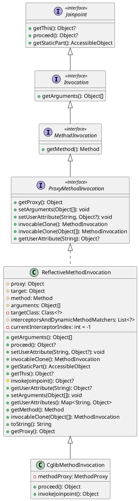
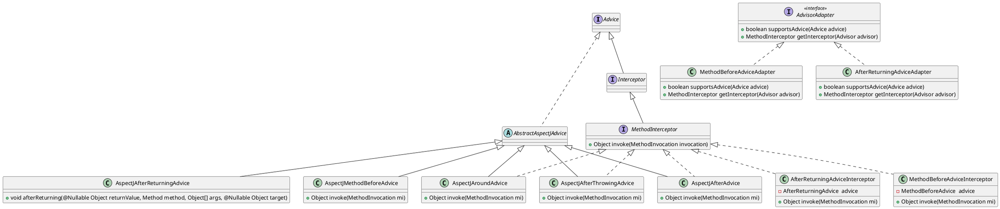
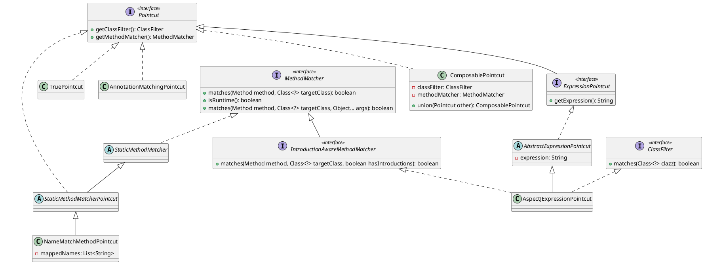
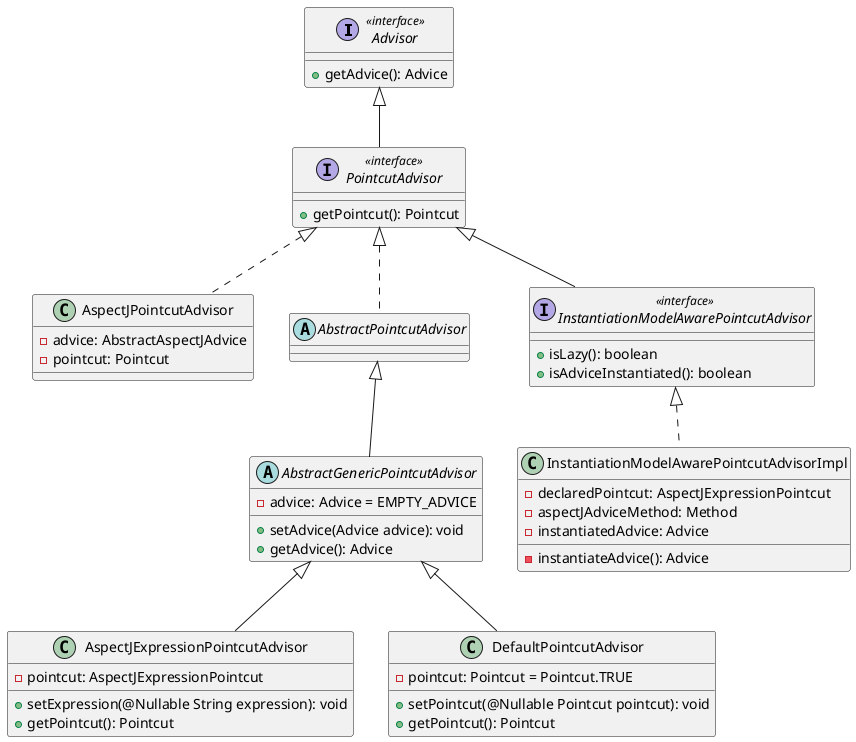
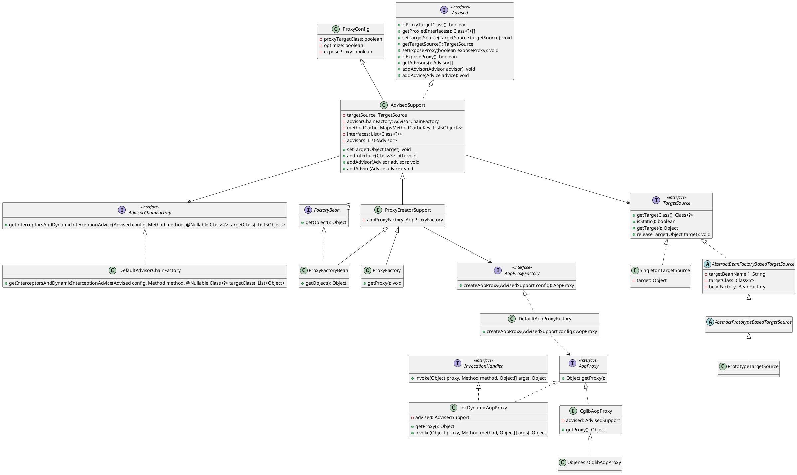
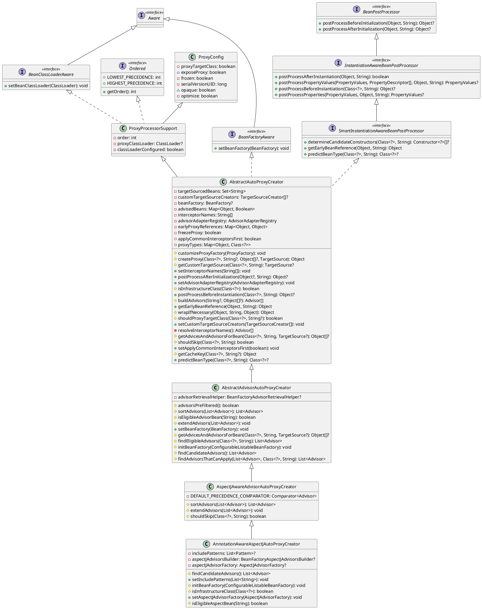
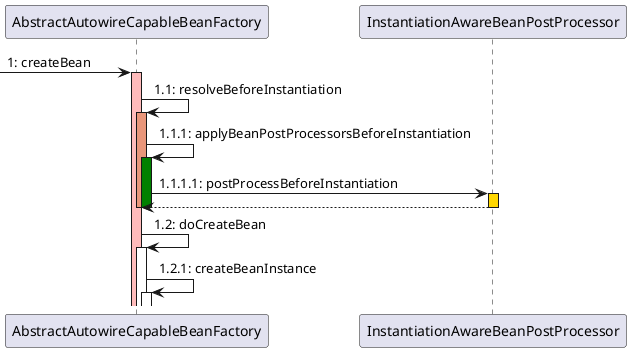
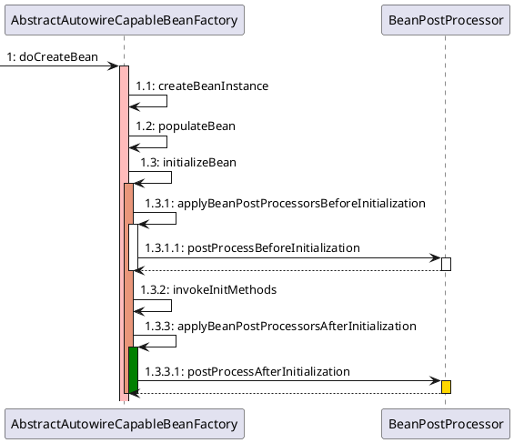

# Spring-Aop底层源码分析

AOP 是 OOP 的延续，是 Aspect Oriented Programming 的缩写，意思是<u>面向切面编程</u>，可以通过预编译和运行时动态代理，实现在不修改源代码的情况下给程序动态统一添加功能。

日常开发中一些非业务，如日志、<u>**事务**</u>、安全等写在业务代码中，这些代码往往是重复的，复制粘贴式代码会给程序的维护带来不便。AOP 就将这些非业务代码与业务代码分开，这种解决方式也称之<u>代理机制</u>。

Spring AOP 是一种编程范式，主要目的是将非功能性需求从功能性需求中分离出来，达到<u>解耦</u>的目的。

## 环境搭建

1. 利用 [Spring-源码环境搭建](./Spring-源码环境搭建.md) 搭建的Spring源码环境，创建一个新的模块专门用来研究 Spring Aop 底层原理的模块。选中项目右键新建一个模块，模块名为`spring-aop-source-test`，选择 Gradle，最后点击创建即可即可；<br />

2. 引入相关依赖：在模块的 build.gradle 文件中引入以下依赖

   ```groovy
   dependencies {
       testImplementation 'org.junit.jupiter:junit-jupiter-api:5.8.1'
       testRuntimeOnly 'org.junit.jupiter:junit-jupiter-engine:5.8.1'
       implementation(project(':spring-context'))
       implementation(project(':spring-aspects'))
       implementation 'org.slf4j:slf4j-api:2.0.3'
       implementation 'ch.qos.logback:logback-classic:1.4.4'
   }
   ```

3. 增加日志配置文件：由于引入了 logback，所以需要在资源目录 resources 下创建一个 logback.xml 文件

   ```xml
   <?xml version="1.0" encoding="UTF-8"?>
   <configuration>
     <appender name="CONSOLE" class="ch.qos.logback.core.ConsoleAppender">
       <encoder>
         <pattern>%d{yyyy-MM-dd HH:mm:ss.SSS} [%t] %-5p %c{1}:%L - %m%n</pattern>
       </encoder>
     </appender>
   
     <appender name="FILE" class="ch.qos.logback.core.rolling.RollingFileAppender">
       <encoder>
         <pattern>%d{yyyy-MM-dd HH:mm:ss.SSS} [%t] %-5p %c{1}:%L - %m%n</pattern>
         <charset>utf-8</charset>
       </encoder>
       <file>log/output.log</file>
       <rollingPolicy class="ch.qos.logback.core.rolling.FixedWindowRollingPolicy">
         <fileNamePattern>log/output.log.%i</fileNamePattern>
       </rollingPolicy>
       <triggeringPolicy class="ch.qos.logback.core.rolling.SizeBasedTriggeringPolicy">
         <MaxFileSize>1MB</MaxFileSize>
       </triggeringPolicy>
     </appender>
   
     <root level="DEBUG">
       <appender-ref ref="CONSOLE"/>
       <appender-ref ref="FILE"/>
     </root>
   </configuration>
   ```

4. 业务逻辑类

   ```java
   public interface EchoService {
   	/**
   	 * 目标方法：原样返回传递的字符串
   	 *
   	 * @param str 传递的字符串
   	 * @return 原样返回传递的字符串
   	 */
   	String echo(String str);
   }
   ```

   ```java
   @Service
   public class EchoServiceImpl implements EchoService {
   	private static final Logger LOGGER = LoggerFactory.getLogger(EchoServiceImpl.class);
   
   	public EchoServiceImpl() {
   		LOGGER.info("...HelloService创建了...");
   	}
   
   	@Override
   	public String echo(String str) {
   		LOGGER.info("目标方法执行：{}", str);
   
   		// 模拟异常
   //		Object o1 = new ArrayList<>(10).get(11);
   
   		return str;
   	}
   }
   ```

5. 日志切面类

   ```java
   @Component
   @Aspect
   public class LogAspect {
   	private static final Logger LOGGER = LoggerFactory.getLogger(LogAspect.class);
   
   	public LogAspect() {
   		LOGGER.info("...LogAspect创建了...");
   	}
   
   	@Pointcut("execution(* fun.xiaorang.spring.aop.service.EchoService.echo(..))")
   	public void pointcut() {
   	}
   
   	/**
   	 * 前置通知，增强方法/增强器
   	 *
   	 * @param joinPoint 封装了 AOP 中切面方法的信息
   	 */
   	@Before("pointcut()")
   	public void logStart(JoinPoint joinPoint) {
   		String name = joinPoint.getSignature().getName();
   		LOGGER.info("前置通知logStart==>目标方法：{}，参数:{}", name, joinPoint.getArgs());
   	}
   
   	/**
   	 * 返回通知
   	 *
   	 * @param joinPoint 封装了 AOP 中切面方法的信息
   	 * @param result    目标方法的返回值
   	 */
   	@AfterReturning(value = "pointcut()", returning = "result")
   	public void logReturn(JoinPoint joinPoint, Object result) {
   		String name = joinPoint.getSignature().getName();
   		LOGGER.info("返回通知logReturn==>目标方法：{}，参数:{}，返回值：{}", name, joinPoint.getArgs(), result);
   	}
   
   	/**
   	 * 后置通知
   	 *
   	 * @param joinPoint 封装了 AOP 中切面方法的信息
   	 */
   	@After("pointcut()")
   	public void logEnd(JoinPoint joinPoint) {
   		String name = joinPoint.getSignature().getName();
   		LOGGER.info("后置通知logEnd==>目标方法：{}，参数:{}", name, joinPoint.getArgs());
   	}
   
   	/**
   	 * 异常通知
   	 *
   	 * @param joinPoint 封装了 AOP 中切面方法的信息
   	 * @param e         异常
   	 */
   	@AfterThrowing(value = "pointcut()", throwing = "e")
   	public void logError(JoinPoint joinPoint, Exception e) {
   		String name = joinPoint.getSignature().getName();
   		LOGGER.info("异常通知logError==>目标方法：{}，参数:{}，异常信息: {}", name, joinPoint.getArgs(), e.getMessage());
   	}
   
   	/**
   	 * 环绕通知
   	 *
   	 * @param proceedingJoinPoint 封装了 AOP 中切面方法的信息
   	 * @return 目标方法的返回值
   	 */
   	@Around("pointcut()")
   	public Object logAround(ProceedingJoinPoint proceedingJoinPoint) {
   		String name = proceedingJoinPoint.getSignature().getName();
   		Object result;
   		try {
   			LOGGER.info("环绕通知logAround前==>目标方法：{}，参数:{}", name, proceedingJoinPoint.getArgs());
   			result = proceedingJoinPoint.proceed();
   		} catch (Throwable e) {
   			throw new RuntimeException(e);
   		} finally {
   			LOGGER.info("环绕通知logAround后==>目标方法：{}，参数:{}", name, proceedingJoinPoint.getArgs());
   		}
   		return result;
   	}
   }
   ```

6. 主配置类

   ```java
   @Configuration
   @EnableAspectJAutoProxy(proxyTargetClass = true)
   @ComponentScan({"fun.xiaorang.spring.aop"})
   public class MainConfig {
   	
   }
   ```

7. 测试类

   ```java
   class ApiTest {
   	private static final Logger LOGGER = LoggerFactory.getLogger(ApiTest.class);
   
   	@Test
   	public void test_00() {
   		ApplicationContext applicationContext = new AnnotationConfigApplicationContext(MainConfig.class);
   		EchoService echoService = applicationContext.getBean(EchoService.class);
   		LOGGER.info("======================华丽的分割线=========================");
   		echoService.echo("小让");
   		LOGGER.info("======================华丽的分割线=========================");
   	}
   }
   ```

   正常情况下的测试结果如下所示：<br /><br />有异常出现的情况下的测试结果如下所示：<br /><br />测试成功，达到预期效果！

以上案例只是日常开发中对 Spring Aop 一种最简单方便的用法，当后续源码分析到某个知识点需要进行 DEBUG 调试时再去增加需要的基础设施类和测试方法代码片段，这样的作法在源码分析时针对某个知识点能够现场举例并马上查看效果可能会对源码理解的更加清晰透彻；

## 核心组件
### Joinpoint

其继承关系图如下所示：



由上图可知，其实现类`ReflectiveMethodInvocation`中存在以下几个非常重要的属性：

- proxy：代理对象
- target：目标对象
- method：目标方法
- arguments：参数列表
- <u>interceptorsAndDynamicMethodMatchers</u>：用于维护与目标方法所匹配的方法拦截器，称之为<u>拦截器链</u>；作用：以便后续在执行代理对象中的某个方法时，可以按照顺序依次执行方法拦截器和目标方法中的逻辑。
- <u>currentInterceptorIndex</u>：当前所执行到的方法拦截器索引，初始值为 -1，当该属性的值等于<u>拦截器链的长度-1</u>时，表示该拦截器链上的所有拦截器都已遍历完（但并不等同于全部执行完，因为除前置通知外的其余4种通知都需要等到目标方法执行完成之后才能回过头来继续进行下一步），可以开始执行目标方法。其实对该属性的解释就是类中`proceed()`方法的逻辑，该方法非常重要！！！至于该方法的详细分析可以查看下文 [执行拦截器链](#执行拦截器链)

### Advice

其继承关系图如下所示：



由上图可知，

1. 主要有五种类型的通知，分别为前置通知（<span style="background-color: rgb(251, 228, 231);">AspectJMethodBeforeAdvice</span>），环绕通知（<span style="background-color:rgb(232, 247, 207);">AspectJAroundAdvice</span>），返回通知（<span style="background-color: rgb(251, 228, 231);">AspectJAfterReturningAdvice</span>），异常通知（<span style="background-color:rgb(232, 247, 207);">AspectJAfterThrowingAdvice</span>）和后置通知（<span style="background-color:rgb(232, 247, 207);">AspectJAfterAdvice</span>），在切面类中被 @Before、@Around、@AfterReturning、@AfterThrowing、@After 注解标注的方法会被分别转换为与之对应的通知。

2. 实现方法拦截器 <span style="background-color:rgb(232, 247, 207);">MethodInterceptor</span> 接口的类分别有 MethodBeforeAdviceInterceptor，AspectJAroundAdvice，AfterReturningAdviceInterceptor，AspectJAfterThrowingAdvice，AspectJAfterAdvice，可以惊奇地发现前置通知（AspectJMethodBeforeAdvice）和 返回通知（AspectJAfterReturningAdvice）并没有实现方法拦截器 MethodInterceptor 接口，这样的话在构建方法拦截器链时该怎么统一成方法拦截器 MethodInterceptor 呢？其实仔细观察的话，可以从上图中找到答案，上图中出现的 MethodBeforeAdviceAdapter 和 AfterReturningAdviceAdapter 两个适配器分别用于将前置通知（AspectJMethodBeforeAdvice）和 返回通知（AspectJAfterReturningAdvice）转化成对应的 MethodBeforeAdviceInterceptor 和 AfterReturningAdviceInterceptor 方法拦截器，这样在构建方法拦截器链的时候就统一了！

3. 关于五种类型通知的执行顺序如下所示：

   ```java
   try{
       环绕通知前
   	前置通知
   	目标方法
   	返回通知
   } catch(Exception e) {
   	异常通知
   } finally {
   	后置通知
       环绕通知后
   }
   ```

### Pointcut

其继承关系图如下所示：



由上图可知，切点（Pointcut）的作用为从所有的增强器（Advisor）中<u>筛选</u>出与目标类和方法所匹配的增强器，主要由以下两部分组成：

- ClassFilter：类过滤器，该接口中的 matches() 方法主要用于判断目标类是否与 Pointcut 规定的类型匹配，如果匹配的话，表示可以对该类进行增强，进入下一步（方法匹配器）的判断；

	>[!CODE|label:ClassFilter 接口及其实现类 TrueClassFilter 定义]
	>
	>```java
	>@FunctionalInterface
	>public interface ClassFilter {
	>
	>	/**
	>	 * Should the pointcut apply to the given interface or target class?
	>	 * @param clazz the candidate target class
	>	 * @return whether the advice should apply to the given target class
	>	 */
	>	boolean matches(Class<?> clazz);
	>
	>
	>	/**
	>	 * Canonical instance of a ClassFilter that matches all classes.
	>	 */
	>	ClassFilter TRUE = TrueClassFilter.INSTANCE;
	>
	>}
	>```
	>
	>在 ClassFilter 接口中定义了一个 TrueClassFilter 单例对象（单例设计模式）的常量，其中 TrueClassFilter 类中的 matches() 方法总是返回 true，表示匹配所有的类；
	>
	>```java
	>final class TrueClassFilter implements ClassFilter, Serializable {
	>
	>	public static final TrueClassFilter INSTANCE = new TrueClassFilter();
	>
	>	/**
	>	 * Enforce Singleton pattern.
	>	 */
	>	private TrueClassFilter() {
	>	}
	>
	>	@Override
	>	public boolean matches(Class<?> clazz) {
	>		return true;
	>	}
	>
	>	/**
	>	 * Required to support serialization. Replaces with canonical
	>	 * instance on deserialization, protecting Singleton pattern.
	>	 * Alternative to overriding {@code equals()}.
	>	 */
	>	private Object readResolve() {
	>		return INSTANCE;
	>	}
	>
	>	@Override
	>	public String toString() {
	>		return "ClassFilter.TRUE";
	>	}
	>
	>}
	>```

- MethodMatcher：方法匹配器，该接口中定义了以下三个方法：

  - 两个参数的 matches() 方法：称之为静态匹配，满足静态匹配的增强器才能将增强器中的通知转换为方法拦截器添加到拦截器链中；

  - 三个参数的 matches() 方法：称之为运行时（动态）匹配，当拦截器链执行到某个方法拦截器时，会先通过该方法进一步对传入的实参进行匹配，如果匹配的话，才会去执行方法拦截器中的逻辑；

  - 以上两个方法的分界线就是 isRuntime() 方法：如果该方法返回 true，说明该方法匹配器是运行时（动态）匹配，反之则为静态匹配。

关于 Pointcut 的实际运用可以查看下文 [获取拦截器链](#获取拦截器链)
### Advisor
其继承关系图如下所示：



>[!IMPORTANT]
>
>Advisor = Pointcut + Advice => <u>增强器</u> = <u>切点</u> + <u>通知</u>

## 源码分析

源码分析过程中涉及到 JDK 和 Cglib 动态代理，对这两种动态代理方式在应用层面都不清楚的小伙伴，强烈建议先去阅读这篇文章 [动态代理(Dynamic Proxy)](https://www.yuque.com/xihuanxiaorang/java/bdeg6cvmcw458906?view=doc_embed) ！！！

### ProxyFactory

咱们并没有先从 <u>AnnotationAwareAspectJAutoProxyCreator</u> 后置处理器入手，而是从 <u>ProxyFactory</u> 代理工厂类着手开始分析，为什么呢？因为其实理清楚这个类就已经对 Spring Aop 的底层原理了解的差不多了！<br />Spring 针对 JDK 和 Cglib 这两种动态代理方式生成代理对象的过程抽象出一个简单实用的类 ProxyFactory，代理工厂，专门用于根据指定的配置信息生产出目标类的代理对象。<br />其继承关系图如下所示：



由上图可知，ProxyFactory 作为最底层的实现类，一路继承自 <u>ProxyCreatorSupport</u> -> <u>AdvisedSupport</u> -> <u>ProxyConfig</u> 。至于 ProxyFactoryBean 有兴趣的小伙伴的可以自行研究，其实只要搞清楚 ProxyFactory，ProxyFactoryBean 就不是事儿！

- 在其顶层父类 ProxyConfig 中有以下两个重要的属性：
   - <u>proxyTargetClass</u>：布尔类型，当该属性值为 true 时，表示将会使用 Cglib 动态代理的方式生成代理对象；
   - <u>exposeProxy</u>：布尔类型，表示是否暴露当前代理对象，即将当前代理对象存储在 <u>AopContext</u> 上下文的 currentProxy 属性中，使用 ThreadLocal 的方式将当前暴露的代理对象与线程绑定起来，后续要使用的时候可以通过上下文中的 currentProxy() 方法获取出该代理对象。可以用来解决在同一个类中非事务方法A调用事务方法B会导致事务失效的情况！

- 在其父类 AdvisedSupport 中又增加了以下几个重要的属性：
   - targetSource：作为目标对象（target）的来源（在其内部持有一个目标对象（target） 引用），有一个非常重要的点：<span style="background-color: rgb(251, 228, 231);">代理对象代理的其实不是目标对象（target），而是 TargetSource！</span>

     🤔 为什么 Spring Aop 不是直接代理目标对象呢？而是通过代理 TargetSource 间接代理 target 呢？<br />🤓 一般情况下，一个代理对象（proxy）只能代理一个目标对象（target），每次方法调用（MethodInvocation）执行（proceed()）之前获取到的目标对象（target）都是同一个单例对象。但是，如果让代理对象（proxy）代理 TargetSource 的话，可以实现每次方法调用时获取到的目标对象可以是一个单例对象或者多例对象，取决于 TargetSource 实现（如默认的实现类 <u>SingletonTargetSource</u> 和 <u>PrototypeTargetSource</u>）。这种机制使得方法调用变得更加灵活，可以扩展出很多高级功能，如目标对象池（Pooling）、运行时目标对象热替换（HotSwappable）等等；

     >[!CODE|label:TargetSource 接口定义]
     >
     >```java
     >public interface TargetSource extends TargetClassAware {
     >    /**
     >	 * 返回目标对象类型
     >	 */
     >    @Override
     >    @Nullable
     >    Class<?> getTargetClass();
     >
     >    /**
     >	 * 用于确定调用 getTarget() 方法时返回的目标对象是不是同一个？如果为true的话，表示返回的同一个目标对象，此时不再需要调用 releaseTarget() 方法，因为 Aop 框架可以缓存目标对象
     >	 * 在其实现类 SingletonTargetSource 中该方法返回 true，表示调用 getTarget() 方法时返回的目标对象是同一个单例对象，
     >	 * 而在其实现类 PrototypeTargetSource 中该方法返回 false，表示调用 getTarget() 方法时返回的目标对象是多例对象
     >	 */
     >    boolean isStatic();
     >
     >    /**
     >	 * 获取目标对象，在每次方法调用（MethodInvocation）执行（proceed()）之前立即获取
     >	 */
     >    @Nullable
     >	Object getTarget() throws Exception;
     >
     >    /**
     >	 * 释放从 getTarget() 方法获得的给定目标对象(如果有的话)
     >	 */
     >    void releaseTarget(Object target) throws Exception;
     >}
     >```

   - interfaces：用于维护目标对象所实现的指定接口，可以不用手动进行设置，在使用 ProxyFactory 有参构造函数进行实例化的时候的时候会默认获取目标对象所实现的所有接口进行填充
   - advisors：用于维护所有的增强器（Advisor），后面在执行代理对象中的某个方法时，通过 advisorChainFactory 可以将符合条件（即满足切点（Pointcut）= ClassFilter + MethodMatcher）的增强器筛选出来，然后将这些筛选出来的增强器转换成一个个的方法拦截器（MethodInterceptor）用于构建一条<u>拦截器链</u>。
   - methodCache：用于缓存被代理的方法和与该方法相对应的拦截器链，后续可以先尝试从缓存中取出方法对应的拦截器链，缓存中不存在的话，才去构建一条拦截器链放入缓存中，避免每次都去重新构建！
   - advisorChainFactory：增强器链工厂，默认实现为 DefaultAdvisorChainFactory，该类主要作用为从维护的所有增强器中筛选出符合条件的增强器转换成方法拦截器后构建出一条拦截器链返回！

- 在其父类 <u>ProxyCreatorSupport</u> 中持有一个 <u>AopProxyFactory</u> 接口的默认实现类 <u>DefaultAopProxyFactory</u> 的引用，利用 DefaultAopProxyFactory 中`createAopProxy()`方法创建出 <u>AopProxy</u> 接口实现类 <u>JdkDynamicAopProxy</u> 或者 <u>CglibAopProxy</u> 的实例对象，至于是使用哪一个实现类来生成代理对象，则需要根据配置条件来决定！

说了这么多，直接上才艺，演示如何用 ProxyFactory 实现与环境搭建中案例相同的效果！先演示使用 Cglib 动态代理的方式来创建代理对象，具体代码实现如下所示：

1. 编写如下五种不同类型的通知

   1. 环绕通知

      ```java
      public class MyAroundAdvice implements MethodInterceptor {
      	private static final Logger LOGGER = LoggerFactory.getLogger(MyAroundAdvice.class);
      
      	@Nullable
      	@Override
      	public Object invoke(@Nonnull MethodInvocation invocation) throws Throwable {
      		String name = invocation.getMethod().getName();
      		Object[] args = invocation.getArguments();
      		Object result;
      		try {
      			LOGGER.info("环绕通知logAround前==>目标方法：{}，参数:{}", name, args);
      			result = invocation.proceed();
      		} catch (Throwable e) {
      			throw new RuntimeException(e);
      		} finally {
      			LOGGER.info("环绕通知logAround后==>目标方法：{}，参数:{}", name, args);
      		}
      		return result;
      	}
      }
      ```

   2. 前置通知

      ```java
      public class MyMethodBeforeAdvice implements MethodBeforeAdvice {
      	private static final Logger LOGGER = LoggerFactory.getLogger(MyMethodBeforeAdvice.class);
      
      	@Override
      	public void before(Method method, Object[] args, Object target) throws Throwable {
      		LOGGER.info("前置通知logStart==>目标方法：{}，参数:{}", method.getName(), args);
      	}
      }
      ```

   3. 后置通知

      ```java
      public class MyAfterAdvice implements MethodInterceptor {
      	private static final Logger LOGGER = LoggerFactory.getLogger(MyAfterAdvice.class);
      
      	@Nullable
      	@Override
      	public Object invoke(@Nonnull MethodInvocation invocation) throws Throwable {
      		try {
      			return invocation.proceed();
      		} finally {
      			LOGGER.info("后置通知logEnd==>目标方法：{}，参数:{}", invocation.getMethod().getName(), invocation.getArguments());
      		}
      	}
      }
      ```

   4. 返回通知

      ```java
      public class MyAfterReturningAdvice implements AfterReturningAdvice {
      	private static final Logger LOGGER = LoggerFactory.getLogger(MyAfterReturningAdvice.class);
      
      	@Override
      	public void afterReturning(Object returnValue, Method method, Object[] args, Object target) throws Throwable {
      		LOGGER.info("返回通知logReturn==>目标方法：{}，参数:{}，返回值：{}", method.getName(), args, returnValue);
      	}
      }
      ```

   5. 异常通知

      ```java
      public class MyAfterThrowingAdvice implements MethodInterceptor {
      	private static final Logger LOGGER = LoggerFactory.getLogger(MyAfterThrowingAdvice.class);
      
      	@Nullable
      	@Override
      	public Object invoke(@Nonnull MethodInvocation invocation) throws Throwable {
      		try {
      			return invocation.proceed();
      		} catch (Throwable ex) {
      			LOGGER.info("异常通知logError==>目标方法：{}，参数:{}，异常信息: {}", invocation.getMethod().getName(), invocation.getArguments(), ex.getMessage());
      			throw ex;
      		}
      	}
      }
      ```

2. 在测试类中增加测试方法，注意：通知的添加顺序会影响到输出结果！

   ```java
   @Test
   public void test_01() {
       EchoService echoService = new EchoServiceImpl();
       // 指定目标对象和设置目标对象所实现的所有接口
       ProxyFactory proxyFactory = new ProxyFactory(echoService);
       // 环绕通知
       proxyFactory.addAdvice(new MyAroundAdvice());
       // 前置通知
       proxyFactory.addAdvice(new MyMethodBeforeAdvice());
       // 后置通知
       proxyFactory.addAdvice(new MyAfterAdvice());
       // 返回通知
       proxyFactory.addAdvice(new MyAfterReturningAdvice());
       // 异常通知
       proxyFactory.addAdvice(new MyAfterThrowingAdvice());
       // 创建代理对象
       EchoService proxy = (EchoService) proxyFactory.getProxy();
       LOGGER.info("======================华丽的分割线=========================");
       proxy.echo("小让");
       LOGGER.info("======================华丽的分割线=========================");
   }
   ```

正常情况下的测试结果如下所示：<br /><br />有异常出现的情况下的测试结果如下所示：<br /><br />可以发现本案例（测试方法 test_01）的测试结果与环境搭建中案例（测试方法 test_00)的测试结果一致！<br />正如前面所说，只要搞清楚 ProxyFactory 是如何生成代理对象以及调用代理对象方法时又是如何运作的，其实对 Spring Aop 的底层原理就已经了解的差不多了！

#### 生成代理对象

使用 ProxyFactory 生成代理对象具体可以分为以下几个步骤：

1. [指定目标源（TargetSource）](#指定目标源（TargetSource）)
2. [注册通知（Advice）](#注册通知（Advice）)或者准确点来说，应该是注册增强器（Advisor）
3. [选择动态代理策略](#选择动态代理策略)
4. 使用 [JDK](#JDK) 或者 [Cglib](#Cglib) 动态代理的方式生成代理对象

##### 指定目标源（TargetSource）

还记得前面所讲的：代理对象代理的是 TargetSource，并不是 target 嘛！所以在使用 ProxyFactory 生成代理对象之前，需要先指定 TargetSource，有的小伙伴可能会疑惑，咦，在本案例（测试方法 test_01）中咱们只指定了目标对象 `proxyFactory.setTarget(echoService);`啊，并没有指定 TargetSource，其实不然，咱们来看下 setTarget() 方法，该方法位于其父类 AdvisedSupport 中，如下所示：<br /><br />由上图可知，指定目标对象（target)其实就是指定 TargetSource，类型为默认的 SingletonTargetSource！
##### 注册通知（Advice）

>[!ATTENTION]
>
>与本案例增强器的来源不同，环境搭建中的案例是通过解析在切面类中被 @Before、@Around、@AfterReturning、@AfterThrowing、@After 注解标注的通知方法，将这些通知方法连同方法上的注解信息转换为与之对应的增强器 Advisor 并排好序后注册到 ProxyFactory 中的！关于这一部分的源码分析可以参考下文 

🤔 在本案例中是按照人为的顺序依次手动注册通知，可是在其父类 AdvisedSupport 中只存在一个 advisors 增强器类型的集合属性，小伙伴们可能会疑惑，这类型都不对，怎么能添加到该集合中？<br />🤓 此时盲猜一波，肯定在注册通知（Advice）的时候将其转换成增强器（Advisor）然后再添加到该集合中的，前面提到过 Advisor = Pointcut + Advice => 增强器 = 切点 + 通知，现在 Advisor 中的 Advice 能够确定，那么切点呢？思考一下，咱们手动注册进去的是通知，并不是增强器，这样的话，说明该通知应该<u>对任何类中的任何方法都生效</u>，从而推导出满足该要求的切点实现类就只有前面提到过的 TruePointcut，现在验证一下咱们的猜想对不对，打断点 DEBUG 调试一下，如下所示：<br /><br /><br />由上图可知，注册进去的通知将会被转换为 DefaultPointcutAdvisor 类型的增强器，并且增强器中的切点类型为 TruePointcut，使得通知可以匹配任何类中的任何方法！现在打断点 DEBUG 查看一下注册进去的增强器。<br />

##### 选择动态代理策略

在本案例中直接调用 ProxyFacrtory 中的 getProxy() 方法获取代理对象，该方法是如何实现生成代理对象的呢？
```java
public Object getProxy() {
    return createAopProxy().getProxy();
}
```
首先会调用其父类 ProxyCreatorSupport 中的 createAopProxy() 创建一个 AopProxy 接口的实例对象（ObjenesisCglibAopProxy 或 JdkDynamicAopProxy）返回，然后将生成代理对象的工作委托给该 AopProxy 实例对象（ObjenesisCglibAopProxy 或 JdkDynamicAopProxy），即调用该实例对象中的 getProxy() 方法创建出代理对象并返回！
```java
protected final synchronized AopProxy createAopProxy() {
    if (!this.active) {
        activate();
    }
    /*
        this <=> 当前 ProxyFactory 实例对象
        使用默认的 DefaultAopProxyFactory 根据配置条件（即当前 ProxyFactory 实例对象中的属性信息，如 optimize、proxyTargetClass、interfaces 等等）创建不同的 AopProxy 实例对象
        JdkDynamicAopProxy 或者 ObjenesisCglibAopProxy
     */
    return getAopProxyFactory().createAopProxy(this);
}
```
在该方法中会使用默认的 DefaultAopProxyFactory 工厂根据配置条件（即当前 ProxyFactory 实例对象中的属性信息，如 optimize、proxyTargetClass、interfaces 等等）选择创建 ObjenesisCglibAopProxy 或 JdkDynamicAopProxy 的实例对象。判断条件如下所示：

1. 判断是否是在 graalvm 虚拟机环境上运行，如果是的话，则只能选择使用 JDK 动态代理；
2. 是否开启优化策略
3. 判断是否使用 Cglib 动态代理，可以通过以下两种方式进行设置：
   1. 手动指定 ProxyFactory 中的 proxyTargetClass 属性设置为 true
   2. 在开启 Aop 功能时设置 @EnableAspectJAutoProxy 注解中的 proxyTargetClass 属性为 true
4.  判断当前目标类是否没有实现任何接口或者实现了一个接口但是该接口是 SpringProxy 类型，如果有实现接口并且只实现了一个接口时也不是 SpringProxy 类型的话，则使用 JDK 动态代理

注意：因为这几个条件是用或（|）连接的，所以前面的条件满足就不再判断后面的条件，即排在前面的条件具有更高的优先级<br />🤔 总结一下，那么在什么情况下会选用 Cglib 动态代理的方式呢？即在什么情况下会选择创建 ObjenesisCglibAopProxy 实例对象呢？<br />🤓 选用 Cglib 动态代理的方式需要同时满足以下条件：

1. 不是在 graalvm 虚拟机上运行 
2. 目标类不是接口 && 不是已经经过 JDK 动态代理生成的代理类 && 不是Lambda 表达式
3. 开启优化策略 || 指定使用 Cglib 动态代理 || 当前目标类没有实现任何接口或者实现了一个接口但是该接口是 SpringProxy 类型

反之，其他情况则会选用 JDK 动态代理的方式，即会选择创建 JdkDynamicAopProxy 实例对象
```java
public AopProxy createAopProxy(AdvisedSupport config) throws AopConfigException {
    /*
        当前 config 参数为 ProxyFactory 实例对象，根据以下配置条件（即当前 ProxyFactory 实例对象中的属性信息，如 optimize、proxyTargetClass、interfaces 等等）选择创建 ObjenesisCglibAopProxy 或 JdkDynamicAopProxy 的实例对象返回
        1. 判断是否是在 graalvm 虚拟机环境上运行，如果是的话，则只能选择使用 JDK 动态代理
        2. 是否开启优化策略
        3. 判断是否指定使用 Cglib 动态代理，可以通过以下两种方式进行设置：
            a. 手动指定 ProxyFactory 中的 proxyTargetClass 属性设置为 true
            b. 在开启 Aop 功能时设置 @EnableAspectJAutoProxy 注解中的 proxyTargetClass 属性为 true
        4. 判断当前目标类是否没有实现任何接口或者实现了一个接口但是该接口是 SpringProxy 类型，如果有实现接口并且只实现了一个接口时也不是 SpringProxy 类型的话，则使用 JDK 动态代理
        因为这几个条件是用或（|）连接的，所以前面的条件满足就不再判断后面的条件，即排在前面的条件具有更高的优先级
     */
    if (!NativeDetector.inNativeImage() &&
            (config.isOptimize() || config.isProxyTargetClass() || hasNoUserSuppliedProxyInterfaces(config))) {
        Class<?> targetClass = config.getTargetClass();
        if (targetClass == null) {
            throw new AopConfigException("TargetSource cannot determine target class: " +
                    "Either an interface or a target is required for proxy creation.");
        }
        // 若目标类是接口或是已经经过 JDK 动态代理生成的代理类或是 Lambda 表达式的话，则只能使用 JDK 动态代理
        if (targetClass.isInterface() || Proxy.isProxyClass(targetClass) || ClassUtils.isLambdaClass(targetClass)) {
            return new JdkDynamicAopProxy(config);
        }
        // 表明目标类并不是接口或者代理类，则使用 Cglib 动态代理
        return new ObjenesisCglibAopProxy(config);
    } else {
        // 使用 JDK 动态代理（即(没有开启优化策略，也没有设置使用 Cglib 动态代理，同时目标类有实现接口并且只实现了一个接口时也不是 SpringProxy 类型)或者当前是在 graalvm 虚拟机环境上运行 ）
        return new JdkDynamicAopProxy(config);
    }
}
```
不急着打断点 DEBUG 调试，先自己分析一下在本案例中会选用哪一种动态代理的方式，这样会对上面的条件分支判断有更深刻的印象！

1. 不是运行在 graalvm 虚拟机环境下，
2. 没有开启优化策略，即没有设置 ProxyFactory 中的 optimize 属性值为 true
3. 没有指定使用 Cglib 动态代理，即没有设置 ProxyFactory 中的 proxyTargetClass 属性值为 true
4. 目标对象实现了 EchoService

综合以上条件可以推断出本案例会选用 JDK 动态代理的方式，即会选择创建 JdkDynamicAopProxy 实例对象后返回！现在打断点 DEBUG 调试一下，验证咱们的猜想是否正确。<br /><br />由上图可知，果然如咱们猜想的一致，选择的是 JDK 动态代理的方式，即会选择创建 JdkDynamicAopProxy 实例对象后返回！

###### JDK

Spring 使用 JDK 动态代理的方式来生成代理对象的具体代码实现如下所示：
```java
public Object getProxy(@Nullable ClassLoader classLoader) {
    if (logger.isTraceEnabled()) {
        logger.trace("Creating JDK dynamic proxy: " + this.advised.getTargetSource());
    }
    if (classLoader == null || classLoader.getParent() == null) {
        // JDK bootstrap loader or platform loader suggested ->
        // use higher-level loader which can see Spring infrastructure classes
        classLoader = getClass().getClassLoader();
    }
    /*
        使用 JDK 动态代理生成代理对象，参数解释如下：
        1. classLoader：类加载器，
        2. proxiedInterfaces：代理类所需要实现的接口
        3. this：表示当前类自身实例对象，实现了 InvocationHandler 接口，需要重写接口中的 invoke() 方法
            在调用代理对象中的某个方法时，会执行该 invoke() 方法中的逻辑：
            1. 从所有的增强器中筛选出与当前目标类和方法匹配的增强器，并将这些增强器中的通知转换为方法拦截器后形成一条拦截器链，并将其形成的拦截器链保存到缓存中，以便再次调用时可以直接从缓存中取，不用再重新去筛选构建
            2. 依次遍历该拦截器链中的每个方法拦截器，直至全部遍历完（但并不等同于全部执行完，因为除前置通知外的其余4种通知都需要等到目标方法执行完成之后才能回过头来继续进行下一步）之后再执行目标方法
     */
    return Proxy.newProxyInstance(classLoader, this.proxiedInterfaces, this);
}
```
可以发现，与咱们平时使用 JDK 动态代理来生成代理对象的方式并没有什么两样！现在打断点 DEBUG 查看一下使用 JDK 动态代理生成的代理对象长啥样吧！<br />

###### Cglib

本案例之所以使用 JDK 动态代理的方式生成代理对象，主要是因为以下这两个条件：

1. 没有指定使用 Cglib 动态代理，即没有设置 ProxyFactory 中的 proxyTargetClass 属性值为 true
2. 目标对象实现了 EchoService

所以咱们只需要破坏其中一个条件就会使其使用 Cglib 动态代理的方式生成代理对象，简单点的做法就是设置 proxyTargetClass 属性值为 true，修改测试方法，如下所示：
```java
@Test
public void test_01() {
    EchoService echoService = new EchoServiceImpl();
    // 指定目标对象和设置目标对象所实现的所有接口
    ProxyFactory proxyFactory = new ProxyFactory(echoService);
    // 使用 Cglib 动态代理的方式生成代理对象
    proxyFactory.setProxyTargetClass(true);
    // 环绕通知
    proxyFactory.addAdvice(new MyAroundAdvice());
    // 前置通知
    proxyFactory.addAdvice(new MyMethodBeforeAdvice());
    // 后置通知
    proxyFactory.addAdvice(new MyAfterAdvice());
    // 返回通知
    proxyFactory.addAdvice(new MyAfterReturningAdvice());
    // 异常通知
    proxyFactory.addAdvice(new MyAfterThrowingAdvice());
    // 创建代理对象
    EchoService proxy = (EchoService) proxyFactory.getProxy();
    LOGGER.info("======================华丽的分割线=========================");
    proxy.echo("小让");
    LOGGER.info("======================华丽的分割线=========================");
}
```
打断点 DEBUG 调试一下，验证一下现在是不是使用 Cglib 动态代理的方式生成代理对象。<br /><br />OK！现在果然是使用 Cglib 动态代理的方式生成代理对象。其具体实现步骤如下所示：

1. 构建字节码增强器（Enhancer），设置被代理类的父类为目标类；
2. 获取回调数组（callbacks），其中最重要的一个为 <u>DynamicAdvisedInterceptor</u> 拦截器，在调用代理对象中的某个方法时将会被该方法拦截器所拦截，执行该方法拦截器中 intercept() 方法的逻辑：
   1. 从所有的增强器中筛选出与当前目标类和方法匹配的增强器，并将这些增强器中的通知转换为方法拦截器后形成一条拦截器链，并将其形成的拦截器链保存到缓存中，以便再次调用时可以直接从缓存中取，不用再重新去筛选构建
   2. 依次遍历该拦截器链中的每个方法拦截器，直至全部遍历完（并不等同于全部执行完）之后再执行目标方法
3. 生成代理对象并设置回调数组

```java
public Object getProxy(@Nullable ClassLoader classLoader) {
    if (logger.isTraceEnabled()) {
        logger.trace("Creating CGLIB proxy: " + this.advised.getTargetSource());
    }

    try {
        // 获取目标类类型
        Class<?> rootClass = this.advised.getTargetClass();
        Assert.state(rootClass != null, "Target class must be available for creating a CGLIB proxy");

        Class<?> proxySuperClass = rootClass;
        // 如果目标类本身已经是 Cglib 所生成的代理类，名字中包含 "$$" 字样
        if (rootClass.getName().contains(ClassUtils.CGLIB_CLASS_SEPARATOR)) {
            // 获取真正的目标类，即代理类的父类
            proxySuperClass = rootClass.getSuperclass();
            // 获取目标类所实现的接口
            Class<?>[] additionalInterfaces = rootClass.getInterfaces();
            for (Class<?> additionalInterface : additionalInterfaces) {
                this.advised.addInterface(additionalInterface);
            }
        }

        // Validate the class, writing log messages as necessary.
        validateClassIfNecessary(proxySuperClass, classLoader);

        // Configure CGLIB Enhancer...
        // 构建字节码增强器
        Enhancer enhancer = createEnhancer();
        if (classLoader != null) {
            enhancer.setClassLoader(classLoader);
            if (classLoader instanceof SmartClassLoader &&
                    ((SmartClassLoader) classLoader).isClassReloadable(proxySuperClass)) {
                enhancer.setUseCache(false);
            }
        }
        // 设置代理类要继承的的父类为目标类，因为 Cglib 的底层原理就是动态生成目标类的子类，然后重写父类中的方法
        enhancer.setSuperclass(proxySuperClass);
        // 设置代理类需要实现的接口，除了用户指定的之外，还包括 SpringProxy、Advised、DecoratingProxy
        enhancer.setInterfaces(AopProxyUtils.completeProxiedInterfaces(this.advised));
        enhancer.setNamingPolicy(SpringNamingPolicy.INSTANCE);
        // 设置字节码生成策略
        enhancer.setStrategy(new ClassLoaderAwareGeneratorStrategy(classLoader));

        /*
            获取回调数组，其中最重要的一个为 DynamicAdvisedInterceptor 拦截器，在调用代理对象中的某个方法时将会被该方法拦截器所拦截，执行该方法拦截器中 intercept() 方法的逻辑：
                1. 从所有的增强器中筛选出与当前目标类和方法匹配的增强器，并将这些增强器中的通知转换为方法拦截器后形成一条拦截器链，并将其形成的拦截器链保存到缓存中，以便再次调用时可以直接从缓存中取，不用再重新去筛选构建
                2. 依次遍历该拦截器链中的每个方法拦截器，直至全部遍历完（但并不等同于全部执行完，因为除前置通知外的其余4种通知都需要等到目标方法执行完成之后才能回过头来继续进行下一步）之后再执行目标方法
         */
        Callback[] callbacks = getCallbacks(rootClass);
        Class<?>[] types = new Class<?>[callbacks.length];
        for (int x = 0; x < types.length; x++) {
            types[x] = callbacks[x].getClass();
        }
        // fixedInterceptorMap only populated at this point, after getCallbacks call above
        enhancer.setCallbackFilter(new ProxyCallbackFilter(
                this.advised.getConfigurationOnlyCopy(), this.fixedInterceptorMap, this.fixedInterceptorOffset));
        enhancer.setCallbackTypes(types);

        // Generate the proxy class and create a proxy instance.
        // 生成代理对象并设置回调数组
        return createProxyClassAndInstance(enhancer, callbacks);
    } catch (CodeGenerationException | IllegalArgumentException ex) {
        throw new AopConfigException("Could not generate CGLIB subclass of " + this.advised.getTargetClass() +
                ": Common causes of this problem include using a final class or a non-visible class",
                ex);
    } catch (Throwable ex) {
        // TargetSource.getTarget() failed
        throw new AopConfigException("Unexpected AOP exception", ex);
    }
}
```

现在打断点 DEBUG 查看一下使用 Cglib 动态代理生成的代理对象长啥样吧！<br />
#### 调用代理对象方法

- 假如是使用 JDK 动态代理生成的代理对象，则在调用代理对象中的某个方法时会先执行 InvocationHandler 接口实现类（JdkDynamicAopProxy）中的 invoke() 方法；

  ```java
  public Object invoke(Object proxy, Method method, Object[] args) throws Throwable {
      Object oldProxy = null;
      boolean setProxyContext = false;
  
      // 获取被代理的目标源对象
      TargetSource targetSource = this.advised.targetSource;
      Object target = null;
  
      try {
          if (!this.equalsDefined && AopUtils.isEqualsMethod(method)) {
              // The target does not implement the equals(Object) method itself.
              return equals(args[0]);
          } else if (!this.hashCodeDefined && AopUtils.isHashCodeMethod(method)) {
              // The target does not implement the hashCode() method itself.
              return hashCode();
          } else if (method.getDeclaringClass() == DecoratingProxy.class) {
              // There is only getDecoratedClass() declared -> dispatch to proxy config.
              return AopProxyUtils.ultimateTargetClass(this.advised);
          } else if (!this.advised.opaque && method.getDeclaringClass().isInterface() &&
                  method.getDeclaringClass().isAssignableFrom(Advised.class)) {
              // Service invocations on ProxyConfig with the proxy config...
              return AopUtils.invokeJoinpointUsingReflection(this.advised, method, args);
          }
  
          Object retVal;
  
          /*
               如果配置暴露当前代理对象的话，即将当前代理对象存储在 AopContext 上下文的 currentProxy 属性中，使用 ThreadLocal 的方式将当前暴露的代理对象与线程绑定起来，
                  后续要使用的时候可以通过上下文中的 currentProxy() 方法获取出该代理对象。
                  可以用来解决在同一个类中非事务方法A调用事务方法B会导致事务失效的情况！
           */
          if (this.advised.exposeProxy) {
              // Make invocation available if necessary.
              oldProxy = AopContext.setCurrentProxy(proxy);
              setProxyContext = true;
          }
  
          // Get as late as possible to minimize the time we "own" the target,
          // in case it comes from a pool.
          // 调用目标源对象中的 getObject() 方法获取被代理的目标对象
          target = targetSource.getTarget();
          Class<?> targetClass = (target != null ? target.getClass() : null);
  
          // Get the interception chain for this method.
          /*
              非常重要！！！
              从所有的增强器中筛选出与当前目标类和方法所匹配的增强器，并将这些增强器中的通知转换为方法拦截器后形成一条拦截器链，并将其形成的拦截器链保存到缓存中，
                  以便再次调用时可以直接从缓存中取，不用再重新去筛选构建
           */
          List<Object> chain = this.advised.getInterceptorsAndDynamicInterceptionAdvice(method, targetClass);
  
          // Check whether we have any advice. If we don't, we can fall back on direct
          // reflective invocation of the target, and avoid creating a MethodInvocation.
          if (chain.isEmpty()) {
              // We can skip creating a MethodInvocation: just invoke the target directly
              // Note that the final invoker must be an InvokerInterceptor so we know it does
              // nothing but a reflective operation on the target, and no hot swapping or fancy proxying.
              Object[] argsToUse = AopProxyUtils.adaptArgumentsIfNecessary(method, args);
              // 如果拦截器链为空的话，则直接通过反射的方式调用目标方法 method.invoke(target, args);
              retVal = AopUtils.invokeJoinpointUsingReflection(target, method, argsToUse);
          } else {
              // We need to create a method invocation...
              // 如果拦截器链不为空的话，则将 代理对象、目标对象、当前调用方法、方法实参、目标类、拦截器链 全部封装到 MethodInvocation 对象中
              MethodInvocation invocation =
                      new ReflectiveMethodInvocation(proxy, target, method, args, targetClass, chain);
              // Proceed to the joinpoint through the interceptor chain.
              // 非常重要！！！依次遍历该拦截器链中的每个方法拦截器，直至全部遍历完（但并不等同于全部执行完，因为除前置通知外的其余4种通知都需要等到目标方法执行完成之后才能回过头来继续进行下一步）之后再执行目标方法
              retVal = invocation.proceed();
          }
  
          // Massage return value if necessary.
          // 处理返回值
          Class<?> returnType = method.getReturnType();
          if (retVal != null && retVal == target &&
                  returnType != Object.class && returnType.isInstance(proxy) &&
                  !RawTargetAccess.class.isAssignableFrom(method.getDeclaringClass())) {
              // Special case: it returned "this" and the return type of the method
              // is type-compatible. Note that we can't help if the target sets
              // a reference to itself in another returned object.
              retVal = proxy;
          } else if (retVal == null && returnType != Void.TYPE && returnType.isPrimitive()) {
              throw new AopInvocationException(
                      "Null return value from advice does not match primitive return type for: " + method);
          }
          return retVal;
      } finally {
          if (target != null && !targetSource.isStatic()) {
              // Must have come from TargetSource.
              targetSource.releaseTarget(target);
          }
          if (setProxyContext) {
              // Restore old proxy.
              AopContext.setCurrentProxy(oldProxy);
          }
      }
  }
  ```

- 如果是使用 Cglib 动态代理生成的代理对象，则在调用对象中的某个方法时会先执行 DynamicAdvisedInterceptor 方法拦截器中的 intercept() 方法；

  ```java
  public Object intercept(Object proxy, Method method, Object[] args, MethodProxy methodProxy) throws Throwable {
      Object oldProxy = null;
      boolean setProxyContext = false;
      Object target = null;
      // 获取被代理的目标源对象
      TargetSource targetSource = this.advised.getTargetSource();
      try {
          /*
               如果配置暴露当前代理对象的话，即将当前代理对象存储在 AopContext 上下文的 currentProxy 属性中，使用 ThreadLocal 的方式将当前暴露的代理对象与线程绑定起来，
                  后续要使用的时候可以通过上下文中的 currentProxy() 方法获取出该代理对象。
                  可以用来解决在同一个类中非事务方法A调用事务方法B会导致事务失效的情况！
           */
          if (this.advised.exposeProxy) {
              // Make invocation available if necessary.
              oldProxy = AopContext.setCurrentProxy(proxy);
              setProxyContext = true;
          }
          // Get as late as possible to minimize the time we "own" the target, in case it comes from a pool...
          // 调用目标源对象中的 getObject() 方法获取被代理的目标对象
          target = targetSource.getTarget();
          Class<?> targetClass = (target != null ? target.getClass() : null);
          /*
              非常重要！！！
              从所有的增强器中筛选出与当前目标类和方法所匹配的增强器，并将这些增强器中的通知转换为方法拦截器后形成一条拦截器链，并将其形成的拦截器链保存到缓存中，
                  以便再次调用时可以直接从缓存中取，不用再重新去筛选构建
           */
          List<Object> chain = this.advised.getInterceptorsAndDynamicInterceptionAdvice(method, targetClass);
          Object retVal;
          // Check whether we only have one InvokerInterceptor: that is,
          // no real advice, but just reflective invocation of the target.
          if (chain.isEmpty() && CglibMethodInvocation.isMethodProxyCompatible(method)) {
              // We can skip creating a MethodInvocation: just invoke the target directly.
              // Note that the final invoker must be an InvokerInterceptor, so we know
              // it does nothing but a reflective operation on the target, and no hot
              // swapping or fancy proxying.
              Object[] argsToUse = AopProxyUtils.adaptArgumentsIfNecessary(method, args);
              // 如果拦截器链为空或者的话，则直接通过反射的方式调用目标方法 method.invoke(target, args);
              retVal = invokeMethod(target, method, argsToUse, methodProxy);
          } else {
              // We need to create a method invocation...
              // 如果拦截器链不为空的话，则将 代理对象、目标对象、当前调用方法、方法实参、目标类、拦截器链 全部封装到 MethodInvocation 对象中
              MethodInvocation methodInvocation = new CglibMethodInvocation(proxy, target, method, args, targetClass, chain, methodProxy);
              // 非常重要！！！依次遍历该拦截器链中的每个方法拦截器，直至全部遍历完（但并不等同于全部执行完，因为除前置通知外的其余4种通知都需要等到目标方法执行完成之后才能回过头来继续进行下一步）之后再执行目标方法
              retVal = methodInvocation.proceed();
          }
          // 处理返回值
          retVal = processReturnType(proxy, target, method, retVal);
          return retVal;
      } finally {
          if (target != null && !targetSource.isStatic()) {
              targetSource.releaseTarget(target);
          }
          if (setProxyContext) {
              // Restore old proxy.
              AopContext.setCurrentProxy(oldProxy);
          }
      }
  }
  ```

可以看到以上两种情况只是表现形式不同而言，其实本质是一样的，方法的执行逻辑大致可以分为以下两个步骤：

1. [获取拦截器链](#获取拦截器链) 从所有的增强器中筛选出与当前目标类和方法所匹配的增强器，并将这些增强器中的通知转换为方法拦截器后形成一条拦截器链，并将其形成的拦截器链保存到缓存中，以便再次调用时可以直接从缓存中取，不用再重新去筛选构建
2. [执行拦截器链](#执行拦截器链) 如果拦截器链为空的话，则直接通过反射的方式调用目标方法；否则的话，依次遍历该拦截器链中的每个方法拦截器，直至全部遍历完（但并不等同于全部执行完，因为除前置通知外的其余4种通知都需要等到目标方法执行完成之后才能回过头来继续进行下一步）之后再执行目标方法

##### 获取拦截器链

```java
public List<Object> getInterceptorsAndDynamicInterceptionAdvice(Method method, @Nullable Class<?> targetClass) {
    // 以当前 Method 作为缓存的 KEY
    MethodCacheKey cacheKey = new MethodCacheKey(method);
    // 从缓存中获取当前 Method 所对应的拦截器链
    List<Object> cached = this.methodCache.get(cacheKey);
    if (cached == null) {
        /*
            如果缓存为空的话，则从所有的增强器中筛选出与当前目标类和方法所匹配的增强器，并将这些增强器中的通知转换为方法拦截器后形成一条拦截器链，
            其中 advisorChainFactory 为默认实现 DefaultAdvisorChainFactory 的实例对象
         */
        cached = this.advisorChainFactory.getInterceptorsAndDynamicInterceptionAdvice(
                this, method, targetClass);
        // 将形成的拦截器链保存到缓存中，以便下次调用时可以直接从缓存中取，不用再重新去筛选构建
        this.methodCache.put(cacheKey, cached);
    }
    // 如果缓存不为空的话，则直接从缓存中取出对应的拦截器链返回即可；
    return cached;
}
```
先来简单看下这三个问题，带着问题去分析源码会更加的有针对性！！！

1. 如何从所有的增强器中筛选出与目标类和方法所匹配的增强器？

   ```java
   public List<Object> getInterceptorsAndDynamicInterceptionAdvice(
   			Advised config, Method method, @Nullable Class<?> targetClass) {
   
       // This is somewhat tricky... We have to process introductions first,
       // but we need to preserve order in the ultimate list.
       /*
           在将增强器（Advisor）中的通知（Advice）转换为方法拦截器（MethodInterceptor）时，可能并不适配，即某个通知并没有实现方法拦截器接口，此时就需要一个适配器（Adapter）进行适配将通知转换为方法拦截器
           而在增强器适配器注册中心（AdvisorAdapterRegistry）中就维护着这些适配器的，默认实现为 DefaultAdvisorAdapterRegistry，在该类进行实例化的时候就已经注册了以下三种通知的适配器：
               1. @Before -> MethodBeforeAdvice -> MethodBeforeAdviceAdapter -> MethodBeforeAdviceInterceptor
               2. @AfterReturning -> AfterReturningAdvice -> AfterReturningAdviceAdapter -> AfterReturningAdviceInterceptor
               3. ThrowsAdvice -> ThrowsAdviceAdapter -> ThrowsAdviceInterceptor，这一种好像没用到
        */
       AdvisorAdapterRegistry registry = GlobalAdvisorAdapterRegistry.getInstance();
       // 获取添加到当前 ProxyFactory 实例对象中的所有增强器
       Advisor[] advisors = config.getAdvisors();
       // 用于存储方法拦截器的集合
       List<Object> interceptorList = new ArrayList<>(advisors.length);
       Class<?> actualClass = (targetClass != null ? targetClass : method.getDeclaringClass());
       Boolean hasIntroductions = null;
   
       // 遍历所有的增强器，筛选出与当前目标类与方法所匹配的增强器，并将这些增强器中的通知转换为方法拦截器后添加到 interceptorList 集合中进行保存
       for (Advisor advisor : advisors) {
           if (advisor instanceof PointcutAdvisor) {
               // Add it conditionally.
               PointcutAdvisor pointcutAdvisor = (PointcutAdvisor) advisor;
               // 先在类级别上判断当前目标类是否与当前增强器匹配，即调用 ClassFilter 中的 matches() 方法进行判断
               if (config.isPreFiltered() || pointcutAdvisor.getPointcut().getClassFilter().matches(actualClass)) {
                   MethodMatcher mm = pointcutAdvisor.getPointcut().getMethodMatcher();
                   boolean match;
                   // 然后才在方法级别上判断当前目标方法是否与当前增强器匹配，即调用 MethodMatcher 中的 matches() 方法进行判断
                   if (mm instanceof IntroductionAwareMethodMatcher) {
                       if (hasIntroductions == null) {
                           hasIntroductions = hasMatchingIntroductions(advisors, actualClass);
                       }
                       match = ((IntroductionAwareMethodMatcher) mm).matches(method, actualClass, hasIntroductions);
                   } else {
                       match = mm.matches(method, actualClass);
                   }
                   // 匹配成功的处理
                   if (match) {
                       // 将当前增强器中的通知转换为方法拦截器，如果是 MethodBeforeAdvice 和 AfterReturningAdvice 这两种通知的话则需要用到对应的适配器才能为方法拦截器
                       MethodInterceptor[] interceptors = registry.getInterceptors(advisor);
                       if (mm.isRuntime()) {
                           // Creating a new object instance in the getInterceptors() method
                           // isn't a problem as we normally cache created chains.
                           /*
                               如果是运行时匹配，则还需要将方法拦截器连同方法匹配器（MethodMatcher）再包装一层为 InterceptorAndDynamicMethodMatcher，
                                   在拦截器链执行到当前方法拦截器时，会先通过方法匹配器（MethodMatcher）中有三个参数的 matches() 方法进一步对传入的实参进行匹配，
                                   如果匹配的话，才会执行方法拦截器中的逻辑，否则的话，跳过该方法拦截器
                            */
                           for (MethodInterceptor interceptor : interceptors) {
                               interceptorList.add(new InterceptorAndDynamicMethodMatcher(interceptor, mm));
                           }
                       } else {
                           // 添加普通的方法拦截器
                           interceptorList.addAll(Arrays.asList(interceptors));
                       }
                   }
               }
           }
           // 引介增强的处理
           else if (advisor instanceof IntroductionAdvisor) {
               IntroductionAdvisor ia = (IntroductionAdvisor) advisor;
               if (config.isPreFiltered() || ia.getClassFilter().matches(actualClass)) {
                   Interceptor[] interceptors = registry.getInterceptors(advisor);
                   interceptorList.addAll(Arrays.asList(interceptors));
               }
           }
           // 其它增强的处理
           else {
               Interceptor[] interceptors = registry.getInterceptors(advisor);
               interceptorList.addAll(Arrays.asList(interceptors));
           }
       }
       // 返回拦截器链
       return interceptorList;
   }
   ```
2. 如何将增强器中的通知转换为方法拦截器的呢？

   ```java
   public MethodInterceptor[] getInterceptors(Advisor advisor) throws UnknownAdviceTypeException {
       List<MethodInterceptor> interceptors = new ArrayList<>(3);
       // 从增强器中获取通知
       Advice advice = advisor.getAdvice();
       /*
   			判断通知是否属于方法拦截器 MethodInterceptor 类型，如以下三种通知就无需通过适配器进行转换就可以直接添加到 interceptors 集合中
   			@Around -> AspectJAroundAdvice
   			@AfterThrowing -> AspectJAfterThrowingAdvice
   			@After -> AspectJAfterAdvice
   		 */
       if (advice instanceof MethodInterceptor) {
           interceptors.add((MethodInterceptor) advice);
       }
       /*
   			遍历适配器集合，在该类进行实例化的时候就已经注册了三个适配器，分别为 MethodBeforeAdviceAdapter、AfterReturningAdviceAdapter、ThrowsAdviceAdapter
   			@Before -> MethodBeforeAdvice -> MethodBeforeAdviceAdapter -> MethodBeforeAdviceInterceptor
   			@AfterReturning -> AfterReturningAdvice -> AfterReturningAdviceAdapter -> AfterReturningAdviceInterceptor
   		 */
       for (AdvisorAdapter adapter : this.adapters) {
           if (adapter.supportsAdvice(advice)) {
               interceptors.add(adapter.getInterceptor(advisor));
           }
       }
       if (interceptors.isEmpty()) {
           throw new UnknownAdviceTypeException(advisor.getAdvice());
       }
       return interceptors.toArray(new MethodInterceptor[0]);
   }
   ```
3. 返回的不是方法拦截器集合吗，为什么叫拦截器链？原因在于集合中这些方法拦截器的执行方式就像链条一样依次顺序执行，所以在习惯上喜欢称之为拦截器链。

现在打断点 DEBUG 查看一下获取到的拦截器链！<br />

##### 执行拦截器链

```java
public Object proceed() throws Throwable {
    // We start with an index of -1 and increment early.
    /*
        currentInterceptorIndex：当前拦截器索引（初始值为-1）
        判断当前拦截器索引是否等于拦截器链长度-1，如果相等的话，则表示拦截器链上的拦截器均已遍历完，至此，可以通过反射的方式调用目标方法
     */
    if (this.currentInterceptorIndex == this.interceptorsAndDynamicMethodMatchers.size() - 1) {
        return invokeJoinpoint();
    }

    // ++this.currentInterceptorIndex => 当前拦截器索引+1，从拦截器链中取出下一个拦截器
    Object interceptorOrInterceptionAdvice =
            this.interceptorsAndDynamicMethodMatchers.get(++this.currentInterceptorIndex);
    /*
        判断当前拦截器是否属于 InterceptorAndDynamicMethodMatcher 类型
        即判断当前拦截器是否需要进行运行时匹配，通过方法匹配器中三个参数的 matches() 方法进一步对传入的实参进行匹配
        如果匹配的话，才会执行当前拦截器中的逻辑，否则的话，则跳过当前拦截器
     */
    if (interceptorOrInterceptionAdvice instanceof InterceptorAndDynamicMethodMatcher) {
        // Evaluate dynamic method matcher here: static part will already have
        // been evaluated and found to match.
        InterceptorAndDynamicMethodMatcher dm =
                (InterceptorAndDynamicMethodMatcher) interceptorOrInterceptionAdvice;
        Class<?> targetClass = (this.targetClass != null ? this.targetClass : this.method.getDeclaringClass());
        if (dm.methodMatcher.matches(this.method, targetClass, this.arguments)) {
            return dm.interceptor.invoke(this);
        } else {
            // Dynamic matching failed.
            // Skip this interceptor and invoke the next in the chain.
            // 动态匹配失败，跳过当前拦截器，执行下一个拦截器
            return proceed();
        }
    } else {
        // It's an interceptor, so we just invoke it: The pointcut will have
        // been evaluated statically before this object was constructed.
        /*
            this：代表的就是当前 MethodInvocation 实例对象，
            将当前 MethodInvocation 实例对象当作参数传入方法拦截器（MethodInterceptor）的 invoke() 方法中，主要用于推动拦截器链的递归遍历
         */
        return ((MethodInterceptor) interceptorOrInterceptionAdvice).invoke(this);
    }
}
```
关于拦截器链真正的执行顺序并不与存放顺序一致，根据上面案例的测试结果可知，存在如下两种情况：

正常情况：

1. 环绕通知（前）
2. 前置通知
3. 目标方法
4. 返回通知
5. 后置通知
6. 环绕通知（后）

有异常出现的情况：

1. 环绕通知（前）
2. 前置通知
3. 目标方法
4. 异常通知
5. 后置通知
6. 环绕通知（后）

废话不多说，咱们就直接在五个通知以及目标方法上打断点 DEBUG 调试一下是否与上述两种情况所描述的一致？就以<u>正常情况下</u>拦截器链的执行顺序为例，至于有异常出现的情况小伙伴可以对照着自行调试一下，因为这两种情况唯一的区别就是正常情况下会执行返回通知，而有异常出现的情况下则会执行异常通知而已！

1. 首先来到 ReflectiveMethodInvocation#proceed() 方法，从拦截器链中取出第一个拦截器 MyAroundAdvice；<br />

2. 调用 MyAroundAdvice#invoke() 方法，将当前 ReflectiveMethodInvocation 实例对象当作参数传入其中；<br /><br />由上图可知，目前执行完环绕通知前半部分之后，就又回到 ReflectiveMethodInvocation#proceed() 方法中，准备执行拦截器链中的下一个拦截器，等待拦截器链中的其余拦截器全部执行完毕后再回过头来继续执行后半部分内容！

3. 从拦截器链中取出第二个拦截器，该拦截器是由适配器进行适配之后将 MyMethodBeforeAdvice 通知转换而成的 MethodBeforeAdviceInterceptor 拦截器；<br />

4. 调用 MethodBeforeAdviceInterceptor#invoke() 方法，将当前 ReflectiveMethodInvocation 实例对象当作参数传入其中；<br /><br />由上图可知，该拦截器实际上会先调用 MyMethodBeforeAdvice#before() 方法，执行完前置通知之后再回到 ReflectiveMethodInvocation#proceed() 方法中，准备执行拦截器链中的下一个拦截器。<br />

5. 从拦截器链中取出第三个拦截器 MyAfterAdvice；<br />

6. 调用 MyAfterAdvice#invoke() 方法，将当前 ReflectiveMethodInvocation 实例对象当作参数传入其中；<br /><br />由上图可知，该拦截器会先回到 ReflectiveMethodInvocation#proceed() 方法中，准备执行拦截器链中的下一个拦截器，等待拦截器链中的其余拦截器全部执行完毕后再回过头来继续执行 finally 代码块中的内容！

7. 从拦截器链中取出第四个拦截器，该拦截器是由适配器进行适配之后将 MyAfterReturningAdvice 通知转换而成的 AfterReturningAdviceInterceptor 拦截器；<br />

8. 调用 AfterReturningAdviceInterceptor#invoke() 方法，将当前 ReflectiveMethodInvocation 实例对象当作参数传入其中；<br /><br />由上图可知，该拦截器会先回到 ReflectiveMethodInvocation#proceed() 方法中，准备执行拦截器链中的下一个拦截器，等待拦截器链中的其余拦截器全部执行完毕后再回过头来继续执行后置通知中的内容！

9. 从拦截器链中取出第五个拦截器 MyAfterThrowingAdvice；<br />

10. 调用 MyAfterThrowingAdvice#invoke() 方法，将当前 ReflectiveMethodInvocation 实例对象当作参数传入其中；<br /><br />由上图可知，该拦截器会先回到 ReflectiveMethodInvocation#proceed() 方法中，准备执行拦截器链中的下一个拦截器，等待拦截器链中的其余拦截器全部执行完毕后再回过头来继续执行 catch 代码块中的内容，即当目标方法执行过程中出现异常时才会回过头来执行 catch 代码块中的内容！

11. 由于当前拦截器索引已等于拦截器链长度-1，表示拦截器链上的拦截器均已遍历完，至此，可以通过反射的方式调用目标方法；<br />

12. 执行目标方法；<br /><br />执行完目标方法方法之后会回过头继续执行如前面遍历过的 AfterReturningAdviceInterceptor、MyAfterAdvice 以及 MyAroundAdvice 拦截器中还未执行完的内容。

13. 回到 AfterReturningAdviceInterceptor#invoke() 方法，执行返回通知 MyAfterReturningAdvice 中的内容；<br />

14. 回到 MyAfterAdvice#invoke() 方法中，执行 finally 代码块中的内容；<br />

15. 回到 MyAroundAdvice#invoke() 方法中，继续执行后半部分内容；<br /><br />至此，经 DEBUG 调试可知，正常情况下拦截器链真正的执行顺序与上面所描述的一致！

### AnnotationAwareAspectJAutoProxyCreator 后置处理器

AnnotationAwareAspectJAutoProxyCreator 后置处理器的继承关系图如下所示：



由上图可知，AnnotationAwareAspectJAutoProxyCreator 后置处理器作为最底层的实现类，一路继承自 <u>AspectJAwareAdvisorAutoProxyCreator</u> -> <u>AbstractAdvisorAutoProxyCreator</u> -> <u>AbstractAutoProxyCreator</u>，而父类 AbstractAutoProxyCreator 所实现的 <u>SmartInstantiationAwareBeanPostProcessor</u> 接口又一路继承自 <u>InstantiationAwareBeanPostProcessor</u> -> <u>BeanPostProcessor</u>，因此父类 <span style="background-color: rgb(251, 228, 231);">AbstractAutoProxyCreator</span> 需要重写所实现接口中的方法，如此次 Aop 源码分析中最为关键的三个方法：

- getEarlyBeanReference()
- postProcessBeforeInstantiation()
- postProcessAfterInitialization()

#### 注册时机

🤔 <u>AnnotationAwareAspectJAutoProxyCreator</u> 后置处理器的 BeanDefinition 是何时被注册到 BeanFactory 中的呢？<br />🤓 这就得从主配置类 MainConfig 上标注的 <u>@EnableAspectJAutoProxy</u> 注解说起，该注解就是用来开启 Aop 功能的。那么它底层到底是如何实现的呢？其实，在 Spring 中，一般由 @EnableXXX 开头的注解都是用来开启某个功能，而开启某个功能的具体实现就是向 IoC 容器中注册负责该功能的后置处理器（BeanPostProcessor）。该注解的定义如下所示：
```java
@Target(ElementType.TYPE)
@Retention(RetentionPolicy.RUNTIME)
@Documented
@Import(AspectJAutoProxyRegistrar.class)
public @interface EnableAspectJAutoProxy {

	/**
	 * Indicate whether subclass-based (CGLIB) proxies are to be created as opposed
	 * to standard Java interface-based proxies. The default is {@code false}.
	 */
	boolean proxyTargetClass() default false;

	/**
	 * Indicate that the proxy should be exposed by the AOP framework as a {@code ThreadLocal}
	 * for retrieval via the {@link org.springframework.aop.framework.AopContext} class.
	 * Off by default, i.e. no guarantees that {@code AopContext} access will work.
	 * @since 4.3.1
	 */
	boolean exposeProxy() default false;

}
```
可知，该注解是一个复合注解，在该注解上标注的 @Import 注解向 IoC 容器中导入一个 ImportBeanDefinitionRegistrar 接口类型的组件 <u>AspectJAutoProxyRegistrar</u>
```java
class AspectJAutoProxyRegistrar implements ImportBeanDefinitionRegistrar {

	/**
	 * Register, escalate, and configure the AspectJ auto proxy creator based on the value
	 * of the @{@link EnableAspectJAutoProxy#proxyTargetClass()} attribute on the importing
	 * {@code @Configuration} class.
	 */
	@Override
	public void registerBeanDefinitions(
			AnnotationMetadata importingClassMetadata, BeanDefinitionRegistry registry) {

		// 注册基于注解的自动代理创建器「AnnotationAwareAspectJAutoProxyCreator」的 BeanDefinition
		AopConfigUtils.registerAspectJAnnotationAutoProxyCreatorIfNecessary(registry);

		/*
			将 @EnableAspectJAutoProxy 注解上配置的属性信息赋值给 AnnotationAwareAspectJAutoProxyCreator 后置处理器，如：
			1. proxyTargetClass：布尔类型，当该属性值为 true 时，表示将会使用 Cglib 动态代理的方式生成代理对象；
			2. exposeProxy：布尔类型，表示是否暴露当前代理对象，即将当前代理对象存储在 AopContext 上下文的 currentProxy 属性中，使用 ThreadLocal 的方式将当前暴露的代理对象与线程绑定起来，
				后续要使用的时候可以通过上下文中的 currentProxy() 方法获取出该代理对象。可以用来解决在同一个类中非事务方法A调用事务方法B会导致事务失效的情况！
		 */
		AnnotationAttributes enableAspectJAutoProxy =
				AnnotationConfigUtils.attributesFor(importingClassMetadata, EnableAspectJAutoProxy.class);
		if (enableAspectJAutoProxy != null) {
			if (enableAspectJAutoProxy.getBoolean("proxyTargetClass")) {
				AopConfigUtils.forceAutoProxyCreatorToUseClassProxying(registry);
			}
			if (enableAspectJAutoProxy.getBoolean("exposeProxy")) {
				AopConfigUtils.forceAutoProxyCreatorToExposeProxy(registry);
			}
		}
	}

}
```
在处理由 @Import 注解导入进来的 ImportBeanDefinitionRegistrar 接口类型的组件时，该组件本身并不会被注册到 IoC 容器中，而是会直接调用该组件中的`registerBeanDefinitions()`方法向 IoC 容器中注册 BeanDefinition，对于这一点还不清楚的小伙伴建议先去阅读这篇文章 [Spring-注解版BeanDefinition注册流程](./Spring-注解版BeanDefinition注册流程.md) 。显而易见，在该方法中会先调用 <u>AopConfigUtils</u> 工具类中的静态方法`registerAspectJAnnotationAutoProxyCreatorIfNecessary()`向 IoC 容器中注册 <u>AnnotationAwareAspectJAutoProxyCreator</u> 后置处理器的 BeanDefinition，然后再将 @EnableAspectJAutoProxy 注解上配置的属性信息（<u>proxyTargetClass</u>、<u>exposeProxy</u>）赋值给 AnnotationAwareAspectJAutoProxyCreator 后置处理器的 BeanDefinition。

#### 执行时机

首先得明确一点，后置处理器（BeanPostProcessor）的执行时机主要作用在 Bean 生命周期（实例化、初始化、属性填充、销毁）中的某一阶段，在从 IoC 容器中获取任意一个 Bean 时，后置处理器就会起作用！
##### postProcessBeforeInstantiation() 方法
见名知意，该方法在组件（Bean）实例化之前就会被执行！该方法<span style="background-color: rgb(251, 228, 231);">**除了用于判断某个组件是否需要进行代理操作之外做的最重要的一件事就是从容器中获取所有的增强器 Advisor 并保存到缓存中！**</span>如果该方法返回的不是 NULL，而是一个非空的对象（即明确为当前组件指定了自定义的 TargetSource，存在自己的代理逻辑实现，会在此处提前创建出代理对象并返回！）的话，则组件的创建过程就会<u>短路</u>，也就是不再执行后面的流程（如实例化、依赖注入、初始化等步骤）。关于该方法的具体调用链如下所示：


由上图可知，在<u>组件实例化（createBeanInstance）之前</u>会依次调用 IoC 容器中所有 InstantiationAwareBeanPostProcessor 后置处理器中的 postProcessBeforeInstantiation() 方法，其中就包括本次 Aop 源码分析时涉及到的 AbstractAutoProxyCreator 后置处理器中的 postProcessBeforeInstantiation() 方法，其具体代码实现如下所示：

```java
public Object postProcessBeforeInstantiation(Class<?> beanClass, String beanName) {
    // 构建缓存键名 KEY = 组件名称，如果当前组件类型为 FactoryBean 的话，则 KEY = & + 组件名称
    Object cacheKey = getCacheKey(beanClass, beanName);

    // 判断是否满足如下条件：组件名称不为空 或者 targetSourcedBeans 缓存中不存在当前组件名称（一般情况下不会包含，只有在配置了自定义 TargetSource 时才会往该缓存中添加组件，如本方法下面代码所示）
    if (!StringUtils.hasLength(beanName) || !this.targetSourcedBeans.contains(beanName)) {
        // 判断 advisedBeans 缓存中是否存在当前组件，如果存在的话，则说明当前组件已经分析过，无需再次分析，直接返回 NULL 即可！
        if (this.advisedBeans.containsKey(cacheKey)) {
            return null;
        }
        /*
            isInfrastructureClass()：判断当前组件是否为基础组件，由子类 AnnotationAwareAspectJAutoProxyCreator 进行重写，
                判断当前组件是否为 Advice、Pointcut、Advisor、AopInfrastructureBean 类型或者切面类（类上是否标注 @Aspect 注解）
            shouldSkip()：判断当前组件是否应该跳过？由子类 AspectJAwareAdvisorAutoProxyCreator 进行重写，
                在该过程中存在一个非常重要的逻辑！！！那就是会从容器中获取所有候选的增强器 Advisor；判断当前组件是否为候选增强器中的一员
            如果满足以上任意一个条件的话，则将当前组件添加到 advisedBeans 缓存中并标记当前组件不需要进行代理操作，然后直接返回 NULL 即可！
         */
        if (isInfrastructureClass(beanClass) || shouldSkip(beanClass, beanName)) {
            this.advisedBeans.put(cacheKey, Boolean.FALSE);
            return null;
        }
    }

    // Create proxy here if we have a custom TargetSource.
    // Suppresses unnecessary default instantiation of the target bean:
    // The TargetSource will handle target instances in a custom fashion.
    /*
        在创建代理对象时默认的 TargetSource 类型为 SingletonTargetSource，如果明确为当前组件指定了自定义的 TargetSource 的话，说明存在自己的代理逻辑实现，则就会直接在此处提前创建出代理对象并返回！
        当然，一般情况下并不会走该逻辑，可以算作是一个扩展点！
     */
    TargetSource targetSource = getCustomTargetSource(beanClass, beanName);
    if (targetSource != null) {
        if (StringUtils.hasLength(beanName)) {
            this.targetSourcedBeans.add(beanName);
        }
        // 从 IoC 容器中获取所有的候选增强器 Advisor 并筛选出与当前组件匹配的增强器
        Object[] specificInterceptors = getAdvicesAndAdvisorsForBean(beanClass, beanName, targetSource);
        // 创建当前组件的代理对象
        Object proxy = createProxy(beanClass, beanName, specificInterceptors, targetSource);
        this.proxyTypes.put(cacheKey, proxy.getClass());
        return proxy;
    }

    return null;
}
```
该方法有如下两个主要的逻辑：

1. 判断当前组件是否应该跳过？即是否不需要进行代理；
   1. 判断 advisedBeans 缓存中是否存在当前组件，如果存在的话，则说明当前组件已经分析过，无需再次分析，直接返回 NULL 即可！
   
   2. isInfrastructureClass() 方法：判断当前组件是否为基础组件？即判断当前组件是否为 Advice、Pointcut、Advisor、AopInfrastructureBean 类型或者切面类（类上是否标注 @Aspect 注解）
   
   3. shouldSkip() 方法：在该过程中存在一个非常重要的逻辑！！！那就是会<u><span style="background-color: rgb(251, 228, 231);">从容器中获取所有的增强器 Advisor</span></u>。然后再判断当前组件是否为候选增强器中的一员？从容器中获取所有的增强器 Advisor 存在如下两种途径：
      1. 从 IoC 容器中获取所有类型为增强器 Advisor 的组件，该方式包括 XML 配置文件中配置的 Bean 以及通过 @Component、@Bean 等注解方式注册到容器中的增强器组件；
   
         当使用 <u>@EnableTransactionManagement</u> <span style="background-color: rgb(232, 247, 207);">**开启事务**</span>时会往 IoC 容器中注册一个 <u>ProxyTransactionManagementConfiguration</u> 配置类，而在该配置类中就通 @Bean 的方式往 IoC 容器中注册一个 <u>BeanFactoryTransactionAttributeSourceAdvisor</u> 增强器，具体详情可以参考这一篇文章 [Spring-事务底层源码详解](https://www.yuque.com/xihuanxiaorang/java/rygnbiowqscwd1g8?view=doc_embed)<br />
   
         >[!DEMO|label:记录方法执行耗时案例]
         >
         >🎯实现方式：通过 @Configuration 搭配 @Bean 注解的方式向容器中注册一个 TimingAdvisor 增强器专门用于记录方法执行耗时
         >
         >```java
         >@Configuration
         >@EnableAspectJAutoProxy(proxyTargetClass = true)
         >@ComponentScan({"fun.xiaorang.spring.aop"})
         >public class MainConfig {
         >	private static final Logger LOGGER = LoggerFactory.getLogger(MainConfig.class);
         >
         >	@Bean
         >	public PointcutAdvisor timingAdvisor() {
         >		return new DefaultPointcutAdvisor(Pointcut.TRUE, new MethodInterceptor() {
         >			@Nullable
         >			@Override
         >			public Object invoke(@Nonnull MethodInvocation invocation) throws Throwable {
         >				String methodName = invocation.getMethod().getName();
         >				Object[] args = invocation.getArguments();
         >				StopWatch stopWatch = new StopWatch();
         >				stopWatch.start("methodCallTiming");
         >				try {
         >					return invocation.proceed();
         >				} finally {
         >					stopWatch.stop();
         >					LOGGER.debug("目标方法：{}，参数：{}，执行时间：{} ms", methodName, args, stopWatch.getLastTaskTimeMillis());
         >				}
         >			}
         >		});
         >	}
         >}
         >```
         >
         >❗因为 TimingAdvisor 增强器定义在主配置类 MainConfig 中，运行测试方法 test_00() 时会抛出循环依赖的异常！如下所示：
         >
         >> Error creating bean with name 'mainConfig': Bean with name 'mainConfig' has been injected into other beans [timingAdvisor] in its raw version as part of a circular reference, but has eventually been wrapped. This means that said other beans do not use the final version of the bean. This is often the result of over-eager type matching - consider using 'getBeanNamesForType' with the 'allowEagerInit' flag turned off, for example.
         >> org.springframework.beans.factory.BeanCurrentlyInCreationException: Error creating bean with name 'mainConfig': Bean with name 'mainConfig' has been injected into other beans [timingAdvisor] in its raw version as part of a circular reference, but has eventually been wrapped. This means that said other beans do not use the final version of the bean. This is often the result of over-eager type matching - consider using 'getBeanNamesForType' with the 'allowEagerInit' flag turned off, for example.
         >
         >通过 @Configuration 搭配 @Bean 注解的方式向容器中注册组件并没有什么问题啊！这是什么原因导致的报错呢？经过不断地 DEBUG 调试，终于发现问题所在！答案就在如下堆栈信息中：<br />
         >
         ><br />简单点来说就是，在创建 MainConfig 单例对象时，会执行到 AbstractAutoProxyCreator 后置处理器中的 postProcessBeforeInstantiation() 方法，在该方法中会从容器中获取所有类型为 Advisor 类型的组件，此时开始创建 TimingAdvisor 增强器的单例对象，来到主配置类中被 @Bean 注解标注的 timingAdvisor() 方法，由于被 @Bean 注解标注的方式是通过工厂方法（factory-method)的方式向容器中注册组件，注册前需要先创建工厂组件，即 MainConfig 组件，此时检测到 MainConfig 组件已经在创建中，所以就会抛出循环依赖的异常！<br />那么该如何解决呢？🚀最简单的办法就是增加一个额外的配置类 AdvisorConfiguration，将 TimingAdvisor 增强器通过 @Bean 注解的方式定义在该配置类中，以上方案其实就是将上面主配置类中的代码移到另一个配置类中，这样就不会再抛出循环依赖的异常！
         >
         >```java
         >@Configuration
         >public class AdvisorConfiguration {
         >    private static final Logger LOGGER = LoggerFactory.getLogger(AdvisorConfiguration.class);
         >
         >    @Bean
         >    public PointcutAdvisor timingAdvisor() {
         >        return new DefaultPointcutAdvisor(Pointcut.TRUE, new MethodInterceptor() {
         >            @Nullable
         >            @Override
         >            public Object invoke(@Nonnull MethodInvocation invocation) throws Throwable {
         >                String methodName = invocation.getMethod().getName();
         >                Object[] args = invocation.getArguments();
         >                StopWatch stopWatch = new StopWatch();
         >                stopWatch.start("methodCallTiming");
         >                try {
         >                    return invocation.proceed();
         >                } finally {
         >                    stopWatch.stop();
         >                    LOGGER.debug("目标方法：{}，参数：{}，执行时间：{} ms", methodName, args, stopWatch.getLastTaskTimeMillis());
         >                }
         >            }
         >        });
         >    }
         >}
         >```
         >
         >再次运行测试方法 test_00，测试结果如下所示：<br />
   
      2. <span style="background-color: rgb(217, 234, 252);">解析 IoC 容器中所有标注 @Aspect  注解的组件（即切面类），将组件中每一个标注 @Around、@Before、@After、@AfterReturning、@AfterThrowing  注解的通知方法都构建成增强器 Advisor</span>，每一个增强器都是 <u>InstantiationModelAwarePointcutAdvisorImpl</u> 类型的实例对象，然后将这些增强器保存到 advisorsCache 缓存中，后续使用的时候就可以直接从缓存中取，而无需再次解析构建！
   
      >[!CODE|label:从容器中获取所有增强器的具体代码实现]
      >
      >```java
      >protected List<Advisor> findCandidateAdvisors() {
      >    // Add all the Spring advisors found according to superclass rules.
      >    /*
      >        从容器中获取所有候选的增强器 Advisor 存在如下两种途径：
      >        1. 从 IoC 容器中获取 Advisor 类型的组件，该方式可以用于兼容 XML 配置文件中配置的 Bean 或者使用 @Component、@Bean 等方式注册到 IoC 容器中的 Advisor 类型组件，
      >            当使用 @EnableTransactionManagement 开启事务时会往 IoC 容器中注册一个 ProxyTransactionManagementConfiguration 配置类，
      >            而在该配置类中就通过 @Bean 的方式往 IoC 容器中注册一个 BeanFactoryTransactionAttributeSourceAdvisor 增强器
      >        2. 解析 IoC 容器中所有标注 @Aspect 注解的组件，将组件中标注 @Around、@Before、@After、@AfterReturning、@AfterThrowing 注解的通知方法构建成增强器 Advisor，
      >            该 Advisor 为 InstantiationModelAwarePointcutAdvisorImpl 类型的实例对象，然后保存到 advisorsCache 缓存中，使用的时候可以直接从缓存中获取，就无需再次解析构建！
      >     */
      >    List<Advisor> advisors = super.findCandidateAdvisors();
      >    // Build Advisors for all AspectJ aspects in the bean factory.
      >    if (this.aspectJAdvisorsBuilder != null) {
      >        advisors.addAll(this.aspectJAdvisorsBuilder.buildAspectJAdvisors());
      >    }
      >    return advisors;
      >}
      >```
      >
      >从容器中获取所有增强器 Advisor 存在如下两种途径：
      >
      >1. 从 IoC 容器中获取所有类型为增强器 Advisor 的组件
      >
      >   ```java
      >   public List<Advisor> findAdvisorBeans() {
      >       // Determine list of advisor bean names, if not cached already.
      >       // 从 cachedAdvisorBeanNames 缓存中取出增强器 Advisor 的全限定名赋值给变量 advisorNames
      >       String[] advisorNames = this.cachedAdvisorBeanNames;
      >       if (advisorNames == null) {
      >           // Do not initialize FactoryBeans here: We need to leave all regular beans
      >           // uninitialized to let the auto-proxy creator apply to them!
      >           /*
      >               从容器中获取所有 Advisor 类型组件名称后保存到 cachedAdvisorBeanNames 缓存中，
      >               此处从容器中获取到的 Advisor 类型组件包括 XML 配置文件中配置的 Bean 以及通过 @Component、@Bean 等方法注册到容器中的组件，
      >               其中，最为关键的是，当使用 @EnableTransactionManagement 开启事务时会往 IoC 容器中注册一个 ProxyTransactionManagementConfiguration 配置类，
      >               而在该配置类中会通过 @Bean 的方式往容器中注册一个 BeanFactoryTransactionAttributeSourceAdvisor 增强器
      >            */
      >           advisorNames = BeanFactoryUtils.beanNamesForTypeIncludingAncestors(
      >                   this.beanFactory, Advisor.class, true, false);
      >           this.cachedAdvisorBeanNames = advisorNames;
      >       }
      >       // 如果容器中不存在 Advisor 类型的组件，则直接返回一个空的集合
      >       if (advisorNames.length == 0) {
      >           return new ArrayList<>();
      >       }
      >   
      >       List<Advisor> advisors = new ArrayList<>();
      >       // 遍历从容器中获取到的所有 Advisor 类型组件名称
      >       for (String name : advisorNames) {
      >           if (isEligibleBean(name)) {
      >               if (this.beanFactory.isCurrentlyInCreation(name)) {
      >                   if (logger.isTraceEnabled()) {
      >                       logger.trace("Skipping currently created advisor '" + name + "'");
      >                   }
      >               } else {
      >                   try {
      >                       // 使用 getBean() 方法创建 Advisor 类型的组件实例保存到 advisors 集合中
      >                       advisors.add(this.beanFactory.getBean(name, Advisor.class));
      >                   } catch (BeanCreationException ex) {
      >                       Throwable rootCause = ex.getMostSpecificCause();
      >                       if (rootCause instanceof BeanCurrentlyInCreationException) {
      >                           BeanCreationException bce = (BeanCreationException) rootCause;
      >                           String bceBeanName = bce.getBeanName();
      >                           if (bceBeanName != null && this.beanFactory.isCurrentlyInCreation(bceBeanName)) {
      >                               if (logger.isTraceEnabled()) {
      >                                   logger.trace("Skipping advisor '" + name +
      >                                           "' with dependency on currently created bean: " + ex.getMessage());
      >                               }
      >                               // Ignore: indicates a reference back to the bean we're trying to advise.
      >                               // We want to find advisors other than the currently created bean itself.
      >                               continue;
      >                           }
      >                       }
      >                       throw ex;
      >                   }
      >               }
      >           }
      >       }
      >       return advisors;
      >   }
      >   ```
      >
      >2. 解析 IoC 容器中所有标注 @Aspect  注解的组件，将组件中每一个标注 @Around、@Before、@After、@AfterReturning、@AfterThrowing  注解的通知方法都构建成增强器 Advisor
      >
      >   ```java
      >   public List<Advisor> buildAspectJAdvisors() {
      >       // 从 aspectBeanNames 缓存中获取所有标注了 @Aspect 注解的切面类名称
      >       List<String> aspectNames = this.aspectBeanNames;
      >       // DCL：双重检查锁
      >       if (aspectNames == null) {
      >           synchronized (this) {
      >               aspectNames = this.aspectBeanNames;
      >               if (aspectNames == null) {
      >                   // 用于保存通过解析切面类中通知方法而构建成的增强器集合
      >                   List<Advisor> advisors = new ArrayList<>();
      >                   aspectNames = new ArrayList<>();
      >                   // 从容器中获取所有组件的名称
      >                   String[] beanNames = BeanFactoryUtils.beanNamesForTypeIncludingAncestors(
      >                       this.beanFactory, Object.class, true, false);
      >                   // 遍历从容器中获取到的所有组件名称
      >                   for (String beanName : beanNames) {
      >                       if (!isEligibleBean(beanName)) {
      >                           continue;
      >                       }
      >                       // We must be careful not to instantiate beans eagerly as in this case they
      >                       // would be cached by the Spring container but would not have been weaved.
      >                       // 获取当前组件所对应的 Class 对象
      >                       Class<?> beanType = this.beanFactory.getType(beanName, false);
      >                       if (beanType == null) {
      >                           continue;
      >                       }
      >                       // 根据 Class 对象判断当前组件是否为一个切面类，即类上是否标注 @Aspect 注解
      >                       if (this.advisorFactory.isAspect(beanType)) {
      >                           // 将当前切面组件的名称保存到 aspectNames 缓存中
      >                           aspectNames.add(beanName);
      >                           // 将当前切面组件的名称 beanName 和 Class 对象封装成一个切面元数据对象 AspectMetadata
      >                           AspectMetadata amd = new AspectMetadata(beanType, beanName);
      >                           if (amd.getAjType().getPerClause().getKind() == PerClauseKind.SINGLETON) {
      >                               MetadataAwareAspectInstanceFactory factory =
      >                               new BeanFactoryAspectInstanceFactory(this.beanFactory, beanName);
      >                               /*
      >   									利用增强器工厂将当前切面组件中标注 @Around、@Before、@After、@AfterReturning、@AfterThrowing 注解的通知方法构建成一个个的增强器 Advisor，
      >   									该增强器 Advisor 为 InstantiationModelAwarePointcutAdvisorImpl 类型的实例对象，
      >   									如果当前切面组件是单例的，则将当前切面组件名称作为 KEY，由通知方法构建成的增强器集合作为 VALUE 保存到 advisorsCache 缓存中；
      >   									如果当前切面组件不是单例的，则将当前切面组件名称作为 KEY，工厂 factory 作为 VALUE 保存到 aspectFactoryCache 缓存中，方便下一次快速解析构建增强器 Advisor；
      >   									已知增强器 Advisor = 切点（Pointcut） + 通知（Advice）组成，其中的 切点（Pointcut）为 AspectJExpressionPointcut 类型，至于通知（Advice）则各不相同，如下所示：
      >   									@Around -> AspectJAroundAdvice，@Before -> AspectJMethodBeforeAdvice，@After -> AspectJAfterAdvice，@AfterReturning -> AspectJAfterReturningAdvice，
      >   									@AfterThrowing -> AspectJAfterThrowingAdvice
      >   								 */
      >                               List<Advisor> classAdvisors = this.advisorFactory.getAdvisors(factory);
      >                               if (this.beanFactory.isSingleton(beanName)) {
      >                                   // 如果当前切面组件是单例的，则将当前切面组件名称作为 KEY，由通知方法构建成的增强器集合作为 VALUE 保存到 advisorsCache 缓存中；
      >                                   this.advisorsCache.put(beanName, classAdvisors);
      >                               } else {
      >                                   // 如果当前切面组件不是单例的，则将当前切面组件名称作为 KEY，工厂 factory 作为 VALUE 保存到 aspectFactoryCache 缓存中，方便下一次快速解析构建增强器 Advisor；
      >                                   this.aspectFactoryCache.put(beanName, factory);
      >                               }
      >                               advisors.addAll(classAdvisors);
      >                           } else {
      >                               // Per target or per this.
      >                               if (this.beanFactory.isSingleton(beanName)) {
      >                                   throw new IllegalArgumentException("Bean with name '" + beanName +
      >                                                                      "' is a singleton, but aspect instantiation model is not singleton");
      >                               }
      >                               MetadataAwareAspectInstanceFactory factory =
      >                               new PrototypeAspectInstanceFactory(this.beanFactory, beanName);
      >                               this.aspectFactoryCache.put(beanName, factory);
      >                               advisors.addAll(this.advisorFactory.getAdvisors(factory));
      >                           }
      >                       }
      >                   }
      >                   // 将从容器中筛选出来的切面组件名称赋值给 aspectBeanNames 缓存，方便下一次直接从缓存中获取，而无需再次从容器中筛选
      >                   this.aspectBeanNames = aspectNames;
      >                   // 返回构建好的增强器集合
      >                   return advisors;
      >               }
      >           }
      >       }
      >   
      >       if (aspectNames.isEmpty()) {
      >           return Collections.emptyList();
      >       }
      >       List<Advisor> advisors = new ArrayList<>();
      >       // 走到这一步，说明已经经历过上面的步骤：从容器中筛选出切面组件并将切面中的通知方法构建成增强器，此处直接遍历切面组件名称 aspectNames 缓存即可！
      >       for (String aspectName : aspectNames) {
      >           // 从缓存中取出当前正在遍历的切面组件名称所对应的增强器集合
      >           List<Advisor> cachedAdvisors = this.advisorsCache.get(aspectName);
      >           if (cachedAdvisors != null) {
      >               advisors.addAll(cachedAdvisors);
      >           } else {
      >               /*
      >   					如果 advisorsCache 缓存中不存在的话，说明当前正在遍历的切面组件不是单例的，需要从 aspectFactoryCache 缓存中取出工厂对象 factory，再利用工厂去构建新的增强器集合
      >   					与前面的保存到缓存中的代码逻辑相呼应！
      >   				 */
      >               MetadataAwareAspectInstanceFactory factory = this.aspectFactoryCache.get(aspectName);
      >               advisors.addAll(this.advisorFactory.getAdvisors(factory));
      >           }
      >       }
      >       return advisors;
      >   }
      >   ```
      >
      >   ```java
      >   public List<Advisor> getAdvisors(MetadataAwareAspectInstanceFactory aspectInstanceFactory) {
      >       // 获取切面组件类型
      >       Class<?> aspectClass = aspectInstanceFactory.getAspectMetadata().getAspectClass();
      >       // 获取切面组件名称
      >       String aspectName = aspectInstanceFactory.getAspectMetadata().getAspectName();
      >       validate(aspectClass);
      >   
      >       // We need to wrap the MetadataAwareAspectInstanceFactory with a decorator
      >       // so that it will only instantiate once.
      >       MetadataAwareAspectInstanceFactory lazySingletonAspectInstanceFactory =
      >               new LazySingletonAspectInstanceFactoryDecorator(aspectInstanceFactory);
      >   
      >       List<Advisor> advisors = new ArrayList<>();
      >       // getAdvisorMethods(aspectClass) 方法：获取当前切面组件中除被 @Pointcut 注解标注之外的所有方法
      >       for (Method method : getAdvisorMethods(aspectClass)) {
      >           // Prior to Spring Framework 5.2.7, advisors.size() was supplied as the declarationOrderInAspect
      >           // to getAdvisor(...) to represent the "current position" in the declared methods list.
      >           // However, since Java 7 the "current position" is not valid since the JDK no longer
      >           // returns declared methods in the order in which they are declared in the source code.
      >           // Thus, we now hard code the declarationOrderInAspect to 0 for all advice methods
      >           // discovered via reflection in order to support reliable advice ordering across JVM launches.
      >           // Specifically, a value of 0 aligns with the default value used in
      >           // AspectJPrecedenceComparator.getAspectDeclarationOrder(Advisor).
      >           /*
      >               将标注 @Around、@Before、@After、@AfterReturning、@AfterThrowing 注解的通知方法构建成一个个的增强器 Advisor，
      >               该增强器 Advisor 为 InstantiationModelAwarePointcutAdvisorImpl 类型的实例对象，
      >            */
      >           Advisor advisor = getAdvisor(method, lazySingletonAspectInstanceFactory, 0, aspectName);
      >           if (advisor != null) {
      >               advisors.add(advisor);
      >           }
      >       }
      >   
      >       // If it's a per target aspect, emit the dummy instantiating aspect.
      >       if (!advisors.isEmpty() && lazySingletonAspectInstanceFactory.getAspectMetadata().isLazilyInstantiated()) {
      >           Advisor instantiationAdvisor = new SyntheticInstantiationAdvisor(lazySingletonAspectInstanceFactory);
      >           advisors.add(0, instantiationAdvisor);
      >       }
      >   
      >       // Find introduction fields.
      >       for (Field field : aspectClass.getDeclaredFields()) {
      >           Advisor advisor = getDeclareParentsAdvisor(field);
      >           if (advisor != null) {
      >               advisors.add(advisor);
      >           }
      >       }
      >   
      >       return advisors;
      >   }
      >   ```
      >
      >   ```java
      >   public Advisor getAdvisor(Method candidateAdviceMethod, MetadataAwareAspectInstanceFactory aspectInstanceFactory, int declarationOrderInAspect, String aspectName) {
      >   
      >       validate(aspectInstanceFactory.getAspectMetadata().getAspectClass());
      >   
      >       // 如果当前候选的方法确实是一个通知方法的话，则从通知方法上标注的注解中获取切入点表达式，然后将切入点表达式赋值给 AspectJExpressionPointcut 的 expression 属性
      >       AspectJExpressionPointcut expressionPointcut = getPointcut(
      >               candidateAdviceMethod, aspectInstanceFactory.getAspectMetadata().getAspectClass());
      >       if (expressionPointcut == null) {
      >           return null;
      >       }
      >   
      >       /*
      >           构建一个增强器 Advisor，该增强器 Advisor 为 InstantiationModelAwarePointcutAdvisorImpl 类型的实例对象，
      >           已知增强器 Advisor = 切点（Pointcut） + 通知（Advice）组成，其中的切点（Pointcut）为 AspectJExpressionPointcut 类型，
      >           现在只需要关心通知（Advice）即可！不同注解标注的通知方法会转换成不同的通知（Advice），如下所示：
      >           @Around -> AspectJAroundAdvice，@Before -> AspectJMethodBeforeAdvice，@After -> AspectJAfterAdvice，@AfterReturning -> AspectJAfterReturningAdvice，
      >           @AfterThrowing -> AspectJAfterThrowingAdvice
      >        */
      >       return new InstantiationModelAwarePointcutAdvisorImpl(expressionPointcut, candidateAdviceMethod,
      >               this, aspectInstanceFactory, declarationOrderInAspect, aspectName);
      >   }
      >   ```
      >
      >   ```java
      >   private AspectJExpressionPointcut getPointcut(Method candidateAdviceMethod, Class<?> candidateAspectClass) {
      >       // 从当前候选的通知方法中获取标注的注解信息，如 @Around、@Before、@After、@AfterReturning、@AfterThrowing 注解
      >       AspectJAnnotation<?> aspectJAnnotation =
      >               AbstractAspectJAdvisorFactory.findAspectJAnnotationOnMethod(candidateAdviceMethod);
      >       // 如果从方法上获取不到以上注解中的任意一个，则说明该方法并不是一个通知方法，直接返回即可！
      >       if (aspectJAnnotation == null) {
      >           return null;
      >       }
      >   
      >       // 构建一个类型为 AspectJExpressionPointcut 的切点对象
      >       AspectJExpressionPointcut ajexp =
      >               new AspectJExpressionPointcut(candidateAspectClass, new String[0], new Class<?>[0]);
      >       // 设置从注解上获取到的切入点表达式
      >       ajexp.setExpression(aspectJAnnotation.getPointcutExpression());
      >       if (this.beanFactory != null) {
      >           ajexp.setBeanFactory(this.beanFactory);
      >       }
      >       // 返回 AspectJExpressionPointcut 实例对象
      >       return ajexp;
      >   }
      >   ```
      >
      >   ```java
      >   public Advice getAdvice(Method candidateAdviceMethod, AspectJExpressionPointcut expressionPointcut,
      >   							MetadataAwareAspectInstanceFactory aspectInstanceFactory, int declarationOrder, String aspectName) {
      >   
      >       // 获取切面组件类型
      >       Class<?> candidateAspectClass = aspectInstanceFactory.getAspectMetadata().getAspectClass();
      >       validate(candidateAspectClass);
      >   
      >       // 从当前候选的通知方法中获取标注的注解信息，如 @Around、@Before、@After、@AfterReturning、@AfterThrowing 注解
      >       AspectJAnnotation<?> aspectJAnnotation =
      >               AbstractAspectJAdvisorFactory.findAspectJAnnotationOnMethod(candidateAdviceMethod);
      >       if (aspectJAnnotation == null) {
      >           return null;
      >       }
      >   
      >       // If we get here, we know we have an AspectJ method.
      >       // Check that it's an AspectJ-annotated class
      >       if (!isAspect(candidateAspectClass)) {
      >           throw new AopConfigException("Advice must be declared inside an aspect type: " +
      >                   "Offending method '" + candidateAdviceMethod + "' in class [" +
      >                   candidateAspectClass.getName() + "]");
      >       }
      >   
      >       if (logger.isDebugEnabled()) {
      >           logger.debug("Found AspectJ method: " + candidateAdviceMethod);
      >       }
      >   
      >       AbstractAspectJAdvice springAdvice;
      >   
      >       /*
      >           不同注解标注的通知方法会转换成不同的通知（Advice），如下所示：
      >           @Around -> AspectJAroundAdvice，@Before -> AspectJMethodBeforeAdvice，@After -> AspectJAfterAdvice，@AfterReturning -> AspectJAfterReturningAdvice，
      >           @AfterThrowing -> AspectJAfterThrowingAdvice
      >           在使用构造方法构建 Advice 实例时将当前通知方法注入其中保存起来，后续在执行拦截器链时就可以从拦截器中取出该通知方法，通过反射的方式执行该通知方法中的代码逻辑！
      >        */
      >       switch (aspectJAnnotation.getAnnotationType()) {
      >           case AtPointcut:
      >               if (logger.isDebugEnabled()) {
      >                   logger.debug("Processing pointcut '" + candidateAdviceMethod.getName() + "'");
      >               }
      >               return null;
      >           // 环绕通知
      >           case AtAround:
      >               springAdvice = new AspectJAroundAdvice(
      >                       candidateAdviceMethod, expressionPointcut, aspectInstanceFactory);
      >               break;
      >           // 前置通知
      >           case AtBefore:
      >               springAdvice = new AspectJMethodBeforeAdvice(
      >                       candidateAdviceMethod, expressionPointcut, aspectInstanceFactory);
      >               break;
      >           // 后置通知
      >           case AtAfter:
      >               springAdvice = new AspectJAfterAdvice(
      >                       candidateAdviceMethod, expressionPointcut, aspectInstanceFactory);
      >               break;
      >           // 返回通知
      >           case AtAfterReturning:
      >               springAdvice = new AspectJAfterReturningAdvice(
      >                       candidateAdviceMethod, expressionPointcut, aspectInstanceFactory);
      >               AfterReturning afterReturningAnnotation = (AfterReturning) aspectJAnnotation.getAnnotation();
      >               if (StringUtils.hasText(afterReturningAnnotation.returning())) {
      >                   springAdvice.setReturningName(afterReturningAnnotation.returning());
      >               }
      >               break;
      >           // 异常通知
      >           case AtAfterThrowing:
      >               springAdvice = new AspectJAfterThrowingAdvice(
      >                       candidateAdviceMethod, expressionPointcut, aspectInstanceFactory);
      >               AfterThrowing afterThrowingAnnotation = (AfterThrowing) aspectJAnnotation.getAnnotation();
      >               if (StringUtils.hasText(afterThrowingAnnotation.throwing())) {
      >                   springAdvice.setThrowingName(afterThrowingAnnotation.throwing());
      >               }
      >               break;
      >           default:
      >               throw new UnsupportedOperationException(
      >                       "Unsupported advice type on method: " + candidateAdviceMethod);
      >       }
      >   
      >       // Now to configure the advice...
      >       springAdvice.setAspectName(aspectName);
      >       springAdvice.setDeclarationOrder(declarationOrder);
      >       String[] argNames = this.parameterNameDiscoverer.getParameterNames(candidateAdviceMethod);
      >       if (argNames != null) {
      >           springAdvice.setArgumentNamesFromStringArray(argNames);
      >       }
      >       springAdvice.calculateArgumentBindings();
      >   
      >       return springAdvice;
      >   }
      >   ```
   
      
   
   如果满足 b、c 中的任意一个条件的话，则将当前组件添加到 advisedBeans 缓存中并标记当前组件不需要进行代理操作，然后直接返回 NULL 即可！

2. 判断是否存在自定义的 TargetSource？在创建代理对象时默认情况下目标源 TargetSource 的类型为 <u>SingletonTargetSource</u>，如果明确为当前组件指定了自定义的 TargetSource 的话，说明存在自己的代理逻辑实现，则就会直接在此处提前创建出代理对象并返回！当然，一般情况下并不会走该逻辑，可以将其算作是一个扩展点，了解即可！

##### postProcessAfterInitialization() 方法

见名知意，该方法会在组件（Bean）初始化之后才会被执行！该方法最主要的作用就是<span style="background-color: rgb(251, 228, 231);">**从所有的增强器中筛选与当前组件匹配的增强器集合，如果集合不为空的话，则为当前组件创建代理对象并返回！**</span>关于该方法的具体调用链如下所示：


由上图可知，在<u>组件初始化（invokeInitMethods）之后</u>会依次调用 IoC 容器中所有 BeanPostProcessor 后置处理器中的 postProcessAfterInitialization() 方法，其中就包括本次 Aop 源码分析时涉及到的 AbstractAutoProxyCreator 后置处理器中的 postProcessAfterInitialization() 方法，其具体代码实现如下所示：

```java
public Object postProcessAfterInitialization(@Nullable Object bean, String beanName) {
    if (bean != null) {
        // 构建缓存键名 KEY = 组件名称，如果当前组件类型为 FactoryBean 的话，则 KEY = & + 组件名称
        Object cacheKey = getCacheKey(bean.getClass(), beanName);
        if (this.earlyProxyReferences.remove(cacheKey) != bean) {
            /*
                如果当前组件不存在于早期代理引用缓存中，则说明当前组件还没有执行过 AOP 代理操作，则为其创建代理对象
                那么什么情况下当前组件会存在于早期代理缓存呢？可以查看本类中的 getEarlyBeanReference() 方法，当当前组件与其他组件出现循环依赖并且当前组件又需要做增强处理时，
                    则将创建当前组件的代理对象的时机提前到依赖注入（属性填充）阶段，最后会将当前组件保存到早期代理引用缓存中，防止在此处进行重复代理操作！
             */
            return wrapIfNecessary(bean, beanName, cacheKey);
        }
    }
    return bean;
}
```
在该方法中最为核心的点就是调用 wrapIfNecessary() 方法为当前组件创建代理对象！其具体代码实现如下所示：
```java
protected Object wrapIfNecessary(Object bean, String beanName, Object cacheKey) {
    /*
        如果当前组件存在于 targetSourcedBeans 缓存中，则说明为当前组件明确指定了自定义的 TargetSource，在当前组件实例化前的 postProcessBeforeInstantiation() 方法中已经为其创建代理对象并保存到缓存中
        此处直接返回即可！
     */
    if (StringUtils.hasLength(beanName) && this.targetSourcedBeans.contains(beanName)) {
        return bean;
    }
    // 如果 advisedBeans 缓存中存在当前组件并且标记当前组件不需要进行代理操作，则直接返回即可！
    if (Boolean.FALSE.equals(this.advisedBeans.get(cacheKey))) {
        return bean;
    }
    // 如果当前组件是基础组件或者不需要进行代理操作，则直接返回即可！详细分析可以查看 postProcessBeforeInstantiation() 方法，其中的逻辑大体相同
    if (isInfrastructureClass(bean.getClass()) || shouldSkip(bean.getClass(), beanName)) {
        this.advisedBeans.put(cacheKey, Boolean.FALSE);
        return bean;
    }

    // Create proxy if we have advice.
    /*
        从 IoC 容器中获取所有的增强器 Advisor （因为已经执行过 postProcessBeforeInstantiation() 方法，所以此处会直接从 advisorCache 缓存中取）并筛选出与当前组件匹配的增强器，
        如果存在与当前组件匹配的增强器的话，则为当前组件创建代理对象！
     */
    Object[] specificInterceptors = getAdvicesAndAdvisorsForBean(bean.getClass(), beanName, null);
    // 存在增强逻辑时才会进行代理
    if (specificInterceptors != DO_NOT_PROXY) {
        // 将当前组件添加到 advisedBeans 缓存中并标记当前组件需要进行代理操作
        this.advisedBeans.put(cacheKey, Boolean.TRUE);
        // 创建代理对象，目标源 TargetSource 为 SingletonTargetSource 类型
        Object proxy = createProxy(
                bean.getClass(), beanName, specificInterceptors, new SingletonTargetSource(bean));
        this.proxyTypes.put(cacheKey, proxy.getClass());
        return proxy;
    }
    // 将当前组件添加到 advisedBeans 缓存中并标记当前组件不需要进行代理操作
    this.advisedBeans.put(cacheKey, Boolean.FALSE);
    return bean;
}
```
那么为某个组件创建代理对象的具体实现步骤是怎样的呢？如下所示：

1. 从容器中获取所有的增强器；因为前面已经执行过 postProcessBeforeInstantiation() 方法，所以此处会直接从<u>缓存</u>中取；

2. 从所有增强器中筛选出与当前组件匹配的增强器；那么如何判断某个增强器是否与当前组件匹配呢？取出增强器中的切点（Pointcut），其中切点由类过滤器（ClassFilter）和方法匹配器（MethodMatcher）组成，只要该增强器同时在类级别和方法级别上都匹配当前组件的话，则可以说明该增强器与当前组件匹配。

  >[!CODE|label:从所有增强器中筛选出与当前组件匹配的增强器的具体代码实现]
  >
  >```java
  >protected Object[] getAdvicesAndAdvisorsForBean(Class<?> beanClass, String beanName, @Nullable TargetSource targetSource) {
  >    // 从 IoC 容器中获取所有增强器 Advisor （因为已经执行过 postProcessBeforeInstantiation() 方法，所以此处会直接从 advisorCache 缓存中取）并筛选出与当前组件匹配的增强器集合
  >    List<Advisor> advisors = findEligibleAdvisors(beanClass, beanName);
  >    if (advisors.isEmpty()) {
  >        return DO_NOT_PROXY;
  >    }
  >    return advisors.toArray();
  >}
  >```
  >
  >```java
  >protected List<Advisor> findEligibleAdvisors(Class<?> beanClass, String beanName) {
  >    // 从 IoC 容器中获取所有增强器 Advisor （因为已经执行过 postProcessBeforeInstantiation() 方法，所以此处会直接从 advisorCache 缓存中取）
  >    List<Advisor> candidateAdvisors = findCandidateAdvisors();
  >    // 从获取到的所有增强器中筛选出与当前组件匹配的增强器集合
  >    List<Advisor> eligibleAdvisors = findAdvisorsThatCanApply(candidateAdvisors, beanClass, beanName);
  >    // 在增强器集合的第一个位置添加 ExposeInvocationInterceptor.ADVISOR 增强器，该增强器中的通知 Advice 为 ExposeInvocationInterceptor 方法拦截器
  >    extendAdvisors(eligibleAdvisors);
  >    if (!eligibleAdvisors.isEmpty()) {
  >        /*
  >            对匹配的增强器进行排序
  >            如果多个切面类同时作用的话，增强器需要按顺序执行，切面类可通过实现 Ordered 接口或者标注 @Order 注解来实现优先级设定，数值越小，优先级越高
  >         */
  >        eligibleAdvisors = sortAdvisors(eligibleAdvisors);
  >    }
  >    return eligibleAdvisors;
  >}
  >```
  >
  >```java
  >protected List<Advisor> findAdvisorsThatCanApply(List<Advisor> candidateAdvisors, Class<?> beanClass, String beanName) {
  >
  >    ProxyCreationContext.setCurrentProxiedBeanName(beanName);
  >    try {
  >        // 从所有增强器中筛选出与当前组件匹配的增强器集合
  >        return AopUtils.findAdvisorsThatCanApply(candidateAdvisors, beanClass);
  >    } finally {
  >        ProxyCreationContext.setCurrentProxiedBeanName(null);
  >    }
  >}
  >```
  >
  >```java
  >public static List<Advisor> findAdvisorsThatCanApply(List<Advisor> candidateAdvisors, Class<?> clazz) {
  >    if (candidateAdvisors.isEmpty()) {
  >        return candidateAdvisors;
  >    }
  >    List<Advisor> eligibleAdvisors = new ArrayList<>();
  >    // 遍历增强器集合
  >    for (Advisor candidate : candidateAdvisors) {
  >        /*
  >            一般情况下，使用通过解析切面类中的通知方法获取到的增强器集合为 InstantiationModelAwarePointcutAdvisorImpl 类型，
  >            而 InstantiationModelAwarePointcutAdvisorImpl 并不是 IntroductionAdvisor 接口的实现类，而是实现的 PointcutAdvisor 接口
  >            所以并不会运行此处逻辑代码
  >         */
  >        if (candidate instanceof IntroductionAdvisor && canApply(candidate, clazz)) {
  >            eligibleAdvisors.add(candidate);
  >        }
  >    }
  >    boolean hasIntroductions = !eligibleAdvisors.isEmpty();
  >    for (Advisor candidate : candidateAdvisors) {
  >        if (candidate instanceof IntroductionAdvisor) {
  >            // already processed
  >            continue;
  >        }
  >        // 通过当前正在遍历的增强器 Advisor 中的切点 Pointcut = ClassFilter + MethodMatcher 中的 matches() 方法判断当前正在遍历的增强器是否与当前组件匹配
  >        if (canApply(candidate, clazz, hasIntroductions)) {
  >            // 如果匹配的话，则将当前正在遍历的增强器添加到匹配的增强器集合中
  >            eligibleAdvisors.add(candidate);
  >        }
  >    }
  >    // 返回与当前组件匹配的增强器集合
  >    return eligibleAdvisors;
  >}
  >```
  >
  >```java
  >public static boolean canApply(Advisor advisor, Class<?> targetClass, boolean hasIntroductions) {
  >    // 如果是 IntroductionAdvisor 类型的增强器，那么就只对类级别进行匹配
  >    if (advisor instanceof IntroductionAdvisor) {
  >        return ((IntroductionAdvisor) advisor).getClassFilter().matches(targetClass);
  >    }
  >    // 如果是 PointcutAdvisor 类型的增强器，那么需要对类级别和方法级别同时进行匹配
  >    else if (advisor instanceof PointcutAdvisor) {
  >        PointcutAdvisor pca = (PointcutAdvisor) advisor;
  >        // 从当前增强器中取出 Pointcut，用于判断当前增强器是否与当前组件在类级别和方法级别上都匹配
  >        return canApply(pca.getPointcut(), targetClass, hasIntroductions);
  >    } else {
  >        // It doesn't have a pointcut so we assume it applies.
  >        return true;
  >    }
  >}
  >```
  >
  >```java
  >public static boolean canApply(Pointcut pc, Class<?> targetClass, boolean hasIntroductions) {
  >    Assert.notNull(pc, "Pointcut must not be null");
  >    // 如果当前增强器在类级别上并不与当前组件匹配，则直接返回 false！
  >    if (!pc.getClassFilter().matches(targetClass)) {
  >        return false;
  >    }
  >
  >    // 从切点 Pointcut 取出方法匹配器，用于进行方法级别上的匹配
  >    MethodMatcher methodMatcher = pc.getMethodMatcher();
  >    // 如果方法匹配器为 TrueMethodMatcher 类型，说明当前增强器对任何组件都匹配，则直接返回 true！
  >    if (methodMatcher == MethodMatcher.TRUE) {
  >        // No need to iterate the methods if we're matching any method anyway...
  >        return true;
  >    }
  >
  >
  >    IntroductionAwareMethodMatcher introductionAwareMethodMatcher = null;
  >    /*
  >        判断方法匹配器是否实现 IntroductionAwareMethodMatcher 接口，通过解析切面类中的通知方法构建成的增强器中的 Pointcut 为 AspectJExpressionPointCut 类型，
  >        而 AspectJExpressionPointCut 又实现了 IntroductionAwareMethodMatcher 接口
  >     */
  >    if (methodMatcher instanceof IntroductionAwareMethodMatcher) {
  >        introductionAwareMethodMatcher = (IntroductionAwareMethodMatcher) methodMatcher;
  >    }
  >
  >    // 创建一个 Class 对象集合，用于保存当前组件（目标类）的 Class 对象
  >    Set<Class<?>> classes = new LinkedHashSet<>();
  >    // 如果当前组件类型并不是已经经过 JDK 动态代理生成的代理类的话，则将当前组件的 Class 对象添加到 classes 集合中
  >    if (!Proxy.isProxyClass(targetClass)) {
  >        classes.add(ClassUtils.getUserClass(targetClass));
  >    }
  >    // 将当前组件所实现的接口所对应的 Class 对象添加到 classes 集合中
  >    classes.addAll(ClassUtils.getAllInterfacesForClassAsSet(targetClass));
  >
  >    // 遍历 classes 集合中的 Class 对象
  >    for (Class<?> clazz : classes) {
  >        // 获取当前正在遍历类及其所有父类中声明的全部方法
  >        Method[] methods = ReflectionUtils.getAllDeclaredMethods(clazz);
  >        // 遍历获取到的方法
  >        for (Method method : methods) {
  >            if (introductionAwareMethodMatcher != null ?
  >                    // 通过切入点表达式进行匹配
  >                    introductionAwareMethodMatcher.matches(method, targetClass, hasIntroductions) :
  >                    methodMatcher.matches(method, targetClass)) {
  >                // 目标类以及所实现的接口中只要有一个方法能够匹配的话，则说明当前增强器与当前组件匹配，直接返回 true！从而可以说明当前组件需要被代理
  >                return true;
  >            }
  >        }
  >    }
  >
  >    return false;
  >}
  >```


3. 使用代理工厂 ProxyFactory 为当前组件创建代理对象；

   ```java
   protected Object createProxy(Class<?> beanClass, @Nullable String beanName, @Nullable Object[] specificInterceptors, TargetSource targetSource) {
   
       if (this.beanFactory instanceof ConfigurableListableBeanFactory) {
           AutoProxyUtils.exposeTargetClass((ConfigurableListableBeanFactory) this.beanFactory, beanName, beanClass);
       }
   
       // 创建一个代理工厂 ProxyFactory 对象，专门用来创建动态代理的工厂，可以通过其 getProxy() 方法获取/创建代理对象！
       ProxyFactory proxyFactory = new ProxyFactory();
       // ProxyFactory 与 AnnotationAwareAspectJAutoProxyCreator 都继承自 ProxyConfig，所以将 AnnotationAwareAspectJAutoProxyCreator 中的相关属性拷贝一份到 ProxyConfig 中
       proxyFactory.copyFrom(this);
   
       // 如果显示指定 proxyFactory 中的 proxyTargetClass 属性设置为 true，则使用 Cglib 动态代理
       if (proxyFactory.isProxyTargetClass()) {
           // Explicit handling of JDK proxy targets and lambdas (for introduction advice scenarios)
           // 但是目标类是已经经过 JDK 动态代理生成的代理类或者是 Lambda 表达式的话
           if (Proxy.isProxyClass(beanClass) || ClassUtils.isLambdaClass(beanClass)) {
               // Must allow for introductions; can't just set interfaces to the proxy's interfaces only.
               for (Class<?> ifc : beanClass.getInterfaces()) {
                   // 则将当前组件所实现的接口添加到 proxyFactory 的 interfaces 属性中
                   proxyFactory.addInterface(ifc);
               }
           }
       } else {
           // No proxyTargetClass flag enforced, let's apply our default checks...
           // 判断当前组件的 BeanDefinition 中是否配置 preserveTargetClass 属性值为 true，如果为 true 的话，则使用 Cglib 动态代理，指定 proxyFactory 中的 proxyTargetClass 属性设置为 true
           if (shouldProxyTargetClass(beanClass, beanName)) {
               proxyFactory.setProxyTargetClass(true);
           } else {
               /*
                   如果当前组件有符合要求的接口，则将接口添加到 proxyFactory 的 interfaces 属性中；
                   如果当前组件没有符合要求的接口，那就只能基于类代理，即使用 Cglib 动态代理，指定 proxyFactory 中的 proxyTargetClass 属性设置为 true
                */
               evaluateProxyInterfaces(beanClass, proxyFactory);
           }
       }
   
       // 构建增强器集合（将匹配到的增强器和普通的增强器（一般为空）进行合并）
       Advisor[] advisors = buildAdvisors(beanName, specificInterceptors);
       // 将增强器集合设置到 proxyFactory 中的 advisors 属性
       proxyFactory.addAdvisors(advisors);
       // 设置目标源 TargetSource，一般情况下为 SingletonTargetSource
       proxyFactory.setTargetSource(targetSource);
       customizeProxyFactory(proxyFactory);
   
       proxyFactory.setFrozen(this.freezeProxy);
       if (advisorsPreFiltered()) {
           proxyFactory.setPreFiltered(true);
       }
   
       // Use original ClassLoader if bean class not locally loaded in overriding class loader
       ClassLoader classLoader = getProxyClassLoader();
       if (classLoader instanceof SmartClassLoader && classLoader != beanClass.getClassLoader()) {
           classLoader = ((SmartClassLoader) classLoader).getOriginalClassLoader();
       }
       // 真正创建代理对象的地方
       return proxyFactory.getProxy(classLoader);
   }
   ```

   此时就与前面分析过的 ProxyFactory 接上轨，就不再重复进行分析，不清楚的小伙伴可以自行回到前面[ProxyFactory](#ProxyFactory)章节再对照着分析一遍源码，加深理解！ 

## TODO

- [ ] 拦截器链执行流程图 <br />

- [ ] Advisor 的排序：AnnotationAwareOrderComparator [spring探秘之aop的执行顺序 - 掘金](https://juejin.cn/post/7160113664085721101)

## 总结

如下图所示：<br /><br />至此，关于 Spring Aop 的源码分析就圆满结束啦~~~ 想必一起跟下来的小伙伴都会有所收获，让咱们一起加油吧！🥳🥳🥳 
