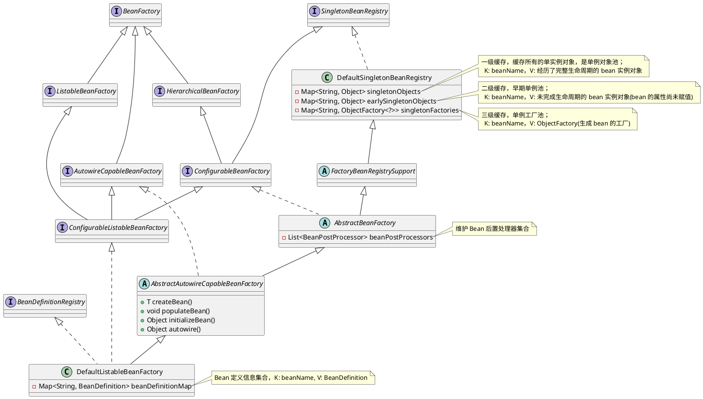
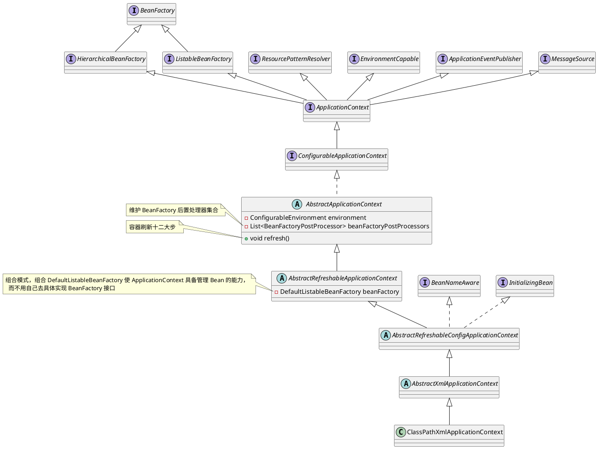
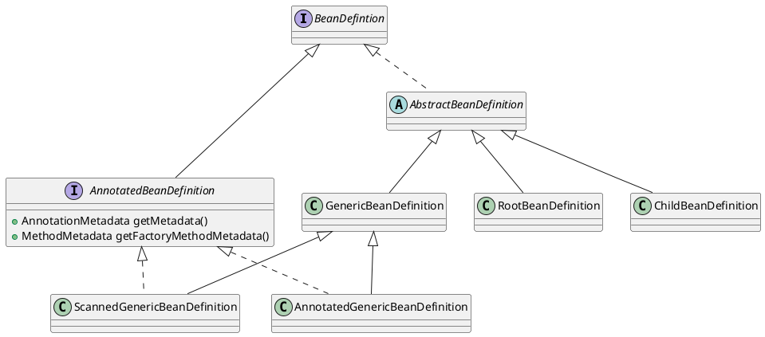
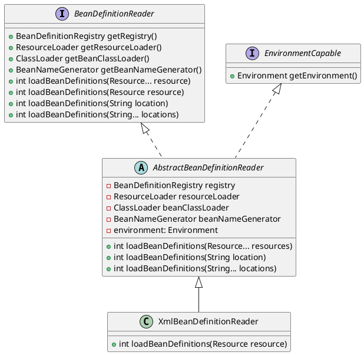
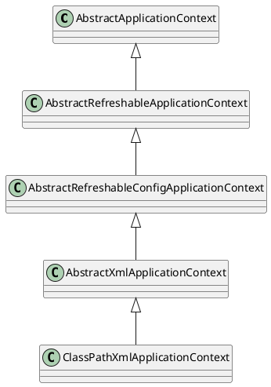

# Spring-XML 版 BeanDefinition 注册流程

## 环境搭建

1. 利用 [Spring-源码环境搭建](./Spring-源码环境搭建.md) 搭建的 Spring 源码环境，创建一个新的模块专门用来研究 XML 版 BeanDefinition 注册流程。选中项目右键新建一个模块（假如所有的流程分析都用同一个模块的话，可能上一次流程分析中存在某些类会对本次流程分析造成影响，这样整个 DEBUG 环境就不是那么纯粹，所以每分析一个流程就创建一个新的模块会更加地方便），模块名为 spring-beandefinition-source-test，选择 Gradle，最后点击创建即可即可；<br />  
   

2. 引入相关依赖：在模块的 build.gradle 文件中引入以下依赖
   
   ```groovy
   dependencies {
       testImplementation 'org.junit.jupiter:junit-jupiter-api:5.8.1'
       testRuntimeOnly 'org.junit.jupiter:junit-jupiter-engine:5.8.1'
       implementation(project(':spring-context'))
       implementation(project(':spring-aspects'))
       implementation 'org.slf4j:slf4j-api:2.0.3'
       implementation 'ch.qos.logback:logback-classic:1.4.4'
   }
   ```

3. 增加日志配置文件：由于引入了 logback，所以需要在资源目录 resources 下创建一个 logback.xml 文件
   
   ```xml
   <?xml version="1.0" encoding="UTF-8"?>
   <configuration>
     <appender name="CONSOLE" class="ch.qos.logback.core.ConsoleAppender">
       <encoder>
         <pattern>%d{yyyy-MM-dd HH:mm:ss.SSS} [%t] %-5p %c{1}:%L - %m%n</pattern>
       </encoder>
     </appender>
   
     <appender name="FILE" class="ch.qos.logback.core.rolling.RollingFileAppender">
       <encoder>
         <pattern>%d{yyyy-MM-dd HH:mm:ss.SSS} [%t] %-5p %c{1}:%L - %m%n</pattern>
         <charset>utf-8</charset>
       </encoder>
       <file>log/output.log</file>
       <rollingPolicy class="ch.qos.logback.core.rolling.FixedWindowRollingPolicy">
         <fileNamePattern>log/output.log.%i</fileNamePattern>
       </rollingPolicy>
       <triggeringPolicy class="ch.qos.logback.core.rolling.SizeBasedTriggeringPolicy">
         <MaxFileSize>1MB</MaxFileSize>
       </triggeringPolicy>
     </appender>
   
     <root level="DEBUG">
       <appender-ref ref="CONSOLE"/>
       <appender-ref ref="FILE"/>
     </root>
   </configuration>
   ```

4. 创建一个简单的实体类 User
   
   ```java
   public class User {
       private Integer id;
       private String username;
       private Integer age;
   
       public Integer getId() {
           return id;
       }
   
       public void setId(Integer id) {
           this.id = id;
       }
   
       public String getUsername() {
           return username;
       }
   
       public void setUsername(String username) {
           this.username = username;
       }
   
       public Integer getAge() {
           return age;
       }
   
       public void setAge(Integer age) {
           this.age = age;
       }
   }
   ```

5. 创建一个 UserService 类，类上标注 @Component 注解，配合 XML 配置文件中的 context:component-scan 标签一起使用，主要用于分析自定义标签解析流程的源码
   
   ```java
   @Component
   public class UserService {
       public String getUserInfo(String username) {
           return username + "用户的详细信息";
       }
   }
   ```

6. 右键单击 resources 资源目录，创建 Spring 的核心配置文件 `applicationContext.xml`：
   
   ```xml
   <?xml version="1.0" encoding="UTF-8"?>
   <beans xmlns:xsi="http://www.w3.org/2001/XMLSchema-instance"
          xmlns:context="http://www.springframework.org/schema/context"
          xmlns="http://www.springframework.org/schema/beans"
          xsi:schemaLocation="http://www.springframework.org/schema/beans http://www.springframework.org/schema/beans/spring-beans.xsd
          http://www.springframework.org/schema/context https://www.springframework.org/schema/context/spring-context.xsd">
       <bean id="user" class="fun.xiaorang.spring.beandefinition.User">
           <property name="id" value="1"/>
           <property name="username" value="xiaorang"/>
           <property name="age" value="18"/>
       </bean>
   
       <!--    开启包扫描-->
       <context:component-scan base-package="fun.xiaorang.spring.beandefinition"/>
   </beans>
   ```

7. 创建一个测试类 ApiTest
   
   ```java
   class ApiTest {
       private static final Logger LOGGER = LoggerFactory.getLogger(ApiTest.class);
   
       @Test
       public void test_00() {
           ApplicationContext ctx = new ClassPathXmlApplicationContext("applicationContext.xml");
           User user = ctx.getBean(User.class);
           LOGGER.info(String.valueOf(user));
           UserService userService = ctx.getBean(UserService.class);
           LOGGER.info(userService.getUserInfo("xiaorang"));
       }
   }
   ```
   
    测试结果如下所示：<br />

## 核心组件

### BeanFactory

Spring 中 Bean 的创建是典型的工厂模式。其中 BeanFactory 作为最顶层的接口，定义了 IoC 容器的基本功能规范。

```java
public interface BeanFactory {
    Object getBean(String name) throws BeansException;
    <T> T getBean(String name, Class<T> requiredType) throws BeansException;
    <T> T getBean(Class<T> requiredType) throws BeansException;
    boolean containsBean(String name);
    boolean isSingleton(String name) throws NoSuchBeanDefinitionException;
    boolean isPrototype(String name) throws NoSuchBeanDefinitionException;
}
```

其继承关系图如下所示：



> 如果一个类实现了某个接口，那么就具备了该接口的能力；如果一个接口继承自另一个接口，那么该接口也会同时具备另一个接口所具备的能力。

由上图可知，其有三个重要的子类：接口隔离原则！

1. ListableBeanFactory 接口，它拥有枚举所有 Bean 实例的能力，如 获取容器中 Bean 实例的数量、查看容器中是否包含某个 Bean、根据给定的类型从容器中获取相应的 Bean 实例（包括给定类型的子类或者实现类）等等。
2. HierarchicalBeanFactory 接口，它拥有访问父容器的能力，即允许多个容器之间存在继承关系，如在 SpringMVC 中的父子容器。
3. AutowireCapableBeanFactory 接口，它拥有创建 Bean 实例、给 Bean 实例中的属性进行填充 (依赖注入)、初始化 Bean 实例等能力。

最基本的 IoC 容器接口是 BeanFactroy，在 BeanFactory 中只对 IoC 容器的基本行为作了定义，如从容器中获取出 Bean 实例，至于 Bean 实例是如何创建的，以及又是如何放到容器中的根本不关心！<br />由上面的类图可知，IoC 容器最终的默认实现类是 DefaultListableBeanFactory。它不仅仅实现了所有的 BeanFactory 接口，还实现了如下两个非常重要的接口：

- BeanDefinitionRegistry：bean 定义信息注册中心，用于管理从 XML 文件中解析出来的 bean 定义信息。至于注解扫描方式的本章节不涉及！
  
  ```java
  public interface BeanDefinitionRegistry extends AliasRegistry {
      // 注册某个bean的定义信息
      void registerBeanDefinition(String beanName, BeanDefinition beanDefinition)
              throws BeanDefinitionStoreException;
  
      // 删除某个bean的定义信息
      void removeBeanDefinition(String beanName) throws NoSuchBeanDefinitionException;
  
      // 获取某个bean的定义信息
      BeanDefinition getBeanDefinition(String beanName) throws NoSuchBeanDefinitionException;
  
      // 是否存在某个某个bean的定义信息
      boolean containsBeanDefinition(String beanName);
  
      // 获取所有bean定义信息的名称
      String[] getBeanDefinitionNames();
  
      // 获取所有bean定义信息的数量
      int getBeanDefinitionCount();
  
      // 判断当前bean定义信息的名称是否正在使用
      boolean isBeanNameInUse(String beanName);
  
  }
  ```
  
    DefaultListableBeanFactory 作为该接口的实现类，是如何实现该接口的呢？
  
  ```java
  public class DefaultListableBeanFactory extends AbstractAutowireCapableBeanFactory implements ConfigurableListableBeanFactory, BeanDefinitionRegistry, Serializable {
  
      /** Map of bean definition objects, keyed by bean name. */
      private final Map<String, BeanDefinition> beanDefinitionMap = new ConcurrentHashMap<>(256);
  
      /** List of bean definition names, in registration order. */
      private volatile List<String> beanDefinitionNames = new ArrayList<>(256);
  
      public void registerBeanDefinition(String beanName, BeanDefinition beanDefinition) throws BeanDefinitionStoreException {
          // ...
          this.beanDefinitionMap.put(beanName, beanDefinition);
          this.beanDefinitionNames.add(beanName);
          // ...
      }
  
      public void removeBeanDefinition(String beanName) throws NoSuchBeanDefinitionException {
          // ...
          BeanDefinition bd = this.beanDefinitionMap.remove(beanName);
          this.beanDefinitionNames.remove(beanName);
          // ...
      }
  
      public String[] getBeanDefinitionNames() {
          // ...
          return StringUtils.toStringArray(this.beanDefinitionNames);
          // ...
      }
  }
  ```
  
    从源码中不难发现，在 DefaultListableBeanFactory 中定义了两个集合来实现一个 bean 定义信息的注册中心。
  
  - beanDefinitionMap 集合用来保存注册的 bean 定义信息，Key 是 bean 的名称，Value 是 BeanDefinition 的实例对象；
  - beanDefinitionNames 集合专门用来保存注册的 bean 定义信息的名称。
- SingletonBeanRegistry：单实例 Bean 注册中心，用于管理所有创建出来的单实例 Bean 对象。本章节不涉及，在后面 [Spring-循环依赖详解](https://www.yuque.com/xihuanxiaorang/java/qgtygh35kkz6ts56?view=doc_embed) 章节会详细讲解该接口中的三级缓存是如何解决循环依赖问题的！

### ApplicationContext

ApplicationContext 是 Spring 提供的一个高级的 IoC 容器，其继承关系图所下所示：



由上图可知，

> [!IMPORTANT]  
> 🤔 ApplicationContext 接口间接继承了 BeanFactory 接口，那么它的实现类具体是怎样实现 BeanFactory 接口的呢？  
> <br />🤓 So Easy！在 ApplicationContext 的实现类 AbstractRefreshableApplicationContext 中通过组合设计模式的方式持有一个 DefaultListableBeanFactory 的引用（成员变量），从而使得 ApplicationContext 拥有作为一个 IoC 容器的能力。多用组合，少用继承！

为什么说 ApplicationContext 是一个高级的 IoC 容器呢？因为它除了能够提供 IoC 容器的基本功能之外，还因为它继承如下多个接口，使其可以为用户提供以下附加服务。

1. ResourcePatternResolver：资源解析的能力；
2. ApplicationEventPublisher：应用事件处理的能力；
3. MessageSource：处理国际化的能力；
4. EnvironmentCapable：环境相关的能力；

### BeanDefinition

对于上面提到的 BeanDefinition 有的小伙伴可能会感到疑惑，这是什么东东？有什么用呢？其实根据它的名字不难猜出 **bean 的定义信息**。事实上就是这样，咱们在 XML 配置文件的 bean 标签中配置的各种属性，这些属性（如当前 Bean 指向的是哪个类、是否是单例的、是否懒加载等等）不仅仅是和 Bean 实例有关，还和 Bean 的生命周期（如 init-method 初始化、destroy 销毁等操作）有关，面向对象编程的话，咱们定义的关于 Bean 的信息总得有一个对象来承载，这个对象就是 BeanDefinition。<br />**作用：在 XML 配置文件的 bean 标签中定义的各种 Bean 的属性都会先封装到 BeanDefinition 上，然后 Spring IoC 容器再根据 BeanDefinition 来创建 Bean 实例对象。**

```java
public interface BeanDefinition extends AttributeAccessor, BeanMetadataElement {
    ...
    void setBeanClassName(@Nullable String beanClassName);
    void setScope(@Nullable String scope);
    void setLazyInit(boolean lazyInit);
    void setAutowireCandidate(boolean autowireCandidate);
    void setPrimary(boolean primary);
    void setInitMethodName(@Nullable String initMethodName);
    void setDestroyMethodName(@Nullable String destroyMethodName);
    void setFactoryBeanName(@Nullable String factoryBeanName);
    void setFactoryMethodName(@Nullable String factoryMethodName);
    ...
}
```

BeanDefinition 中定义的方法虽然多，但是结合 XML 配置文件一起分析，这些方法其实就很好理解，比如说：

1. `setBeanClassName()`：用于配置 Bean 的 Class 全路径，对应 bean 标签中的 class 属性；
2. `setScope()`：用于配置 Bean 的作用域，指定当前 Bean 是单例还是多例，对应 bean 标签中的 scope 属性；
3. `setLazyInit()`：用于配置 Bean 是否懒加载，对应 bean 标签中的 lazy-init 属性；
4. `setAutowireCandidate()`：用于配置 Bean 的自动装配模式，对应 bean 标签中的 autowire-candidate 属性；
5. `setPrimary()`：用于配置当前 Bean 是否为首选的 Bean（当出现多个类型相同的 Bean 时），对应 bean 标签中的 primary 属性；
6. `setInitMethodName()`：用于配置 Bean 的初始化方法，对应 bean 标签中的 init-method 属性；
7. `setDestroyMethodName()`：用于配置 Bean 的销毁方法，对应 bean 标签中的 destroy 属性；
8. `setFactoryBeanName()`：用于配置 FactoryBean 实例的引用，对应 bean 标签中的 factory-bean 属性，配合 factory-method 属性一起使用，使用实例工厂的方式创建复杂对象；
9. `setFactoryMethodName()`：用于配置实例工厂/静态工厂中提供的用于创建复杂对象的公共方法，对应 bean 标签中的 factory-method 属性，配合 factory-bean 属性一起使用，使用实例工厂的方式创建复杂对象；或者单独使用，使用静态工厂的方式创建复杂对象；

其继承关系图如下所示：



其每个实现类解释如下：对于其中某个实现类不是太清楚也没关系，因为实现类并不是很重要，面向接口编程嘛！只需要知道 BeanDefinition 接口是用来封装 XML 配置文件中 bean 标签对于 bean 的定义信息，后续 Spring IoC 容器会根据 BeanDefinition 创建出对应的 Bean 实例对象即可。

1. AbstractBeanDefinition：是一个抽象类，它根据 BeanDefinition 中定义的接口提供了相应的属性，并实现了 BeanDefinition 中定义的一部分方法，后面的其他实现类基本上都是在此基础上完成的；
2. RootBeanDefinition：一个比较常用的实现类，对应了一般的元素标签；
3. GenericBeanDefinition：是从 Spring2.5 以后新加入的 BeanDefinition 实现类。GenericBeanDefinition 可以动态设置父 Bean，同时兼具 RootBeanDefinition 和 ChildBeanDefinition 的功能；
4. AnnotatedBeanDefinition：表示注解类型的 BeanDefinition，拥有获取注解元数据和方法元数据的能力；
5. AnnotatedGenericBeanDefinition：使用 @Configuration 注解标记的配置类会被解析为 AnnotatedGenericBeanDefinition；

### BeanDefinitionReader

bean 定义信息读取器，该接口定义了带有资源和配置文件所在位置作为参数的加载方法。其继承关系图如下所示：



由上图可知，BeanDefinitionReader 的具体实现类为 XmlBeanDefinitionReader，专门用来读取 XML 配置文件并解析其中的 bean 标签，将 bean 标签中对于 bean 的定义信息封装成 BeanDefinition 对象后保存到 bean 定义信息注册中心（DefaultListableBeanFactory 作为 BeanRegistry 的实现，会将 BeanDefinition 保存到其成员变量 beanDefinitionMap 集合中）。

## 源码分析

进入今天的主题，XML 版的 BeanDefinition 注册流程，阅读的源码的时候一定要紧扣主题，不要跑偏了！！！<br />

> [!IMPORTANT|label: 抓住主流程，带着问题阅读]  
> 有的小伙伴在阅读源码的时候，很容易一直点进方法中查看，然后就迷失了方向，不知道自己刚才干了啥，然后又要重新来过，所以<u>先把主流程给搞清楚，不要跑偏</u>！之后，有需要的话可以再去分析分支情况。

从测试案例入手，第一行代码就创建了一个 <u>ClassPathXmlApplicationContext</u> 应用上下文对象，将 Spring 的核心配置文件 applicationContext.xml 的路径作为参数传入构造函数中。<br />从上面 ApplicationContext 的继承关系图可以看到，ClassPathXmlApplicationContext 是 ApplicationContext （Spring IoC 高级容器）的实现类。

```java
public ClassPathXmlApplicationContext(String configLocation) throws BeansException {
    this(new String[]{configLocation}, true, null);
}

public ClassPathXmlApplicationContext(
        String[] configLocations, boolean refresh, @Nullable ApplicationContext parent)
        throws BeansException {

    super(parent);
    // 解析 XML 配置文件路径中的占位符并保存解析后的文件路径
    setConfigLocations(configLocations);
    if (refresh) {
        // 容器刷新十二大步
        refresh();
    }
}
```

1. 在其重载的构造方法中，首先会调用 `setConfigLocations(configLocations)` 方法将传入进来的 Spring 核心配置文件的路径保存起来，用于后面加载 bean 定义信息时知道去哪加载 bean 定义信息。
2. 非常重要的容器刷新方法 `refresh()`，该方法的实现位于其父类 <u>AbstractApplicationContext</u> 中，分析 Spring 源码就没有不讲该方法的，该 `refresh()` 方法是重中之重，一定要记住（自己多刷几遍源码自然就记住了）！ 毫不夸张的说，抛开一些细枝末节不谈，**该 `refresh()` 方法可以算得上是整个 Spring 源码分析的入口**。关于 Spring 容器刷新 `refresh()` 方法的<u>十二大步</u>，小伙伴们应该都有所耳闻。
   1. `├─` prepareRefresh ① 上下文刷新前的准备工作，设置启动时间和 active 标志，初始化属性
   2. `├─` **obtainFreshBeanFactory** <span style="background-color: rgb(232, 247, 207);">② 创建 bean 工厂实例以及加载 bean 定义信息到 bean 工厂</span>
   3. `├─` prepareBeanFactory ③ 设置 beanFactory 的基本属性
   4. `├─` postProcessBeanFactory ④ 子类处理自定义的 BeanFactoryPostProcess
   5. `├─` invokeBeanFactoryPostProcessors ⑤ 实例化并调用所有 bean 工厂后置处理器
   6. `├─` registerBeanPostProcessors ⑥ 注册所有实现了 BeanPostProcessor 接口的类到 BeanFactory 中
   7. `├─` initMessageSource ⑦ 初始化上下文中的资源文件，如国际化文件的处理等
   8. `├─` initApplicationEventMulticaster ⑧ 初始化事件多播器
   9. `├─` onRefresh ⑨ 给子类扩展初始化其他 Bean，在 Springboot 中用来做内嵌 tomcat 启动
   10. `├─` registerListeners ⑩ 注册监听器
   11. `├─` finishBeanFactoryInitialization ⑪ 实例化所有非懒加载的单实例 bean
   12. `└─` finishRefresh ⑫ 完成刷新过程，发布上下文刷新完成事件

其中，绿色标记的部分就代表本次源码分析的主题，属于十二大步中的第二大步。`obtainFreshBeanFactory()` 方法如下所示：

```java
protected ConfigurableListableBeanFactory obtainFreshBeanFactory() {
    refreshBeanFactory();
    return getBeanFactory();
}
```

其中，`refreshBeanFactory()` 是一个抽象方法，由子类去实现，典型的<u>模板方法设计模式</u>。AbstractApplicationContext 继承关系如下所示：



该 `refreshBeanFactory()` 方法就是在其子类 <u>AbstractRefreshableApplicationContext</u> 中被实现，

```java
protected final void refreshBeanFactory() throws BeansException {
    // 判断是否已经存在 bean 工厂？
    if (hasBeanFactory()) {
        // 条件成立的话，则销毁工厂中的所有单实例对象并关闭该 bean 工厂
        destroyBeans();
        closeBeanFactory();
    }
    try {
        // 创建一个新的 bean 工厂，创建出来的 bean 工厂的类型是 DefaultListableBeanFactory
        DefaultListableBeanFactory beanFactory = createBeanFactory();
        beanFactory.setSerializationId(getId());
        // 定制化 bean 工厂，设置相关属性（包括是否允许覆盖同名称的不同定义的 bean 对象以及是否允许循环依赖）
        customizeBeanFactory(beanFactory);
        // 加载 XML 配置文件中的 bean 定义信息到 bean 工厂中，该方法由子类去实现
        loadBeanDefinitions(beanFactory);
        this.beanFactory = beanFactory;
    } catch (IOException ex) {
        throw new ApplicationContextException("I/O error parsing bean definition source for " + getDisplayName(), ex);
    }
}
```

1. 先判断是否已经存在一个 bean 工厂，如果存在的话，则先销毁该工厂中的所有单实例 bean 并关闭该工厂；
2. 然后再创建一个新的 bean 工厂，创建出来的 bean 工厂的类型是 DefaultListableBeanFactory，(实现了 BeanRegitry 接口) 用于保存所有解析出来的 bean 定义信息；
3. 最后通过 `loadBeanDefinitions()` 方法加载所有的 bean 定义信息到刚创建出来的 bean 工厂中，该方法由子类去实现。

该 `loadBeanDefinitions()` 方法在其子类 <u>AbstractXmlApplicationContext</u> 中被实现，

```java
protected void loadBeanDefinitions(DefaultListableBeanFactory beanFactory) throws BeansException, IOException {
    // Create a new XmlBeanDefinitionReader for the given BeanFactory.
    // 为给定的 bean 工厂创建 bean 定义信息读取器 XmlBeanDefinitionReader
    XmlBeanDefinitionReader beanDefinitionReader = new XmlBeanDefinitionReader(beanFactory);

    // Configure the bean definition reader with this context's
    // resource loading environment.
    beanDefinitionReader.setEnvironment(this.getEnvironment());
    beanDefinitionReader.setResourceLoader(this);
    beanDefinitionReader.setEntityResolver(new ResourceEntityResolver(this));

    // Allow a subclass to provide custom initialization of the reader,
    // then proceed with actually loading the bean definitions.
    initBeanDefinitionReader(beanDefinitionReader);
    // 通过刚创建的 XmlBeanDefinitionReader 实例对象解析 XML 配置文件并加载 bean 定义信息到 bean 工厂中
    loadBeanDefinitions(beanDefinitionReader);
}

protected void loadBeanDefinitions(XmlBeanDefinitionReader reader) throws BeansException, IOException {
    Resource[] configResources = getConfigResources();
    if (configResources != null) {
        reader.loadBeanDefinitions(configResources);
    }
    // 将前面保存好的 XML 配置文件路径取出
    String[] configLocations = getConfigLocations();
    if (configLocations != null) {
        // 委托 XmlBeanDefinitionReader 解析 XML 配置文件并加载 bean 定义信息到 bean 工厂中
        reader.loadBeanDefinitions(configLocations);
    }
}
```

1. 调用 XmlBeanDefinitionReader 的构造方法创建实例对象，将 DefaultListableBeanFactory 实例对象当作 BeanRegistry 类型参数传入其中（说明在 XmlBeanDefinitionReader 类中肯定存在一个 BeanRegistry 类型的属性接收）；
2. 然后调用其重载方法，在其重载方法中会委托 XmlBeanDefinitionReader 实例对象来解析 XML 配置文件并加载 bean 定义信息到 bean 工厂中，即调用 XmlBeanDefinitionReader 类的 `loadBeanDefinitions()` 方法，将配置文件路径作为参数传入。

在 <u>XmlBeanDefinitionReader</u> 的父类 AbstractBeanDefinitionReader 中存在该方法的多个重载方法，经过一系列的调用最终会来到下面的重载方法。

```java
public int loadBeanDefinitions(String location, @Nullable Set<Resource> actualResources) throws BeanDefinitionStoreException {
    ResourceLoader resourceLoader = getResourceLoader();
    if (resourceLoader == null) {
        throw new BeanDefinitionStoreException(
                "Cannot load bean definitions from location [" + location + "]: no ResourceLoader available");
    }

    if (resourceLoader instanceof ResourcePatternResolver) {
        // Resource pattern matching available.
        try {
            // 将传入的 XML 配置文件路径解析之后封装成一个 Resource 资源对象
            Resource[] resources = ((ResourcePatternResolver) resourceLoader).getResources(location);
            // 重载方法，从指定的 Resource 资源 中加载 bean 定义信息
            int count = loadBeanDefinitions(resources);
            if (actualResources != null) {
                Collections.addAll(actualResources, resources);
            }
            if (logger.isTraceEnabled()) {
                logger.trace("Loaded " + count + " bean definitions from location pattern [" + location + "]");
            }
            return count;
        } catch (IOException ex) {
            throw new BeanDefinitionStoreException(
                    "Could not resolve bean definition resource pattern [" + location + "]", ex);
        }
    } else {
        // Can only load single resources by absolute URL.
        Resource resource = resourceLoader.getResource(location);
        int count = loadBeanDefinitions(resource);
        if (actualResources != null) {
            actualResources.add(resource);
        }
        if (logger.isTraceEnabled()) {
            logger.trace("Loaded " + count + " bean definitions from location [" + location + "]");
        }
        return count;
    }
}
```

1. 首先获取一个 ResourceLoader 对象，资源加载器，用于加载对应路径的资源。通过资源加载器将传入的 Spring 配置文件路径解析之后封装成一个 Resource 资源对象；
2. 然后将资源对象传入到另一个重载的 `loadBeanDefinitions()` 方法中，有意思的是，另外一个重载方法在父类 AbstractBeanDefinitionReader 中并没有被实现，而是由子类去实现的，所以兜兜转转最终又回到子类 XmlBeanDefinitionReader 中的 `loadBeanDefinitions(resource)` 方法，其实整个调用过程就是典型的<u>模板方法设计模式</u>！

```java
public int loadBeanDefinitions(Resource resource) throws BeanDefinitionStoreException {
    // 将 Resource 包装成 EncodedResource，不过 EncodedResource 并没有什么真正的作用，装饰器模式！
    return loadBeanDefinitions(new EncodedResource(resource));
}

public int loadBeanDefinitions(EncodedResource encodedResource) throws BeanDefinitionStoreException {
    Assert.notNull(encodedResource, "EncodedResource must not be null");
    if (logger.isTraceEnabled()) {
        logger.trace("Loading XML bean definitions from " + encodedResource);
    }

    Set<EncodedResource> currentResources = this.resourcesCurrentlyBeingLoaded.get();

    if (!currentResources.add(encodedResource)) {
        throw new BeanDefinitionStoreException(
                "Detected cyclic loading of " + encodedResource + " - check your import definitions!");
    }

    // 从封装的 Resource 资源对象中取出文件的输入流信息
    try (InputStream inputStream = encodedResource.getResource().getInputStream()) {
        InputSource inputSource = new InputSource(inputStream);
        if (encodedResource.getEncoding() != null) {
            inputSource.setEncoding(encodedResource.getEncoding());
        }
        // 真正加载 bean 定义信息的方法
        return doLoadBeanDefinitions(inputSource, encodedResource.getResource());
    } catch (IOException ex) {
        throw new BeanDefinitionStoreException(
                "IOException parsing XML document from " + encodedResource.getResource(), ex);
    } finally {
        currentResources.remove(encodedResource);
        if (currentResources.isEmpty()) {
            this.resourcesCurrentlyBeingLoaded.remove();
        }
    }
}
```

1. 将 Resource 包装成 EncodedResource，不过 EncodedResource 并没有什么真正的作用，装饰器模式！
2. 从封装的 Resource 资源对象中取出文件的输入流信息；
3. 调用 `doLoadBeanDefinitions()` 方法，将从资源转获取的输入流作为参数传入该方法，该方法是真正加载 bean 定义信息的方法。

   > [!IMPORTANT|label: 着重关注 try 中的代码和带 do 前缀的方法]  
   > 在分析 Spring 源码时，<u>需要着重关注 try 中的代码和带 do 前缀的方法</u>，因为此处的代码是真正干实事的。

```java
protected int doLoadBeanDefinitions(InputSource inputSource, Resource resource)
            throws BeanDefinitionStoreException {

    try {
        Document doc = doLoadDocument(inputSource, resource);
        int count = registerBeanDefinitions(doc, resource);
        if (logger.isDebugEnabled()) {
            logger.debug("Loaded " + count + " bean definitions from " + resource);
        }
        return count;
    } catch (BeanDefinitionStoreException ex) {
        throw ex;
    } catch (SAXParseException ex) {
        throw new XmlBeanDefinitionStoreException(resource.getDescription(),
                "Line " + ex.getLineNumber() + " in XML document from " + resource + " is invalid", ex);
    } catch (SAXException ex) {
        throw new XmlBeanDefinitionStoreException(resource.getDescription(),
                "XML document from " + resource + " is invalid", ex);
    } catch (ParserConfigurationException ex) {
        throw new BeanDefinitionStoreException(resource.getDescription(),
                "Parser configuration exception parsing XML from " + resource, ex);
    } catch (IOException ex) {
        throw new BeanDefinitionStoreException(resource.getDescription(),
                "IOException parsing XML document from " + resource, ex);
    } catch (Throwable ex) {
        throw new BeanDefinitionStoreException(resource.getDescription(),
                "Unexpected exception parsing XML document from " + resource, ex);
    }
}
```

1. 使用 SAX 解析 XML 配置文件，将其转换成 Document 对象，方面后续解析 XML 配置文件中的各种标签；
2. 调用 `registerBeanDefinitions()` 解析 XML 配置文件中的各种标签，将其中的 bean 标签封装成 BeanDefinition 对象注册到 bean 工厂中。

```java
public int registerBeanDefinitions(Document doc, Resource resource) throws BeanDefinitionStoreException {
    // 创建 BeanDefinitionDocumentReader 实例对象，用于从 XML 文档中实际读取 bean 定义信息
    BeanDefinitionDocumentReader documentReader = createBeanDefinitionDocumentReader();
    int countBefore = getRegistry().getBeanDefinitionCount();
    // 注册给定 DOM 文档中包含的 bean 定义信息
    // 上下文对象中存在一个 NamespaceHandlerResolver 实例对象，该实例对象用于解析 XML 配置文件中的自定义标签
    documentReader.registerBeanDefinitions(doc, createReaderContext(resource));
    return getRegistry().getBeanDefinitionCount() - countBefore;
}

public XmlReaderContext createReaderContext(Resource resource) {
    return new XmlReaderContext(resource, this.problemReporter, this.eventListener,
            this.sourceExtractor, this, getNamespaceHandlerResolver());
}

public NamespaceHandlerResolver getNamespaceHandlerResolver() {
    if (this.namespaceHandlerResolver == null) {
        this.namespaceHandlerResolver = createDefaultNamespaceHandlerResolver();
    }
    return this.namespaceHandlerResolver;
}

protected NamespaceHandlerResolver createDefaultNamespaceHandlerResolver() {
    ResourceLoader resourceLoader = getResourceLoader();
    ClassLoader cl = (resourceLoader != null ? resourceLoader.getClassLoader() : getBeanClassLoader());
    return new DefaultNamespaceHandlerResolver(cl);
}
```

1. 创建 <u>BeanDefinitionDocumentReader</u> 实例对象，用于从 XML 文档中实际读取 bean 定义信息，并将读取到的 bean 定义信息注册到 bean 工厂中；
2. 调用 BeanDefinitionDocumentReader 的 `registerBeanDefinitions()` 方法注册给定 DOM 文档中包含的 bean 定义信息。该方法需要两个参数，一个是 XML 配置文件所转换后的 Document 对象 ，另一个参数是一个上下文对象，在其中保存了一个 <u>DefaultNamespaceHandlerResolver</u> 类型的实例对象，该实例对象在后面<u>解析自定义标签元素</u>的时候会被使用到，现在先提一嘴，知道是如何产生该实例对象的即可。

```java
public void registerBeanDefinitions(Document doc, XmlReaderContext readerContext) {
    this.readerContext = readerContext;
    doRegisterBeanDefinitions(doc.getDocumentElement());
}

protected void doRegisterBeanDefinitions(Element root) {
    // root 元素为 beans 标签，由于 XML 配置文件中允许存在嵌套的 beans 标签，所以该方法是一个递归方法
    BeanDefinitionParserDelegate parent = this.delegate;
    // 创建 bean 定义信息解析委托类 BeanDefinitionParserDelegate，将 bean 定义信息解析的工作委托给该类
    this.delegate = createDelegate(getReaderContext(), root, parent);

    if (this.delegate.isDefaultNamespace(root)) {
        // 判断根标签 beans 上是否配置 profile 属性
        String profileSpec = root.getAttribute(PROFILE_ATTRIBUTE);
        if (StringUtils.hasText(profileSpec)) {
            // 条件成立的话，说明根标签 beans 上存在 profile 属性，形如 profile = "dev,test"
            String[] specifiedProfiles = StringUtils.tokenizeToStringArray(
                    profileSpec, BeanDefinitionParserDelegate.MULTI_VALUE_ATTRIBUTE_DELIMITERS);
            // We cannot use Profiles.of(...) since profile expressions are not supported
            // in XML config. See SPR-12458 for details.
            // 判断环境是否激活？spring.profiles.active 属性值是否在根标签 beans 配置的 profile 属性值中
            // 比如，当前激活的环境是 prod 的话，即 spring.profiles.active = prod，不在 profile = "dev,test" 中，此时就不再解析该 XML 配置文件中的标签，直接返回，跳过该 XML 配置文件
            if (!getReaderContext().getEnvironment().acceptsProfiles(specifiedProfiles)) {
                if (logger.isDebugEnabled()) {
                    logger.debug("Skipped XML bean definition file due to specified profiles [" + profileSpec +
                            "] not matching: " + getReaderContext().getResource());
                }
                return;
            }
        }
    }

    preProcessXml(root);
    // 委派模式，解析 XML 配置文件中所有的 bean 定义信息
    parseBeanDefinitions(root, this.delegate);
    postProcessXml(root);

    this.delegate = parent;
}
```

1. `doRegisterBeanDefinitions(Element root)` 是一个递归方法，其中 root 元素对应的是 XML 配置文件中的 beans 标签，在一个 XML 配置文件中允许同时存在多个 beans 标签，所以在接下来解析 XML 配置文件时肯定会存在又重新调用该方法的情况；
2. 创建一个 bean 定义信息解析委托类 <u>BeanDefinitionParserDelegate</u>，将当前根标签元素和上下文对象当作参数传入其中，该类专门用于解析 XML 配置文件中的各种标签；
3. 判断根标签 beans 上是否配置 profile 属性以及 profile 属性值是否包含当前激活的环境，比如说，根标签 `<beans profile="dev,test"></beans>` 中 profile 属性值为 dev 和 test，说明该根标签下的配置的 bean 定义信息只在 dev 和 test 这两个环境下生效。假如当前激活的环境是 prod，即 spring.profiles.active = prod，那么不再解析该根标签下配置的所有 bean 定义信息，也就说不会将该根标签下配置的所有 bean 定义信息注册到 bean 工厂中。

```java
protected void parseBeanDefinitions(Element root, BeanDefinitionParserDelegate delegate) {
    // 判断当前根标签是否属于默认命名空间，即 namespaceURI 属性是否等于 "http://www.springframework.org/schema/beans"
    if (delegate.isDefaultNamespace(root)) {
        NodeList nl = root.getChildNodes();
        for (int i = 0; i < nl.getLength(); i++) {
            Node node = nl.item(i);
            if (node instanceof Element) {
                Element ele = (Element) node;
                if (delegate.isDefaultNamespace(ele)) {
                    // 解析默认标签元素，如 import、bean、alias、beans 标签
                    parseDefaultElement(ele, delegate);
                } else {
                    // 解析自定义标签元素，如 用于开启 AOP 功能的标签：aop:aspectj-autoproxy，用于用于开启包扫描的标签 component-scan，...
                    // 加载 META-INFO/spring.handlers 配置文件，根据配置文件中指定的 Key 获取对应的处理器来处理不同的自定义标签
                    delegate.parseCustomElement(ele);
                }
            }
        }
    } else {
        delegate.parseCustomElement(root);
    }
}
```

判断当前根标签 (beans) 是否属于默认命名空间，即 namespaceURI 属性是否等于 `http://www.springframework.org/schema/beans`？条件成立的话，进入 if 语句中，循环遍历该 beans 标签下的所有子标签，挨个判断每个标签是<u>默认标签</u>还是<u>自定义标签</u>？

1. 如果是<u>默认标签</u>，如 import、<u>bean</u>、alias、beans 标签，则走默认标签解析的流程；
   
   ```java
   private void parseDefaultElement(Element ele, BeanDefinitionParserDelegate delegate) {
       // 判断当前标签是不是 import 标签
       if (delegate.nodeNameEquals(ele, IMPORT_ELEMENT)) {
           importBeanDefinitionResource(ele);
       }
       // 判断当前标签是不是 alias 标签
       else if (delegate.nodeNameEquals(ele, ALIAS_ELEMENT)) {
           processAliasRegistration(ele);
       }
       // 判断当前标签是不是 bean 标签
       else if (delegate.nodeNameEquals(ele, BEAN_ELEMENT)) {
           // 解析 bean 标签，将其封装成 BeanDefinition 对象注册到 bean 工厂中
           processBeanDefinition(ele, delegate);
       }
       // 判断当前标签是不是 beans 标签
       else if (delegate.nodeNameEquals(ele, NESTED_BEANS_ELEMENT)) {
           // 递归，解析嵌套的 beans 标签下的所有子标签
           doRegisterBeanDefinitions(ele);
       }
   }
   ```
   
    在该方法中最值得关注的是 `processBeanDefinition()` 方法，用于解析 bean 标签，将其封装成 BeanDefinition 对象注册到 bean 工厂中。
   
   ```java
   protected void processBeanDefinition(Element ele, BeanDefinitionParserDelegate delegate) {
       // 使用 bean 定义信息解析委托类 delegate 解析当前 bean 标签，解析完成之后返回一个 bean 定义信息的包装类对象，可以就看作是 BeanDefinition 对象
       BeanDefinitionHolder bdHolder = delegate.parseBeanDefinitionElement(ele);
       if (bdHolder != null) {
           bdHolder = delegate.decorateBeanDefinitionIfRequired(ele, bdHolder);
           try {
               // Register the final decorated instance.
               // 使用工具类将 bean 定义信息对象注册到注册中心，其实内部就是调用 BeanRegistry 接口的 registerBeanDefinition() 方法注册 bean 定义信息
               // 由于当前 BeanRegistry 接口的实现类为 DefaultListableBeanFactory，也就说最终解析出来的 BeanDefinition 对象会被保存到 DefaultListableBeanFactory 的 beanDefinitionMap 集合中
               BeanDefinitionReaderUtils.registerBeanDefinition(bdHolder, getReaderContext().getRegistry());
           } catch (BeanDefinitionStoreException ex) {
               getReaderContext().error("Failed to register bean definition with name '" +
                       bdHolder.getBeanName() + "'", ele, ex);
           }
           // Send registration event.
           getReaderContext().fireComponentRegistered(new BeanComponentDefinition(bdHolder));
       }
   }
   ```
   
    现在重点落在 bean 定义信息解析委托类 delegate 是如何解析当前 bean 标签并封装成 bean 定义信息对象返回的？
   
   ```java
   public BeanDefinitionHolder parseBeanDefinitionElement(Element ele) {
       return parseBeanDefinitionElement(ele, null);
   }
   
   public BeanDefinitionHolder parseBeanDefinitionElement(Element ele, @Nullable BeanDefinition containingBean) {
       // 获取 bean 标签中的 id 和 name 属性（别名）
       String id = ele.getAttribute(ID_ATTRIBUTE);
       String nameAttr = ele.getAttribute(NAME_ATTRIBUTE);
   
       // 别名集合，别名可以存在多个，由逗号、分号或者空格隔开
       List<String> aliases = new ArrayList<>();
       if (StringUtils.hasLength(nameAttr)) {
           String[] nameArr = StringUtils.tokenizeToStringArray(nameAttr, MULTI_VALUE_ATTRIBUTE_DELIMITERS);
           aliases.addAll(Arrays.asList(nameArr));
       }
   
       // beanName 为 id 属性值
       String beanName = id;
       // 如果没有配置 id 属性并且配置了别名的话，则 beanName 等于第一个别名
       if (!StringUtils.hasText(beanName) && !aliases.isEmpty()) {
           beanName = aliases.remove(0);
           if (logger.isTraceEnabled()) {
               logger.trace("No XML 'id' specified - using '" + beanName +
                       "' as bean name and " + aliases + " as aliases");
           }
       }
   
       if (containingBean == null) {
           // 检查 beanName 是否唯一
           checkNameUniqueness(beanName, aliases, ele);
       }
   
       // 解析 bean 标签中除 id,name 属性之外的其他属性（如 class、singleton、lazy-init、scope、init-method 等属性）和子标签（如 construct-arg、property 标签）
       // 将解析出来的 bean 的定义信息全部封装到创建出来的 BeanDefinition 的实现类 GenericBeanDefinition 中
       AbstractBeanDefinition beanDefinition = parseBeanDefinitionElement(ele, beanName, containingBean);
       if (beanDefinition != null) {
           // 如果 beanName 为空的话，即 bean 标签既没有配置 id 属性，也没有配置 name 属性，则根据 bean 的 Class 自动生成一个 beanName.
           if (!StringUtils.hasText(beanName)) {
               try {
                   if (containingBean != null) {
                       beanName = BeanDefinitionReaderUtils.generateBeanName(
                               beanDefinition, this.readerContext.getRegistry(), true);
                   } else {
                       beanName = this.readerContext.generateBeanName(beanDefinition);
                       // Register an alias for the plain bean class name, if still possible,
                       // if the generator returned the class name plus a suffix.
                       // This is expected for Spring 1.2/2.0 backwards compatibility.
                       String beanClassName = beanDefinition.getBeanClassName();
                       if (beanClassName != null &&
                               beanName.startsWith(beanClassName) && beanName.length() > beanClassName.length() &&
                               !this.readerContext.getRegistry().isBeanNameInUse(beanClassName)) {
                           aliases.add(beanClassName);
                       }
                   }
                   if (logger.isTraceEnabled()) {
                       logger.trace("Neither XML 'id' nor 'name' specified - " +
                               "using generated bean name [" + beanName + "]");
                   }
               } catch (Exception ex) {
                   error(ex.getMessage(), ele);
                   return null;
               }
           }
           String[] aliasesArray = StringUtils.toStringArray(aliases);
           // 返回 beanDefinition 的包装类对象
           return new BeanDefinitionHolder(beanDefinition, beanName, aliasesArray);
       }
   
       return null;
   }
   ```
   
   1. 为当前 bean 标签生成 beanName，存在以下三种情况：
   
      1. 如果 bean 标签有配置 id 属性，则 beanName 就等于 id 属性的值；
      2. 如果 bean 标签没有配置 id 属性，但是配置了 name 属性（别名），别名可以有多个，一般由逗号隔开，则 beanName 就等于第一个别名；
      3. 如果 bean 标签既没有配置 id 属性，也没有配置 name 属性，则根据 bean 的 Class 为其生成一个 beanName；
   
   2. 判断 beanName 是否唯一，如果不唯一则会抛出异常！如下所示：<br />  
      <br />

      > [!IMPORTANT|label: 多打断点 Debug]  
      > 搭建开发调试环境，编写 Demo 示例，然后通过打断点 DEBUG 的方式，结合运行时数据，加深对代码的理解。

   3. 最后，解析 bean 标签中除 id, name 之外的所有属性（如 class、singleton、lazy-init、scope、init-method 等属性）及其子标签（如 construct-arg、property、lookup-method、replaced-method 等标签），然后将解析出来的 bean 的定义信息全部封装到 BeanDefinition 的实现类 GenericBeanDefinition 中。关于 bean 标签中的其他属性以及部分不常用的子标签的解析过程就不再详细分析，有兴趣的小伙伴可以自行分析。            
   
      ```java
      public AbstractBeanDefinition parseBeanDefinitionElement(
                Element ele, String beanName, @Nullable BeanDefinition containingBean) {
      
            this.parseState.push(new BeanEntry(beanName));
      
            String className = null;
            // 获取当前 bean 标签中的 class 属性
            if (ele.hasAttribute(CLASS_ATTRIBUTE)) {
                className = ele.getAttribute(CLASS_ATTRIBUTE).trim();
            }
            String parent = null;
            if (ele.hasAttribute(PARENT_ATTRIBUTE)) {
                parent = ele.getAttribute(PARENT_ATTRIBUTE);
            }
      
            try {
                // 创建出来的 BeanDefinition 类型为 GenericBeanDefinition
                AbstractBeanDefinition bd = createBeanDefinition(className, parent);
      
                // // 解析当前 bean 标签中的其他属性（如 scope、lazy-init、autowire、autowire-candidate、primary、init-method、destroy-method、factory-method、factory-bean 等属性）
                parseBeanDefinitionAttributes(ele, beanName, containingBean, bd);
                bd.setDescription(DomUtils.getChildElementValueByTagName(ele, DESCRIPTION_ELEMENT));
      
                parseMetaElements(ele, bd);
                parseLookupOverrideSubElements(ele, bd.getMethodOverrides());
                parseReplacedMethodSubElements(ele, bd.getMethodOverrides());
      
                // 解析 construct-arg 子标签，将解析出来的信息保存到 bd 的 constructorArgumentValues 属性中
                parseConstructorArgElements(ele, bd);
                // 解析 property 子标签，将解析出来的信息保存到 bd 的 propertyValues 属性中
                parsePropertyElements(ele, bd);
                parseQualifierElements(ele, bd);
      
                bd.setResource(this.readerContext.getResource());
                bd.setSource(extractSource(ele));
      
                return bd;
            } catch (ClassNotFoundException ex) {
                error("Bean class [" + className + "] not found", ele, ex);
            } catch (NoClassDefFoundError err) {
                error("Class that bean class [" + className + "] depends on not found", ele, err);
            } catch (Throwable ex) {
                error("Unexpected failure during bean definition parsing", ele, ex);
            } finally {
                this.parseState.pop();
            }
      
            return null;
        }
      ```

      1. 解析 property 子标签
   
         <span style="background-color: rgb(251, 228, 231);">TODO</span>
   
2. 如果是<u>自定义标签</u>，如用于开启 AOP 功能的 <u>aop:aspectj-autoproxy</u> 标签，用于开启包扫描的 <u>component-scan</u> 标签，...，则走自定义标签解析的流程；
	咱们就以 context:component-scan 标签为例进行分析，其他自定义标签的解析流程都与之类似，一法通万法通！

    ```java
    public BeanDefinition parseCustomElement(Element ele) {
        // 解析自定义标签元素，例如开启 AOP 功能的：aop:aspectj-autoproxy，包扫描功能:context:component-scan
        return parseCustomElement(ele, null);
    }
	
    public BeanDefinition parseCustomElement(Element ele, @Nullable BeanDefinition containingBd) {
        /**
         * 获取该自定义标签元素所属命名空间 uri，如
         * AOP 的命名空间 uri = "http://www.springframework.org/schema/aop"
         * 事务 的命名空间 uri = "http://www.springframework.org/schema/tx"
         * 包扫描 的命名空间 uri = "http://www.springframework.org/schema/context"
         */
        String namespaceUri = getNamespaceURI(ele);
        if (namespaceUri == null) {
            return null;
        }
        // 基于 META-INF/spring.handlers 配置文件，获取命名空间 uri 所对应的命名空间处理器
        NamespaceHandler handler = this.readerContext.getNamespaceHandlerResolver().resolve(namespaceUri);
        if (handler == null) {
            error("Unable to locate Spring NamespaceHandler for XML schema namespace [" + namespaceUri + "]", ele);
            return null;
        }
        // 使用对应的处理器对该自定义标签元素进行解析，策略模式！
        return handler.parse(ele, new ParserContext(this.readerContext, this, containingBd));
    }
    ```

	1. 获取该自定义标签元素所属命名空间 uri，如 <u>AOP</u> 的命名空间 uri = "http://www.springframework.org/schema/aop"，事务 的命名空间 uri = "http://www.springframework.org/schema/tx"，<u>包扫描</u>的命名空间 uri = "http://www.springframework.org/schema/context"；
	
	2. 基于 META-INF/spring.handlers 配置文件，获取命名空间 uri 所对应的命名空间处理器 <u>NamespaceHandler</u>，
	   1. 细心的小伙伴肯定知道 `this.readerContext.getNamespaceHandlerResolver()` 从上下文对象中获取出来的命名空间处理器解析器是 <u>DefaultNamespaceHandlerResolver</u> 类型的实例对象，前面提过一嘴的，不知道也没有关系，咱们有绝招，在 DEBUG 调试的时候选中该行代码按 Alt + F8 计算一下结果；<br />可以看到，在其内部有一个 handlerMappings 集合属性保存着所有 JAR 包下 META-INF/spring.handlers 配置文件中命名空间 uri 与 命名空间处理器的映射关系，可以基于这一点，可以自己实现一个标签，很简单，参照 Spring 是如何实现的即可；<br />
	
	   2. 在获取命名空间 uri 所对应的命名空间处理器 NamespaceHandler 时，除了建立命名空间 uri 和命名空间处理器的映射关系之外，还会在利用反射创建命名空间处理器实例后，调用命名空间处理器实例的 `init()` 初始化方法，建立自定义标签与对应标签解析器的映射关系；
	
	      ```java
	      public NamespaceHandler resolve(String namespaceUri) {
	          // 获取命名空间 uri 和命名空间处理器的映射关系
	          Map<String, Object> handlerMappings = getHandlerMappings();
	          // 通过映射关系获取命名空间处理器的的全限定类名，比如：org.springframework.context.config.ContextNamespaceHandler
	          Object handlerOrClassName = handlerMappings.get(namespaceUri);
	          if (handlerOrClassName == null) {
	              return null;
	          } else if (handlerOrClassName instanceof NamespaceHandler) {
	              return (NamespaceHandler) handlerOrClassName;
	          } else {
	              String className = (String) handlerOrClassName;
	              try {
	                  // 通过全限定类名获取对应的 Class 对象
	                  Class<?> handlerClass = ClassUtils.forName(className, this.classLoader);
	                  if (!NamespaceHandler.class.isAssignableFrom(handlerClass)) {
	                      throw new FatalBeanException("Class [" + className + "] for namespace [" + namespaceUri +
	                                                   "] does not implement the [" + NamespaceHandler.class.getName() + "] interface");
	                  }
	                  // 反射创建命名空间处理器实例
	                  NamespaceHandler namespaceHandler = (NamespaceHandler) BeanUtils.instantiateClass(handlerClass);
	                  // 初始化命名空间处理器（namespaceHandler 是 ContextNamespaceHandler 的实例，此处即执行 ContextNamespaceHandler 的初始化方法）
	                  namespaceHandler.init();
	                  handlerMappings.put(namespaceUri, namespaceHandler);
	                  // 将命名空间处理器作为结果返回
	                  return namespaceHandler;
	              } catch (ClassNotFoundException ex) {
	                  throw new FatalBeanException("Could not find NamespaceHandler class [" + className +
	                                               "] for namespace [" + namespaceUri + "]", ex);
	              } catch (LinkageError err) {
	                  throw new FatalBeanException("Unresolvable class definition for NamespaceHandler class [" +
	                                               className + "] for namespace [" + namespaceUri + "]", err);
	              }
	          }
	      }
	      ```
	      由上图可知，用于解析 context:component-scan 标签的处理器为 <u>ContextNameSpaceHandler</u>，不信的话 DEBUG 打个断点调试一下，根据测试案例 DEBUG 情况如下所示：<br />
	      <br />
	      通过反射创建出 ContextNameSpaceHandler 实例对象之后，还会调用其 `init()` 初始化方法，建立自定义标签与对应标签解析器的映射关系，保存在其父类 <u>NamespaceHandlerSupport</u> 的 paseres 集合属性中。
	
	      ```java
	      public class ContextNamespaceHandler extends NamespaceHandlerSupport {
	      
	          @Override
	          public void init() {
	              registerBeanDefinitionParser("property-placeholder", new PropertyPlaceholderBeanDefinitionParser());
	              registerBeanDefinitionParser("property-override", new PropertyOverrideBeanDefinitionParser());
	              registerBeanDefinitionParser("annotation-config", new AnnotationConfigBeanDefinitionParser());
	              registerBeanDefinitionParser("component-scan", new ComponentScanBeanDefinitionParser());
	              registerBeanDefinitionParser("load-time-weaver", new LoadTimeWeaverBeanDefinitionParser());
	              registerBeanDefinitionParser("spring-configured", new SpringConfiguredBeanDefinitionParser());
	              registerBeanDefinitionParser("mbean-export", new MBeanExportBeanDefinitionParser());
	              registerBeanDefinitionParser("mbean-server", new MBeanServerBeanDefinitionParser());
	          }
	      
	      }
	      ```
	      可以发现 context:component-scan 标签对应的解析器为 <u>ComponentScanBeanDefinitionParser</u> ，不用说，后面在解析 context:component-scan 标签时肯定是用 ComponentScanBeanDefinitionParser 解析器进行解析。

	3. 使用对应的处理器对该自定义标签元素进行解析，典型的<u>策略模式</u>！
	
	   ```java
	   public BeanDefinition parse(Element element, ParserContext parserContext) {
	       // 为标签元素匹配合适的解析器
	       BeanDefinitionParser parser = findParserForElement(element, parserContext);
	       // 使用该解析器解析标签元素
	       return (parser != null ? parser.parse(element, parserContext) : null);
	   }
	   ```
	
	   其实在其内部是找到对应的解析器对该自定义标签进行解析，如 context:component-scan 标签对应的解析器为 ComponentScanBeanDefinitionParser，紧接着调用 ComponentScanBeanDefinitionParser 的 parse() 方法解析该自定义标签。
	
	   ```java
	   public BeanDefinition parse(Element element, ParserContext parserContext) {
	       // 获取 base-package 属性
	       String basePackage = element.getAttribute(BASE_PACKAGE_ATTRIBUTE);
	       // 解析 basePackage 字符串中占位符 ${} 内的值，需要用到环境变量 Environment
	       basePackage = parserContext.getReaderContext().getEnvironment().resolvePlaceholders(basePackage);
	       // 扫描包路径可能有多个，以逗号或者分号或者空格等分隔，需要拆分成数组
	       String[] basePackages = StringUtils.tokenizeToStringArray(basePackage,
	               ConfigurableApplicationContext.CONFIG_LOCATION_DELIMITERS);
	   
	       // Actually scan for bean definitions and register them.
	       // 创建 ClassPathBeanDefinitionScanner 实例对象，注册默认的过滤策略（扫描带有 @Component、@Repository、@Service、@Controller 注解的类）
	       // 如果存在 include-filter 和 exclude-filter 子标签，则可以额外配置其他的过滤策略，可以自定义，只需实现 TypeFilter 接口即可
	       ClassPathBeanDefinitionScanner scanner = configureScanner(parserContext, element);
	       // 扫描包路径下所有符合条件的类，封装成 beanDefinition 对象
	       Set<BeanDefinitionHolder> beanDefinitions = scanner.doScan(basePackages);
	       // 很关键！！！向 Spring IoC 容器中注册一些底层的核心后置处理器的 BeanDefinition（如 ConfigurationClassPostProcessor，AutowiredAnnotationBeanPostProcessor，CommonAnnotationBeanPostProcessor，...）
	       registerComponents(parserContext.getReaderContext(), beanDefinitions, element);
	   
	       return null;
	   }
	   ```
	
	   1. 获取要扫描的包路径，存在占位符以及分隔符的情况需要处理；
	
	   2. 创建 <u>ClassPathBeanDefinitionScanner</u> 实例对象，用于扫描指定包路径下的所有符合条件的类并封装成 beanDefinition 对象，可以指定是否使用默认的过滤策略（扫描带有 @Component、@Repository、@Service、@Controller 注解的类）和额外配置其他的过滤策略；
	
	      ```java
	      protected ClassPathBeanDefinitionScanner configureScanner(ParserContext parserContext, Element element) {
	          boolean useDefaultFilters = true;
	          // 判断标签中是否配置 use-default-filters 属性，如果配置并且值为false的话，则表示不使用默认的过滤策略！
	          // 缺省以及值为true表示使用默认的过滤策略，即扫描带有 @Component、@Repository、@Service、@Controller 注解的类
	          if (element.hasAttribute(USE_DEFAULT_FILTERS_ATTRIBUTE)) {
	              useDefaultFilters = Boolean.parseBoolean(element.getAttribute(USE_DEFAULT_FILTERS_ATTRIBUTE));
	          }
	      
	          // Delegate bean definition registration to scanner class.
	          // 创建 ClassPathBeanDefinitionScanner 实例对象并且注册默认的过滤策略（如果 useDefaultFilters 变量值为true的话）
	          ClassPathBeanDefinitionScanner scanner = createScanner(parserContext.getReaderContext(), useDefaultFilters);
	          scanner.setBeanDefinitionDefaults(parserContext.getDelegate().getBeanDefinitionDefaults());
	          scanner.setAutowireCandidatePatterns(parserContext.getDelegate().getAutowireCandidatePatterns());
	      
	          if (element.hasAttribute(RESOURCE_PATTERN_ATTRIBUTE)) {
	              scanner.setResourcePattern(element.getAttribute(RESOURCE_PATTERN_ATTRIBUTE));
	          }
	      
	          try {
	              parseBeanNameGenerator(element, scanner);
	          } catch (Exception ex) {
	              parserContext.getReaderContext().error(ex.getMessage(), parserContext.extractSource(element), ex.getCause());
	          }
	      
	          try {
	              parseScope(element, scanner);
	          } catch (Exception ex) {
	              parserContext.getReaderContext().error(ex.getMessage(), parserContext.extractSource(element), ex.getCause());
	          }
	      
	          // 解析 component-scan 标签中的 include-filter 和 exclude-filter 子标签，用于配置其他的过滤策略
	          parseTypeFilters(element, scanner, parserContext);
	      
	          return scanner;
	      }
	      ```
	
	   3. 调用 ClassPathBeanDefinitionScanner 实例对象的 `doScan()` 方法扫描包路径下所有符合条件的类，封装成 beanDefinition 对象；
	
	      ```java
	      protected Set<BeanDefinitionHolder> doScan(String... basePackages) {
	          Assert.notEmpty(basePackages, "At least one base package must be specified");
	          Set<BeanDefinitionHolder> beanDefinitions = new LinkedHashSet<>();
	          // 遍历要扫描的包集合
	          for (String basePackage : basePackages) {
	              // 找到该包路径下所有符合条件的候选组件
	              Set<BeanDefinition> candidates = findCandidateComponents(basePackage);
	              // 遍历所有符合条件的候选组件，将每个候选组件完善一下注册到 beanDefinition 注册中心
	              for (BeanDefinition candidate : candidates) {
	                  ScopeMetadata scopeMetadata = this.scopeMetadataResolver.resolveScopeMetadata(candidate);
	                  candidate.setScope(scopeMetadata.getScopeName());
	                  // 使用默认策略为组件生成 beanName
	                  String beanName = this.beanNameGenerator.generateBeanName(candidate, this.registry);
	                  if (candidate instanceof AbstractBeanDefinition) {
	                      postProcessBeanDefinition((AbstractBeanDefinition) candidate, beanName);
	                  }
	                  // 判断 BeanDefinition 是否是 AnnotatedBeanDefinition 类型的实例，即是否是注解类型的 BeanDefinition
	                  if (candidate instanceof AnnotatedBeanDefinition) {
	                      // 处理当前正在遍历的组件上的其它注解（@Lazy/@Primary/@DependsOn/@Role/@Description）上的信息，即进一步填充 beanDefinition 中的属性
	                      AnnotationConfigUtils.processCommonDefinitionAnnotations((AnnotatedBeanDefinition) candidate);
	                  }
	                  // 判断当前组件与容器中已注册的组件是否兼容
	                  if (checkCandidate(beanName, candidate)) {
	                      // 包装成 BeanDefinitionHolder 实例对象
	                      BeanDefinitionHolder definitionHolder = new BeanDefinitionHolder(candidate, beanName);
	                      definitionHolder =
	                              AnnotationConfigUtils.applyScopedProxyMode(scopeMetadata, definitionHolder, this.registry);
	                      beanDefinitions.add(definitionHolder);
	                      // 将当前候选组件注册到 beanDefinition 注册中心，其实就是保存到 DefaultListableBeanFactory 中的 beanDefinitionMap 集合属性中
	                      registerBeanDefinition(definitionHolder, this.registry);
	                  }
	              }
	          }
	          return beanDefinitions;
	      }
	      ```
	
	      在该方法中，循环遍历传入进来的包扫描路径数组，找到所有符合条件的候选组件封装成 beanDefinition 对象，找到之后，开始给找到的每一个候选组件填充属性，如 (lazy，primary，...)，最后，再将其保存到 bean 定义信息注册中心，其实就是保存到 DefaultListableBeanFactory 中的 beanDefinitionMap 集合属性中。其中最重要的一步就是 <span style="background-color: rgb(251, 228, 231);"><u>Spring 是如何扫描指定包路径下的所有组件的呢</u></span>？搞懂这个问题，就大功告成！
	
	      ```java
	      private Set<BeanDefinition> scanCandidateComponents(String basePackage) {
	          Set<BeanDefinition> candidates = new LinkedHashSet<>();
	          try {
	              // 把传进来的类似命名空间形式的字符串转换成类似文件地址的形式，然后再前面加上 "classpath*:" 前缀
	              // 如 com.xx  ==>  classpath*:com/xx/**/*.class
	              String packageSearchPath = ResourcePatternResolver.CLASSPATH_ALL_URL_PREFIX +
	                      resolveBasePackage(basePackage) + '/' + this.resourcePattern;
	              // 获取包路径下的所有的.class文件资源
	              Resource[] resources = getResourcePatternResolver().getResources(packageSearchPath);
	              boolean traceEnabled = logger.isTraceEnabled();
	              boolean debugEnabled = logger.isDebugEnabled();
	              for (Resource resource : resources) {
	                  if (traceEnabled) {
	                      logger.trace("Scanning " + resource);
	                  }
	                  try {
	                      MetadataReader metadataReader = getMetadataReaderFactory().getMetadataReader(resource);
	                      // 判断确定给定的类是否不匹配任何排除过滤器并且匹配至少一个包含过滤器，前面注册的默认过滤器和额外配置的过滤策略在此处就被用上
	                      if (isCandidateComponent(metadataReader)) {
	                          // 封装成 ScannedGenericBeanDefinition 类型
	                          ScannedGenericBeanDefinition sbd = new ScannedGenericBeanDefinition(metadataReader);
	                          sbd.setSource(resource);
	                          if (isCandidateComponent(sbd)) {
	                              if (debugEnabled) {
	                                  logger.debug("Identified candidate component class: " + resource);
	                              }
	                              candidates.add(sbd);
	                          } else {
	                              if (debugEnabled) {
	                                  logger.debug("Ignored because not a concrete top-level class: " + resource);
	                              }
	                          }
	                      } else {
	                          if (traceEnabled) {
	                              logger.trace("Ignored because not matching any filter: " + resource);
	                          }
	                      }
	                  } catch (FileNotFoundException ex) {
	                      if (traceEnabled) {
	                          logger.trace("Ignored non-readable " + resource + ": " + ex.getMessage());
	                      }
	                  } catch (Throwable ex) {
	                      throw new BeanDefinitionStoreException(
	                              "Failed to read candidate component class: " + resource, ex);
	                  }
	              }
	          } catch (IOException ex) {
	              throw new BeanDefinitionStoreException("I/O failure during classpath scanning", ex);
	          }
	          return candidates;
	      }
	      ```
	
	      其实就是 <u>**递归遍历找到指定包路径及其子包下所有的 .class 文件**</u>，打个断点 DEBUG 调试一下，看看找到了哪些类，<br /><br />由上图可知，在本测试案例中，fun.xiaorang.spring.beandefinition 包路径下的类只有三个，分别是 ApiTest、UserService 和 User，但是咱们只在 UserService 类标注了 @Component 注解，所以在后面会借助配置的过滤策略对不满足条件的类进行过滤，将符合条件的类保留下来，注册到 beanDefinition 注册中心。
	
	      ```java
	      protected boolean isCandidateComponent(MetadataReader metadataReader) throws IOException {
	          // 遍历所有的排除过滤器
	          for (TypeFilter tf : this.excludeFilters) {
	              // 判断当前指定的类是否匹配其中任意一个排除过滤器，如果是的话，则组件被过滤掉
	              if (tf.match(metadataReader, getMetadataReaderFactory())) {
	                  return false;
	              }
	          }
	          // 遍历所有的包含过滤器
	          for (TypeFilter tf : this.includeFilters) {
	              // 判断当前指定的类是否匹配其中任何一个包含过滤器，如果是的话，则组件被保留下来，否则将被过滤掉
	              if (tf.match(metadataReader, getMetadataReaderFactory())) {
	                  return isConditionMatch(metadataReader);
	              }
	          }
	          return false;
	      }
	      ```
	
	      <br />由上图可知，经过过滤之后，发现只有标注了 @Component 注解的 UserService 类被保留下来，其他两个类已经被过滤掉。
	
	   4. 调用 `registerComponents()` 方法向 Spring IoC 容器中注册一些与注解相关的后置处理器的 BeanDefinition（如 <u>ConfigurationClassPostProcessor</u>，<u>AutowiredAnnotationBeanPostProcessor</u>，<u>CommonAnnotationBeanPostProcessor</u>，...）。
	
	      ```java
	      protected void registerComponents(
	                  XmlReaderContext readerContext, Set<BeanDefinitionHolder> beanDefinitions, Element element) {
	      
	          Object source = readerContext.extractSource(element);
	          CompositeComponentDefinition compositeDef = new CompositeComponentDefinition(element.getTagName(), source);
	      
	          for (BeanDefinitionHolder beanDefHolder : beanDefinitions) {
	              compositeDef.addNestedComponent(new BeanComponentDefinition(beanDefHolder));
	          }
	      
	          // Register annotation config processors, if necessary.
	          boolean annotationConfig = true;
	          // 判断 context:component-scan 标签中是否配置 annotation-config 属性，如果配置并且值为false的话，则表示不开启注解配置
	          if (element.hasAttribute(ANNOTATION_CONFIG_ATTRIBUTE)) {
	              annotationConfig = Boolean.parseBoolean(element.getAttribute(ANNOTATION_CONFIG_ATTRIBUTE));
	          }
	          // 缺省以及值为true表示开启注解配置，此时会向容器中注册一些与注解配置相关的后置处理器，如
	          // ConfigurationClassPostProcessor，
	          // AutowiredAnnotationBeanPostProcessor，
	          // CommonAnnotationBeanPostProcessor，
	          // ...
	          if (annotationConfig) {
	              Set<BeanDefinitionHolder> processorDefinitions =
	                      AnnotationConfigUtils.registerAnnotationConfigProcessors(readerContext.getRegistry(), source);
	              for (BeanDefinitionHolder processorDefinition : processorDefinitions) {
	                  compositeDef.addNestedComponent(new BeanComponentDefinition(processorDefinition));
	              }
	          }
	      
	          readerContext.fireComponentRegistered(compositeDef);
	      }
	      ```
	
	      其中，ConfigurationClassPostProcessor 后置处理器是在使用注解驱动开发时专门用来处理配置类（被 @Configuration、@Component、@ComponentScan、@Import、@ImportResource、@Bean 注解标注的类或方法）的后置处理器；
	
	      ```java
	      public static Set<BeanDefinitionHolder> registerAnnotationConfigProcessors(
	                  BeanDefinitionRegistry registry, @Nullable Object source) {
	      
	          // 将注册中心 registry 向下转型成 DefaultListableBeanFactory 类型的注册中心
	          DefaultListableBeanFactory beanFactory = unwrapDefaultListableBeanFactory(registry);
	          if (beanFactory != null) {
	              if (!(beanFactory.getDependencyComparator() instanceof AnnotationAwareOrderComparator)) {
	                  beanFactory.setDependencyComparator(AnnotationAwareOrderComparator.INSTANCE);
	              }
	              if (!(beanFactory.getAutowireCandidateResolver() instanceof ContextAnnotationAutowireCandidateResolver)) {
	                  beanFactory.setAutowireCandidateResolver(new ContextAnnotationAutowireCandidateResolver());
	              }
	          }
	      
	          // 封装 BeanDefinition 的集合
	          Set<BeanDefinitionHolder> beanDefs = new LinkedHashSet<>(8);
	      
	          // 注册用于处理配置类的后置处理器 ConfigurationClassPostProcessor 的 BeanDefinition
	          if (!registry.containsBeanDefinition(CONFIGURATION_ANNOTATION_PROCESSOR_BEAN_NAME)) {
	              RootBeanDefinition def = new RootBeanDefinition(ConfigurationClassPostProcessor.class);
	              def.setSource(source);
	              beanDefs.add(registerPostProcessor(registry, def, CONFIGURATION_ANNOTATION_PROCESSOR_BEAN_NAME));
	          }
	      
	          //  注册用于处理自动装配的后置处理器 AutowiredAnnotationBeanPostProcessor 的 BeanDefinition
	          if (!registry.containsBeanDefinition(AUTOWIRED_ANNOTATION_PROCESSOR_BEAN_NAME)) {
	              RootBeanDefinition def = new RootBeanDefinition(AutowiredAnnotationBeanPostProcessor.class);
	              def.setSource(source);
	              beanDefs.add(registerPostProcessor(registry, def, AUTOWIRED_ANNOTATION_PROCESSOR_BEAN_NAME));
	          }
	      
	          // 注册支持 JSR-250 规范的后置处理器 CommonAnnotationBeanPostProcessor 的 BeanDefinition
	          // Check for JSR-250 support, and if present add the CommonAnnotationBeanPostProcessor.
	          if (jsr250Present && !registry.containsBeanDefinition(COMMON_ANNOTATION_PROCESSOR_BEAN_NAME)) {
	              RootBeanDefinition def = new RootBeanDefinition(CommonAnnotationBeanPostProcessor.class);
	              def.setSource(source);
	              beanDefs.add(registerPostProcessor(registry, def, COMMON_ANNOTATION_PROCESSOR_BEAN_NAME));
	          }
	      
	          // 注册支持 JPA 功能的后置处理器 PersistenceAnnotationBeanPostProcessor 的 BeanDefinition
	          // Check for JPA support, and if present add the PersistenceAnnotationBeanPostProcessor.
	          if (jpaPresent && !registry.containsBeanDefinition(PERSISTENCE_ANNOTATION_PROCESSOR_BEAN_NAME)) {
	              RootBeanDefinition def = new RootBeanDefinition();
	              try {
	                  def.setBeanClass(ClassUtils.forName(PERSISTENCE_ANNOTATION_PROCESSOR_CLASS_NAME,
	                          AnnotationConfigUtils.class.getClassLoader()));
	              } catch (ClassNotFoundException ex) {
	                  throw new IllegalStateException(
	                          "Cannot load optional framework class: " + PERSISTENCE_ANNOTATION_PROCESSOR_CLASS_NAME, ex);
	              }
	              def.setSource(source);
	              beanDefs.add(registerPostProcessor(registry, def, PERSISTENCE_ANNOTATION_PROCESSOR_BEAN_NAME));
	          }
	      
	          // 注册支持事件方法功能的后置处理器 EventListenerMethodProcessor 的 BeanDefinition
	          if (!registry.containsBeanDefinition(EVENT_LISTENER_PROCESSOR_BEAN_NAME)) {
	              RootBeanDefinition def = new RootBeanDefinition(EventListenerMethodProcessor.class);
	              def.setSource(source);
	              beanDefs.add(registerPostProcessor(registry, def, EVENT_LISTENER_PROCESSOR_BEAN_NAME));
	          }
	      
	          // 注册支持事件工厂功能的后置处理器 DefaultEventListenerFactory 的 BeanDefinition
	          if (!registry.containsBeanDefinition(EVENT_LISTENER_FACTORY_BEAN_NAME)) {
	              RootBeanDefinition def = new RootBeanDefinition(DefaultEventListenerFactory.class);
	              def.setSource(source);
	              beanDefs.add(registerPostProcessor(registry, def, EVENT_LISTENER_FACTORY_BEAN_NAME));
	          }
	      
	          return beanDefs;
	      }
	      ```
	
	      至此，关于 context:component-scan 自定义标签的解析流程就分析完毕！至于其他的自定义标签都可以参照 context:component-scan 自定义标签的解析流程进行分析，大体差不多。

至此，关于 XML 版 BeanDefinition 注册流程的源码分析就圆满结束啦~~~ 想必一起跟下来的小伙伴都会有所收获，让咱们一起加油吧！🥳🥳🥳
