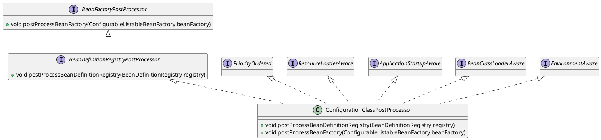
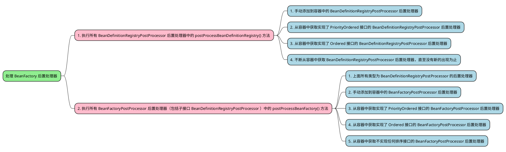

# Spring-注解版 BeanDefinition 注册流程

## 环境搭建

1. 利用 [Spring-源码环境搭建](./Spring-源码环境搭建.md) 搭建的 Spring 源码环境，创建一个新的模块专门用来研究注解版 BeanDefinition 注册流程。选中项目右键新建一个模块，模块名为 spring-annotation-beandefinition-source-test，选择 Gradle，最后点击创建即可即可；<br />

2. 引入相关依赖：在模块的 build.gradle 文件中引入以下依赖

   ```java
   dependencies {
       testImplementation 'org.junit.jupiter:junit-jupiter-api:5.8.1'
       testRuntimeOnly 'org.junit.jupiter:junit-jupiter-engine:5.8.1'
       implementation(project(':spring-context'))
       implementation(project(':spring-aspects'))
       implementation 'org.slf4j:slf4j-api:2.0.3'
       implementation 'ch.qos.logback:logback-classic:1.4.4'
   }
   ```

3. 增加日志配置文件：由于引入了 logback，所以需要在资源目录 resources 下创建一个 logback.xml 文件

   ```xml
   <?xml version="1.0" encoding="UTF-8"?>
   <configuration>
     <appender name="CONSOLE" class="ch.qos.logback.core.ConsoleAppender">
       <encoder>
         <pattern>%d{yyyy-MM-dd HH:mm:ss.SSS} [%t] %-5p %c{1}:%L - %m%n</pattern>
       </encoder>
     </appender>
   
     <appender name="FILE" class="ch.qos.logback.core.rolling.RollingFileAppender">
       <encoder>
         <pattern>%d{yyyy-MM-dd HH:mm:ss.SSS} [%t] %-5p %c{1}:%L - %m%n</pattern>
         <charset>utf-8</charset>
       </encoder>
       <file>log/output.log</file>
       <rollingPolicy class="ch.qos.logback.core.rolling.FixedWindowRollingPolicy">
         <fileNamePattern>log/output.log.%i</fileNamePattern>
       </rollingPolicy>
       <triggeringPolicy class="ch.qos.logback.core.rolling.SizeBasedTriggeringPolicy">
         <MaxFileSize>1MB</MaxFileSize>
       </triggeringPolicy>
     </appender>
   
     <root level="DEBUG">
       <appender-ref ref="CONSOLE"/>
       <appender-ref ref="FILE"/>
     </root>
   </configuration>
   ```

4. 当后续源码分析到某个知识点需要进行 DEBUG 调试时再去增加需要的基础设施类和测试方法代码片段，这样的作法在源码分析时针对某个知识点能够现场举例并马上查看效果可能会对源码理解的更加清晰透彻；

## ConfigurationClassPostProcessor 后置处理器

ConfigurationClassPostProcessor 后置处理器的继承关系图如下所示：



由其继承关系图可知，ConfigurationClassPostProcessor 实现了 <u>BeanDefinitionRegistryPostProcessor</u>，<u>PriorityOrdered</u> 和 ResourceLoaderAware、ApplicationStartupAware、BeanClassLoaderAware、EnvironmentAware 等 Aware 接口，而其中的 <u>BeanDefinitionRegistryPostProcessor</u> 后置处理器接口又<u>继承</u>自 <u>BeanFactoryPostProcessor</u> 后置处理器接口，是 BeanFactoryPostProcessor 后置处理器接口的子类。<br />既然 ConfigurationClassPostProcessor 实现了 BeanDefinitionRegistryPostProcessor 接口，必然要重写该接口中定义的 `postProcessBeanDefinitionRegistry()` 方法，本次源码分析重点针对的就是该方法，<span style="background-color: rgb(251, 228, 231);">在该方法中会解析被 **@Configuration、@Component、@ComponentScan、@Import、@ImportResource、@Bean** 等注解标注的类或方法，将这些类或方法封装成 BeanDefinition 后注册到 BeanFactory 中</span>。

### 注册时机

🤔 ConfigurationClassPostProcessor 后置处理器的 BeanDefinition 是何时被注册到 BeanFactory 中的呢？<br />🤓 存在以下两种情况：

1. 如果阅读过上一篇文章 [Spring-XML 版 BeanDefinition 注册流程](./Spring-XML版BeanDefinition注册流程.md)，记性好的小伙伴肯定会记得在文章的最后，描述了在使用 ComponentScanBeanDefinitionParser 解析器对 context:component-scan 自定义标签解析时，在解析器的核心方法 parse() 的最后会调用 registerComponents() 方法，在 registerComponents() 方法中又会调用 <span style="background-color: rgb(232, 247, 207);">AnnotationConfigUtils</span> 工具类的静态方法 `registerAnnotationConfigProcessors()` 向 BeanFactory 中注册一些与注解相关的后置处理器的 BeanDefinition（如 <span style="background-color: rgb(251, 228, 231);">ConfigurationClassPostProcessor</span>，AutowiredAnnotationBeanPostProcessor，CommonAnnotationBeanPostProcessor，...），注册到 BeanFactory 中的后置处理器就包括今天源码分析的主角 - ConfigurationClassPostProcessor 后置处理器。

2. 如测试案例所示，基于注解进行开发的话，则会使用 <u>AnnotationConfigApplicationContext</u> 上下文，在 AnnotationConfigApplicationContext 的无参构造中，

   ```java
   public AnnotationConfigApplicationContext() {
       /*
           先隐式调用其父类 GenericApplicationContext 的构造函数
           其父类构造函数里初始化了 DefaultListableBeanFactory，并赋值给 beanFactory 属性
           然后再运行其本类构造，即执行下面的逻辑
        */
       StartupStep createAnnotatedBeanDefReader = this.getApplicationStartup().start("spring.context.annotated-bean-reader.create");
       /*
           初始化一个注解版的 BeanDefinition 读取器
           在其内部会向 BeanFactory 中注册一些与注解相关的后置处理器的 BeanDefinition（如 ConfigurationClassPostProcessor，AutowiredAnnotationBeanPostProcessor，CommonAnnotationBeanPostProcessor，...）
        */
       this.reader = new AnnotatedBeanDefinitionReader(this);
       createAnnotatedBeanDefReader.end();
       /*
           初始化一个 BeanDefinition 扫描器，用于扫描指定包路径及其子包下所有满足条件的类继而转换为 BeanDefinition 注册到 BeanFactory 中
           默认使用的扫描器并不是这个 scanner 实例对象，而是在 ConfigurationClassPostProcessor 后置处理器去执行包扫描时会重新创建一个扫描器
           这个扫描器仅仅是为了程序员可以手动调用该类中的 scan() 方法以实现在没有指定配置类的时候能手动扫描包
           此处的扫描器用处不大，因为平常使用的时候并不会用到该扫描器
        */
       this.scanner = new ClassPathBeanDefinitionScanner(this);
   }
   ```

   点进 <u>AnnotatedBeanDefinitionReader</u> 的无参构造中，可以惊讶地发现在该无参构造的重载方法中也会调用 <span style="background-color: rgb(232, 247, 207);"><u>AnnotationConfigUtils</u></span> 工具类的静态方法 `registerAnnotationConfigProcessors()` 向 BeanFactory 中注册一些与注解相关的后置处理器的 BeanDefinition（如 <span style="background-color: rgb(251, 228, 231);">ConfigurationClassPostProcessor</span>，AutowiredAnnotationBeanPostProcessor，CommonAnnotationBeanPostProcessor，...），与前一种情况一模一样！

   ```java
   public AnnotatedBeanDefinitionReader(BeanDefinitionRegistry registry) {
       this(registry, getOrCreateEnvironment(registry));
   }
   
   public AnnotatedBeanDefinitionReader(BeanDefinitionRegistry registry, Environment environment) {
       Assert.notNull(registry, "BeanDefinitionRegistry must not be null");
       Assert.notNull(environment, "Environment must not be null");
       this.registry = registry;
       /*
           用于处理 @Conditional 条件注解
        */
       this.conditionEvaluator = new ConditionEvaluator(registry, environment, null);
       /*
           向 BeanFactory 中注册一些与注解相关的后置处理器的 BeanDefinition，如
           用于处理配置类后置处理器：ConfigurationClassPostProcessor，
           支持自动装配功能的后置处理器：AutowiredAnnotationBeanPostProcessor，
           支持JSR-250规范的后置处理器：CommonAnnotationBeanPostProcessor
           支持JPA功能的后置处理器、支持事件方法功能的后置处理器、支持事件工厂功能的后置处理器
        */
       AnnotationConfigUtils.registerAnnotationConfigProcessors(this.registry);
   }
   ```

### 执行时机

🤔 ConfigurationClassPostProcessor 后置处理器是何时执行的呢？准确点来说是，ConfigurationClassPostProcessor 后置处理器中的 postProcessBeanDefinitionRegistry() 是何时执行的呢？<br />🤓 在执行容器刷新 refresh() 方法的十二大步的第五大步 invokeBeanFactoryPostProcessors() 时，会执行 ConfigurationClassPostProcessor 后置处理器中的 postProcessBeanDefinitionRegistry() 方法。<br />调用 AnnotationConfigApplicationContext 实例对象中非常重要的容器刷新方法`refresh()`，该方法的实现位于其父类 AbstractApplicationContext 中，分析 Spring 源码就没有不讲该方法的，该 `refresh()` 方法是重中之重，一定要记住（自己多刷几遍源码自然就记住了）！ 毫不夸张的说，抛开一些细枝末节不谈，**该`refresh()`方法可以算得上是整个 Spring 源码分析的入口**。关于 Spring 容器刷新 `refresh()` 方法的<u>十二大步</u>，小伙伴们应该都有所耳闻。

1. `├─` prepareRefresh ① 上下文刷新前的准备工作，设置启动时间和 active 标志，初始化属性
2. `├─` obtainFreshBeanFactory  ② 创建 bean 工厂实例以及加载 bean 定义信息到 bean 工厂
3. `├─` prepareBeanFactory ③ 设置 beanFactory 的基本属性
4. `├─` postProcessBeanFactory ④ 子类处理自定义的 BeanFactoryPostProcess
5. `├─` **invokeBeanFactoryPostProcessors** <span style="background-color: rgb(232, 247, 207);">⑤ 实例化并调用所有 bean 工厂后置处理器</span>
6. `├─` registerBeanPostProcessors ⑥ 注册所有实现了 BeanPostProcessor 接口的类到 BeanFactory 中
7. `├─` initMessageSource ⑦ 初始化上下文中的资源文件，如国际化文件的处理等
8. `├─` initApplicationEventMulticaster ⑧ 初始化事件多播器
9. `├─` onRefresh ⑨ 给子类扩展初始化其他 Bean，在 Springboot 中用来做内嵌 tomcat 启动
10. `├─` registerListeners ⑩ 注册监听器
11. `├─` finishBeanFactoryInitialization ⑪ 实例化所有非懒加载的单实例 bean
12. `└─` finishRefresh ⑫ 完成刷新过程，发布上下文刷新完成事件

其中，绿色标记的部分就代表本次源码分析的主题，属于十二大步中的第五大步。invokeBeanFactoryPostProcessors() 方法如下所示：

```java
protected void invokeBeanFactoryPostProcessors(ConfigurableListableBeanFactory beanFactory) {
    /*
        对所有的 BeanFactory 后置处理器进行实例化并且按照顺序依次执行；
        getBeanFactoryPostProcessors()：用于获取当前 BeanFactory 中的 BeanFactory 后置处理器集合，一般情况下此集合为空，
            除非手动调用 AnnotationConfigApplicationContext#addBeanFactoryPostProcessor() 方法进行添加
     */
    PostProcessorRegistrationDelegate.invokeBeanFactoryPostProcessors(beanFactory, getBeanFactoryPostProcessors());

    // Detect a LoadTimeWeaver and prepare for weaving, if found in the meantime
    // (e.g. through an @Bean method registered by ConfigurationClassPostProcessor)
    if (!NativeDetector.inNativeImage() && beanFactory.getTempClassLoader() == null && beanFactory.containsBean(LOAD_TIME_WEAVER_BEAN_NAME)) {
        beanFactory.addBeanPostProcessor(new LoadTimeWeaverAwareProcessor(beanFactory));
        beanFactory.setTempClassLoader(new ContextTypeMatchClassLoader(beanFactory.getBeanClassLoader()));
    }
}
```

在该方法中会调用后置处理器的处理委托类 PostProcessorRegistrationDelegate 中的静态方法 invokeBeanFactoryPostProcessors()，

1. 在该静态方法中会对所有的 BeanFactory 后置处理器进行实例化并且按照顺序依次执行。
2. 该静态方法的第二个参数为 getBeanFactoryPostProcessors()，用于获取当前容器中 BeanFactory 后置处理器集合，此集合一般情况下为空，除非在执行容器刷新 `refresh()` 方法之前就手动调用 AnnotationConfigApplicationContext#addBeanFactoryPostProcessor() 方法往容器中添加 BeanFactory 后置处理器；

> [!NOTE|label:用于演示手动添加 BeanFactory 后置处理器的案例] 
>
> 1. 增加基础设施类，创建两个专门用于手动添加到容器中的自定义 BeanFactory 后置处理器类：MyManualBeanDefinitionRegistryPostProcessor 和 MyManualBeanFactoryPostProcessor；
>
>    ```java
>    public class MyManualBeanDefinitionRegistryPostProcessor implements BeanDefinitionRegistryPostProcessor {
>    	private static final Logger LOGGER = LoggerFactory.getLogger(MyManualBeanDefinitionRegistryPostProcessor.class);
>    
>    	@Override
>    	public void postProcessBeanFactory(ConfigurableListableBeanFactory beanFactory) throws BeansException {
>    		LOGGER.info("MyManualBeanDefinitionRegistryPostProcessor#postProcessBeanFactory");
>    	}
>    
>    	@Override
>    	public void postProcessBeanDefinitionRegistry(BeanDefinitionRegistry registry) throws BeansException {
>    		LOGGER.info("MyManualBeanDefinitionRegistryPostProcessor#postProcessBeanDefinitionRegistry");
>    	}
>    }
>    ```
>
> 2. 增加测试方法以及必需的代码片段，创建 AnnotationConfigApplicationContext 的实例对象并且调用该实例对象中的 addBeanFactoryPostProcessor() 方法添加上面声明的两个自定义 BeanFactory 后置处理器的实例对象；
>
>    ```java
>    public class ApiTest {
>    	@Test
>    	public void test_00() {
>    		AnnotationConfigApplicationContext ctx = new AnnotationConfigApplicationContext();
>    		// 手动添加自定义的 BeanFactory 后置处理器
>            ctx.addBeanFactoryPostProcessor(new MyManualBeanDefinitionRegistryPostProcessor());
>    		ctx.addBeanFactoryPostProcessor(new MyManualBeanFactoryPostProcessor());
>    		ctx.refresh();
>    	}
>    }
>    ```
>
> 3. 打断点进行 DEBUG 调试，如下所示：通过计算表达式可以看到集合中存在的两个实例对象正是咱们手动添加到容器中的自定义 BeanFactory 后置处理器的实例对象

首先对 PostProcessorRegistrationDelegate 中的静态方法 invokeBeanFactoryPostProcessors() 有个宏观的了解，该方法的代码逻辑阅读起来并不难，大体可以分为以下两种情况：<br />



1. 首先执行所有 <u>BeanDefinitionRegistryPostProcessor</u> 后置处理器中的 `postProcessBeanDefinitionRegistry()` 方法，针对这种情况又可以分为以下四种情况：
   1. 首先执行通过 AnnotationConfigApplicationContext#addBeanFactoryPostProcessor() 方法<u>手动添加</u>到容器中的 BeanDefinitionRegistryPostProcessor 后置处理器中的 postProcessBeanDefinitionRegistry() 方法；
   2. 其次执行通过 beanFactory.getBean() 方法<u>从容器中获取</u>实现了 <u>PriorityOrdered</u> 接口的 BeanDefinitionRegistryPostProcessor 后置处理器中的 postProcessBeanDefinitionRegistry() 方法；其中最为重要的 <span style="background-color: rgb(251, 228, 231);">ConfigurationClassPostProcessor</span> 后置处理器的 `postProcessBeanDefinitionRegistry()` 方法就是在此处执行。
   
      <br />如上图所示，一般情况下，此时只会找到一个符合条件的 BeanFactory 后置处理器 ConfigurationClassPostProcessor，接下来就会去执行该后置处理器中的 postProcessBeanDefinitionRegistry() 方法。<br />
   
   3. 再其次执行通过 beanFactory.getBean() 方法从容器中获取实现了 <u>Ordered</u> 接口的 BeanDefinitionRegistryPostProcessor 后置处理器中的 postProcessBeanDefinitionRegistry() 方法；
   4. 最后执行通过 beanFactory.getBean() 方法从容器中获取 BeanDefinitionRegistryPostProcessor 后置处理器中的 postProcessBeanDefinitionRegistry() 方法；不断循环该过程，直至不再有新的 BeanDefinitionRegistryPostProcessor 后置处理器出现为止！
   
2. 然后才执行所有 BeanFactoryPostProcessor 后置处理器（包括子接口 BeanDefinitionRegistryPostProcessor ）中的 postProcessBeanFactory() 方法，针对这种情况又可以以下五种情况：

   1.  首先统一执行上面所有类型为 BeanDefinitionRegistryPostProcessor 后置处理器中的 postProcessBeanFactory() 方法，执行顺序为上面步骤中后置处理器处理的顺序；
   2.  其次执行通过 AnnotationConfigApplicationContext#addBeanFactoryPostProcessor() 方法<u>手动添加</u>到容器中的 BeanFactoryPostProcessor 后置处理器中的 postProcessBeanFactory() 方法；
   3.  再其次执行通过 beanFactory.getBean() 方法从容器中获取实现了 <u>PriorityOrdered</u> 接口的 BeanFactoryPostProcessor 后置处理器中的 postProcessBeanFactory() 方法；
   4.  再其次执行通过 beanFactory.getBean() 方法从容器中获取实现了 <u>Ordered</u> 接口的 BeanFactoryPostProcessor 后置处理器中的 postProcessBeanFactory() 方法；
   5.  最后执行通过 beanFactory.getBean() 方法从容器中获取<u>不实现任何排序接口</u>的 BeanFactoryPostProcessor 后置处理器中的 postProcessBeanFactory() 方法；

   > [!CODE|label:处理所有 BeanFactory 后置处理器的具体代码实现]
   >
   > ```java
   > public static void invokeBeanFactoryPostProcessors(ConfigurableListableBeanFactory beanFactory, List<BeanFactoryPostProcessor> beanFactoryPostProcessors) {
   >     // WARNING: Although it may appear that the body of this method can be easily
   >     // refactored to avoid the use of multiple loops and multiple lists, the use
   >     // of multiple lists and multiple passes over the names of processors is
   >     // intentional. We must ensure that we honor the contracts for PriorityOrdered
   >     // and Ordered processors. Specifically, we must NOT cause processors to be
   >     // instantiated (via getBean() invocations) or registered in the ApplicationContext
   >     // in the wrong order.
   >     //
   >     // Before submitting a pull request (PR) to change this method, please review the
   >     // list of all declined PRs involving changes to PostProcessorRegistrationDelegate
   >     // to ensure that your proposal does not result in a breaking change:
   >     // https://github.com/spring-projects/spring-framework/issues?q=PostProcessorRegistrationDelegate+is%3Aclosed+label%3A%22status%3A+declined%22
   > 
   >     // Invoke BeanDefinitionRegistryPostProcessors first, if any.
   >     // 定义用于存储 "已处理" 的 BeanFactory 后置处理器的集合
   >     Set<String> processedBeans = new HashSet<>();
   > 
   >     // 判断 BeanFactory 是否是 BeanDefinitionRegistry 接口的实现类，
   >     // 因为传进来的 beanFactory 是 DefaultListableBeanFactory 类型的实例对象，而 DefaultListableBeanFactory 又实现了 BeanDefinitionRegistry 接口，所以肯定满足条件走 if 逻辑
   >     if (beanFactory instanceof BeanDefinitionRegistry) {
   >         BeanDefinitionRegistry registry = (BeanDefinitionRegistry) beanFactory;
   >         // 定义用于存储普通的 BeanFactoryPostProcessor 后置处理器的集合
   >         List<BeanFactoryPostProcessor> regularPostProcessors = new ArrayList<>();
   >         // 定义用于存储 BeanDefinitionRegistryPostProcessor 类型的 BeanFactory 后置处理器集合，其实 BeanDefinitionRegistryPostProcessor 是 BeanFactoryPostProcessor 的子类
   >         List<BeanDefinitionRegistryPostProcessor> registryProcessors = new ArrayList<>();
   >         // 遍历通过 AnnotationConfigApplicationContext#addBeanFactoryPostProcessor() 方法手动添加到 BeanFactory 的 BeanFactory 后置处理器的实例对象集合
   >         for (BeanFactoryPostProcessor postProcessor : beanFactoryPostProcessors) {
   >             /*
   >                 判断 postProcessor 是不是 BeanDefinitionRegistryPostProcessor 类型的 BeanFactory 后置处理器，
   >                 BeanDefinitionRegistryPostProcessor 对 BeanFactoryPostProcessor 进行扩展，
   >                     在 BeanFactoryPostProcessor 的基础上增加了 postProcessBeanDefinitionRegistry() 方法，用于向 BeanFactory 中注册 BeanDefinition
   >                 如果判断为 true 的话，则直接执行 BeanDefinitionRegistryPostProcessor 实例对象中的 postProcessBeanDefinitionRegistry() 方法，然后再把该实例对象添加到 registryProcessors 集合中
   >              */
   >             if (postProcessor instanceof BeanDefinitionRegistryPostProcessor) {
   >                 // 强制类型转换，转换成子类 BeanDefinitionRegistryPostProcessor 实例对象
   >                 BeanDefinitionRegistryPostProcessor registryProcessor =
   >                 (BeanDefinitionRegistryPostProcessor) postProcessor;
   >                 // 执行 BeanDefinitionRegistryPostProcessor 实例对象中的 postProcessBeanDefinitionRegistry() 方法
   >                 registryProcessor.postProcessBeanDefinitionRegistry(registry);
   >                 // 将 registryProcessor 添加到 registryProcessors 集合中，方便后续统一执行所有 BeanDefinitionRegistryPostProcessor 实例对象中的 postProcessBeanFactory() 方法
   >                 registryProcessors.add(registryProcessor);
   >             } else {
   >                 // 如果不是 BeanDefinitionRegistryPostProcessor 类型的 BeanFactory 后置处理器的话，则将该 BeanFactory 后置处理器实例对象添加到普通的 regularPostProcessors 集合中
   >                 regularPostProcessors.add(postProcessor);
   >             }
   >         }
   > 
   >         // Do not initialize FactoryBeans here: We need to leave all regular beans
   >         // uninitialized to let the bean factory post-processors apply to them!
   >         // Separate between BeanDefinitionRegistryPostProcessors that implement
   >         // PriorityOrdered, Ordered, and the rest.
   >         // 定义用于存储当前需要处理的 BeanDefinitionRegistryPostProcessor 类型的 BeanFactory 后置处理器的临时集合，每处理完一批，会阶段性地清空一批
   >         List<BeanDefinitionRegistryPostProcessor> currentRegistryProcessors = new ArrayList<>();
   > 
   >         // First, invoke the BeanDefinitionRegistryPostProcessors that implement PriorityOrdered.
   >         /*
   >             从容器中获取所有类型为 BeanDefinitionRegistryPostProcessor 后置处理器的 BeanDefinition 名称，并判断是否实现了优先级（PriorityOrdered）接口
   >             例如，内置的用于处理配置类的后置处理器 internalConfigurationAnnotationProcessor，类型为 ConfigurationClassPostProcessor
   >             一般情况下，只会找到一个符合条件的，即用于处理配置类的后置处理器 ConfigurationClassPostProcessor
   >             此处有一个坑，为什么自己创建了一个既实现 BeanDefinitionRegistryPostProcessor 接口又实现了 PriorityOrdered 接口的类，并标注了 @Component 注解，但是在此处却无法获得呢？
   >             其实是因为直到这一步，Spring 还没有去执行包扫描呢！当然获取不到被 @Component 注解标注的自定义的 BeanDefinitionRegistryPostProcessor 后置处理器，
   >                 在下方第一个 invokeBeanDefinitionRegistryPostProcessors() 方法中，会去执行 ConfigurationClassPostProcessor 后置处理器中的 postProcessBeanDefinitionRegistry() 时，此时才会进行包扫描
   >          */
   >         String[] postProcessorNames =
   >         beanFactory.getBeanNamesForType(BeanDefinitionRegistryPostProcessor.class, true, false);
   >         for (String ppName : postProcessorNames) {
   >             if (beanFactory.isTypeMatch(ppName, PriorityOrdered.class)) {
   >                 /*
   >                     从容器中获取该后置处理器的实例对象添加到临时集合 currentRegistryProcessors 中
   >                     beanFactory.getBean()：如果是第一次从容器中去获取该后置处理器，则会去创建该后置处理器的单例对象，然后保存到 BeanFactory 的单例池中，此过程会经历完整的 Bean 的生命周期（实例化、属性填充、初始化）
   >                  */
   >                 currentRegistryProcessors.add(beanFactory.getBean(ppName, BeanDefinitionRegistryPostProcessor.class));
   >                 // 同时把 name 也添加到 "已处理" 的 BeanFactory 后置处理器集合中，后续会根据该集合来判断某个 BeanFactory 后置处理器是否已经执行过
   >                 processedBeans.add(ppName);
   >             }
   >         }
   >         // 对临时集合中的 BeanDefinitionRegistryPostProcessor 后置处理器进行排序（实现了 PriorityOrdered 接口）
   >         sortPostProcessors(currentRegistryProcessors, beanFactory);
   >         /*
   >             将当前临时集合中所有的 BeanDefinitionRegistryPostProcessor 后置处理器添加到 registryProcessors 集合中，
   >                 方便后续统一执行所有 BeanDefinitionRegistryPostProcessor 后置处理器中的 postProcessBeanFactory() 方法
   >          */
   >         registryProcessors.addAll(currentRegistryProcessors);
   >         /*
   >             遍历执行当前临时集合中 BeanDefinitionRegistryPostProcessor 后置处理器中的 postProcessBeanDefinitionRegistry() 方法
   >             最为典型且重要的一个 BeanDefinitionRegistryPostProcessor 后置处理器为 ConfigurationClassPostProcessor，
   >                 该后置处理器专门用于解析配置类，被 @Configuration、@Component、@ComponentScan、@Import、@ImportResource、@Bean 注解标注的类或方法会被解析封装成 BeanDefinition 后注册到 BeanFactory 中
   >             是 Spring 中热插拔的一种体现，例如，ConfigurationClassPostProcessor 就相当于一个组件，Spring 中很多事情就交给该组件去管理，如果不想用这个组件时，直接把注册组件的那一步去掉就可以了
   >          */
   >         invokeBeanDefinitionRegistryPostProcessors(currentRegistryProcessors, registry, beanFactory.getApplicationStartup());
   >         // 这一轮 BeanDefinitionRegistryPostProcessor 后置处理器中的 postProcessBeanDefinitionRegistry() 方法都执行完成后，清空临时集合，准备开始下一轮
   >         currentRegistryProcessors.clear();
   > 
   >         // Next, invoke the BeanDefinitionRegistryPostProcessors that implement Ordered.
   >         // 与上面一段代码的逻辑大体差不多，可以对照着一块进行分析
   >         // 从容器中获取所有类型为 BeanDefinitionRegistryPostProcessor 后置处理器的 BeanDefinition 名称，并判断是否实现了排序（Ordered）接口
   >         postProcessorNames = beanFactory.getBeanNamesForType(BeanDefinitionRegistryPostProcessor.class, true, false);
   >         for (String ppName : postProcessorNames) {
   >             if (!processedBeans.contains(ppName) && beanFactory.isTypeMatch(ppName, Ordered.class)) {
   >                 // 从容器中获取该后置处理器的实例对象添加到临时集合 currentRegistryProcessors 中
   >                 currentRegistryProcessors.add(beanFactory.getBean(ppName, BeanDefinitionRegistryPostProcessor.class));
   >                 // 同时把 name 也添加到 "已处理" 的 BeanFactory 后置处理器集合中，后续会根据该集合来判断某个 BeanFactory 后置处理器是否已经执行过
   >                 processedBeans.add(ppName);
   >             }
   >         }
   >         // 对临时集合中的 BeanDefinitionRegistryPostProcessor 后置处理器进行排序（实现了 Ordered 接口）
   >         sortPostProcessors(currentRegistryProcessors, beanFactory);
   >         /*
   >             将当前临时集合中所有的 BeanDefinitionRegistryPostProcessor 后置处理器添加到 registryProcessors 集合中，
   >             方便后续统一执行所有 BeanDefinitionRegistryPostProcessor 后置处理器中的 postProcessBeanFactory() 方法
   >          */
   >         registryProcessors.addAll(currentRegistryProcessors);
   >         // 遍历执行当前临时集合中 BeanDefinitionRegistryPostProcessor 后置处理器中的 postProcessBeanDefinitionRegistry() 方法
   >         invokeBeanDefinitionRegistryPostProcessors(currentRegistryProcessors, registry, beanFactory.getApplicationStartup());
   >         // 清空临时集合，准备开始下一轮
   >         currentRegistryProcessors.clear();
   > 
   >         // Finally, invoke all other BeanDefinitionRegistryPostProcessors until no further ones appear.
   >         // 最后，从容器中获取所有类型为 BeanDefinitionRegistryPostProcessor 后置处理器的 BeanDefinition 名称，没有实现任何优先级和排序接口的情况
   >         boolean reiterate = true;
   >         /*
   >             直到从容器再也获取不到新的 BeanDefinitionRegistryPostProcessor 后置处理器才会退出 while 循环，这是什么情况呢？
   >             因为 BeanDefinitionRegistryPostProcessor 后置处理器的作用就是向容器中注册 BeanDefinition，而注册到容器中的 BeanDefinition 有可能是 BeanDefinitionRegistryPostProcessor 后置处理器类型，
   >                 类似于这种情况：在 A 后置处理器的 postProcessBeanDefinitionRegistry() 方法中向容器中注册 B 后置处理器（有可能实现了 PriorityOrdered 或者 Ordered 排序接口）的 BeanDefinition，
   >                 Spring 为了处理该情况的出现，才使用 while 循环不断判断是否有新增的 BeanDefinitionRegistryPostProcessor 后置处理器是否没有被执行到，即保证新增的 B 后置处理器也会被执行到，
   >                 直至不再有新的 BeanDefinitionRegistryPostProcessor 后置处理器出现才会退出循环！
   >          */
   >         while (reiterate) {
   >             reiterate = false;
   >             postProcessorNames = beanFactory.getBeanNamesForType(BeanDefinitionRegistryPostProcessor.class, true, false);
   >             for (String ppName : postProcessorNames) {
   >                 if (!processedBeans.contains(ppName)) {
   >                     // 从容器中获取该后置处理器的实例对象添加到临时集合 currentRegistryProcessors 中
   >                     currentRegistryProcessors.add(beanFactory.getBean(ppName, BeanDefinitionRegistryPostProcessor.class));
   >                     // 同时把 name 也添加到 "已处理" 的 BeanFactory 后置处理器集合中，后续会根据该集合来判断某个 BeanFactory 后置处理器是否已经执行过
   >                     processedBeans.add(ppName);
   >                     reiterate = true;
   >                 }
   >             }
   >             // 对临时集合中的 BeanDefinitionRegistryPostProcessor 后置处理器进行排序（可能实现了 PriorityOrdered 或者 Ordered 排序接口）
   >             sortPostProcessors(currentRegistryProcessors, beanFactory);
   >             /*
   >                 将当前临时集合中所有的 BeanDefinitionRegistryPostProcessor 后置处理器添加到 registryProcessors 集合中，
   >                 方便后续统一执行所有 BeanDefinitionRegistryPostProcessor 后置处理器中的 postProcessBeanFactory() 方法
   >              */
   >             registryProcessors.addAll(currentRegistryProcessors);
   >             // 遍历执行当前临时集合中 BeanDefinitionRegistryPostProcessor 后置处理器中的 postProcessBeanDefinitionRegistry() 方法
   >             invokeBeanDefinitionRegistryPostProcessors(currentRegistryProcessors, registry, beanFactory.getApplicationStartup());
   >             // 清空临时集合，准备开始下一轮
   >             currentRegistryProcessors.clear();
   >         }
   > 
   >         // Now, invoke the postProcessBeanFactory callback of all processors handled so far.
   >         /*
   >             统一执行上面所有类型为 BeanDefinitionRegistryPostProcessor 后置处理器中的 postProcessBeanFactory() 方法
   >             对于 ConfigurationClassPostProcessor 后置处理器中的 postProcessBeanFactory() 方法，主要用于将 FULL 模式配置类所对应的 BeanDefinition 中的 beanClass 替换为 cglib 增强的子类，
   >                 这样在创建该 FULL 模式的配置类的实例对象时，创建出来的是经过 cglib 增强的动态代理类对象
   >          */
   >         invokeBeanFactoryPostProcessors(registryProcessors, beanFactory);
   >         // 遍历执行所有通过 AnnotationConfigApplicationContext#addBeanFactoryPostProcessor() 方法手动添加到容器中的 BeanFactoryPostProcessor 后置处理器中的 postProcessBeanFactory() 方法
   >         invokeBeanFactoryPostProcessors(regularPostProcessors, beanFactory);
   >     } else {
   >         // Invoke factory processors registered with the context instance.
   >         invokeBeanFactoryPostProcessors(beanFactoryPostProcessors, beanFactory);
   >     }
   > 
   >     // Do not initialize FactoryBeans here: We need to leave all regular beans
   >     // uninitialized to let the bean factory post-processors apply to them!
   >     /*
   >         由于 BeanFactoryPostProcessor 后置处理器不会向容器中注册 BeanDefinition，
   >             所以不需要像上面处理 BeanDefinitionRegistryPostProcessor 后置处理器一样麻烦，每执行完一轮之后还需要从容器中重新取，检查以下是否有新增的后置处理器没有处理，
   >             防止优先级高的 BeanDefinitionRegistryPostProcessor 后置处理器利用 postProcessBeanDefinitionRegistry() 方法注册到容器中的没有处理过的 BeanDefinitionRegistryPostProcessor 后置处理器被遗漏
   >         从容器中取出所有类型为 BeanFactoryPostProcessor 的后置处理器，按照是否实现了 PriorityOrdered 接口、Ordered 接口和剩余的三种情况进行分组分别添加到三个集合中
   >      */
   >     String[] postProcessorNames =
   >     beanFactory.getBeanNamesForType(BeanFactoryPostProcessor.class, true, false);
   > 
   >     // Separate between BeanFactoryPostProcessors that implement PriorityOrdered,
   >     // Ordered, and the rest.
   >     List<BeanFactoryPostProcessor> priorityOrderedPostProcessors = new ArrayList<>();
   >     List<String> orderedPostProcessorNames = new ArrayList<>();
   >     List<String> nonOrderedPostProcessorNames = new ArrayList<>();
   >     for (String ppName : postProcessorNames) {
   >         if (processedBeans.contains(ppName)) {
   >             // 如果该 BeanFactoryPostProcessor 后置处理器已经处理过的话，则直接跳过，不再重复处理！
   >             // skip - already processed in first phase above
   >         } else if (beanFactory.isTypeMatch(ppName, PriorityOrdered.class)) {
   >             // 如果实现了 PriorityOrdered 接口，则添加到 priorityOrderedPostProcessors 集合中
   >             priorityOrderedPostProcessors.add(beanFactory.getBean(ppName, BeanFactoryPostProcessor.class));
   >         } else if (beanFactory.isTypeMatch(ppName, Ordered.class)) {
   >             // 如果实现了 Ordered 接口，则添加到 orderedPostProcessorNames 集合中
   >             orderedPostProcessorNames.add(ppName);
   >         } else {
   >             // 如果 PriorityOrdered 和 Ordered 两个接口都没有实现，则添加到 orderedPostProcessorNames 集合中
   >             nonOrderedPostProcessorNames.add(ppName);
   >         }
   >     }
   > 
   >     // First, invoke the BeanFactoryPostProcessors that implement PriorityOrdered.
   >     // 对集合中的 BeanFactoryPostProcessor 后置处理器进行排序（实现了 PriorityOrdered 接口）
   >     sortPostProcessors(priorityOrderedPostProcessors, beanFactory);
   >     // 遍历执行集合中 BeanFactoryPostProcessor 后置处理器中的 postProcessBeanFactory() 方法
   >     invokeBeanFactoryPostProcessors(priorityOrderedPostProcessors, beanFactory);
   > 
   >     // Next, invoke the BeanFactoryPostProcessors that implement Ordered.
   >     // 通过 orderedPostProcessorNames 集合中的名称以及 getBean() 方法从容器中获取 BeanFactoryPostProcessor 后置处理器的实例对象添加到 orderedPostProcessors 集合中
   >     List<BeanFactoryPostProcessor> orderedPostProcessors = new ArrayList<>(orderedPostProcessorNames.size());
   >     for (String postProcessorName : orderedPostProcessorNames) {
   >         orderedPostProcessors.add(beanFactory.getBean(postProcessorName, BeanFactoryPostProcessor.class));
   >     }
   >     // 对集合中的 BeanFactoryPostProcessor 后置处理器进行排序（实现了 Ordered 接口）
   >     sortPostProcessors(orderedPostProcessors, beanFactory);
   >     // 遍历执行集合中 BeanFactoryPostProcessor 后置处理器中的 postProcessBeanFactory() 方法
   >     invokeBeanFactoryPostProcessors(orderedPostProcessors, beanFactory);
   > 
   >     // Finally, invoke all other BeanFactoryPostProcessors.
   >     // 通过 nonOrderedPostProcessors 集合中的名称以及 getBean() 方法从容器中获取 BeanFactoryPostProcessor 后置处理器的实例对象添加到 nonOrderedPostProcessors 集合中
   >     List<BeanFactoryPostProcessor> nonOrderedPostProcessors = new ArrayList<>(nonOrderedPostProcessorNames.size());
   >     for (String postProcessorName : nonOrderedPostProcessorNames) {
   >         nonOrderedPostProcessors.add(beanFactory.getBean(postProcessorName, BeanFactoryPostProcessor.class));
   >     }
   >     // 遍历执行集合中 BeanFactoryPostProcessor 后置处理器中的 postProcessBeanFactory() 方法
   >     invokeBeanFactoryPostProcessors(nonOrderedPostProcessors, beanFactory);
   > 
   >     // Clear cached merged bean definitions since the post-processors might have
   >     // modified the original metadata, e.g. replacing placeholders in values...
   >     beanFactory.clearMetadataCache();
   > }
   > ```

   > [!DEMO|label:用于演示两种 BeanFactory 后置处理器中 postProcessBeanDefinitionRegistry 方法与 postProcessBeanFactory 方法执行顺序的案例]
   >
   > 1. 创建一个自定义的 BeanDefinitionRegistryPostProcessor 后置处理器
   >
   >    ```java
   >    @Component
   >    public class MyBeanDefinitionRegistryPostProcessor implements BeanDefinitionRegistryPostProcessor {
   >    	private static final Logger LOGGER = LoggerFactory.getLogger(MyBeanDefinitionRegistryPostProcessor.class);
   >    
   >    	@Override
   >    	public void postProcessBeanFactory(ConfigurableListableBeanFactory beanFactory) throws BeansException {
   >    		LOGGER.info("MyBeanDefinitionRegistryPostProcessor#postProcessBeanFactory");
   >    	}
   >    
   >    	@Override
   >    	public void postProcessBeanDefinitionRegistry(BeanDefinitionRegistry registry) throws BeansException {
   >    		LOGGER.info("MyBeanDefinitionRegistryPostProcessor#postProcessBeanDefinitionRegistry");
   >    		GenericBeanDefinition beanDefinition = new GenericBeanDefinition();
   >    		beanDefinition.setBeanClass(MyBeanDefinitionRegistryPostProcessor2.class);
   >    		registry.registerBeanDefinition(MyBeanDefinitionRegistryPostProcessor2.class.getName(), beanDefinition);
   >    		LOGGER.info("向容器中注册 MyBeanDefinitionRegistryPostProcessor2 后置处理器");
   >    	}
   >    }
   >    ```
   >
   >    在 MyBeanDefinitionRegistryPostProcessor 的 postProcessBeanDefinitionRegistry() 方法中向容器中注册另一个 BeanDefinitionRegistryPostProcessor 后置处理器：MyBeanDefinitionRegistryPostProcessor2
   >
   >    可以注意到 MyBeanDefinitionRegistryPostProcessor2 后置处理器并没有标注 @Component 注解！
   >
   >    ```java
   >    public class MyBeanDefinitionRegistryPostProcessor2 implements BeanDefinitionRegistryPostProcessor, PriorityOrdered {
   >    	private static final Logger LOGGER = LoggerFactory.getLogger(MyBeanDefinitionRegistryPostProcessor2.class);
   >    
   >    	@Override
   >    	public void postProcessBeanFactory(ConfigurableListableBeanFactory beanFactory) throws BeansException {
   >    		LOGGER.info("MyBeanDefinitionRegistryPostProcessor2#postProcessBeanFactory");
   >    	}
   >    
   >    	@Override
   >    	public void postProcessBeanDefinitionRegistry(BeanDefinitionRegistry registry) throws BeansException {
   >    		LOGGER.info("MyBeanDefinitionRegistryPostProcessor2#postProcessBeanDefinitionRegistry");
   >    	}
   >    
   >    	@Override
   >    	public int getOrder() {
   >    		return 0;
   >    	}
   >    }
   >    ```
   >
   > 2. 创建一个自定义的 BeanFactoryPostProcessor 后置处理器
   >
   >    ```java
   >    @Component
   >    public class MyBeanFactoryPostProcessor implements BeanFactoryPostProcessor {
   >    	private static final Logger LOGGER = LoggerFactory.getLogger(MyBeanFactoryPostProcessor.class);
   >    
   >    	@Override
   >    	public void postProcessBeanFactory(ConfigurableListableBeanFactory beanFactory) throws BeansException {
   >    		LOGGER.info("MyBeanFactoryPostProcessor#postProcessBeanFactory");
   >    	}
   >    }
   >    ```
   >
   > 3. 主配置类，标注 @ComponentScan 注解，用于将上面两个被 @Component 注解标注的 BeanFactory 后置处理器扫描注册到容器中
   >
   >    ```java
   >    @ComponentScan("fun.xiaorang.spring.annotation.beandefinition") public class MainConfig { }
   >    ```
   >
   > 4. 修改测试方法，如下所示：
   >
   >    ```java
   >    @Test
   >    public void test_00() {
   >        AnnotationConfigApplicationContext ctx = new AnnotationConfigApplicationContext();
   >        ctx.register(MainConfig.class);
   >        // 手动添加自定义的 BeanFactory 后置处理器
   >        ctx.addBeanFactoryPostProcessor(new MyManualBeanFactoryPostProcessor());
   >        ctx.addBeanFactoryPostProcessor(new MyManualBeanDefinitionRegistryPostProcessor());
   >        ctx.refresh();
   >    }
   >    ```
   >
   >    先对照着上面的源码分析推断一下测试结果，如下所示：
   >
   >    1. 执行手动添加到容器中的 BeanDefinitionRegistryPostProcessor 后置处理器中的 postProcessBeanDefinitionRegistry() 方法，输出 "MyManualBeanDefinitionRegistryPostProcessor#postProcessBeanFactory" 字样；对应上面源码分析步骤中的 1-a
   >
   >    2. 从 IoC 容器中取出内置的实现了 PriorityOrdered 接口的 BeanDefinitionRegistryPostProcessor 后置处理器：ConfigurationClassPostProcessor，执行其 postProcessBeanDefinitionRegistry() 方法将自定义的 MyBeanDefinitionRegistryPostProcessor 和 MyBeanFactoryPostProcessor 后置处理器注册到 IoC 容器中；对应上面源码分析步骤中的 1-b
   >
   >    3. 从 IoC 容器中取出自定义的 MyBeanDefinitionRegistryPostProcessor 后置处理器，执行其 postProcessBeanDefinitionRegistry() 方法，依次输出 "MyBeanDefinitionRegistryPostProcessor#postProcessBeanDefinitionRegistry"、"向容器中注册 MyBeanDefinitionRegistryPostProcessor2 后置处理器" 字样；对应上面源码分析步骤中的 1-d
   >
   >    4. 从 IoC 容器中取出上一步注册进去的 MyBeanDefinitionRegistryPostProcessor2 后置处理器，执行其 postProcessBeanDefinitionRegistry() 方法，输出 "MyBeanDefinitionRegistryPostProcessor2#postProcessBeanDefinitionRegistry" 字样；对应上面源码分析步骤中的 1-d
   >
   >    5. 统一执行上面所有类型为 BeanDefinitionRegistryPostProcessor 后置处理器中的 postProcessBeanFactory() 方法，依次输出：
   >
   >       "MyManualBeanDefinitionRegistryPostProcessor#postProcessBeanFactory"、
   >
   >       "MyBeanDefinitionRegistryPostProcessor#postProcessBeanFactory"、
   >
   >       "MyBeanDefinitionRegistryPostProcessor2#postProcessBeanFactory" 字样；对应上面源码分析步骤中的 2-a
   >
   >    6. 执行手动添加到容器中的 BeanFactoryPostProcessor 后置处理器中的 postProcessBeanFactory() 方法，输出 "MyManualBeanFactoryPostProcessor#postProcessBeanFactory" 字样；对应上面源码分析步骤中的 2-b
   >
   >    7. 从 IoC 容器中取出自定义的 MyBeanFactoryPostProcessor 后置处理器，执行其 postProcessBeanFactory() 方法，输出 "MyBeanFactoryPostProcessor#postProcessBeanFactory" 字样；对应上面源码分析步骤中的 2-e
   >
   >    测试结果如下所示：可以发现测试结果与咱们推断的一致！

#### postProcessBeanDefinitionRegistry() 方法

现在将重心放到 <u>ConfigurationClassPostProcessor</u> 后置处理器的 `postProcessBeanDefinitionRegistry()` 方法上，该方法专门用于解析配置类，被 **@Configuration、@Component、@ComponentScan、@Import、@ImportResource、@Bean** 注解标注的类或方法会被解析封装成 BeanDefinition 后注册到 BeanFactory 中。

```java
public void postProcessBeanDefinitionRegistry(BeanDefinitionRegistry registry) {
    int registryId = System.identityHashCode(registry);
    if (this.registriesPostProcessed.contains(registryId)) {
        throw new IllegalStateException(
                "postProcessBeanDefinitionRegistry already called on this post-processor against " + registry);
    }
    if (this.factoriesPostProcessed.contains(registryId)) {
        throw new IllegalStateException(
                "postProcessBeanFactory already called on this post-processor against " + registry);
    }
    this.registriesPostProcessed.add(registryId);
    /*
        该方法用于解析配置类，解析被 @Configuration、@Component、@ComponentScan、@Import、@ImportResource、@Bean 注解标注的类或方法，封装成 BeanDefinition 后注册到容器中。
     */
    processConfigBeanDefinitions(registry);
}
```

> [!CODE|label:处理配置类上标注的各种注解从而实现向容器中注册各种组件的 BeanDefinition 的具体代码实现]
>
> ```java
> public void processConfigBeanDefinitions(BeanDefinitionRegistry registry) {
>     // 候选的配置类集合：用于存放容器中所有配置类的 BeanDefinition，并将其包装成 BeanDefinitionHolder
>     List<BeanDefinitionHolder> configCandidates = new ArrayList<>();
>     // 从容器中取出所有 BeanDefinition 的名称，包括后置处理器和以及通过 AnnotationConfigApplicationContext#register() 方法注册到容器中的配置类（如 MainConfig）
>     String[] candidateNames = registry.getBeanDefinitionNames();
>     // 遍历上述集合，筛选出所有是配置类的 BeanDefinition，包装成 BeanDefinitionHolder 后添加到 configCandidates 集合中
>     for (String beanName : candidateNames) {
>         BeanDefinition beanDef = registry.getBeanDefinition(beanName);
>         /*
>             根据当前 BeanDefinition 中属性名称为 ConfigurationClassPostProcessor.configurationClass 的值是否为 NULL 判断当前 BeanDefinition 是否已经被处理过
>             如果当前 BeanDefinition 是第一次执行该方法的话，该属性值默认为 NULL，当前 BeanDefinition 中该属性的值如果不为 NULL，则说明已经被处理过，不再对其进行处理
>          */
>         if (beanDef.getAttribute(ConfigurationClassUtils.CONFIGURATION_CLASS_ATTRIBUTE) != null) {
>             if (logger.isDebugEnabled()) {
>                 logger.debug("Bean definition has already been processed as a configuration class: " + beanDef);
>             }
>         }
>         /*
>             如何判断一个类是不是一个配置类呢？配置类，可以分为以下两种模式：
>              a. FULL模式：标注 @Configuration 注解且注解中的 proxyBeanMethods 属性缺省或者显示设置为 true的类；
>              b. LITE 模式：
>                 ⅰ. 标注 @Configuration 注解且注解中的 proxyBeanMethods 属性显示设置为 false 的类；
>                 ⅱ. 标注 @Component 或 @ComponentScan 或 @Import 或 @ImportResource 注解的类；
>                 ⅲ. 类中存在被 @Bean 注解标注的方法的类;
>                 总结：所以说被 @Configuration 或 @Component 或 @ComponentScan 或 @Import 或 @ImportResource 注解的类，或者类中存在 被 @Bean 注解标注的方法的类都是一个配置类
> 
>             如果判断当前 BeanDefinition 是配置类的话，则会标记当前 BeanDefinition 已经被处理过，
>                 即给当前 BeanDefinition 中的 ConfigurationClassPostProcessor.configurationClass 属性赋值 = "full" 或者 "lite"
>         */
>         else if (ConfigurationClassUtils.checkConfigurationClassCandidate(beanDef, this.metadataReaderFactory)) {
>             // 如果是配置类的话，就将当前 BeanDefinition 包装成 BeanDefinitionHolder 后添加到 configCandidates 集合中
>             configCandidates.add(new BeanDefinitionHolder(beanDef, beanName));
>         }
>     }
> 
>     // Return immediately if no @Configuration classes were found
>     // 如果从容器中找不到配置类的话，则直接返回，不再执行后面的逻辑！
>     if (configCandidates.isEmpty()) {
>         return;
>     }
> 
>     // Sort by previously determined @Order value, if applicable
>     // 根据配置类上标注的 @Order 注解中的 value 值进行排序，值越小代表优先级越高，也就代表越先被解析
>     configCandidates.sort((bd1, bd2) -> {
>         int i1 = ConfigurationClassUtils.getOrder(bd1.getBeanDefinition());
>         int i2 = ConfigurationClassUtils.getOrder(bd2.getBeanDefinition());
>         return Integer.compare(i1, i2);
>     });
> 
>     // Detect any custom bean name generation strategy supplied through the enclosing application context
>     SingletonBeanRegistry sbr = null;
>     if (registry instanceof SingletonBeanRegistry) {
>         sbr = (SingletonBeanRegistry) registry;
>         if (!this.localBeanNameGeneratorSet) {
>             BeanNameGenerator generator = (BeanNameGenerator) sbr.getSingleton(
>                     AnnotationConfigUtils.CONFIGURATION_BEAN_NAME_GENERATOR);
>             if (generator != null) {
>                 this.componentScanBeanNameGenerator = generator;
>                 this.importBeanNameGenerator = generator;
>             }
>         }
>     }
> 
>     if (this.environment == null) {
>         this.environment = new StandardEnvironment();
>     }
> 
>     // Parse each @Configuration class
>     // 初始化配置类解析器，用于解析从容器中获取的配置类
>     ConfigurationClassParser parser = new ConfigurationClassParser(
>             this.metadataReaderFactory, this.problemReporter, this.environment,
>             this.resourceLoader, this.componentScanBeanNameGenerator, registry);
> 
>     // 将从容器中获取到的配置类集合放入该 set 集合中去重
>     Set<BeanDefinitionHolder> candidates = new LinkedHashSet<>(configCandidates);
>     // 用于存放已经解析完毕的配置类集合，避免重复解析
>     Set<ConfigurationClass> alreadyParsed = new HashSet<>(configCandidates.size());
>     // 循环解析从容器中获取的配置类，直至容器中没有新的配置类出现为止；为什么需要循环解析？因为在解析的过程中可能会发现新的配置类。道家思想：一生二，二生三，三生万物！
>     do {
>         StartupStep processConfig = this.applicationStartup.start("spring.context.config-classes.parse");
>         /*
>             使用解析器开始解析当前批次的配置类，此过程会进行包扫描，导入等操作，有可能会发现新的配置类
>          */
>         // MY TODO : 2023/5/21 19:42 liulei 2023/5/21 19:23 liulei 有一点需要特别说明：当当前批次的所有配置类处理完后，才会去处理 DeferredImportSelector
>         parser.parse(candidates);
>         parser.validate();
> 
>         // 从解析器中获取当前批次中所有的配置类
>         Set<ConfigurationClass> configClasses = new LinkedHashSet<>(parser.getConfigurationClasses());
>         // 剔除前面批次中已经完全解析完成的配置类
>         configClasses.removeAll(alreadyParsed);
> 
>         // Read the model and create bean definitions based on its content
>         if (this.reader == null) {
>             this.reader = new ConfigurationClassBeanDefinitionReader(
>                     registry, this.sourceExtractor, this.resourceLoader, this.environment,
>                     this.importBeanNameGenerator, parser.getImportRegistry());
>         }
>         /*
>             真正处理以下三种情况的地方：
>             1. 被 @Bean 注解标注的方法
>             2. @ImportResource 注解中的资源文件
>             3. 通过 @Import 注解导入进来 ImportBeanDefinitionRegistrar 接口类型的组件
>          */
>         this.reader.loadBeanDefinitions(configClasses);
> 
>         // 将完全解析完成的配置类添加到 alreadyParsed 集合中
>         alreadyParsed.addAll(configClasses);
>         processConfig.tag("classCount", () -> String.valueOf(configClasses.size())).end();
>         // 清空当前批次中的配置类，为解析下一批次的配置类做准备
>         candidates.clear();
>         // 如果判断此时容器中的 BeanDefinition 数量有所增加的话，则开始下一批次的配置类的解析，直至容器中不再有新的配置类出现为止！
>         if (registry.getBeanDefinitionCount() > candidateNames.length) {
>             String[] newCandidateNames = registry.getBeanDefinitionNames();
>             Set<String> oldCandidateNames = new HashSet<>(Arrays.asList(candidateNames));
>             Set<String> alreadyParsedClasses = new HashSet<>();
>             for (ConfigurationClass configurationClass : alreadyParsed) {
>                 alreadyParsedClasses.add(configurationClass.getMetadata().getClassName());
>             }
>             for (String candidateName : newCandidateNames) {
>                 // 该if条件用于排除新注册进来的配置类已经被处理过的情况
>                 if (!oldCandidateNames.contains(candidateName)) {
>                     BeanDefinition bd = registry.getBeanDefinition(candidateName);
>                     // 判断新注册进来的 BeanDefinition 是不是一个配置类？如果是的话，则添加到 candidates 集合中，用作下一批次解析的配置类
>                     if (ConfigurationClassUtils.checkConfigurationClassCandidate(bd, this.metadataReaderFactory) &&
>                             !alreadyParsedClasses.contains(bd.getBeanClassName())) {
>                         candidates.add(new BeanDefinitionHolder(bd, candidateName));
>                     }
>                 }
>             }
>             // 此处的作用其实是记录当前容器中存在的 BeanDefinition 的数量，在下一次判断容器中是否有新的 BeanDefinition 注册进来用
>             candidateNames = newCandidateNames;
>         }
>     }
>     while (!candidates.isEmpty());
> 
>     // Register the ImportRegistry as a bean in order to support ImportAware @Configuration classes
>     if (sbr != null && !sbr.containsSingleton(IMPORT_REGISTRY_BEAN_NAME)) {
>         sbr.registerSingleton(IMPORT_REGISTRY_BEAN_NAME, parser.getImportRegistry());
>     }
> 
>     if (this.metadataReaderFactory instanceof CachingMetadataReaderFactory) {
>         // Clear cache in externally provided MetadataReaderFactory; this is a no-op
>         // for a shared cache since it'll be cleared by the ApplicationContext.
>         ((CachingMetadataReaderFactory) this.metadataReaderFactory).clearCache();
>     }
> }
> ```

该方法的代码逻辑可以分为以下几部分：

1. 从容器中取出所有配置类并按照优先级从高到底进行排序，如果容器中不存在配置类的话，则直接返回，不再执行后面的逻辑！

   🤔 那么如何判断一个类是不是配置类呢？

   🤓 配置类，可以分为以下两种模式：可以对照着这一篇文章 https://www.yuque.com/xihuanxiaorang/java/wi3dkql91i04x09g#W8S9U 中的 @Configuration + @Bean 章节一起进行分析！

   1. <u>FULL</u> 模式：标注 <u>@Configuration</u> 注解且注解中的 <u>proxyBeanMethods</u> 属性缺省或者显示设置为 <u>true</u> 的类；

   2. <u>LITE</u> 模式：

      1. 标注 <u>@Configuration</u> 注解且注解中的 <u>proxyBeanMethods</u> 属性显示设置为 <u>false</u> 的类；

      2. 标注 <u>@Component</u> 或 <u>@ComponentScan</u> 或 <u>@Import</u> 或 <u>@ImportResource</u> 注解的类；

      3. 类中存在被 <u>@Bean</u> 注解标注的方法的类;

         > [!IMPORTANT|label:结论]
         >
         > 被 @Configuration 或 @Component 或 @ComponentScan 或 @Import 或 @ImportResource 注解标注的类，或者类中存在被 @Bean 注解标注的方法的类都是一个配置类。

         > [!CODE|label:如何判断一个类是不是配置类的具体代码实现]
         >
         > ```java
         > public static boolean checkConfigurationClassCandidate(BeanDefinition beanDef, MetadataReaderFactory metadataReaderFactory) {
         > 	String className = beanDef.getBeanClassName();
         > 	/*
         > 		若类的全限定名为空或者当前 BeanDefinition 已经指定了工厂方法，则说明当前 BeanDefinition 不是一个配置类，直接返回 false
         > 		对应以下这种情况：
         > 			@Configuration
         > 			public class A {
         > 				@Bean
         > 				public B b() {
         > 					return new B();
         > 				}
         > 			}
         > 
         > 			public class B {
         > 				@Bean
         > 				public C c() {
         > 					return new C();
         > 				}
         > 			}
         > 
         > 			如果此时使用 getBean(C.class) 方法的话，从容器中是获取不到 C 的实例对象的，因为经过 @Bean 注解注册进来的 B（如果没有标注 @Configuration 或者 @Component 注解的话）并不是一个配置类，
         > 				自然不会再去解析 B 类中被 @Bean 注解 标注的方法
         > 		}
         > 	 */
         > 	if (className == null || beanDef.getFactoryMethodName() != null) {
         > 		return false;
         > 	}
         > 
         > 	AnnotationMetadata metadata;
         > 	// 判断当前 beanDef 是否是注解类型的，且注解元数据信息中是否包含了类的全限定名
         > 	if (beanDef instanceof AnnotatedBeanDefinition &&
         > 			className.equals(((AnnotatedBeanDefinition) beanDef).getMetadata().getClassName())) {
         > 		// Can reuse the pre-parsed metadata from the given BeanDefinition...
         > 		// 获取当前 BeanDefinition 中的注解元数据对象
         > 		metadata = ((AnnotatedBeanDefinition) beanDef).getMetadata();
         > 	} else if (beanDef instanceof AbstractBeanDefinition && ((AbstractBeanDefinition) beanDef).hasBeanClass()) {
         > 		// Check already loaded Class if present...
         > 		// since we possibly can't even load the class file for this Class.
         > 		Class<?> beanClass = ((AbstractBeanDefinition) beanDef).getBeanClass();
         > 		/*
         > 			如果当前 BeanDefinition 属于 Spring 中的内部组件，如 BeanFactoryPostProcessor 或者 BeanPostProcessor 或者 AopInfrastructureBean 或者 EventListenerFactory 的话，则直接返回 false
         > 		 */
         > 		if (BeanFactoryPostProcessor.class.isAssignableFrom(beanClass) ||
         > 				BeanPostProcessor.class.isAssignableFrom(beanClass) ||
         > 				AopInfrastructureBean.class.isAssignableFrom(beanClass) ||
         > 				EventListenerFactory.class.isAssignableFrom(beanClass)) {
         > 			return false;
         > 		}
         > 		// 根据从当前 BeanDefinition 中得到的类名创建出注解元数据对象
         > 		metadata = AnnotationMetadata.introspect(beanClass);
         > 	} else {
         > 		try {
         > 			MetadataReader metadataReader = metadataReaderFactory.getMetadataReader(className);
         > 			metadata = metadataReader.getAnnotationMetadata();
         > 		} catch (IOException ex) {
         > 			if (logger.isDebugEnabled()) {
         > 				logger.debug("Could not find class file for introspecting configuration annotations: " +
         > 						className, ex);
         > 			}
         > 			return false;
         > 		}
         > 	}
         > 
         > 	// 从注解元数据中获取 @Configuration 注解中配置的属性值，如 proxyBeanMethods 和 value 属性
         > 	Map<String, Object> config = metadata.getAnnotationAttributes(Configuration.class.getName());
         > 	/*
         > 		如果 config 非空，说明类上有标注 @Configuration 注解，并且注解中的 proxyBeanMethods 属性值为 true 的话，
         > 			则将当前 BeanDefinition 中的 ConfigurationClassPostProcessor.configurationClass 属性赋值 = "full"，表示当前 BeanDefinition 为 FULL 模式的配置类
         > 	 */
         > 	if (config != null && !Boolean.FALSE.equals(config.get("proxyBeanMethods"))) {
         > 		beanDef.setAttribute(CONFIGURATION_CLASS_ATTRIBUTE, CONFIGURATION_CLASS_FULL);
         > 	}
         > 	/*
         > 		条件1：如果 config 非空，说明类上虽然有标注 @Configuration 注解，但是注解中的 proxyBeanMethods 属性值被显示设置为 false
         > 		条件2：判断类上是否标注 @Component、@ComponentScan、@Import、@ImportResource 注解或者类中是否存在被 @Bean 注解标注的方法
         > 		两个条件满足其中一个，则表示当前 BeanDefinition 为 LITE 模式的配置类
         > 	 */
         > 	else if (config != null || isConfigurationCandidate(metadata)) {
         > 		beanDef.setAttribute(CONFIGURATION_CLASS_ATTRIBUTE, CONFIGURATION_CLASS_LITE);
         > 	} else {
         > 		// 如果不满足以上条件，则直接返回 false，说明当前 BeanDefinition 不是一个配置类
         > 		return false;
         > 	}
         > 
         > 	// It's a full or lite configuration candidate... Let's determine the order value, if any.
         > 	Integer order = getOrder(metadata);
         > 	if (order != null) {
         > 		beanDef.setAttribute(ORDER_ATTRIBUTE, order);
         > 	}
         > 
         > 	return true;
         > }
         > ```
         >
         > ```java
         > public static boolean isConfigurationCandidate(AnnotationMetadata metadata) {
         > 	// Do not consider an interface or an annotation...
         > 	// 如果当前注解元数据所在的类是一个接口或者注解的话，则直接返回 false，表示当前类不是一个配置类
         > 	if (metadata.isInterface()) {
         > 		return false;
         > 	}
         > 
         > 	// Any of the typical annotations found?
         > 	// 如果当前注解元数据所在的类上有标注 @Component、@ComponentScan、@Import、@ImportResource 注解的话，则返回 true，说明当前类是一个配置类
         > 	for (String indicator : candidateIndicators) {
         > 		if (metadata.isAnnotated(indicator)) {
         > 			return true;
         > 		}
         > 	}
         > 
         > 	// Finally, let's look for @Bean methods...
         > 	// 最后，判断当前注解元数据所在的类中是否存在被 @Bean 注解标注的方法，如果存在的话，则返回 true，同样可以说明当前类是一个配置类
         > 	return hasBeanMethods(metadata);
         > }
         > ```

2. 初始化一个配置类解析器，分批次解析从容器中获取到的配置类；

   ```java
   /**
    * 解析从容器中获取到的配置类
    *
    * @param configCandidates 配置类集合
    */
   public void parse(Set<BeanDefinitionHolder> configCandidates) {
       // 遍历配置类集合
       for (BeanDefinitionHolder holder : configCandidates) {
           BeanDefinition bd = holder.getBeanDefinition();
           try {
               if (bd instanceof AnnotatedBeanDefinition) {
                   // 解析注解类型的 BeanDefinition，如 @Configuration、@Component、@ComponentScan、@Import、@ImportResource、@Bean 注解标注的类或方法封装而成的 BeanDefinition
                   parse(((AnnotatedBeanDefinition) bd).getMetadata(), holder.getBeanName());
               } else if (bd instanceof AbstractBeanDefinition && ((AbstractBeanDefinition) bd).hasBeanClass()) {
                   parse(((AbstractBeanDefinition) bd).getBeanClass(), holder.getBeanName());
               } else {
                   parse(bd.getBeanClassName(), holder.getBeanName());
               }
           } catch (BeanDefinitionStoreException ex) {
               throw ex;
           } catch (Throwable ex) {
               throw new BeanDefinitionStoreException(
                       "Failed to parse configuration class [" + bd.getBeanClassName() + "]", ex);
           }
       }
   
       // 当前批次中的所有配置类处理完成之后，开始集中处理导入进来的 DeferredImportSelector 接口类型的组件
       this.deferredImportSelectorHandler.process();
   }
   ```

   1. 遍历当前批次中所有的配置类，针对单独某个配置类会使用如下 processConfigurationClass() 方法进行解析

      ```java
      protected void processConfigurationClass(ConfigurationClass configClass, Predicate<String> filter) throws IOException {
      	// 根据配置类上标注的 @Conditional 注解判断是否需要跳过该配置类的解析，如果配置类上没有标注 @Conditional 注解的话，则无需理会该判断
      	if (this.conditionEvaluator.shouldSkip(configClass.getMetadata(), ConfigurationPhase.PARSE_CONFIGURATION)) {
      		return;
      	}
      
      	/*
      		判断当前处理的配置类是否已经存在，即是否已经被解析过？如果存在的话，则接着判断当前处理的配置类是否是被 import 导入的？
      		1. 如果是 import 导入进来的，并且已经存在的配置类也是通过 import 导入进来的，则做一个合并；最后忽略当前 import 进来的配置类，直接返回，不需要再处理当前 import 进来的配置类；
      		2. 如果不是 import 导入进来的，说明是显示指定的，则删除掉已经存在的（相当于让当前新的配置类去覆盖掉原来/已经存在的配置类），继续后面配置类真正的解析流程；
      	 */
      	ConfigurationClass existingClass = this.configurationClasses.get(configClass);
      	if (existingClass != null) {
      		if (configClass.isImported()) {
      			if (existingClass.isImported()) {
      				existingClass.mergeImportedBy(configClass);
      			}
      			// Otherwise ignore new imported config class; existing non-imported class overrides it.
      			// 忽略新导入的配置类，使用现有的非导入的配置类覆盖它（非导入的配置类优先级更高！）
      			return;
      		} else {
      			// Explicit bean definition found, probably replacing an import.
      			// Let's remove the old one and go with the new one.
      			this.configurationClasses.remove(configClass);
      			this.knownSuperclasses.values().removeIf(configClass::equals);
      		}
      	}
      
      	// Recursively process the configuration class and its superclass hierarchy.
      	// 递归处理配置类及其超类层次结构
      	SourceClass sourceClass = asSourceClass(configClass, filter);
      	do {
      		/*
      			核心方法，解析配置类，该方法的返回值为当前正在解析的配置类的父类，如果当前配置类存在父类且其父类也是一个配置类的话，则也会对其父类进行解析，递归处理，直至不再存在父类或父类不是一个配置类为止。
      			解析所有标注在配置类上的 @Component、@ComponentScan、@ImportResource、@PropertySource、@Import 等注解或标注在类中方法上的 @Bean 注解
      		 */
      		sourceClass = doProcessConfigurationClass(configClass, sourceClass, filter);
      	}
      	while (sourceClass != null);
      
      	// 将解析过的配置类添加到 configurationClasses 集合中
      	this.configurationClasses.put(configClass, configClass);
      }
      ```

      对于一个配置类的解析流程如下所示：

      1. 根据配置类上标注的 @Conditional 注解判断是否需要跳过该配置类的解析；

      2. 处理一个配置类被多个配置类同时导入的情况；首先判断当前处理的配置类是否已经存在？

         1. 如果存在的话，则接着判断当前处理的配置类是否是被 import 导入进来的？
            1. 如果当前处理的配置类是被 import 导入进来的的话，则接着判断已经存在的配置类是不是也是被 import 导入进来的？如果是的话，则做一个合并。不管已经存在的配置类是不是被 import 导入进来的，最后都会忽略当前被 import 导入进来的配置类，直接返回，即不再处理/解析当前被 import 导入进来的配置类；
            2. 如果当前处理的配置类不是被 import 导入进来的，则删除掉已经存在的配置类（相当于让当前新的配置类去覆盖掉原来/已经存在的配置类），继续后面配置类真正的解析流程；
         2. 如果不存在的话，则正式开始该配置类的解析流程；

      3. 直接开始配置类真正的解析流程：

         > [!CODE|label:配置类真正解析流程的具体代码实现]
         >
         > ```java
         > protected final SourceClass doProcessConfigurationClass(ConfigurationClass configClass, SourceClass sourceClass, Predicate<String> filter) throws IOException {
         > 
         >     // 处理 @Component 注解
         >     if (configClass.getMetadata().isAnnotated(Component.class.getName())) {
         >         // Recursively process any member (nested) classes first
         >         /*
         >             首先递归处理配置类中的内部类，如果当前配置类中存在内部类，并且内部类是一个配置类的话，才会将配置类中的内部类也当作一个配置类去解析，并且标记是配置类的内部类是被导入的（importedBy）
         >             注意：只有被 @Component 注解标注的配置类才会去检查其内部类是不是也是一个配置类
         >          */
         >         processMemberClasses(configClass, sourceClass, filter);
         >     }
         > 
         >     // Process any @PropertySource annotations
         >     // 处理 @PropertySource 注解，将 properties 或者 xml 配置文件中的内容解析后存到环境变量 environment 对象中
         >     for (AnnotationAttributes propertySource : AnnotationConfigUtils.attributesForRepeatable(
         >             sourceClass.getMetadata(), PropertySources.class,
         >             org.springframework.context.annotation.PropertySource.class)) {
         >         if (this.environment instanceof ConfigurableEnvironment) {
         >             processPropertySource(propertySource);
         >         } else {
         >             logger.info("Ignoring @PropertySource annotation on [" + sourceClass.getMetadata().getClassName() +
         >                     "]. Reason: Environment must implement ConfigurableEnvironment");
         >         }
         >     }
         > 
         >     // Process any @ComponentScan annotations
         >     // 处理 @ComponentScan 注解
         >     // 获取 @ComponentScan 注解中的属性信息，除了最常用的 basePackages，还包括 includeFilters、excludeFilters 等等
         >     Set<AnnotationAttributes> componentScans = AnnotationConfigUtils.attributesForRepeatable(
         >             sourceClass.getMetadata(), ComponentScans.class, ComponentScan.class);
         >     if (!componentScans.isEmpty() &&
         >             !this.conditionEvaluator.shouldSkip(sourceClass.getMetadata(), ConfigurationPhase.REGISTER_BEAN)) {
         >         // 循环处理 @ComponentScan 注解中的属性信息
         >         for (AnnotationAttributes componentScan : componentScans) {
         >             // The config class is annotated with @ComponentScan -> perform the scan immediately
         >             /*
         >                 使用扫描器扫描指定包路径及其子包下所有标注 @Component、@Controller、@Service、@Repository 注解的组件，
         >                 如果在 @ComponentScan 注解中没有指定要扫描的包路径的话，则将当前 @ComponentScan 注解所标注的配置类的包作为要扫描的包路径；
         >              */
         >             Set<BeanDefinitionHolder> scannedBeanDefinitions =
         >                     this.componentScanParser.parse(componentScan, sourceClass.getMetadata().getClassName());
         >             // Check the set of scanned definitions for any further config classes and parse recursively if needed
         >             // 遍历扫描到的组件，如果其中某个组件是一个配置类的话，则也需要对其进行递归解析
         >             for (BeanDefinitionHolder holder : scannedBeanDefinitions) {
         >                 BeanDefinition bdCand = holder.getBeanDefinition().getOriginatingBeanDefinition();
         >                 if (bdCand == null) {
         >                     bdCand = holder.getBeanDefinition();
         >                 }
         >                 // 判断当前扫描到的组件是不是一个配置类
         >                 if (ConfigurationClassUtils.checkConfigurationClassCandidate(bdCand, this.metadataReaderFactory)) {
         >                     // 如果当前扫描到的组件是一个配置类的话，则递归解析该配置类
         >                     parse(bdCand.getBeanClassName(), holder.getBeanName());
         >                 }
         >             }
         >         }
         >     }
         > 
         >     // Process any @Import annotations
         >     /*
         >         处理 @Import 注解，具体实现步骤如下：
         >         1. 首先收集当前配置类上所有希望通过 @Import 注解导入的类，需要考虑配置类上的某个注解是复合注解并且该复合注解中可能存在 @Import 注解的情况；
         >         2. 将要导入的组件分成以下三种情况：
         >             a. 如果当前导入的组件是 ImportSelector 接口类型：
         >                 则先通过反射实例化该组件，在此期间，如果判断该组件还实现 BeanClassLoaderAware、BeanFactoryAware、EnvironmentAware、ResourceLoaderAware 等 Aware 接口的话，
         >                     则还会执行相关 Aware 接口中的方法
         >                 判断该组件是否为 ImportSelector 接口的子类 DeferredImportSelector 接口类型，
         >                     如果是的话，则会将当前为 DeferredImportSelector 子接口类型的实例对象添加到当前配置类的 deferredImportSelectorHandler 属性中的 deferredImportSelectors 集合中保存起来，
         >                         等到当前配置类所属批次中的所有配置类处理完成之后再对其进行集中处理，处理逻辑位于 ConfigurationClassParser#parse() 方法中的最后一行代码
         >                     如果不是的话，则立即执行当前 ImportSelector 接口类型的实例对象中的 selectImports() 方法，获取要导入的所有组件的全限定名之后，将这些组件包装成一个个的 SourceClass 对象执行递归导入
         >             b. 如果当前导入的组件是 ImportBeanDefinitionRegistrar 接口类型：
         >                 则先通过反射实例化该组件，在此期间，如果判断该组件还实现 BeanClassLoaderAware、BeanFactoryAware、EnvironmentAware、ResourceLoaderAware 等 Aware 接口的话，
         >                     则还会执行相关 Aware 接口中的方法
         >                 最后，将 ImportBeanDefinitionRegistrar 接口的实例对象添加到当前配置类的 importBeanDefinitionRegistrars 属性集合中保存起来，
         >                     并没有立即执行 ImportBeanDefinitionRegistrar 实例对象中的 registerBeanDefinitions() 方法
         >             c. 如果当前导入的组件是一个普通类（相较于上面两种情况而言）：则将其当成是一个配置类进行处理，走配置类的解析的流程
         > 
         >      */
         >     processImports(configClass, sourceClass, getImports(sourceClass), filter, true);
         > 
         >     // Process any @ImportResource annotations
         >     // 处理 @ImportResource 注解，将 @ImportResource 注解中配置文件文件路径添加到当前配置类的 importedResources 属性中保存起来，此时并没有立即对这些配置文件进行处理！
         >     // 获取 @ImportResource 注解中的属性信息，即配置文件路径
         >     AnnotationAttributes importResource =
         >             AnnotationConfigUtils.attributesFor(sourceClass.getMetadata(), ImportResource.class);
         >     if (importResource != null) {
         >         String[] resources = importResource.getStringArray("locations");
         >         Class<? extends BeanDefinitionReader> readerClass = importResource.getClass("reader");
         >         for (String resource : resources) {
         >             // 使用环境变量解析当前配置文件路径中的占位符信息（${...}）
         >             String resolvedResource = this.environment.resolveRequiredPlaceholders(resource);
         >             // 将配置文件路径添加到当前配置类的 importedResources 属性中保存起来
         >             configClass.addImportedResource(resolvedResource, readerClass);
         >         }
         >     }
         > 
         >     // Process individual @Bean methods
         >     // 处理 @Bean 注解，找出当前配置类中所有被 @Bean 注解标注的方法后，将这些方法添加到当前配置类的 beanMethods 属性中保存起来，此时并没有立即对这些方法进行处理！
         >     Set<MethodMetadata> beanMethods = retrieveBeanMethodMetadata(sourceClass);
         >     for (MethodMetadata methodMetadata : beanMethods) {
         >         // 将当前被 @Bean 注解标注的方法添加到当前配置类的 beanMethods 属性中保存起来
         >         configClass.addBeanMethod(new BeanMethod(methodMetadata, configClass));
         >     }
         > 
         >     // Process default methods on interfaces
         >     // 处理配置类所实现接口中被 @Bean 注解标注的默认方法的情况，与上面一样，会将这些方法添加到当前配置类的 beanMethods 属性中保存起来，此时并没有立即对这些方法进行处理！
         >     processInterfaces(configClass, sourceClass);
         > 
         >     // Process superclass, if any
         >     /*
         >         判断当前配置类是否存在父类？
         >         a. 如果存在的话，则将其父类当作一个配置类去处理，走配置类的解析流程，外层方法会进行递归处理（因为存在父类的父类的情况）；
         >         b. 如果不存在的话，则当前配置类的解析流程完成！
         >      */
         >     if (sourceClass.getMetadata().hasSuperClass()) {
         >         String superclass = sourceClass.getMetadata().getSuperClassName();
         >         if (superclass != null && !superclass.startsWith("java") &&
         >                 !this.knownSuperclasses.containsKey(superclass)) {
         >             this.knownSuperclasses.put(superclass, configClass);
         >             // Superclass found, return its annotation metadata and recurse
         >             return sourceClass.getSuperClass();
         >         }
         >     }
         > 
         >     // No superclass -> processing is complete
         >     return null;
         > }
         > ```

         对于以下哪个注解在应用层面不清楚的小伙伴，建议先阅读这一篇文章 [Spring-注解驱动开发](../../Spring全家桶/Spring/Spring-注解驱动开发.md)，里面列出了比较常用的注解以及对每个注解进行举例演示说明！

         1. 处理 <span style="background-color: rgb(232, 247, 207);">@Component</span> 注解，解析配置类中的内部类，<u>递归</u>处理。❗注意：只有被 @Component 注解标注的配置类才会去检查其内部类是不是也是一个配置类！

            ```java
            /**
             * Register member (nested) classes that happen to be configuration classes themselves.
             */
            private void processMemberClasses(ConfigurationClass configClass, SourceClass sourceClass,  Predicate<String> filter) throws IOException {
                // 获取配置类中所有的内部类
                Collection<SourceClass> memberClasses = sourceClass.getMemberClasses();
                if (!memberClasses.isEmpty()) {
                    List<SourceClass> candidates = new ArrayList<>(memberClasses.size());
                    for (SourceClass memberClass : memberClasses) {
                        /*
                            判断内部类是不是也是一个 LITE 模式的配置类（被 @Component 或 @ComponentScan 或 @Import 或 @ImportResource 注解的类或类中类中存在被 @Bean 注解标注的方法）
                            && 内部类的类名是否不与正在处理的配置类的类名相等
                         */
                        if (ConfigurationClassUtils.isConfigurationCandidate(memberClass.getMetadata()) &&
                                !memberClass.getMetadata().getClassName().equals(configClass.getMetadata().getClassName())) {
                            // 条件成立的话，说明当前内部类是一个配置类，则将当前内部类添加到候选的配置类集合中
                            candidates.add(memberClass);
                        }
                    }
                    // 对候选的配置类按照优先级进行排序
                    OrderComparator.sort(candidates);
                    // 遍历解析是配置类的内部类
                    for (SourceClass candidate : candidates) {
                        /*
                            如果出现循环导入这种情况则直接抛出异常。
                            如在配置类 MainConfig 中有一个内部类 A，在内部类 A 标注 @Import 注解，此时说明内部类 A 是一个配置类，但是内部类 A 却用 @Import 注解导入 MainConfig 配置类，此时就出现循环导入的情况
                         */
                        if (this.importStack.contains(configClass)) {
                            this.problemReporter.error(new CircularImportProblem(configClass, this.importStack));
                        } else {
                            this.importStack.push(configClass);
                            try {
                                // 递归解析是配置类的内部类，并且标记当前是配置类的内部类是被当前配置类导入的（importedBy）
                                processConfigurationClass(candidate.asConfigClass(configClass), filter);
                            } finally {
                                this.importStack.pop();
                            }
                        }
                    }
                }
            }
            ```
   
            > [!CODE|label:用于演示被 Component 注解标注的配置类中的内部类也可以作为一个配置类的案例]
            >
            > 1. 增加一个被 @Component 注解标注的 Animal 类，在其内部存在两个内部类 Bird 和 Tiger，如果能从 IoC 容器中取出 Tiger、Bird、 Eagle 类型的 Bean 的话，则说明 Spring 支持被 @Component 注解标注的配置类中的内部类作为一个配置类的情况。
            >
            >    ```java
            >    @Component
            >    public class Animal {
            >    	public static class Bird {
            >    		@Bean
            >    		public Eagle eagle() {
            >    			return new Eagle();
            >    		}
            >    	}
            >    
            >    	@Component
            >    	public static class Tiger {
            >    
            >    	}
            >    }
            >    ```
            >
            > 2. 增加测试方法，如下所示：为了减少与本例不相关的打印信息，将自定义的 BeanFactory 后置处理器上标注的 @Component 注解注释掉！
            >
            >    ```java
            >    @Test
            >    public void test_01() {
            >        AnnotationConfigApplicationContext ctx = new AnnotationConfigApplicationContext(MainConfig.class);
            >        Eagle eagle = ctx.getBean(Eagle.class);
            >        LOGGER.info("{}", eagle);
            >        Animal.Bird bird = ctx.getBean(Animal.Bird.class);
            >        LOGGER.info("{}", bird);
            >        Animal.Tiger tiger = ctx.getBean(Animal.Tiger.class);
            >        LOGGER.info("{}", tiger);
            >    }
            >    ```
            >
            >    测试结果如下所示：<br />
            >
            > 3. 在 ConfigurationClassParser#processMemberClasses() 中打个断点，Debug 调试一下看下真实情况从上图可以清楚的看到，被 @Component 注解标注的 Animal 类中的两个内部类 Tiger 和 Bird 通过了判断，因此这两个内部类后续也会被当作是配置类进行处理！因为位于 Bird 类中被 @Bean 注解标注的方法才会生效，往 IoC 容器注册一个类型为 Eagle 的 Bean。

         2. 处理 @PropertySource 注解，用于将 properties 或者 xml 配置文件中的内容解析后存到环境变量 environment 对象中。

            ```java
            private void processPropertySource(AnnotationAttributes propertySource) throws IOException {
            	String name = propertySource.getString("name");
            	if (!StringUtils.hasLength(name)) {
            		name = null;
            	}
            	String encoding = propertySource.getString("encoding");
            	if (!StringUtils.hasLength(encoding)) {
            		encoding = null;
            	}
            	// 获取配置文件所在路径集合，可能会加载多个配置文件中的内容
            	String[] locations = propertySource.getStringArray("value");
            	Assert.isTrue(locations.length > 0, "At least one @PropertySource(value) location is required");
            	boolean ignoreResourceNotFound = propertySource.getBoolean("ignoreResourceNotFound");
            
            	Class<? extends PropertySourceFactory> factoryClass = propertySource.getClass("factory");
            	PropertySourceFactory factory = (factoryClass == PropertySourceFactory.class ?
            			DEFAULT_PROPERTY_SOURCE_FACTORY : BeanUtils.instantiateClass(factoryClass));
            
            	for (String location : locations) {
            		try {
            			// 解析配置文件路径中的占位符信息 ${...}
            			String resolvedLocation = this.environment.resolveRequiredPlaceholders(location);
            			// 获取资源文件
            			Resource resource = this.resourceLoader.getResource(resolvedLocation);
            			// 将配置文件中的内容解析后存到环境变量 environment 对象中
            			addPropertySource(factory.createPropertySource(name, new EncodedResource(resource, encoding)));
            		} catch (IllegalArgumentException | FileNotFoundException | UnknownHostException | SocketException ex) {
            			// Placeholders not resolvable or resource not found when trying to open it
            			if (ignoreResourceNotFound) {
            				if (logger.isInfoEnabled()) {
            					logger.info("Properties location [" + location + "] not resolvable: " + ex.getMessage());
            				}
            			} else {
            				throw ex;
            			}
            		}
            	}
            }
            ```
   
         3. 处理 @ComponentScan 注解，扫描指定包路径及其子包下所有标注 @Component、@Controller、@Service、@Repository 注解的组件并将这些组件(BeanDefinition)注册到容器中，如果没有指定要扫描的包路径的话，则将当前 @ComponentScan 注解所标注的配置类的包作为要扫描的包路径；判断扫描到的组件中哪些是配置类，如果是配置类的话，则会递归解析该配置类组件！
   
            ```java
            public Set<BeanDefinitionHolder> parse(AnnotationAttributes componentScan, String declaringClass) {
            	/*
            		初始化一个扫描器，根据 @ComponentScan注解中的 useDefaultFilters 属性判断是否使用默认的过滤规则，
            			即扫描指定包路径下所有标注 @Component、@Controller、@Service、@Repository 注解的类
            	 */
            	ClassPathBeanDefinitionScanner scanner = new ClassPathBeanDefinitionScanner(this.registry,
            			componentScan.getBoolean("useDefaultFilters"), this.environment, this.resourceLoader);
            
            	// 根据 @ComponentScan 注解中的属性信息给扫描器中的属性进行赋值
            	Class<? extends BeanNameGenerator> generatorClass = componentScan.getClass("nameGenerator");
            	boolean useInheritedGenerator = (BeanNameGenerator.class == generatorClass);
            	scanner.setBeanNameGenerator(useInheritedGenerator ? this.beanNameGenerator :
            			BeanUtils.instantiateClass(generatorClass));
            
            	ScopedProxyMode scopedProxyMode = componentScan.getEnum("scopedProxy");
            	if (scopedProxyMode != ScopedProxyMode.DEFAULT) {
            		scanner.setScopedProxyMode(scopedProxyMode);
            	} else {
            		Class<? extends ScopeMetadataResolver> resolverClass = componentScan.getClass("scopeResolver");
            		scanner.setScopeMetadataResolver(BeanUtils.instantiateClass(resolverClass));
            	}
            
            	scanner.setResourcePattern(componentScan.getString("resourcePattern"));
            
            	// 增加保留类的过滤规则，includeFilters 属性用于指定进行包扫描时该按照什么过滤规则去注册（保留）组件；
            	for (AnnotationAttributes includeFilterAttributes : componentScan.getAnnotationArray("includeFilters")) {
            		List<TypeFilter> typeFilters = TypeFilterUtils.createTypeFiltersFor(includeFilterAttributes, this.environment,
            				this.resourceLoader, this.registry);
            		for (TypeFilter typeFilter : typeFilters) {
            			scanner.addIncludeFilter(typeFilter);
            		}
            	}
            	// 增加排除类的过滤规则，excludeFilters 属性用于指定进行包扫描时该按照什么过滤规则去排除组件；
            	for (AnnotationAttributes excludeFilterAttributes : componentScan.getAnnotationArray("excludeFilters")) {
            		List<TypeFilter> typeFilters = TypeFilterUtils.createTypeFiltersFor(excludeFilterAttributes, this.environment,
            				this.resourceLoader, this.registry);
            		for (TypeFilter typeFilter : typeFilters) {
            			scanner.addExcludeFilter(typeFilter);
            		}
            	}
            
            	boolean lazyInit = componentScan.getBoolean("lazyInit");
            	if (lazyInit) {
            		scanner.getBeanDefinitionDefaults().setLazyInit(true);
            	}
            
            	Set<String> basePackages = new LinkedHashSet<>();
            	// 从 @ComponentScan 注解的 basePackages 属性中获取要扫描的包路径
            	String[] basePackagesArray = componentScan.getStringArray("basePackages");
            	for (String pkg : basePackagesArray) {
            		// 使用环境变量解析当前包路径中的占位符信息（${...}）并根据分隔符（如逗号，分号，...）对该包路径进行拆分
            		String[] tokenized = StringUtils.tokenizeToStringArray(this.environment.resolvePlaceholders(pkg),
            				ConfigurableApplicationContext.CONFIG_LOCATION_DELIMITERS);
            		Collections.addAll(basePackages, tokenized);
            	}
            	for (Class<?> clazz : componentScan.getClassArray("basePackageClasses")) {
            		basePackages.add(ClassUtils.getPackageName(clazz));
            	}
            	if (basePackages.isEmpty()) {
            		// 如果在 @ComponentScan 注解中没有指定要扫描的包路径的话，则将当前 @ComponentScan 注解所标注的配置类的包作为要扫描的包路径
            		basePackages.add(ClassUtils.getPackageName(declaringClass));
            	}
            
            	// 扫描时排除当前 @ComponentScan 注解所标注的配置类
            	scanner.addExcludeFilter(new AbstractTypeHierarchyTraversingFilter(false, false) {
            		@Override
            		protected boolean matchClassName(String className) {
            			return declaringClass.equals(className);
            		}
            	});
            	// 开始扫描，将扫描到的组件的 BeanDefinition 注册到容器中；并返回给外层用于判断扫描到的组件是不是一个配置类，如果是的话，则递归解析作为配置类的组件
            	return scanner.doScan(StringUtils.toStringArray(basePackages));
            }
            ```
   
            可以对照着上一篇文章 [Spring-XML 版 BeanDefinition 注册流程](./Spring-XML版BeanDefinition注册流程.md) 一起进行分析，注解版使用的是 <u>ComponentScanAnnotationParser</u> 对 @ComponentScan 注解进行解析，而 XML 版使用的是 <u>ComponentScanBeanDefinitionParser</u> 对 context:component-scan 自定义标签进行解析，两者最后都会使用 <u>ClassPathBeanDefinitionScanner</u> 中的 doScan() 方法开始扫描指定包路径及其子包下所有标注 @Component、@Controller、@Service、@Repository 注解的组件，最后将扫描到的所有组件注册到容器中。
   
         4. 处理 <span style="background-color: rgb(232, 247, 207);">@Import</span> 注解，具体实现步骤如下：
   
            1. 首先<u>递归</u>收集当前配置类上所有 @Import 注解中要导入的组件，已考虑当前配置类上的某个注解是复合注解并且该复合注解上可能标注 @Import 注解的情况；
   
               ```java
               class ConfigurationClassParser {
               
                   /**
                    * 返回所有要导入的类，需要考虑配置类上所有的注解
                    */
                   private Set<SourceClass> getImports(SourceClass sourceClass) throws IOException {
                       Set<SourceClass> imports = new LinkedHashSet<>();
                       Set<SourceClass> visited = new LinkedHashSet<>();
                       collectImports(sourceClass, imports, visited);
                       return imports;
                   }
               
                   private void collectImports(SourceClass sourceClass, Set<SourceClass> imports, Set<SourceClass> visited)
                               throws IOException {
               
                       if (visited.add(sourceClass)) {
                           // 遍历标注在当前配置类上的所有注解
                           for (SourceClass annotation : sourceClass.getAnnotations()) {
                               String annName = annotation.getMetadata().getClassName();
                               if (!annName.equals(Import.class.getName())) {
                                   // 如果当前正在遍历的注解不是 @Import 注解，则递归处理，因为存在某个注解是一个复合注解，在该复合注解中可能存在 @Import 注解的情况
                                   collectImports(annotation, imports, visited);
                               }
                           }
                           // 将所有收集到的要导入的类包装成 SourceClass 对象添加到集合中
                           imports.addAll(sourceClass.getAnnotationAttributes(Import.class.getName(), "value"));
                       }
                   }
               }
               ```
   
            2. 将要导入的组件分成以下三种情况：
   
               > [!CODE|label:Import 注解处理逻辑的具体代码实现]
               >
               > ```java
               > private void processImports(ConfigurationClass configClass, SourceClass currentSourceClass,
               > 								Collection<SourceClass> importCandidates, Predicate<String> exclusionFilter,
               > 								boolean checkForCircularImports) {
               >     // 如果没有需要导入的组件，则直接返回，不再执行后面的逻辑！
               >     if (importCandidates.isEmpty()) {
               >         return;
               >     }
               > 
               >     // 如果出现循环导入这种情况，则直接报错！
               >     if (checkForCircularImports && isChainedImportOnStack(configClass)) {
               >         this.problemReporter.error(new CircularImportProblem(configClass, this.importStack));
               >     } else {
               >         this.importStack.push(configClass);
               >         try {
               >             // 遍历导入的组件
               >             for (SourceClass candidate : importCandidates) {
               >                 // 判断当前导入的组件是否为 ImportSelector 接口类型？
               >                 if (candidate.isAssignable(ImportSelector.class)) {
               >                     // Candidate class is an ImportSelector -> delegate to it to determine imports
               >                     /*
               >                         如果当前导入的组件是 ImportSelector 接口类型，
               >                         则先通过反射实例化该组件，在此期间，如果判断该组件还实现 BeanClassLoaderAware、BeanFactoryAware、EnvironmentAware、ResourceLoaderAware 等 Aware 接口的话，
               >                             则还会执行相关 Aware 接口中的方法
               >                         判断该组件是否为 ImportSelector 接口的子类 DeferredImportSelector 接口类型，
               >                             如果是的话，说明推迟导入，则会将当前 DeferredImportSelector 组件添加到当前配置类的 deferredImportSelectorHandler 属性中的 deferredImportSelectors 集合中保存起来，
               >                                 等到当前配置类所属批次中的所有配置类处理完成之后再对其进行集中处理；存在另外一种情况：如果当前 DeferredImportSelector 组件是被其他 DeferredImportSelector 组件导入进来的，
               >                                     则会立即对该组件进行处理，而不用再等到后面去进行集中处理
               >                                 应用：SpringBoot 中的自动配置就是使用这种方式向 IoC 容器中导入大量的自动配置类（xxxAutoConfiguration）组件，
               >                                         标注在 SpringBoot 启动类上的 @SpringBootApplication => @EnableAutoConfiguration => @Import({AutoConfigurationImportSelector.class})，
               >                                         其中的 AutoConfigurationImportSelector 就是一个 DeferredImportSelector 接口类型的组件
               >                             如果不是的话，则立即执行当前 ImportSelector 组件中的 selectImports() 方法，获取要导入的所有组件的全限定名之后，将这些组件包装成一个个的 SourceClass 对象执行递归导入
               >                      */
               >                     Class<?> candidateClass = candidate.loadClass();
               >                     ImportSelector selector = ParserStrategyUtils.instantiateClass(candidateClass, ImportSelector.class,
               >                             this.environment, this.resourceLoader, this.registry);
               >                     Predicate<String> selectorFilter = selector.getExclusionFilter();
               >                     if (selectorFilter != null) {
               >                         exclusionFilter = exclusionFilter.or(selectorFilter);
               >                     }
               >                     if (selector instanceof DeferredImportSelector) {
               >                         this.deferredImportSelectorHandler.handle(configClass, (DeferredImportSelector) selector);
               >                     } else {
               >                         String[] importClassNames = selector.selectImports(currentSourceClass.getMetadata());
               >                         Collection<SourceClass> importSourceClasses = asSourceClasses(importClassNames, exclusionFilter);
               >                         processImports(configClass, currentSourceClass, importSourceClasses, exclusionFilter, false);
               >                     }
               >                 }
               >                 // 判断当前导入的组件是否为 ImportBeanDefinitionRegistrar 接口类型？
               >                 else if (candidate.isAssignable(ImportBeanDefinitionRegistrar.class)) {
               >                     // Candidate class is an ImportBeanDefinitionRegistrar ->
               >                     // delegate to it to register additional bean definitions
               >                     /*
               >                         如果当前导入的组件是 ImportBeanDefinitionRegistrar 接口类型，
               >                         则先通过反射实例化该组件，在此期间，如果判断该组件还实现 BeanClassLoaderAware、BeanFactoryAware、EnvironmentAware、ResourceLoaderAware 等 Aware 接口的话，
               >                             则还会执行相关 Aware 接口中的方法
               >                         最后，将 ImportBeanDefinitionRegistrar 接口的实例对象添加到当前配置类的 importBeanDefinitionRegistrars 属性集合中保存起来，
               >                             并没有立即执行 ImportBeanDefinitionRegistrar 实例对象中的 registerBeanDefinitions() 方法
               >                      */
               >                     Class<?> candidateClass = candidate.loadClass();
               >                     ImportBeanDefinitionRegistrar registrar =
               >                             ParserStrategyUtils.instantiateClass(candidateClass, ImportBeanDefinitionRegistrar.class,
               >                                     this.environment, this.resourceLoader, this.registry);
               >                     configClass.addImportBeanDefinitionRegistrar(registrar, currentSourceClass.getMetadata());
               >                 } else {
               >                     // Candidate class not an ImportSelector or ImportBeanDefinitionRegistrar ->
               >                     // process it as an @Configuration class
               >                     // 如果当前导入的组件是一个普通类（相较于上面两种情况而言）的话，则将其当成是一个配置类进行处理，走配置类的解析的流程，并且标记该普通类所对应的配置类是由当前配置类导入的（importedBy）
               >                     this.importStack.registerImport(
               >                             currentSourceClass.getMetadata(), candidate.getMetadata().getClassName());
               >                     processConfigurationClass(candidate.asConfigClass(configClass), exclusionFilter);
               >                 }
               >             }
               >         } catch (BeanDefinitionStoreException ex) {
               >             throw ex;
               >         } catch (Throwable ex) {
               >             throw new BeanDefinitionStoreException(
               >                     "Failed to process import candidates for configuration class [" +
               >                             configClass.getMetadata().getClassName() + "]", ex);
               >         } finally {
               >             this.importStack.pop();
               >         }
               >     }
               > }
               > ```
   
               1. 如果当前导入的组件是 <u>ImportSelector</u> 接口类型：则先通过反射实例化该组件，在此期间，如果判断该组件还实现 BeanClassLoaderAware、BeanFactoryAware、EnvironmentAware、ResourceLoaderAware 等 Aware 接口的话，则还会执行相关 Aware 接口中的方法。接着判断该组件是否为 ImportSelector 接口的子类 <u>DeferredImportSelector</u> 接口类型：
   
                  1. 如果是的话，说明<u>推迟导入</u>，则会将当前 DeferredImportSelector 组件添加到当前配置类的 deferredImportSelectorHandler 属性中的 deferredImportSelectors 集合中保存起来，等到当前配置类所属批次中的所有配置类处理完成之后再对其进行集中处理；存在另外一种情况：如果当前 DeferredImportSelector 组件是被其他 DeferredImportSelector 组件导入进来的，则会立即对该组件进行处理，而不用再等到后面去进行集中处理
   
                     ```java
                     public void handle(ConfigurationClass configClass, DeferredImportSelector importSelector) {
                         // 将 ConfigurationClass 和 DeferredImportSelector 包装成一个 DeferredImportSelectorHolder 对象
                         // 为了方便理解，直接将 DeferredImportSelectorHolder 看成是 DeferredImportSelector
                         DeferredImportSelectorHolder holder = new DeferredImportSelectorHolder(configClass, importSelector);
                         /*
                             判断 deferredImportSelectors 是否为 NULL，其实真正目的是判断当前 DeferredImportSelector 组件不是被其他 DeferredImportSelector 组件导入进来的
                                 如果是的话，则立即对该组件进行处理，而不用再等到后面去进行集中处理
                                 如果不是的话，则将该组件添加到 deferredImportSelectors 集合中保存起来，等到当前配置类所属批次中的所有配置类处理完成之后再对其进行集中处理
                          */
                         if (this.deferredImportSelectors == null) {
                             DeferredImportSelectorGroupingHandler handler = new DeferredImportSelectorGroupingHandler();
                             handler.register(holder);
                             handler.processGroupImports();
                         } else {
                             // 添加到 deferredImportSelectors 集合中保存起来
                             this.deferredImportSelectors.add(holder);
                         }
                     }
                     ```
   
                  2. 如果不是的话，则立即执行当前 ImportSelector 组件中的 selectImports() 方法，获取要导入的所有组件的全限定名之后，将这些组件包装成一个个的 SourceClass 对象执行<u>递归</u>导入
   
               2. 如果当前导入的组件是 <u>ImportBeanDefinitionRegistrar</u> 接口类型：则先通过反射实例化该组件，在此期间，如果判断该组件还实现 BeanClassLoaderAware、BeanFactoryAware、EnvironmentAware、ResourceLoaderAware 等 Aware 接口的话，则还会执行相关 Aware 接口中的方法。最后，将 ImportBeanDefinitionRegistrar 接口类型的实例对象添加到当前配置类的 <span style="background-color: rgb(241, 162, 171);">importBeanDefinitionRegistrars</span> 属性集合中保存起来，此时并没有立即执行 ImportBeanDefinitionRegistrar 实例对象中的 registerBeanDefinitions() 方法
   
               3. 如果当前导入的组件是一个普通类（相较于上面两种情况而言）：则将其当成是一个配置类进行处理，走配置类的解析流程
   
               ❗ 注意：如果 ImportSelector 和 ImportBeanDefinitionRegistrar 接口类型的组件上没有标注 @Component 注解或者标注了 @Component 注解但是没有处在包扫描路径下的话，则该组件本身并不会被当成一个配置类去处理，即标注在该组件上的其他注解不会生效！该组件自然也不会被注册到 IoC 容器中（这不就是妥妥的工具人嘛！🤣）。
   
               > [!DEMO|label:用于演示 ImportSelector 和 ImportBeanDefinitionRegistrar 接口类型的组件本身不会被注册到 IoC 容器中的案例，组件上没有标注 Component 注解的情况]
               >
               > 具体实现步骤如下所示：
               >
               > 1. 两个最简单的类，其中的 User 组件通过 ImportSelector 接口中的 selectImports() 方法的方式去导入，而 Person 组件通过 ImportBeanDefinitionRegistrar 接口中的 registerBeanDefinitions() 方法去注册；
               >
               >    ```java
               >    public class User {
               >    
               >    }
               >    ```
               >
               >    ```java
               >    public class Person {
               >    
               >    }
               >    ```
               >
               > 2. 自定义 ImportSelector 接口的实现类
               >
               >    ```java
               >    public class MyImportSelector implements ImportSelector {
               >    	@Override
               >    	public String[] selectImports(AnnotationMetadata importingClassMetadata) {
               >    		return new String[]{User.class.getName()};
               >    	}
               >    }
               >    ```
               >
               > 3. 自定义 ImportBeanDefinitionRegistrar 接口的实现类
               >
               >    ```java
               >    public class MyImportBeanDefinitionRegistrar implements ImportBeanDefinitionRegistrar {
               >    	@Override
               >    	public void registerBeanDefinitions(AnnotationMetadata importingClassMetadata, BeanDefinitionRegistry registry) {
               >    		GenericBeanDefinition beanDefinition = new GenericBeanDefinition();
               >    		beanDefinition.setBeanClass(Person.class);
               >    		registry.registerBeanDefinition(Person.class.getName(), beanDefinition);
               >    	}
               >    }
               >    ```
               >
               > 4. 在主配置类 MainConfig 上标注 @Import 注解用于导入 MyImportSelector 和 MyImportBeanDefinitionRegistrar 两个组件
               >
               >    ```java
               >    @ComponentScan("fun.xiaorang.spring.annotation.beandefinition")
               >    @Import({MyImportSelector.class, MyImportBeanDefinitionRegistrar.class})
               >    public class MainConfig {
               >    
               >    }
               >    ```
               >
               > 5. 增加用于测试 IoC 容器中是否存在 MyImportSelector 组件的方法，如下所示：
               >
               >    ```java
               >    @Test
               >    public void test_02() {
               >        AnnotationConfigApplicationContext ctx = new AnnotationConfigApplicationContext(MainConfig.class);
               >        User user = ctx.getBean(User.class);
               >        LOGGER.info("{}", user);
               >        MyImportSelector myImportSelector = ctx.getBean(MyImportSelector.class);
               >        LOGGER.info("{}", myImportSelector);
               >    }
               >    ```
               >
               >    测试结果如下所示：IoC 容器中虽然存在由 MyImportSelector 组件导入进来的 User 组件，但是并不存在 MyImportSelector 组件本身！<br />
               >
               > 6. 增加用于测试 IoC 容器中是否存在 MyImportBeanDefinitionRegistrar 组件的方法，如下所示：
               >
               >    ```java
               >    @Test
               >    public void test_03() {
               >        AnnotationConfigApplicationContext ctx = new AnnotationConfigApplicationContext(MainConfig.class);
               >        Person person = ctx.getBean(Person.class);
               >        LOGGER.info("{}", person);
               >        MyImportBeanDefinitionRegistrar myImportBeanDefinitionRegistrar = ctx.getBean(MyImportBeanDefinitionRegistrar.class);
               >        LOGGER.info("{}", myImportBeanDefinitionRegistrar);
               >    }
               >    ```
               >
               >    测试结果如下所示：IoC 容器中虽然存在由 MyImportBeanDefinitionRegistrar 组件导入进来的 Person 组件，但是并不存在 MyImportBeanDefinitionRegistrar 组件本身！<br />
   
         5. 处理 <span style="background-color: rgb(232, 247, 207);">@ImportResource</span> 注解，将 @ImportResource 注解中配置文件路径添加到当前配置类的 <span style="background-color: rgb(241, 162, 171);">importedResources</span> 属性中保存起来，此时并没有立即对这些配置文件进行处理！
   
            > [!DEMO|label:用于演示使用 ImportResource 注解导入一个 XML 配置文件实现注册组件的案例]
            >
            > 具体实现步骤如下所示：
            >
            > 1. 一个简单的类，用于演示使用 XML 配置文件中的 bean 标签将该组件注册到 IoC 容器
            >
            >    ```java
            >    public class Pet {
            >    
            >    }
            >    ```
            >
            > 2. 在 resources 资源目录下增加 XML 配置文件
            >
            >    ```xml
            >    <?xml version="1.0" encoding="UTF-8"?>
            >    <beans xmlns:xsi="http://www.w3.org/2001/XMLSchema-instance"
            >      xmlns="http://www.springframework.org/schema/beans"
            >      xsi:schemaLocation="http://www.springframework.org/schema/beans http://www.springframework.org/schema/beans/spring-beans.xsd">
            >      <bean class="fun.xiaorang.spring.annotation.beandefinition.pojo.Pet"/>
            >    
            >    </beans>
            >    ```
            >
            > 3. 在主配置类 MainConfig 上标注 @ImportResource 注解导入该 XML 配置文件
            >
            >    ```java
            >    @ComponentScan("fun.xiaorang.spring.annotation.beandefinition")
            >    @Import({MyImportSelector.class, MyImportBeanDefinitionRegistrar.class})
            >    @ImportResource({"applicationContext.xml"})
            >    public class MainConfig {
            >    
            >    }
            >    ```
            >
            > 4. 增加测试方式，如下所示：
            >
            >    ```java
            >    @Test
            >    public void test_04() {
            >        AnnotationConfigApplicationContext ctx = new AnnotationConfigApplicationContext(MainConfig.class);
            >        Pet pet = ctx.getBean(Pet.class);
            >        LOGGER.info("{}", pet);
            >    }
            >    ```
            >
            >    测试结果如下所示：<br />
   
         6. 处理 <span style="background-color: rgb(232, 247, 207);">@Bean</span> 注解，找出当前配置类中所有被 @Bean 注解标注的方法后，将这些方法添加到当前配置类的 <span style="background-color: rgb(241, 162, 171);">beanMethods</span> 属性中保存起来，此时并没有立即对这些方法进行处理！

         7. 处理配置类所实现接口中被 @Bean 注解标注的默认方法的情况，与上面一样，会将这些方法添加到当前配置类的 beanMethods 属性中保存起来，此时并没有立即对这些方法进行处理！

         8. 判断当前配置类是否存在父类？
   
            1. 如果存在的话，则将其父类当作一个配置类去处理，走配置类的解析流程，外层方法会进行递归处理（因为存在父类的父类的情况）；
            2. 如果不存在的话，则当前配置类的解析流程完成！
   
   2. 当前批次中所有的配置类处理完成之后，开始集中处理导入进来的 DeferredImportSelector 接口类型的组件；
   
      > [!CODE|label:对 DeferredImportSelector 类型的组件进行集中处理的具体代码实现]
      >
      > ```java
      > public void process() {
      >     // 获取所有的 DeferredImportSelector 组件
      >     List<DeferredImportSelectorHolder> deferredImports = this.deferredImportSelectors;
      >     // 将 deferredImportSelectors 属性置为 NULL，真正意图为：当其他的 DeferredImportSelector 组件被同类型的 DeferredImportSelector 组件导入时，可以立即进行处理，而不用再等到后面去进行集中处理
      >     this.deferredImportSelectors = null;
      >     try {
      >         if (deferredImports != null) {
      >             DeferredImportSelectorGroupingHandler handler = new DeferredImportSelectorGroupingHandler();
      >             deferredImports.sort(DEFERRED_IMPORT_COMPARATOR);
      >             // 将所有的 DeferredImportSelector 组件进行分组注册
      >             deferredImports.forEach(handler::register);
      >             // 开始分组处理
      >             handler.processGroupImports();
      >         }
      >     } finally {
      >         this.deferredImportSelectors = new ArrayList<>();
      >     }
      > }
      > ```
      >
      > ```java
      > /**
      >  * 分组注册
      >  *
      >  * @param deferredImport
      >  */
      > public void register(DeferredImportSelectorHolder deferredImport) {
      >     /*
      >       1. 获取分组条件：首先判断当前 DeferredImportSelector 组件是否没有重写 getImportGroup() 方法或者重写了该方法但是方法返回值为 NULL？
      >         a. 如果是的话，则分组条件为当前 DeferredImportSelector 组件的实例对象，这样的话，当前 DeferredImportSelector 组件不会与其他 DeferredImportSelector 组件分到同一个组，即自己一个人一组；
      >         b. 如果不是的话，表示当前 DeferredImportSelector 组件重写了 getImportGroup() 方法并且方法返回值不为 NULL，
      >             则分组条件为该方法的返回值（一个类型为 DeferredImportSelector.Group 接口实现类的 Class 对象），
      >             此时，如果两个 DeferredImportSelector 组件中的 getImportGroup() 方法返回的是相同类型的 Class 对象，则这两个组件会被放到同一个组中。
      >             其中 Group 接口的默认实现为 DefaultDeferredImportSelectorGroup ，🌈 如 SpringBoot 为了实现自动配置功能，
      >                 在自定义的 AutoConfigurationImportSelector 类中对 getImportGroup() 方法进行重写并且方法的返回值为自定义的分组接口实现 AutoConfigurationGroup 的 Class 对象。
      >       2. 以分组条件作为 KEY 去 groupings（一个 Map 集合） 中查找 VALUE，其中 VALUE 值为 DeferredImportSelectorGrouping 类型的实例对象；
      >             首先介绍一下 DeferredImportSelectorGrouping 类，在该类有如下两个属性：
      >                 group：Group，判断当前 DeferredImportSelector 组件是否没有重写 getImportGroup() 方法或者重写了该方法但是方法返回值为 NULL？
      >                             如果是的话，则 group 属性值为 DefaultDeferredImportSelectorGroup 类型的实例对象；
      >                             如果不是的话，则  group 属性值为自定义的 Group 接口实现类的实例对象；
      >                 deferredImports：List，用于保存属于同一组的 DeferredImportSelector 组件
      >             a. 如果能获取到 VALUE 值的话，说明当前 DeferredImportSelector 组件与其他的 DeferredImportSelector 组件属于同一组，
      >                 被一起保存到同一个 DeferredImportSelectorGrouping 实例对象中的 deferredImports 属性集合中；
      >             b. 如果获取不到的话，说明当前 DeferredImportSelector 组件自己一个人一组，则创建一个 DeferredImportSelectorGrouping 实例对象作为 VALUE，
      >                 该 DeferredImportSelectorGrouping 实例对象中的 group 属性为通过反射实例化出来的 Group 对象，默认为 DefaultDeferredImportSelectorGroup 类型，
      >                 创建完 DeferredImportSelectorGrouping 实例对象之后，会将当前组件添加到该对象中的 deferredImports 属性集合中；
      >      */
      >     Class<? extends Group> group = deferredImport.getImportSelector().getImportGroup();
      >     DeferredImportSelectorGrouping grouping = this.groupings.computeIfAbsent(
      >             (group != null ? group : deferredImport),
      >             key -> new DeferredImportSelectorGrouping(createGroup(group)));
      >     grouping.add(deferredImport);
      >     this.configurationClasses.put(deferredImport.getConfigurationClass().getMetadata(),
      >             deferredImport.getConfigurationClass());
      > }
      > ```
      >
      > ```java
      > /**
      >  * 分组处理
      >  */
      > public void processGroupImports() {
      >     // 分组处理
      >     for (DeferredImportSelectorGrouping grouping : this.groupings.values()) {
      >         Predicate<String> exclusionFilter = grouping.getCandidateFilter();
      >         /*
      >             遍历每一组，在 getImports() 方法中，会遍历本组内的所有 DeferredImportSelector 组件，
      >                 对本组中的某个 DeferredImportSelector 组件会使用该组对应的 DeferredImportSelector.Group 实例对象中的 process() 方法进行处理；
      >                 1. 默认实现 DefaultDeferredImportSelectorGroup 中的 process() 方法具体实现就是直接执行 DeferredImportSelector 组件中的 selectImports() 方法完成组件的导入；
      >                 2. 如果是自定义的 Group 接口实现类对象，🌈 如 SpringBoot 中的 AutoConfigurationGroup，
      >                     其 process() 方法的具体实现就是去读取类路径下所有的 META-INF/spring.factories 配置文件，
      >                     然后根据指定的 KEY = EnableAutoConfiguration 类从这些配置文件中解析出对应的 VALUE 值（其实就是一堆自动配置类的全限定名），
      >                     最后会向容器中导入一堆经过筛选过滤之后符合条件的自动配置类（xxxAutoConfiguration），该实现就是咱们常说的 SpringFactories 机制，它是 Java SPI 设计思想的延伸和扩展；
      >          */
      >         grouping.getImports().forEach(entry -> {
      >             ConfigurationClass configurationClass = this.configurationClasses.get(entry.getMetadata());
      >             try {
      >                 // 将导入进来每一个的组件当成是一个配置类走配置类的解析流程（对配置类上的各种注解进行解析）
      >                 processImports(configurationClass, asSourceClass(configurationClass, exclusionFilter),
      >                         Collections.singleton(asSourceClass(entry.getImportClassName(), exclusionFilter)),
      >                         exclusionFilter, false);
      >             } catch (BeanDefinitionStoreException ex) {
      >                 throw ex;
      >             } catch (Throwable ex) {
      >                 throw new BeanDefinitionStoreException(
      >                         "Failed to process import candidates for configuration class [" +
      >                                 configurationClass.getMetadata().getClassName() + "]", ex);
      >             }
      >         });
      >     }
      > }
      > ```
   
      1. 分组注册：遍历这些 DeferredImportSelector 组件，针对单独某个 DeferredImportSelector 组件是如何完成分组注册的呢？实现步骤如下所示：
   
         1. 获取分组条件：首先判断当前 DeferredImportSelector 组件是否没有重写 getImportGroup() 方法或者重写了该方法但是方法返回值为 NULL？
   
            1. 如果是的话，则分组条件为当前 DeferredImportSelector 组件的实例对象，这样的话，当前 DeferredImportSelector 组件不会与其他 DeferredImportSelector 组件分到同一个组，即自己一个人一组；
            2. 如果不是的话，表示当前 DeferredImportSelector 组件重写了 getImportGroup() 方法并且方法返回值不为 NULL，则分组条件为该方法的返回值（一个类型为 DeferredImportSelector.Group 接口实现类的 Class 对象），此时，如果两个 DeferredImportSelector 组件中的 getImportGroup() 方法返回的是相同类型的 Class 对象，则这两个组件会被放到同一个组中。其中 Group 接口的默认实现为 DefaultDeferredImportSelectorGroup ，🌈 如 SpringBoot 为了实现自动配置功能，在自定义的 <u>AutoConfigurationImportSelector</u> 类中对 getImportGroup() 方法进行重写并且方法的返回值为自定义的分组接口实现 <u>AutoConfigurationGroup</u> 的 Class 对象。
   
         2. 以分组条件作为 KEY 去 groupings（一个 Map 集合） 中查找 VALUE，其中 VALUE 值为 DeferredImportSelectorGrouping 类型的实例对象；
   
            首先介绍一下 DeferredImportSelectorGrouping 类，在该类有如下两个属性：<br /> 	group：Group，判断当前 DeferredImportSelector 组件是否没有重写 getImportGroup() 方法或者重写了该方法但是方法返回值为 NULL？<br /> 		如果是的话，则 group 属性值为 DefaultDeferredImportSelectorGroup 类型的实例对象；<br /> 		如果不是的话，则 group 属性值为自定义的 Group 接口实现类的实例对象；<br /> 	deferredImports：List，用于保存属于同一组的 DeferredImportSelector 组件
   
            1. 如果能获取到 VALUE 值的话，说明当前 DeferredImportSelector 组件与其他的 DeferredImportSelector 组件属于同一组，被一起保存到同一个 DeferredImportSelectorGrouping 实例对象中的 deferredImports 属性集合中；
            2. 如果获取不到的话，说明当前 DeferredImportSelector 组件自己一个人一组，则创建一个 DeferredImportSelectorGrouping 实例对象作为 VALUE，该 DeferredImportSelectorGrouping 对象中的 group 属性为通过反射实例化出来的 Group 对象，默认为 DefaultDeferredImportSelectorGroup 类型，创建完 DeferredImportSelectorGrouping 实例对象之后，会将当前组件添加到该对象中的 deferredImports 属性集合中；
   
         3. 这个 group 属性有什么用呢？在后面分组处理的时候，实际上调用的是该 group 实例对象中的 process() 方法对 DeferredImportSelector 组件进行处理，<br />如果当前 group 属性值为 DefaultDeferredImportSelectorGroup 类型的实例对象，<br />其 process() 方法的具体实现就是直接执行 DeferredImportSelector 组件中的 selectImports() 方法完成组件的导入<br />如果是自定义的 Group 接口实现类的实例对象，如 SpringBoot 中的 AutoConfigurationGroup，<br />其 process() 方法的具体实现就是去读取类路径下所有 META-INF/spring.factories 文件中 KEY = EnableAutoConfiguration 类的全限定名的值（对应的是一堆自动配置类的全限定名）
   
      2. 分组处理：遍历每一组，对每一组中的某个 DeferredImportSelector 组件使用该组对应的 DeferredImportSelector.Group 实例对象中的 process() 方法进行处理；
   
         1. 默认实现 DefaultDeferredImportSelectorGroup 中的 process() 方法的具体实现就是直接执行 DeferredImportSelector 组件中的 selectImports() 方法完成组件的导入；
   
         2. 如果是自定义的 Group 接口实现类对象，🌈 如 SpringBoot 中的 AutoConfigurationGroup，其 process() 方法的具体实现就是去读取类路径下所有的 META-INF/spring.factories 配置文件，然后根据指定的 KEY = EnableAutoConfiguration 类从这些配置文件中解析出对应的 VALUE 值（其实就是一堆自动配置类的全限定名），最后会向容器中导入一堆经过筛选过滤之后符合条件的自动配置类（xxxAutoConfiguration），该实现就是咱们常说的 <u>SpringFactories</u> 机制，它是 Java SPI 设计思想的延伸和扩展；
   
            > [!TIP|label:应用：SpringBoot 的自动配置]
            >
            > SpringBoot 中的自动配置就是使用这种方式向 IoC 容器中导入大量的自动配置类（xxxAutoConfiguration）组件，标注在 SpringBoot 启动类上的 @SpringBootApplication => @EnableAutoConfiguration => @Import({AutoConfigurationImportSelector.class})，其中的 AutoConfigurationImportSelector 就是一个 DeferredImportSelector 接口类型的组件。
            >
            > 🤔 SpringBoot 中 AutoConfigurationImportSelector 为什么实现 DeferredImportSelector 接口，而不是直接实现 ImportSelector 接口，使用这种推迟导入的方式向容器中导入大量的自动配置类呢？
            >
            > 🤓 其实是因为这些自动配置类一般会标注 @Conditional 注解，只有当条件满足的时候才会将这些自动配置类注册到容器中，比如说某个自动配置类上标注 @ConditionalOnMissingBean 注解，当容器中不存在某个 Bean 时才会将该自动配置类注册到容器中，此时如果检查到容器中存在通过包扫描（ComponentScan）的方式注册进来的 Bean，那么此时就不应该向容器中注册该自动配置类，以用户配置的为主，所以才推迟导入这些自动配置类的。约定大于配置！
            >
            > 关于 SpringBoot 自动配置原理的详细分析可以阅读 https://www.yuque.com/xihuanxiaorang/java/lq4s5y5kgewbm5wc 这一篇文章。

   3. 遍历当前批次中的所有配置类，判断哪些配置类是被导入进来的？如果某个配置类是被导入进来的话，则直接将该配置类的 BeanDefinition 注册到容器中，有以下两种情况，会标记该配置类是被导入的；
   
      1. 标注 @Component 注解的配置类中的内部类；
      2. 通过 @Import 注解导入进来的普通类；

   4. 在配置类的解析过程中，并没有对如下三种情况进行真正处理，只是将这三种情况对应的内容分别保存到配置类的三个属性集合中，此时才开始遍历当前批次中的配置类来真正处理这三种情况：

      1. 处理当前配置类中被 @Bean 注解标注的方法 <span style="background-color: rgb(251, 228, 231);">TODO</span>
      2. 解析标注在当前配置类上的 @ImportResource 注解中的配置文件，其实就是通过解析 XML 配置文件的方式向容器中注册 BeanDefinition，对于通过解析 XML 配置文件注册 BeanDefinition 流程不清楚的小伙伴可以先阅读上一篇文章[Spring-XML版BeanDefinition注册流程](./Spring-XML版BeanDefinition注册流程.md)
      3. 处理通过当前配置类上标注的 @Import 注解导入进来的 ImportBeanDefinitionRegistrar 接口类型的组件，实现方式就是直接调用 ImportBeanDefinitionRegistrar 接口类型组件中的 registerBeanDefinitions() 方法向容器中注册 BeanDefinition

   5. 当前批次中所有的配置类都已完全解析完成，此时会判断容器中是否存在新的配置类？如果存在的话，则开始下一批次的配置类的解析，直至容器中不再有新的配置类出现为止！

细枝末节：BeanDefinition 覆盖的场景 <span style="background-color: rgb(251, 228, 231);">TODO</span>

#### postProcessBeanFactory() 方法

为 FULL 模式的配置类生成代理对象 <span style="background-color: rgb(251, 228, 231);">TODO</span>
