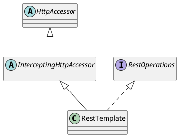
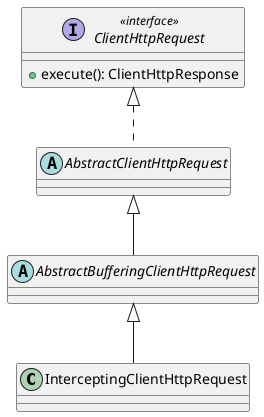

# SpringCloud-Ribbon负载均衡源码分析

> 本篇文章主要用于分析 SpringCloud 如何集成 Netflix Ribbon 实现客户端负载均衡，关于 `RestTemplate` 和 `Ribbon` 的简单介绍请参考 [RestTemplate&Ribbon](../../Spring全家桶/SpringCloudAlibaba/RestTemplate&Ribbon?id=ribbon) 文章。

## 如何使 RestTemplate 具备负载均衡的能力？

```java
@Bean
@LoadBalanced
public RestTemplate restTemplate() {
    return new RestTemplate();
}
```

咱们只需要在声明的 `RestTemplate` 组件上标注 `@LoadBalanced` 注解即可使得 `RestTemplate` 具备 `LoadBalanced` 负载均衡能力，那么它底层具体是如何实现的呢？这就是咱们今天探讨的主题。

### 入口

咱们通过 `RestTemplate` 的 `getForObject()` 方法发起一个请求，代码如下所示：

```java
@GetMapping
public String orderInfo() {
    URI uri = UriComponentsBuilder.fromHttpUrl("http://cloud-ribbon-server/order").build().toUri();
    return restTemplate.getForObject(uri, String.class);
}
```

其中的 `cloud-ribbon-server` 表示服务提供方的服务名，相信所有的小伙伴都知道发起一个请求需要知道**具体的 ip 地址端口号**，咱们这么写为什么能请求到数据？由此不难推测出在使用 `RestTemplate` 发送请求的时候其内部做了如下事情：

- 根据服务名从服务注册中心找到匹配的多个服务实例；
- 根据负载均衡算法选择一个合适的服务实例；
- 使用选择的服务实例的 ip 地址端口号替换掉请求中的服务名；

咱们就从 `RestTemplate` 的 `getForObject()` 方法开始分析 `RestTemplate` 发送请求的整个过程。

```java
public class RestTemplate extends InterceptingHttpAccessor implements RestOperations {
	@Override
	@Nullable
	public <T> T getForObject(URI url, Class<T> responseType) throws RestClientException {
		RequestCallback requestCallback = acceptHeaderRequestCallback(responseType);
		HttpMessageConverterExtractor<T> responseExtractor =
				new HttpMessageConverterExtractor<>(responseType, getMessageConverters(), logger);
		return execute(url, HttpMethod.GET, requestCallback, responseExtractor);
	}
    
    @Override
	@Nullable
	public <T> T execute(URI url, HttpMethod method, @Nullable RequestCallback requestCallback,
			@Nullable ResponseExtractor<T> responseExtractor) throws RestClientException {

		return doExecute(url, method, requestCallback, responseExtractor);
	}
    
    @Nullable
	protected <T> T doExecute(URI url, @Nullable HttpMethod method, @Nullable RequestCallback requestCallback,
			@Nullable ResponseExtractor<T> responseExtractor) throws RestClientException {

		Assert.notNull(url, "URI is required");
		Assert.notNull(method, "HttpMethod is required");
		ClientHttpResponse response = null;
		try {
            // 创建请求
			ClientHttpRequest request = createRequest(url, method);
			if (requestCallback != null) {
				requestCallback.doWithRequest(request);
			}
            // 执行请求
			response = request.execute();
            // 处理响应
			handleResponse(url, method, response);
			return (responseExtractor != null ? responseExtractor.extractData(response) : null);
		}
		catch (IOException ex) {
			String resource = url.toString();
			String query = url.getRawQuery();
			resource = (query != null ? resource.substring(0, resource.indexOf('?')) : resource);
			throw new ResourceAccessException("I/O error on " + method.name() +
					" request for \"" + resource + "\": " + ex.getMessage(), ex);
		}
		finally {
			if (response != null) {
				response.close();
			}
		}
	}
}
```

#### 创建请求

`RestTemplate` 继承自 `InterceptingHttpAccessor`，而 `InterceptingHttpAccessor` 又继承自 `HttpAccessor`，其继承体系图如下所示：



##### HttpAccessor

调用父类 `HttpAccessor` 中的 `createRequest()` 方法创建请求，方法定义如下所示：

```java
public abstract class HttpAccessor {
    private ClientHttpRequestFactory requestFactory = new SimpleClientHttpRequestFactory();

	private final List<ClientHttpRequestInitializer> clientHttpRequestInitializers = new ArrayList<>();
    
    protected ClientHttpRequest createRequest(URI url, HttpMethod method) throws IOException {
		ClientHttpRequest request = getRequestFactory().createRequest(url, method);
		initialize(request);
		if (logger.isDebugEnabled()) {
			logger.debug("HTTP " + method.name() + " " + url);
		}
		return request;
	}

	private void initialize(ClientHttpRequest request) {
		this.clientHttpRequestInitializers.forEach(initializer -> initializer.initialize(request));
	}
}
```

##### InterceptingHttpAccessor

使用工厂模式创建一个请求，将创建请求的细节全部放到工厂中，不过此处使用 `getRequestFactory()` 方法获取到的并不是 `SimpleClientHttpRequestFactory` 工厂实例，而是可用于创建带有**拦截器**的请求的 `InterceptingClientHttpRequestFactory` 工厂实例，因为在其子类 `InterceptingHttpAccessor` 中重写了该方法。如下所示：

```java
public abstract class InterceptingHttpAccessor extends HttpAccessor {
	private final List<ClientHttpRequestInterceptor> interceptors = new ArrayList<>();
    
    @Nullable
	private volatile ClientHttpRequestFactory interceptingRequestFactory;
    
    // 设置拦截器链
    public void setInterceptors(List<ClientHttpRequestInterceptor> interceptors) {
		Assert.noNullElements(interceptors, "'interceptors' must not contain null elements");
		// Take getInterceptors() List as-is when passed in here
		if (this.interceptors != interceptors) {
			this.interceptors.clear();
			this.interceptors.addAll(interceptors);
			AnnotationAwareOrderComparator.sort(this.interceptors);
		}
	}
    
    // 获取拦截器链
    public List<ClientHttpRequestInterceptor> getInterceptors() {
		return this.interceptors;
	}
    
    @Override
	public ClientHttpRequestFactory getRequestFactory() {
		List<ClientHttpRequestInterceptor> interceptors = getInterceptors();
        // 如果存在拦截器的话，则返回可用于创建带有拦截器的请求的工厂
		if (!CollectionUtils.isEmpty(interceptors)) {
			ClientHttpRequestFactory factory = this.interceptingRequestFactory;
			if (factory == null) {
				factory = new InterceptingClientHttpRequestFactory(super.getRequestFactory(), interceptors);
				this.interceptingRequestFactory = factory;
			}
			return factory;
		}
		else {
			return super.getRequestFactory();
		}
	}
}
```

##### InterceptingClientHttpRequestFactory

使用 `InterceptingClientHttpRequestFactory` 工厂中的 `createRequest()` 方法创建出来的请求为带有拦截器的 `InterceptingClientHttpRequest` 请求。如下所示：

```java
public class InterceptingClientHttpRequestFactory extends AbstractClientHttpRequestFactoryWrapper {
	private final List<ClientHttpRequestInterceptor> interceptors;
    
    public InterceptingClientHttpRequestFactory(ClientHttpRequestFactory requestFactory,
			@Nullable List<ClientHttpRequestInterceptor> interceptors) {

		super(requestFactory);
		this.interceptors = (interceptors != null ? interceptors : Collections.emptyList());
	}

	@Override
	protected ClientHttpRequest createRequest(URI uri, HttpMethod httpMethod, ClientHttpRequestFactory requestFactory) {
		return new InterceptingClientHttpRequest(requestFactory, this.interceptors, uri, httpMethod);
	}
}
```

---

咱们现在断点调试一下，看看是不是咱们所分析的这样？首先，启动应用，包括订单服务提供方（端口号分别为 `8080` 和 `8081`，不知道如何启动多个服务实例的小伙伴请先阅读 [RestTemplate&Ribbon](../../Spring全家桶/SpringCloudAlibaba/RestTemplate&Ribbon?id=服务提供方) 文章）、用户服务提供方（端口号分别为 `8090` 和 `8091`）一个服务消费方（端口号为 `8088`），如下所示：<br />

其中，订单服务提供方 `cloud-ribbon-server-order` 和用户服务提供方 `cloud-ribbon-server-user` 都分别有两个实例，如下所示：<br />

具体的 DEBUG 流程如下所示：

1. 在控制台中输入 `curl http://localhost:9000/order ` 命令之后会发送一个请求给服务消费方 `cloud-ribbon-consumer`；
2. 服务消费方在收到请求后，使用 `RestTemplate` 中的 `getForObject()` 方法开始发送一个请求 `http://cloud-ribbon-server/order` 给订单服务提供方；<br />
3. 最终会来到 `RestTemplate` 中的 `doExecute()` 方法，在 `doExecute()` 方法中首先会通过 `InterceptingClientHttpRequestFactory` 工厂创建一个带有拦截器的 `InterceptingClientHttpRequest` 请求；<br />
   1. `getRequestFactory()` 方法在其子类 `InterceptingHttpAccessor` 中被重写，返回的是 `InterceptingClientHttpRequestFactory` 类型的工厂；<br />
   2. 通过调用 `InterceptingClientHttpRequestFactory` 工厂中的 `createRequest()` 方法创建出一个带有拦截器的 `InterceptingClientHttpRequest` 请求；<br />

#### 执行请求

从上面的分析中可知，创建出来的请求是带有拦截器的 `InterceptingClientHttpRequest` 请求，现在来到执行请求这一步，这一步最为关键的点就是：分析一下底层到底是**如何将带有服务名的请求 `http://cloud-ribbon-server/order` 转换为真正带有具体 ip 地址端口号的请求**，即 `cloud-ribbon-server` ➡️ `ip:port`。

##### InterceptingClientHttpRequest

`InterceptingClientHttpRequest` 一路继承自 `AbstractBufferingClientHttpRequest` ➡️ `AbstractBufferingClientHttpRequest` ➡️ `AbstractClientHttpRequest`，其继承体系图如下所示：



在 `RestTemplate` 的 `doExecute()` 方法中，在创建完请求后，会调用请求的 `execute()` 方法来执行请求，对于 `InterceptingClientHttpRequest` 请求，兜兜转转最终会来到其 `executeInternal()` 方法，如下所示：

```java
class InterceptingClientHttpRequest extends AbstractBufferingClientHttpRequest {
	private final ClientHttpRequestFactory requestFactory;

	private final List<ClientHttpRequestInterceptor> interceptors;

	private HttpMethod method;

	private URI uri;
    
    @Override
	protected final ClientHttpResponse executeInternal(HttpHeaders headers, byte[] bufferedOutput) throws IOException {
		InterceptingRequestExecution requestExecution = new InterceptingRequestExecution();
		return requestExecution.execute(this, bufferedOutput);
	}
    
    private class InterceptingRequestExecution implements ClientHttpRequestExecution {

        // 当前请求中拦截器链的迭代器
		private final Iterator<ClientHttpRequestInterceptor> iterator;

		public InterceptingRequestExecution() {
			this.iterator = interceptors.iterator();
		}

		@Override
		public ClientHttpResponse execute(HttpRequest request, byte[] body) throws IOException {
            // 使用迭代器的方式依次遍历拦截器链
			if (this.iterator.hasNext()) {
				ClientHttpRequestInterceptor nextInterceptor = this.iterator.next();
                // 依次执行拦截器中的 intercept 方法，
                // 如 LoadBalancerInterceptor 拦截器中的 intercept 方法用于实现负载均衡的功能，将带有服务名的请求转换为真正带有具体 ip 地址端口号的请求
				return nextInterceptor.intercept(request, body, this);
			}
			else {
				HttpMethod method = request.getMethod();
				Assert.state(method != null, "No standard HTTP method");
                // 经过拦截器链后，此时 request.getURI() 获取出来的 URL 地址带有具体 ip 地址端口号
				ClientHttpRequest delegate = requestFactory.createRequest(request.getURI(), method);
				request.getHeaders().forEach((key, value) -> delegate.getHeaders().addAll(key, value));
				if (body.length > 0) {
					if (delegate instanceof StreamingHttpOutputMessage) {
						StreamingHttpOutputMessage streamingOutputMessage = (StreamingHttpOutputMessage) delegate;
						streamingOutputMessage.setBody(outputStream -> StreamUtils.copy(body, outputStream));
					}
					else {
						StreamUtils.copy(body, delegate.getBody());
					}
				}
                // 真正发送 http 请求
				return delegate.execute();
			}
		}
	}  
}
```

首先创建一个内部类 `InterceptingRequestExecution` 实例对象，然后调用其 `execute()` 方法执行请求，在该方法中，会使用迭代器的方式依次调用拦截器中的 `intercept()` 方法对请求进行拦截，当执行完所有拦截器中的 `intercept()` 方法之后，才拿着真正的 ip 地址端口号进行远程服务调用。

其中有一个有意思的点是：`nextInterceptor.intercept(request, body, this);` 在执行拦截器中的 `intercept()` 方法时，会将 `this` 也就是内部类 `InterceptingRequestExecution` 的实例对象当作参数进行传递，由此可以推测出，在后续的过程中，肯定会调用该实例对象的 `execute()` 方法回到此处，判断所有的拦截器是否都遍历过，如果存在没有遍历过的拦截器则执行该拦截器中的 `intercept()` 方法，如此这般，就形成了一个**拦截器链**，到最后，当拦截器链中的拦截器都已经遍历完，则拿着真正的 ip 地址端口号进行远程服务调用。

##### LoadBalancerInterceptor

```java
public class LoadBalancerInterceptor implements ClientHttpRequestInterceptor {    
    private LoadBalancerClient loadBalancer;

	private LoadBalancerRequestFactory requestFactory;
    
    @Override
	public ClientHttpResponse intercept(final HttpRequest request, final byte[] body,
			final ClientHttpRequestExecution execution) throws IOException {
        // 此时 request.getURI() 获取出来的 URL 地址为带有服务名的地址，如 http://cloud-ribbon-server/order
		final URI originalUri = request.getURI();
        // 从 URL 地址中获取出服务名，如 cloud-ribbon-server
		String serviceName = originalUri.getHost();
		Assert.state(serviceName != null,
				"Request URI does not contain a valid hostname: " + originalUri);
        // 此时的 LoadBalancerClient 为 RibbonLoadBalancerClient 的实例对象，在其内部会首先获取（创建）一个与服务名相关联的负载均衡器，然后负载均衡器根据负载均衡算法从服务列表中选择一个合适的服务实例
		return this.loadBalancer.execute(serviceName,
				this.requestFactory.createRequest(request, body, execution));
	}    
}
```

##### LoadBalancerRequestFactory

在上面负载均衡拦截器 `LoadBalancerInterceptor` 的 `intercept()` 方法中，最终会执行到 `LoadBalancerClient` 中的 `execute()` 方法，从该方法的定义可知，第一个参数为**服务名**，第二个参数需要传入一个 **`LoadBalancerRequest` 接口**类型的实现，该接口非常简单，如下所示：只存在一个方法定义（为什么没有标注 `@FunctionalInterface` 注解表明该接口是一个函数式接口呢？小声地说.）

```java
public interface LoadBalancerRequest<T> {
	T apply(ServiceInstance instance) throws Exception;
}
```

从上面可知，会将 `LoadBalancerRequestFactory` 中的 `createRequest()` 方法的返回值作为 `LoadBalancerClient` 中 `execute()` 方法的第二个参数，所以现在咱们就来看下该 `createRequest()` 方法，如下所示：是一个 Lambda 表达式，当执行接口中的 `apply()` 方法时，在该方法实现中会做以下两件事：

1. 将请求和选择的服务实例一起进行包装，构建出一个 `ServiceRequestWrapper` 类型的实例对象；
2. 回到 `RestTemplate` 内部类 `InterceptingRequestExecution` 中的 `execute()` 方法，继续执行拦截器链中剩余拦截器中的 `intercept()` 方法，或根据选择的服务实例（带有具体的 ip 地址端口号）替换掉请求中的服务名，执行真正的 http 请求；

```java
public class LoadBalancerRequestFactory {
	private LoadBalancerClient loadBalancer;

	private List<LoadBalancerRequestTransformer> transformers;

	public LoadBalancerRequestFactory(LoadBalancerClient loadBalancer,
			List<LoadBalancerRequestTransformer> transformers) {
		this.loadBalancer = loadBalancer;
		this.transformers = transformers;
	}

	public LoadBalancerRequestFactory(LoadBalancerClient loadBalancer) {
		this.loadBalancer = loadBalancer;
	}

	public LoadBalancerRequest<ClientHttpResponse> createRequest(
			final HttpRequest request, final byte[] body,
			final ClientHttpRequestExecution execution) {
		return instance -> {
            // 将请求和选择的服务实例一起进行包装，构建出一个 ServiceRequestWrapper 类型的实例对象
			HttpRequest serviceRequest = new ServiceRequestWrapper(request, instance,
					this.loadBalancer);
			if (this.transformers != null) {
				for (LoadBalancerRequestTransformer transformer : this.transformers) {
					serviceRequest = transformer.transformRequest(serviceRequest,
							instance);
				}
			}
            // 回到 RestTemplate 内部类 InterceptingRequestExecution 中的 execute() 方法，继续执行拦截器链中剩余拦截器中的 intercept() 方法，或根据选择的服务实例（带有具体的 ip 地址端口号）替换掉请求中的服务名，执行真正的 http 请求
			return execution.execute(serviceRequest, body);
		};
	}
}
```

##### LoadBalancerClient & RibbonLoadBanlancerClient

`LoadBalancerClient ` 接口定义如下所示：

```java
public interface LoadBalancerClient extends ServiceInstanceChooser {
    <T> T execute(String serviceId, LoadBalancerRequest<T> request) throws IOException;
    
    <T> T execute(String serviceId, ServiceInstance serviceInstance, LoadBalancerRequest<T> request) throws IOException;
    
    URI reconstructURI(ServiceInstance instance, URI original);   
}
```

其中，

- `execute()` ：使用来自负载均衡器的服务实例执行特定服务的请求。这意味着负载均衡器会选择一个适当的服务实例，然后执行请求。这是一种用于确保请求被均衡分发到不同服务实例的方法；
- `reconstructURI()`：创建一个具有真实 ip 地址端口号的 URI 以供系统使用，即用选择的服务实例中的 ip 地址端口号替换掉请求中的服务名称；

该接口又继承自 `ServiceInstanceChooser` 接口，因此又多具备一种能力：从负载均衡器中为指定的服务选择一个合适的服务实例。

```java
public interface ServiceInstanceChooser {
    ServiceInstance choose(String serviceId);
}
```

`LoadBalancerClient ` 接口作为 SpringCloud 与 Netflix Ribbon 之间的桥梁，是如何将原生 Ribbon 负载均衡的能力集成进来呢？咱们现在将目光聚焦到该接口目前唯一的实现 `RibbonLoadBanlancerClient` 上，关于该实现类，只需重点分析一下该类中的 `execute()` 方法即可，至于 `reconstructURI()` 和 `choose()` 方法不是比较简单就是在分析 `excute()` 方法时会顺带提到，因此不必做过多赘述！在 `execute()` 方法中主要干了三件事：

- [ ] 根据服务名获取（创建）对应负载均衡器；
- [ ] 负载均衡器根据负载均衡算法从服务列表中选择出一个合适的服务实例；
- [x] 执行 Lambda 表达式，也就是执行 `LoadBalancerRequestFactory` 中的 `createRequest()` 方法。
  - [x] 将请求和选择的服务实例一起进行包装，构建出一个 `ServiceRequestWrapper` 类型的实例对象；
  - [x] 回到 `RestTemplate` 内部类 `InterceptingRequestExecution` 中的 `execute()` 方法，继续执行拦截器链中剩余拦截器中的 `intercept()` 方法，或根据选择的服务实例（带有具体的 ip 地址端口号）替换掉请求中的服务名，执行真正的 http 请求；

> [!NOTE]
>
> 最上面两个重要的逻辑：【根据服务名获取（创建）对应负载均衡器的过程】+ 【负载均衡器是如何根据负载均衡算法从服务列表中选择出一个合适的服务实例的？】会在分析 Ribbon 配置隔离的原理时一并仔细分析！此时只是一笔带过而已。

```java
@Override
public <T> T execute(String serviceId, LoadBalancerRequest<T> request) throws IOException {
    return execute(serviceId, request, null);
}

public <T> T execute(String serviceId, LoadBalancerRequest<T> request, Object hint) throws IOException {
    // 根据服务名获取（创建）对应的负载均衡器，因为不同的服务可能配置不一样（配置隔离）
    ILoadBalancer loadBalancer = getLoadBalancer(serviceId);
    // 负载均衡器根据负载均衡算法从服务列表中选择一个合适的服务实例
    Server server = getServer(loadBalancer, hint);
    if (server == null) {
        throw new IllegalStateException("No instances available for " + serviceId);
    }
    // 将服务名和选择的服务实例一起进行包装，构建一个 RibbonServer 的实例对象
    RibbonServer ribbonServer = new RibbonServer(serviceId, server,
            isSecure(server, serviceId),
            serverIntrospector(serviceId).getMetadata(server));

    return execute(serviceId, ribbonServer, request);
}

@Override
public <T> T execute(String serviceId, ServiceInstance serviceInstance,
        LoadBalancerRequest<T> request) throws IOException {
    Server server = null;
    if (serviceInstance instanceof RibbonServer) {
        server = ((RibbonServer) serviceInstance).getServer();
    }
    if (server == null) {
        throw new IllegalStateException("No instances available for " + serviceId);
    }

    RibbonLoadBalancerContext context = this.clientFactory
            .getLoadBalancerContext(serviceId);
    RibbonStatsRecorder statsRecorder = new RibbonStatsRecorder(context, server);

    try {
        // 执行 Lambda 表达式
        // （1）将请求和选择的服务实例一起进行包装，构建出一个 ServiceRequestWrapper 类型的实例对象
        // （2）回到 RestTemplate 内部类 InterceptingRequestExecution 中的 execute() 方法，继续执行拦截器链中剩余拦截器中的 intercept() 方法，或根据选择的服务实例（带有具体的 ip 地址端口号）替换掉请求中的服务名，执行真正的 http 请求
        T returnVal = request.apply(serviceInstance);
        statsRecorder.recordStats(returnVal);
        return returnVal;
    }
    // catch IOException and rethrow so RestTemplate behaves correctly
    catch (IOException ex) {
        statsRecorder.recordStats(ex);
        throw ex;
    }
    catch (Exception ex) {
        statsRecorder.recordStats(ex);
        ReflectionUtils.rethrowRuntimeException(ex);
    }
    return null;
}

protected Server getServer(ILoadBalancer loadBalancer, Object hint) {
    if (loadBalancer == null) {
        return null;
    }
    // Use 'default' on a null hint, or just pass it on?
    return loadBalancer.chooseServer(hint != null ? hint : "default");
}

protected ILoadBalancer getLoadBalancer(String serviceId) {
    // 通过 SpringClientFactory 中的 getLoadBalancer() 方法获取（创建）一个与服务名相关联的负载均衡器实现
    return this.clientFactory.getLoadBalancer(serviceId);
}
```

在该方法中，会涉及到 Ribbon 中几个重要的组件，如下所示：

- 负载均衡器 `ILoadBalancer`：维护了一份服务实例清单，并对外提供添加服务实例、停止服务、过滤服务和根据负载均衡算法选择一个合适的服务实例的方法。<span style="background-color: rgb(251, 228, 231);">默认的</span>负载均衡器为 `ZoneAwareLoadBalancer`。

  ```java
  public interface ILoadBalancer {
      // 向负载均衡器维护的服务列表中添加新的服务实例
      public void addServers(List<Server> newServers);
      
      // 根据不同的负载均衡算法从维护的服务列表中选择一个合适的服务实例
      public Server chooseServer(Object key);
      
      // 标记某个服务实例已经停止服务，否则负载均衡器直至下一次获取服务实例清单前都会认为该服务实例都是正常可用的
      public void markServerDown(Server server);
      
      // 从维护的服务列表中过滤出满足条件的服务实例
      public List<Server> getServerList(boolean availableOnly);
      
      // 获取当前正常可用的服务实例集合
      public List<Server> getReachableServers();
      
      // 获取所有的服务实例，包括正常可用和停止工作的服务实例
      public List<Server> getAllServers();
  }
  ```

  其继承体系图如下所示：

  ```plantuml
  @startuml
  
  interface ILoadBalancer <<interface>> {
  	+ addServers(List<Server> newServers): void
  	+ chooseServer(Object key): Server
  	+ markServerDown(Server server): void
  	+ getServerList(boolean availableOnly): List<Server>
  	+ getReachableServers(): List<Server>
      + getAllServers(): List<Server>
  }
  
  abstract class AbstractLoadBalancer implements ILoadBalancer {}
  
  class BaseLoadBalancer extends AbstractLoadBalancer {}
  
  class DynamicServerListLoadBalancer<T extends Server> extends BaseLoadBalancer {}
  
  class ZoneAwareLoadBalancer<T extends Server> extends DynamicServerListLoadBalancer {}
  
  class NoOpLoadBalancer extends AbstractLoadBalancer {}
  
  @enduml
  ```

- 负载均衡策略 `IRule`，存在如下负载均衡策略：<span style="background-color: rgb(251, 228, 231);">默认的</span>负载均衡策略为 `ZoneAvoidanceRule`；

  ```plantuml
  @startuml
  
  interface IRule <<interface>> {}
  
  abstract class AbstractLoadBalancerRule implements IRule {}
  
  class ClientConfigEnabledRoundRobinRule extends AbstractLoadBalancerRule {}
  
  class BestAvailableRule extends ClientConfigEnabledRoundRobinRule {}
  
  abstract class PredicateBasedRule extends ClientConfigEnabledRoundRobinRule {}
  
  class AvailabilityFilteringRule extends PredicateBasedRule {}
  
  class ZoneAvoidanceRule extends PredicateBasedRule {}
  
  class RandomRule extends AbstractLoadBalancerRule {}
  
  class RetryRule extends AbstractLoadBalancerRule {}
  
  class RoundRobinRule extends AbstractLoadBalancerRule {}
  
  class WeightedResponseTimeRule extends RoundRobinRule {}
  
  @enduml
  ```

  | 策略类                    | 命名             | 描述                                                         |
  | ------------------------- | ---------------- | ------------------------------------------------------------ |
  | RandomRule                | 随机策略         | 从服务实例清单中随机选择一个服务实例的功能                   |
  | RoundRobinRule            | 轮询策略         | 以轮询的方式从服务实例清单中依次选择服务实例                 |
  | RetryRule                 | 重试策略         | 该策略实现了具备重试机制的实例选择功能                       |
  | BestAvailableRule         | 最低并发策略     | 选择一个并发请求量最少的服务实例                             |
  | AvailabilityFilteringRule | 可用过滤策略     | 过滤掉一直连接失败并被标记为 circuit tipped 的服务实例，过滤掉那些高并发连接的服务实例（active connections 超过配置的阀值，该阈值可以通过客户端的 `<clientName>.<nameSpace>.ActiveConnectionsLimit` 属性进行配置） |
  | WeightedResponseTimeRule  | 响应时间加权策略 | 根据服务实例的响应时间分配权重。响应时间越长，权重越低，被选择到的概率越低；响应时间越短，权重越高，被选择到的概率就越高。这个策略很贴切，综合了各种因素，如：网络、磁盘、CPU 等，这些因素都直接影响着响应时间 |
  | ZoneAvoidanceRule         | 区域权衡策略     | 综合判断服务器所在区域的性能和服务器的可用性来轮询选择服务实例，并且判断一个 Zone 的运行性能是否可用，剔除不可用的 Zone 中的所有服务实例 |

##### ServiceRequestWrapper

执行完 Lambda 表达式之后，回到 `RestTemplate` 内部类 `InterceptingRequestExecution` 中的 `execute()` 方法，从上面可以发现，拦截器链中只存在一个 `LoadBanlancerInterceptor` 类型的拦截器，并且已经执行过了，所以现在来到该方法的 `else` 逻辑部分，调用

## 参考资料

- 文档
  - [分析Ribbon源码，Ribbon在底层如何拉取服务列表、进行负载均衡选择并发起Http请求 | 帆的博客 (saily.top)](http://www.saily.top/2020/03/31/springcloud/ribbon01/)
  - [HanShu-Note/SpringCloud源码分析/Ribbon/万字长文浅析微服务Ribbon负载均衡源码.md at master · hanshuaikang/HanShu-Note (github.com)](https://github.com/hanshuaikang/HanShu-Note/blob/master/SpringCloud源码分析/Ribbon/万字长文浅析微服务Ribbon负载均衡源码.md)
  - [spring-cloud-netflix-ribbon 源码解析 - 吴振照 - 博客园 (cnblogs.com)](https://www.cnblogs.com/wuzhenzhao/p/13672916.html)
- 视频
  - [Spring Cloud Ribbon 源码解析](https://www.bilibili.com/video/BV1L14y1n72M/?spm_id_from=333.999.section.playall&vd_source=bf3d4320498e90d36e1361cc18b45e48)
