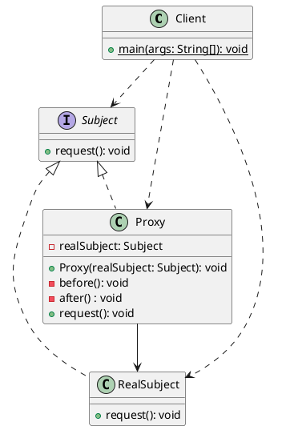

# 代理模式(Proxy)

## 定义

**代理模式**是一种<u><span style="background-color: rgb(232, 247, 207);">结构型</span></u>设计模式，为其他对象提供一种代理以控制对这个对象的访问。

使用代理模式主要有两个目的：一是**保护目标对象**，二是**增强目标对象**。

## 分类

- 静态代理：在程序运行前就已经存在代理类的字节码文件，代理类和委托类的关系在运行前就已经确定。针对每个目标类都需要单独写一个代理类，一旦接口中增加新的方法，目标类与代理类都需要进行修改，不满足开闭原则！
- **动态代理**：编译完后没有代理类的字节码文件，而是 **在运行时动态生成并加载到 JVM 中**。

### 静态代理

类图如下所示：


- Subject：顶层接口，RealSubject 和 Proxy 都需要实现该接口；
- RealSubject：目标类，或者说被代理类；
- **Proxy**：代理类，**代理类中持有被代理类对象的引用**，因此可以在不修改目标类对象的前提下，扩展目标类对象的功能；

[Java 代理模式讲解和代码示例](https://refactoringguru.cn/design-patterns/proxy/java/example#lang-features) 本案例演示如何使用静态代理模式为低效的第三方YouTube集成程序库中添加延迟初始化和缓存功能。

1. 顶层接口：ThirdPartyYouTubeLib，YouTube远程服务接口

   ```java
   public interface ThirdPartyYouTubeLib {
       /**
        * 获取热门视频
        *
        * @return 热门视频集合
        */
       Map<String, Video> popularVideos();
   
       /**
        * 根据视频id获取视频详细信息
        *
        * @param videoId 视频id
        * @return 视频详细信息
        */
       Video getVideo(String videoId);
   }
   ```
2. 目标类：ThirdPartyYouTubeLibClass，YouTube远程服务实现

   ```java
   public class ThirdPartyYouTubeLibClass implements ThirdPartyYouTubeLib {
       private static final Logger LOGGER = LoggerFactory.getLogger(ThirdPartyYouTubeLibClass.class);
   
       @Override
       public Map<String, Video> popularVideos() {
           LOGGER.info("-------------------------------");
           connectToServer("https://www.youtube.com");
           return getRandomVideos();
       }
   
       @Override
       public Video getVideo(String videoId) {
           LOGGER.info("-------------------------------");
           connectToServer("https://www.youtube.com/" + videoId);
           return getSomeVideo(videoId);
       }
   
       private Map<String, Video> getRandomVideos() {
           LOGGER.info("开始下载热门视频 ... ");
           experienceNetworkLatency();
           Map<String, Video> videoMap = new HashMap<>(5);
           videoMap.put("catzzzzzzzzz", new Video("sadgahasgdas", "Catzzzz.avi"));
           videoMap.put("mkafksangasj", new Video("mkafksangasj", "Dog play with ball.mp4"));
           videoMap.put("dancesvideoo", new Video("asdfas3ffasd", "Dancing video.mpq"));
           videoMap.put("dlsdk5jfslaf", new Video("dlsdk5jfslaf", "Barcelona vs RealM.mov"));
           videoMap.put("3sdfgsd1j333", new Video("3sdfgsd1j333", "Programing lesson#1.avi"));
           LOGGER.info("Done!");
           return videoMap;
       }
   
       private Video getSomeVideo(String videoId) {
           LOGGER.info("开始下载 {} 视频... ", videoId);
           experienceNetworkLatency();
           Video video = new Video(videoId, "Some video title");
           LOGGER.info("Done!");
           return video;
       }
   
       private int random(int min, int max) {
           return min + (int) (Math.random() * ((max - min) + 1));
       }
   
       /**
        * 模拟网络延迟
        */
       private void experienceNetworkLatency() {
           int randomLatency = random(5, 10);
           for (int i = 0; i < randomLatency; i++) {
               try {
                   Thread.sleep(100);
               } catch (InterruptedException ex) {
                   ex.printStackTrace();
               }
           }
       }
   
       private void connectToServer(String server) {
           LOGGER.info("Connecting to {} ... ", server);
           experienceNetworkLatency();
           LOGGER.info("Connected!");
       }
   }
   ```
3. 代理类：YouTubeCacheProxy，缓存代理，同样实现 YouTube远程服务接口，在其内部持有一个被代理类对象的引用，通过构造方法注入被代理类实例对象；为了实现缓存的功能，在其内部定义两个集合作为热门视频和全部视频的缓存池。

   ```java
   public class YouTubeCacheProxy implements ThirdPartyYouTubeLib {
       private static final Logger LOGGER = LoggerFactory.getLogger(YouTubeCacheProxy.class);
       private final ThirdPartyYouTubeLib thirdPartyYouTubeLib;
       private final Map<String, Video> cacheAll = new HashMap<>();
       private Map<String, Video> cachePopular = new HashMap<>();
   
       public YouTubeCacheProxy(ThirdPartyYouTubeLib thirdPartyYouTubeLib) {
           this.thirdPartyYouTubeLib = thirdPartyYouTubeLib;
       }
   
       @Override
       public Map<String, Video> popularVideos() {
           if (cachePopular.isEmpty()) {
               cachePopular = thirdPartyYouTubeLib.popularVideos();
           } else {
               LOGGER.info("从缓存中下载热门视频");
           }
           return cachePopular;
       }
   
       @Override
       public Video getVideo(String videoId) {
           Video video = cacheAll.get(videoId);
           if (video == null) {
               video = thirdPartyYouTubeLib.getVideo(videoId);
               cacheAll.put(videoId, video);
           } else {
               LOGGER.info("从缓存中下载 {} 视频... ", videoId);
           }
           return video;
       }
   }
   ```
4. 媒体下载应用：调用YouTube远程服务接口获取热门视频或单独某个视频并渲染

   ```java
   public class YouTubeDownloader {
       private static final Logger LOGGER = LoggerFactory.getLogger(YouTubeDownloader.class);
   
       private final ThirdPartyYouTubeLib thirdPartyYouTubeLib;
   
       public YouTubeDownloader(ThirdPartyYouTubeLib thirdPartyYouTubeLib) {
           this.thirdPartyYouTubeLib = thirdPartyYouTubeLib;
       }
   
       public void renderVideoPage(String videoId) {
           Video video = thirdPartyYouTubeLib.getVideo(videoId);
           LOGGER.info("渲染视频详情页面");
           LOGGER.info("ID: {}", video.getId());
           LOGGER.info("Title: {}", video.getTitle());
           LOGGER.info("Video: {}", video.getData());
           LOGGER.info("-------------------------------\n");
       }
   
       public void renderPopularVideos() {
           Map<String, Video> list = thirdPartyYouTubeLib.popularVideos();
           LOGGER.info("渲染热门视频专栏页面");
           for (Video video : list.values()) {
               LOGGER.info("ID: {}  / Title: {}", video.getId(), video.getTitle());
           }
           LOGGER.info("-------------------------------\n");
       }
   }
   ```
5. 客户端：Client，通过媒体下载应用分别对两种YouTube远程服务实现进行测试，比较原生实现与缓存代理具体耗时时间

   ```java
   class ApiTest {
       private static final Logger LOGGER = LoggerFactory.getLogger(ApiTest.class);
   
       @Test
       public void test_00() {
           ThirdPartyYouTubeLib thirdPartyYouTubeLib = new ThirdPartyYouTubeLibClass();
           YouTubeDownloader naiveDownloader = new YouTubeDownloader(thirdPartyYouTubeLib);
           YouTubeDownloader smartDownloader =
           new YouTubeDownloader(new YouTubeCacheProxy(thirdPartyYouTubeLib));
       
           long naive = test(naiveDownloader);
           LOGGER.info(
               "--------------------------------------------------------------------------------\n");
           long smart = test(smartDownloader);
           LOGGER.info("通过缓存代理可以节约 {} ms", (naive - smart));
       }
   
       private long test(YouTubeDownloader downloader) {
           long startTime = System.currentTimeMillis();
   
           // 应用中的用户行为如下：
           downloader.renderPopularVideos();
           downloader.renderVideoPage("catzzzzzzzzz");
           downloader.renderPopularVideos();
           downloader.renderVideoPage("dancesvideoo");
           // 用户有可能会经常访问同一个页面
           downloader.renderVideoPage("catzzzzzzzzz");
           downloader.renderVideoPage("someothervid");
       
           long estimatedTime = System.currentTimeMillis() - startTime;
           LOGGER.info("测试总共耗时 {} ms", estimatedTime);
           return estimatedTime;
       }
   }
   ```

   测试结果如下所示：由结果可知，如果用户越多次访问相同的页面，缓存代理的价值就越大！

   ```
   2023-05-10 16:51:08.709 [main] INFO  f.x.d.p.s.ThirdPartyYouTubeLibClass:73 - Connecting to https://www.youtube.com ... 
   2023-05-10 16:51:09.249 [main] INFO  f.x.d.p.s.ThirdPartyYouTubeLibClass:75 - Connected!
   2023-05-10 16:51:09.249 [main] INFO  f.x.d.p.s.ThirdPartyYouTubeLibClass:34 - 开始下载热门视频 ... 
   2023-05-10 16:51:10.337 [main] INFO  f.x.d.p.s.ThirdPartyYouTubeLibClass:42 - Done!
   2023-05-10 16:51:10.338 [main] INFO  f.x.d.p.s.YouTubeDownloader:35 - 渲染热门视频专栏页面
   2023-05-10 16:51:10.338 [main] INFO  f.x.d.p.s.YouTubeDownloader:37 - ID: mkafksangasj  / Title: Dog play with ball.mp4
   2023-05-10 16:51:10.338 [main] INFO  f.x.d.p.s.YouTubeDownloader:37 - ID: sadgahasgdas  / Title: Catzzzz.avi
   2023-05-10 16:51:10.338 [main] INFO  f.x.d.p.s.YouTubeDownloader:37 - ID: asdfas3ffasd  / Title: Dancing video.mpq
   2023-05-10 16:51:10.339 [main] INFO  f.x.d.p.s.YouTubeDownloader:37 - ID: dlsdk5jfslaf  / Title: Barcelona vs RealM.mov
   2023-05-10 16:51:10.339 [main] INFO  f.x.d.p.s.YouTubeDownloader:37 - ID: 3sdfgsd1j333  / Title: Programing lesson#1.avi
   2023-05-10 16:51:10.339 [main] INFO  f.x.d.p.s.YouTubeDownloader:39 - -------------------------------
   2023-05-10 16:51:10.339 [main] INFO  f.x.d.p.s.ThirdPartyYouTubeLibClass:28 - -------------------------------
   2023-05-10 16:51:10.339 [main] INFO  f.x.d.p.s.ThirdPartyYouTubeLibClass:73 - Connecting to https://www.youtube.com/catzzzzzzzzz ... 
   2023-05-10 16:51:11.316 [main] INFO  f.x.d.p.s.ThirdPartyYouTubeLibClass:75 - Connected!
   2023-05-10 16:51:11.317 [main] INFO  f.x.d.p.s.ThirdPartyYouTubeLibClass:47 - 开始下载 catzzzzzzzzz 视频... 
   2023-05-10 16:51:12.404 [main] INFO  f.x.d.p.s.ThirdPartyYouTubeLibClass:50 - Done!
   2023-05-10 16:51:12.406 [main] INFO  f.x.d.p.s.YouTubeDownloader:26 - 渲染视频详情页面
   2023-05-10 16:51:12.406 [main] INFO  f.x.d.p.s.YouTubeDownloader:27 - ID: catzzzzzzzzz
   2023-05-10 16:51:12.406 [main] INFO  f.x.d.p.s.YouTubeDownloader:28 - Title: Some video title
   2023-05-10 16:51:12.406 [main] INFO  f.x.d.p.s.YouTubeDownloader:29 - Video: Random video.
   2023-05-10 16:51:12.406 [main] INFO  f.x.d.p.s.YouTubeDownloader:30 - -------------------------------
   2023-05-10 16:51:12.406 [main] INFO  f.x.d.p.s.ThirdPartyYouTubeLibClass:21 - -------------------------------
   2023-05-10 16:51:12.406 [main] INFO  f.x.d.p.s.ThirdPartyYouTubeLibClass:73 - Connecting to https://www.youtube.com ... 
   2023-05-10 16:51:13.167 [main] INFO  f.x.d.p.s.ThirdPartyYouTubeLibClass:75 - Connected!
   2023-05-10 16:51:13.167 [main] INFO  f.x.d.p.s.ThirdPartyYouTubeLibClass:34 - 开始下载热门视频 ... 
   2023-05-10 16:51:14.254 [main] INFO  f.x.d.p.s.ThirdPartyYouTubeLibClass:42 - Done!
   2023-05-10 16:51:14.254 [main] INFO  f.x.d.p.s.YouTubeDownloader:35 - 渲染热门视频专栏页面
   2023-05-10 16:51:14.254 [main] INFO  f.x.d.p.s.YouTubeDownloader:37 - ID: mkafksangasj  / Title: Dog play with ball.mp4
   2023-05-10 16:51:14.254 [main] INFO  f.x.d.p.s.YouTubeDownloader:37 - ID: sadgahasgdas  / Title: Catzzzz.avi
   2023-05-10 16:51:14.254 [main] INFO  f.x.d.p.s.YouTubeDownloader:37 - ID: asdfas3ffasd  / Title: Dancing video.mpq
   2023-05-10 16:51:14.254 [main] INFO  f.x.d.p.s.YouTubeDownloader:37 - ID: dlsdk5jfslaf  / Title: Barcelona vs RealM.mov
   2023-05-10 16:51:14.255 [main] INFO  f.x.d.p.s.YouTubeDownloader:37 - ID: 3sdfgsd1j333  / Title: Programing lesson#1.avi
   2023-05-10 16:51:14.255 [main] INFO  f.x.d.p.s.YouTubeDownloader:39 - -------------------------------
   2023-05-10 16:51:14.255 [main] INFO  f.x.d.p.s.ThirdPartyYouTubeLibClass:28 - -------------------------------
   2023-05-10 16:51:14.255 [main] INFO  f.x.d.p.s.ThirdPartyYouTubeLibClass:73 - Connecting to https://www.youtube.com/dancesvideoo ... 
   2023-05-10 16:51:15.013 [main] INFO  f.x.d.p.s.ThirdPartyYouTubeLibClass:75 - Connected!
   2023-05-10 16:51:15.014 [main] INFO  f.x.d.p.s.ThirdPartyYouTubeLibClass:47 - 开始下载 dancesvideoo 视频... 
   2023-05-10 16:51:16.094 [main] INFO  f.x.d.p.s.ThirdPartyYouTubeLibClass:50 - Done!
   2023-05-10 16:51:16.095 [main] INFO  f.x.d.p.s.YouTubeDownloader:26 - 渲染视频详情页面
   2023-05-10 16:51:16.095 [main] INFO  f.x.d.p.s.YouTubeDownloader:27 - ID: dancesvideoo
   2023-05-10 16:51:16.095 [main] INFO  f.x.d.p.s.YouTubeDownloader:28 - Title: Some video title
   2023-05-10 16:51:16.095 [main] INFO  f.x.d.p.s.YouTubeDownloader:29 - Video: Random video.
   2023-05-10 16:51:16.097 [main] INFO  f.x.d.p.s.YouTubeDownloader:30 - -------------------------------
   2023-05-10 16:51:16.097 [main] INFO  f.x.d.p.s.ThirdPartyYouTubeLibClass:28 - -------------------------------
   2023-05-10 16:51:16.097 [main] INFO  f.x.d.p.s.ThirdPartyYouTubeLibClass:73 - Connecting to https://www.youtube.com/catzzzzzzzzz ... 
   2023-05-10 16:51:16.963 [main] INFO  f.x.d.p.s.ThirdPartyYouTubeLibClass:75 - Connected!
   2023-05-10 16:51:16.963 [main] INFO  f.x.d.p.s.ThirdPartyYouTubeLibClass:47 - 开始下载 catzzzzzzzzz 视频... 
   2023-05-10 16:51:17.832 [main] INFO  f.x.d.p.s.ThirdPartyYouTubeLibClass:50 - Done!
   2023-05-10 16:51:17.832 [main] INFO  f.x.d.p.s.YouTubeDownloader:26 - 渲染视频详情页面
   2023-05-10 16:51:17.832 [main] INFO  f.x.d.p.s.YouTubeDownloader:27 - ID: catzzzzzzzzz
   2023-05-10 16:51:17.832 [main] INFO  f.x.d.p.s.YouTubeDownloader:28 - Title: Some video title
   2023-05-10 16:51:17.832 [main] INFO  f.x.d.p.s.YouTubeDownloader:29 - Video: Random video.
   2023-05-10 16:51:17.832 [main] INFO  f.x.d.p.s.YouTubeDownloader:30 - -------------------------------
   2023-05-10 16:51:17.832 [main] INFO  f.x.d.p.s.ThirdPartyYouTubeLibClass:28 - -------------------------------
   2023-05-10 16:51:17.832 [main] INFO  f.x.d.p.s.ThirdPartyYouTubeLibClass:73 - Connecting to https://www.youtube.com/someothervid ... 
   2023-05-10 16:51:18.482 [main] INFO  f.x.d.p.s.ThirdPartyYouTubeLibClass:75 - Connected!
   2023-05-10 16:51:18.482 [main] INFO  f.x.d.p.s.ThirdPartyYouTubeLibClass:47 - 开始下载 someothervid 视频... 
   2023-05-10 16:51:19.135 [main] INFO  f.x.d.p.s.ThirdPartyYouTubeLibClass:50 - Done!
   2023-05-10 16:51:19.135 [main] INFO  f.x.d.p.s.YouTubeDownloader:26 - 渲染视频详情页面
   2023-05-10 16:51:19.135 [main] INFO  f.x.d.p.s.YouTubeDownloader:27 - ID: someothervid
   2023-05-10 16:51:19.135 [main] INFO  f.x.d.p.s.YouTubeDownloader:28 - Title: Some video title
   2023-05-10 16:51:19.135 [main] INFO  f.x.d.p.s.YouTubeDownloader:29 - Video: Random video.
   2023-05-10 16:51:19.135 [main] INFO  f.x.d.p.s.YouTubeDownloader:30 - -------------------------------
   2023-05-10 16:51:19.135 [main] INFO  f.x.d.p.ApiTest:46 - 测试总共耗时 10430 ms
   2023-05-10 16:51:19.135 [main] INFO  f.x.d.p.ApiTest:28 - --------------------------------------------------------------------------------
   2023-05-10 16:51:19.135 [main] INFO  f.x.d.p.s.ThirdPartyYouTubeLibClass:21 - -------------------------------
   2023-05-10 16:51:19.137 [main] INFO  f.x.d.p.s.ThirdPartyYouTubeLibClass:73 - Connecting to https://www.youtube.com ... 
   2023-05-10 16:51:20.227 [main] INFO  f.x.d.p.s.ThirdPartyYouTubeLibClass:75 - Connected!
   2023-05-10 16:51:20.230 [main] INFO  f.x.d.p.s.ThirdPartyYouTubeLibClass:34 - 开始下载热门视频 ... 
   2023-05-10 16:51:21.314 [main] INFO  f.x.d.p.s.ThirdPartyYouTubeLibClass:42 - Done!
   2023-05-10 16:51:21.314 [main] INFO  f.x.d.p.s.YouTubeDownloader:35 - 渲染热门视频专栏页面
   2023-05-10 16:51:21.314 [main] INFO  f.x.d.p.s.YouTubeDownloader:37 - ID: mkafksangasj  / Title: Dog play with ball.mp4
   2023-05-10 16:51:21.314 [main] INFO  f.x.d.p.s.YouTubeDownloader:37 - ID: sadgahasgdas  / Title: Catzzzz.avi
   2023-05-10 16:51:21.315 [main] INFO  f.x.d.p.s.YouTubeDownloader:37 - ID: asdfas3ffasd  / Title: Dancing video.mpq
   2023-05-10 16:51:21.315 [main] INFO  f.x.d.p.s.YouTubeDownloader:37 - ID: dlsdk5jfslaf  / Title: Barcelona vs RealM.mov
   2023-05-10 16:51:21.315 [main] INFO  f.x.d.p.s.YouTubeDownloader:37 - ID: 3sdfgsd1j333  / Title: Programing lesson#1.avi
   2023-05-10 16:51:21.315 [main] INFO  f.x.d.p.s.YouTubeDownloader:39 - -------------------------------
   
   2023-05-10 16:51:21.315 [main] INFO  f.x.d.p.s.ThirdPartyYouTubeLibClass:28 - -------------------------------
   2023-05-10 16:51:21.315 [main] INFO  f.x.d.p.s.ThirdPartyYouTubeLibClass:73 - Connecting to https://www.youtube.com/catzzzzzzzzz ... 
   2023-05-10 16:51:22.088 [main] INFO  f.x.d.p.s.ThirdPartyYouTubeLibClass:75 - Connected!
   2023-05-10 16:51:22.088 [main] INFO  f.x.d.p.s.ThirdPartyYouTubeLibClass:47 - 开始下载 catzzzzzzzzz 视频... 
   2023-05-10 16:51:23.068 [main] INFO  f.x.d.p.s.ThirdPartyYouTubeLibClass:50 - Done!
   2023-05-10 16:51:23.068 [main] INFO  f.x.d.p.s.YouTubeDownloader:26 - 渲染视频详情页面
   2023-05-10 16:51:23.068 [main] INFO  f.x.d.p.s.YouTubeDownloader:27 - ID: catzzzzzzzzz
   2023-05-10 16:51:23.068 [main] INFO  f.x.d.p.s.YouTubeDownloader:28 - Title: Some video title
   2023-05-10 16:51:23.068 [main] INFO  f.x.d.p.s.YouTubeDownloader:29 - Video: Random video.
   2023-05-10 16:51:23.068 [main] INFO  f.x.d.p.s.YouTubeDownloader:30 - -------------------------------
   
   2023-05-10 16:51:23.069 [main] INFO  f.x.d.p.s.YouTubeCacheProxy:31 - 从缓存中下载热门视频
   2023-05-10 16:51:23.069 [main] INFO  f.x.d.p.s.YouTubeDownloader:35 - 渲染热门视频专栏页面
   2023-05-10 16:51:23.069 [main] INFO  f.x.d.p.s.YouTubeDownloader:37 - ID: mkafksangasj  / Title: Dog play with ball.mp4
   2023-05-10 16:51:23.069 [main] INFO  f.x.d.p.s.YouTubeDownloader:37 - ID: sadgahasgdas  / Title: Catzzzz.avi
   2023-05-10 16:51:23.069 [main] INFO  f.x.d.p.s.YouTubeDownloader:37 - ID: asdfas3ffasd  / Title: Dancing video.mpq
   2023-05-10 16:51:23.069 [main] INFO  f.x.d.p.s.YouTubeDownloader:37 - ID: dlsdk5jfslaf  / Title: Barcelona vs RealM.mov
   2023-05-10 16:51:23.069 [main] INFO  f.x.d.p.s.YouTubeDownloader:37 - ID: 3sdfgsd1j333  / Title: Programing lesson#1.avi
   2023-05-10 16:51:23.069 [main] INFO  f.x.d.p.s.YouTubeDownloader:39 - -------------------------------
   
   2023-05-10 16:51:23.069 [main] INFO  f.x.d.p.s.ThirdPartyYouTubeLibClass:28 - -------------------------------
   2023-05-10 16:51:23.069 [main] INFO  f.x.d.p.s.ThirdPartyYouTubeLibClass:73 - Connecting to https://www.youtube.com/dancesvideoo ... 
   2023-05-10 16:51:24.043 [main] INFO  f.x.d.p.s.ThirdPartyYouTubeLibClass:75 - Connected!
   2023-05-10 16:51:24.044 [main] INFO  f.x.d.p.s.ThirdPartyYouTubeLibClass:47 - 开始下载 dancesvideoo 视频... 
   2023-05-10 16:51:24.801 [main] INFO  f.x.d.p.s.ThirdPartyYouTubeLibClass:50 - Done!
   2023-05-10 16:51:24.801 [main] INFO  f.x.d.p.s.YouTubeDownloader:26 - 渲染视频详情页面
   2023-05-10 16:51:24.801 [main] INFO  f.x.d.p.s.YouTubeDownloader:27 - ID: dancesvideoo
   2023-05-10 16:51:24.802 [main] INFO  f.x.d.p.s.YouTubeDownloader:28 - Title: Some video title
   2023-05-10 16:51:24.802 [main] INFO  f.x.d.p.s.YouTubeDownloader:29 - Video: Random video.
   2023-05-10 16:51:24.802 [main] INFO  f.x.d.p.s.YouTubeDownloader:30 - -------------------------------
   
   2023-05-10 16:51:24.802 [main] INFO  f.x.d.p.s.YouTubeCacheProxy:43 - 从缓存中下载 catzzzzzzzzz 视频... 
   2023-05-10 16:51:24.802 [main] INFO  f.x.d.p.s.YouTubeDownloader:26 - 渲染视频详情页面
   2023-05-10 16:51:24.802 [main] INFO  f.x.d.p.s.YouTubeDownloader:27 - ID: catzzzzzzzzz
   2023-05-10 16:51:24.802 [main] INFO  f.x.d.p.s.YouTubeDownloader:28 - Title: Some video title
   2023-05-10 16:51:24.803 [main] INFO  f.x.d.p.s.YouTubeDownloader:29 - Video: Random video.
   2023-05-10 16:51:24.803 [main] INFO  f.x.d.p.s.YouTubeDownloader:30 - -------------------------------
   
   2023-05-10 16:51:24.803 [main] INFO  f.x.d.p.s.ThirdPartyYouTubeLibClass:28 - -------------------------------
   2023-05-10 16:51:24.803 [main] INFO  f.x.d.p.s.ThirdPartyYouTubeLibClass:73 - Connecting to https://www.youtube.com/someothervid ... 
   2023-05-10 16:51:25.344 [main] INFO  f.x.d.p.s.ThirdPartyYouTubeLibClass:75 - Connected!
   2023-05-10 16:51:25.345 [main] INFO  f.x.d.p.s.ThirdPartyYouTubeLibClass:47 - 开始下载 someothervid 视频... 
   2023-05-10 16:51:25.998 [main] INFO  f.x.d.p.s.ThirdPartyYouTubeLibClass:50 - Done!
   2023-05-10 16:51:25.998 [main] INFO  f.x.d.p.s.YouTubeDownloader:26 - 渲染视频详情页面
   2023-05-10 16:51:25.998 [main] INFO  f.x.d.p.s.YouTubeDownloader:27 - ID: someothervid
   2023-05-10 16:51:25.998 [main] INFO  f.x.d.p.s.YouTubeDownloader:28 - Title: Some video title
   2023-05-10 16:51:25.998 [main] INFO  f.x.d.p.s.YouTubeDownloader:29 - Video: Random video.
   2023-05-10 16:51:25.998 [main] INFO  f.x.d.p.s.YouTubeDownloader:30 - -------------------------------
   
   2023-05-10 16:51:25.998 [main] INFO  f.x.d.p.ApiTest:46 - 测试总共耗时 6863 ms
   2023-05-10 16:51:25.998 [main] INFO  f.x.d.p.ApiTest:30 - 通过缓存代理可以节约 3567 ms
   ```

静态代理实现步骤如下:

1. 定义顶层接口 Subject；
2. 定义实现类/目标类 RealSubject，实现顶层接口 Subject；
3. 定义代理类 Proxy，同样实现顶层接口 Subject，并在代理类中需要定义一个被代理类对象的引用，在使用时将目标类对象通过构造方法注入进来，在调用代理类对象中的方法时实际上是调用目标类对应的方法，不过在目标方法执行前后增加额外功能实现增强目标类对象方法功能的目的，此过程对于用户而言是不可见的；

### 动态代理

动态代理与静态代理的基本思路一致，只不过动态代理功能更加强大，随着业务的扩展适应性更强。

#### JDK

> [!NOTE]
>
> **要求目标类必须实现某个接口**，如果没有的话，则会抛出异常！因为代理类已经继承自 Proxy，而 Java 不允许多继承，但允许某个类实现多个接口。

>[!IMPORTANT]
>
>JDK 动态代理实现原理：**代理类与目标类实现相同的接口**。

实现方式：位于 Java.lang.reflect 包下，一般仅涉及 `Java.lang.reflect.Proxy` 类与 `InvocationHandler` 接口，两者配合反射技术即可实现动态代理的操作。常使用 `Proxy` 类中的 `newProxyInstance()` 静态方法产生代理对象：

```java
public static Object newProxyInstance(ClassLoader loader, Class<?>[] interfaces,  InvocationHandler h)
```

三个参数的含义依次为：

   1. ClassLoader loader：目标类的类加载器；

   2. Class<?>[] interfaces：目标类实现的接口数组；

   3. InvocationHandler h：调用处理器，每一个代理对象都会关联一个 `InvocationHandler` 接口的实现类（如果需要额外的参数可以提供构造方法），当一个方法伴随代理对象被调用时，就会被自动转移为对处理器中重写的 `invoke()` 扩展方法的调用。

      ```java
      public interface InvocationHandler {
          public Object invoke(Object proxy, Method method, Object[] args) throws Throwable;
      }
      ```

       1. proxy: 代理类的实例对象；
       2. method：要调用的真实业务的处理方法；
       3. args：调用真实业务处理方法时所需要的参数；

将代理类 YouTubeCacheProxy 使用 JDK 动态代理的方式实现：
```java
public class JdkYouTubeCacheProxy implements InvocationHandler {
    private static final Logger LOGGER = LoggerFactory.getLogger(YouTubeCacheProxy2.class);
    private static final Map<String, Video> cacheAll = new HashMap<>();
    private static Map<String, Video> cachePopular = new HashMap<>();
    private ThirdPartyYouTubeLib thirdPartyYouTubeLib;

    public ThirdPartyYouTubeLib bind(ThirdPartyYouTubeLib thirdPartyYouTubeLib) {
        this.thirdPartyYouTubeLib = thirdPartyYouTubeLib;
        return (ThirdPartyYouTubeLib)
                Proxy.newProxyInstance(
                    thirdPartyYouTubeLib.getClass().getClassLoader(),
                    thirdPartyYouTubeLib.getClass().getInterfaces(),
                    this);
    }

    @Override
    public Object invoke(Object proxy, Method method, Object[] args) throws Throwable {
        String methodName = method.getName();
        if ("popularVideos".equals(methodName)) {
            if (cachePopular.isEmpty()) {
                cachePopular = (Map<String, Video>) method.invoke(thirdPartyYouTubeLib, args);
            } else {
                LOGGER.info("从缓存中下载热门视频");
            }
            return cachePopular;
        } else if ("getVideo".equals(methodName)) {
            String videoId = (String) args[0];
            Video video = cacheAll.get(videoId);
            if (video == null) {
                video = (Video) method.invoke(thirdPartyYouTubeLib, args);
                cacheAll.put(videoId, video);
            } else {
                LOGGER.info("从缓存中下载 {} 视频... ", videoId);
            }
            return video;
        }
        return method.invoke(thirdPartyYouTubeLib, args);
    }
}
```
增加新的测试方法，使用 JDK 动态代理的方式产生代理对象
```java
@Test
public void test_01() {
    ThirdPartyYouTubeLib thirdPartyYouTubeLib = new ThirdPartyYouTubeLibClass();
    ThirdPartyYouTubeLib proxy = new JdkYouTubeCacheProxy().getProxy(thirdPartyYouTubeLib);
    YouTubeDownloader naiveDownloader = new YouTubeDownloader(thirdPartyYouTubeLib);
    YouTubeDownloader smartDownloader = new YouTubeDownloader(proxy);

    long naive = test(naiveDownloader);
    LOGGER.info(
            "--------------------------------------------------------------------------------\n");
    long smart = test(smartDownloader);
    LOGGER.info("通过缓存代理可以节约 {} ms", (naive - smart));
}
```
可以发现测试结果与使用静态代理时一致！

#### CGLIB

> [!IMPORTANT]
>
> CGLIB 动态代理实现原理：**代理类继承自目标类，重写目标类中的方法**，所以对于**被 final 修饰的类或方法无法进行代理**，CGLIB是通过 ASM 来操作字节码生成代理类；

实现方式：需要额外引入 `cglib` 依赖，在 CGLIB 动态代理机制中 `Enhancer` 类和 `MethodInterceptor` 接口是核心。

   1. 先创建 `Enhancer` 实例对象；

   2. 设置 superClass 属性为目标类.class，指定代理类继承的父类是谁；

   3. 设置 callback 属性为其子类 `MethodInterceptor` 类型的实例对象，需要实现 `MethodInterceptor` 接口并重写 `intercept()` 方法，其中的 `intercept()` 方法用于拦截（增强）被代理类的方法。

      ```java
      public interface MethodInterceptor extends Callback {
      	public Object intercept(Object obj, java.lang.reflect.Method method, Object[] args, MethodProxy methodProxy) throws Throwable;
      }
      ```

         1. 当使用 `methodProxy.invoke(obj, args)` 时，不断递归调用代理对象中的该方法直至产生 StackOverflow 异常！
         2. 当使用 `methodProxy.invokeSuper(target, args)` 时，会产生 ClassCastException 异常！
         3. 只有使用 `methodProxy.invoke(target, args)` 或者 `methodProxy.invokeSuper(obj, args)` 时才会调用目标对象中的原始方法，等价于 `method.invoke(target, args)`；
         4. 最后调用 create() 方法创建代理对象；

将代理类 YouTubeCacheProxy 使用 CGLIB 动态代理的方式实现：
```java
public class CglibYouTubeCacheProxy {
    private static final Logger LOGGER = LoggerFactory.getLogger(CglibYouTubeCacheProxy.class);
    private static final Map<String, Video> cacheAll = new HashMap<>();
    private static Map<String, Video> cachePopular = new HashMap<>();

    public ThirdPartyYouTubeLibClass getProxy(ThirdPartyYouTubeLibClass thirdPartyYouTubeLib) {
        Enhancer enhancer = new Enhancer();
        enhancer.setSuperclass(thirdPartyYouTubeLib.getClass());
        enhancer.setCallbacks(new Callback[]{
                (MethodInterceptor) (obj, method, args, methodProxy) -> {
                    if (cachePopular.isEmpty()) {
                        cachePopular = (Map<String, Video>) methodProxy.invokeSuper(obj, args);
                    } else {
                        LOGGER.info("从缓存中下载热门视频");
                    }
                    return cachePopular;
                },
                (MethodInterceptor) (obj, method, args, methodProxy) -> {
                    String videoId = (String) args[0];
                    Video video = cacheAll.get(videoId);
                    if (video == null) {
                        video = (Video) methodProxy.invokeSuper(obj, args);
                        cacheAll.put(videoId, video);
                    } else {
                        LOGGER.info("从缓存中下载 {} 视频... ", videoId);
                    }
                    return video;
                }
        });
        enhancer.setCallbackFilter(method -> {
            if ("popularVideos".equals(method.getName())) {
                return 0;
            } else {
                return 1;
            }
        });
        return (ThirdPartyYouTubeLibClass) enhancer.create();
    }
}
```
增加新的测试方法，使用 CGLIB 动态代理的方式产生代理对象
```java
@Test
public void test_02() {
    ThirdPartyYouTubeLibClass thirdPartyYouTubeLib = new ThirdPartyYouTubeLibClass();
    YouTubeDownloader naiveDownloader = new YouTubeDownloader(thirdPartyYouTubeLib);
    YouTubeDownloader smartDownloader =
        new YouTubeDownloader(new YouTubeCacheProxy3().bind(thirdPartyYouTubeLib));
    
    long naive = test(naiveDownloader);
    LOGGER.info(
        "--------------------------------------------------------------------------------\n");
    long smart = test(smartDownloader);
    LOGGER.info("通过缓存代理可以节约 {} ms", (naive - smart));
}
```
在运行测试方法前，需要增加如下 VM 选项，否则的话会抛出`module java.base does not “opens java.lang“ to unnamed module`异常！
```
--add-opens java.base/java.lang=ALL-UNNAMED
```
可以发现测试结果与使用静态代理时一致！

## 进阶-源码分析

### JDK

#### 查看生成的代理类

>[!NOTE]
>
>要想输出动态生成的代理类的 `class` 文件，必须保证如下条件：
>
>1. 必须是在 `main` 方法中，在测试方法中是不生效的！
>
>2. 在 `main` 方法首行添加 `System.setProperty("sun.misc.ProxyGenerator.saveGeneratedFiles", "true");` 代码，该属性与 JDK 版本有关（在 JDK11 版本中该属性为 `jdk.proxy.ProxyGenerator.saveGeneratedFiles`），不确定的话可以查看 `ProxyGenerator` 类中的 `saveGeneratedFiles` 属性进行确定，只有当该属性值为 `true` 时，才会输出动态生成的代理类的 `class` 文件，如下所示：<br />
>
>   当添加以上代码后并没有看到生成的代理类的 `class` 文件，则使用如下方式：添加 JVM 参数 `-Dsun.misc.ProxyGenerator.saveGeneratedFiles=true`<br />


JDK 动态生成的代理类如下所示：可以看到**代理类继承自 `Proxy` 并且实现了与被代理类相同的接口**。

```java
public final class $Proxy2 extends Proxy implements ThirdPartyYouTubeLib {
    private static Method m1;
    private static Method m4;
    private static Method m3;
    private static Method m2;
    private static Method m0;

    public $Proxy2(InvocationHandler var1) throws  {
        super(var1);
    }

    public final boolean equals(Object var1) throws  {
        try {
            return (Boolean)super.h.invoke(this, m1, new Object[]{var1});
        } catch (RuntimeException | Error var3) {
            throw var3;
        } catch (Throwable var4) {
            throw new UndeclaredThrowableException(var4);
        }
    }

    public final Video getVideo(String var1) throws  {
        try {
            return (Video)super.h.invoke(this, m4, new Object[]{var1});
        } catch (RuntimeException | Error var3) {
            throw var3;
        } catch (Throwable var4) {
            throw new UndeclaredThrowableException(var4);
        }
    }

    public final Map popularVideos() throws  {
        try {
            return (Map)super.h.invoke(this, m3, (Object[])null);
        } catch (RuntimeException | Error var2) {
            throw var2;
        } catch (Throwable var3) {
            throw new UndeclaredThrowableException(var3);
        }
    }

    public final String toString() throws  {
        try {
            return (String)super.h.invoke(this, m2, (Object[])null);
        } catch (RuntimeException | Error var2) {
            throw var2;
        } catch (Throwable var3) {
            throw new UndeclaredThrowableException(var3);
        }
    }

    public final int hashCode() throws  {
        try {
            return (Integer)super.h.invoke(this, m0, (Object[])null);
        } catch (RuntimeException | Error var2) {
            throw var2;
        } catch (Throwable var3) {
            throw new UndeclaredThrowableException(var3);
        }
    }

    static {
        try {
            m1 = Class.forName("java.lang.Object").getMethod("equals", Class.forName("java.lang.Object"));
            m4 = Class.forName("fun.xiaorang.designpattern.proxy.statics.ThirdPartyYouTubeLib").getMethod("getVideo", Class.forName("java.lang.String"));
            m3 = Class.forName("fun.xiaorang.designpattern.proxy.statics.ThirdPartyYouTubeLib").getMethod("popularVideos");
            m2 = Class.forName("java.lang.Object").getMethod("toString");
            m0 = Class.forName("java.lang.Object").getMethod("hashCode");
        } catch (NoSuchMethodException var2) {
            throw new NoSuchMethodError(var2.getMessage());
        } catch (ClassNotFoundException var3) {
            throw new NoClassDefFoundError(var3.getMessage());
        }
    }
}
```

#### 代理类是如何生成的？

从上面动态生成的代理类源码中看出，**生成的代理类继承自 `Proxy` 类并实现与被代理类相同的接口**。

在 `Proxy` 类中，咱们最熟悉的一个方法可能就是 `newProxyInstance()`，**生成并返回一个代理对象**。在 `newProxyInstance()` 方法中最为关键的几行代码如下所示：

```java
public static Object newProxyInstance(ClassLoader loader, Class<?>[] interfaces, InvocationHandler h) throws IllegalArgumentException {
	...
	// 生成代理类
	Class<?> cl = getProxyClass0(loader, intfs);
	// 根据代理类获取构造方法
	final Constructor<?> cons = cl.getConstructor(InvocationHandler.class);
	// 通过代理类的构造器创建代理对象并返回，传入 InvocationHandler 参数
	return cons.newInstance(new Object[]{h});  
	...
}
```

关于反射是如何使用在此处就不再赘述。此处关键点就在于 **`getProxyClass0()`** 方法是如何生成一个代理类的？ 

```java
private static final WeakCache<ClassLoader, Class<?>[], Class<?>> proxyClassCache = new WeakCache<>(new KeyFactory(), new ProxyClassFactory());

private static Class<?> getProxyClass0(ClassLoader loader, Class<?>... interfaces) {   
	// 如果缓存中存在给定类加载器和接口的代理类（唯一标识，多次调用时重复创建相同的代理类），则直接从缓存中取；否则的话，将通过代理类工厂 ProxyClassFactory 创建代理类
	return proxyClassCache.get(loader, interfaces);  
}
```

来到 `WeakCache` 类的 `get()` 方法中，如下所示：

```java
public V get(K key, P parameter) {  
    Objects.requireNonNull(parameter);  
    expungeStaleEntries();  
    Object cacheKey = CacheKey.valueOf(key, refQueue);  
  
    // 通过类加载器,获取已加载过的接口元数据和代理类工厂(ProxyClassFactory)
    // 其中，map 中的 key = 接口元数据，value = 代理类工厂(作用: 创建代理类)
    ConcurrentMap<Object, Supplier<V>> valuesMap = map.get(cacheKey);
    // 初始化操作，如果是第一次，则创建一个空的 Map  
    if (valuesMap == null) {  
        ConcurrentMap<Object, Supplier<V>> oldValuesMap  
            = map.putIfAbsent(cacheKey,  
                              valuesMap = new ConcurrentHashMap<>());  
        if (oldValuesMap != null) {  
            valuesMap = oldValuesMap;  
        }  
    }  
  
    // 将所有接口进行hash生成唯一标识   
    Object subKey = Objects.requireNonNull(subKeyFactory.apply(key, parameter)); 
    // 通过唯一标识尝试性获取代理类工厂(ProxyClassFactory) 
    Supplier<V> supplier = valuesMap.get(subKey);  
    Factory factory = null;  
  
    while (true) {
	    // 第一次并不存在代理类工厂，所以不满足条件，走下面的代码生成代理类工厂，第一次循环结束。第二次才会满足条件  
        if (supplier != null) {  
            // 从代理类工厂中获取代理类并返回
            V value = supplier.get();  
            if (value != null) {  
                return value;  
            }  
        }  
        // 创建一个代理类工厂       
        if (factory == null) {  
            factory = new Factory(key, parameter, subKey, valuesMap);  
        }  
  
        if (supplier == null) {
	        // 将代理类工厂放入缓存中  
            supplier = valuesMap.putIfAbsent(subKey, factory);  
            if (supplier == null) {  
                // 已经创建好代理类工厂，为第二次循环做准备，在第二次循环时，可以通过代理类工厂获取代理类 
                supplier = factory;  
            }  
        } else {
	        // 代理类工厂的重试机制
	        // 当从代理类工厂中获取出的代理类为空时，则用新创建的代理类工厂替换掉缓存中旧的代理类工厂
	        // 然后再用新的代理类工厂去创建代理类
            if (valuesMap.replace(subKey, supplier, factory)) {  
                supplier = factory;  
            } else {  
                supplier = valuesMap.get(subKey);  
            }  
        }  
    }  
}
```

##### 细节分析 1：Proxy.KeyFactory

作用：通过对所有的接口进行 hash 操作生成唯一标识，用来对应代理类工厂。

```java
private static final class KeyFactory implements BiFunction<ClassLoader, Class<?>[], Object> {  
    @Override  
    public Object apply(ClassLoader classLoader, Class<?>[] interfaces) {  
        switch (interfaces.length) {  
            case 1: return new Key1(interfaces[0]); // the most frequent  
            case 2: return new Key2(interfaces[0], interfaces[1]);  
            case 0: return key0;  
            default: return new KeyX(interfaces);  
        }  
    }  
}
```

##### 细节分析 2：Proxy.ProxyClassFactory

作用：真正**生成代理类**的地方。

```java
private static final class ProxyClassFactory implements BiFunction<ClassLoader, Class<?>[], Class<?>> {  
    // 所有代理类名称的前缀 
    private static final String proxyClassNamePrefix = "$Proxy";  
  
    // 用于生成唯一代理类名称的下一个数字  
    private static final AtomicLong nextUniqueNumber = new AtomicLong();
    
	@Override
	public Class<?> apply(ClassLoader loader, Class<?>[] interfaces) {
		// 要生成的代理类的名称
	    long num = nextUniqueNumber.getAndIncrement();  
	    String proxyName = proxyPkg + proxyClassNamePrefix + num;
	    // 生成动态代理类的字节码文件.即$Proxy.class  
	    byte[] proxyClassFile = ProxyGenerator.generateProxyClass(proxyName, interfaces, accessFlags);  
	    try { 
		    // 将字节码文件加载到JVM虚拟机内存中，返回生成的代理类 
	        return defineClass0(loader, proxyName, proxyClassFile, 0, proxyClassFile.length);  
	    } catch (ClassFormatError e) {  
	        throw new IllegalArgumentException(e.toString());  
	    }  
	}
}
```

##### 细节分析 3：ProxyGenerator

在该类中最重要的一个方法 **`generateProxyClass`**，**生成并返回代理类的字节码信息**。如果 `saveGeneratedFiles` 标识为 `true`，即 JVM 参数 `sun.misc.ProxyGenerator.saveGeneratedFiles` 为 `true` 的话（这也就是上面查看生成的代理类中为啥要加该 JVM 参数的原因），则可以使用 I/O 流将字节码保存到本地文件 `$Proxy{num}.class` 中。

```java
private static final boolean saveGeneratedFiles = (Boolean)AccessController.doPrivileged(new GetBooleanAction("sun.misc.ProxyGenerator.saveGeneratedFiles"));

public static byte[] generateProxyClass(final String var0, Class<?>[] var1, int var2) {  
    ProxyGenerator var3 = new ProxyGenerator(var0, var1, var2); 
    // 生成字节码文件，返回字节数组
    final byte[] var4 = var3.generateClassFile();
    // 将生成的字节码,使用I/O流保存到本地文件  
    if (saveGeneratedFiles) {  
        AccessController.doPrivileged(new PrivilegedAction<Void>() {  
            public Void run() {  
                try {  
                    int var1 = var0.lastIndexOf(46);  
                    Path var2;  
                    if (var1 > 0) {  
                        Path var3 = Paths.get(var0.substring(0, var1).replace('.', File.separatorChar));  
                        Files.createDirectories(var3);  
                        var2 = var3.resolve(var0.substring(var1 + 1, var0.length()) + ".class");  
                    } else {  
                        var2 = Paths.get(var0 + ".class");  
                    }  
  
                    Files.write(var2, var4, new OpenOption[0]);  
                    return null;               
                } catch (IOException var4x) {  
                    throw new InternalError("I/O exception saving generated file: " + var4x);  
                }  
            }  
        });  
    }  
    return var4;  
}
```

#### 代理类使用的整体流程

以 `getVideo()` 方法为例，在上面案例的测试类代码中，会调用代理类中的 `getVideo()` 方法，现在让咱们来看看代理类中 `getVideo()` 方法的具体实现，如下所示：

```java
public final Video getVideo(String var1) throws  {
    try {
        return (Video)super.h.invoke(this, m4, new Object[]{var1});
    } catch (RuntimeException | Error var3) {
        throw var3;
    } catch (Throwable var4) {
        throw new UndeclaredThrowableException(var4);
    }
}
```

从上面的代码中可以看到，**调用了父类 `Proxy` 中 `InvocationHandler` 接口成员变量的 `invoke()` 方法**（也就是咱们重写的 `invoke()` 方法）。传入的参数依次是代理类本身，`getVideo()` 方法所对应的 `Method` 对象，`getVideo()` 方法的入参。 

其中，有一个关键的点在于咱们使用 Proxy 类中的 `newProxyInstance()` 方法时，利用代理类的构造器创建代理类对象时，构造器传入的参数为 `InvocationHandler` 实现。

```java
public $Proxy2(InvocationHandler var1) throws  {
    super(var1);
}
```

在代理类的构造器中，又调用父类的构造器，将 `InvocationHandler` 实现传给父类，让父类 `Proxy` 中的的成员变量 `h` 接收，所以代理类的 `getVideo()` 才可以直接执行父类中成员变量 `h` 的 `invoke()` 方法。  

以上就是代理类使用的整个流程，从生成代理类 ➡️ 执行代理类中的方法。

### CGLIB

#### 查看生成的代理类

在测试类的 `main` 方法中加入如下代码即可，至于原因在后面的源码分析中会说。

```java
System.setProperty(DEBUG_LOCATION_PROPERTY, new File("").getAbsolutePath() + "/cglib");
```

点击运行就可以在当前项目目录下的 cglib 目录中找到动态生成的代理类的 class 文件，如下所示：<br />

可以看到与 JDK 生成的代理类不同的是，Cglib 生成的 class 文件有三个，依次往下分别是**代理类**、**代理类的 FastClass 类**和**被代理类的 FastClass 类**。

Cglib 动态生成的代理类如下所示 (仅截取部分重要的代码)：可以看到**生成的代理类是继承自被代理类**的。需要注意的是💡：**被 `final` 修饰的类或方法是无法被代理的**。

```java
public class ThirdPartyYouTubeLibClass$$EnhancerByCGLIB$$682a47a2 extends ThirdPartyYouTubeLibClass implements ThirdPartyYouTubeLib, Factory {
    private boolean CGLIB$BOUND;
    public static Object CGLIB$FACTORY_DATA;
    private static final ThreadLocal CGLIB$THREAD_CALLBACKS;
    private static final Callback[] CGLIB$STATIC_CALLBACKS;
    private MethodInterceptor CGLIB$CALLBACK_0;
    private MethodInterceptor CGLIB$CALLBACK_1;
    private static Object CGLIB$CALLBACK_FILTER;
    private static final Method CGLIB$getVideo$0$Method;
    private static final MethodProxy CGLIB$getVideo$0$Proxy;
    private static final Object[] CGLIB$emptyArgs;
    private static final Method CGLIB$popularVideos$1$Method;
    private static final MethodProxy CGLIB$popularVideos$1$Proxy;

    
    static void CGLIB$STATICHOOK1() {
        CGLIB$THREAD_CALLBACKS = new ThreadLocal();
        CGLIB$emptyArgs = new Object[0];
        // var0 = 代理类  
        Class var0 = Class.forName("fun.xiaorang.designpattern.proxy.statics.ThirdPartyYouTubeLibClass$$EnhancerByCGLIB$$682a47a2");
        // var1 = 被代理类  
        Class var1;
        Method[] var10000  = ReflectUtils.findMethods(new String[]{"getVideo", "(Ljava/lang/String;)Lfun/xiaorang/designpattern/proxy/statics/Video;", "popularVideos", "()Ljava/util/Map;"}, (var1 = Class.forName("fun.xiaorang.designpattern.proxy.statics.ThirdPartyYouTubeLibClass")).getDeclaredMethods());
        CGLIB$getVideo$0$Method = var10000[0];
        CGLIB$getVideo$0$Proxy = MethodProxy.create(var1, var0, "(Ljava/lang/String;)Lfun/xiaorang/designpattern/proxy/statics/Video;", "getVideo", "CGLIB$getVideo$0");
        CGLIB$popularVideos$1$Method = var10000[1];
        CGLIB$popularVideos$1$Proxy = MethodProxy.create(var1, var0, "()Ljava/util/Map;", "popularVideos", "CGLIB$popularVideos$1");
    }
    
    final Video CGLIB$getVideo$0(String var1) {
        return super.getVideo(var1);
    }

    public final Video getVideo(String var1) {
        MethodInterceptor var10000 = this.CGLIB$CALLBACK_1;
        if (var10000 == null) {
            CGLIB$BIND_CALLBACKS(this);
            var10000 = this.CGLIB$CALLBACK_1;
        }
        return var10000 != null ? (Video)var10000.intercept(this, CGLIB$getVideo$0$Method, new Object[]{var1}, CGLIB$getVideo$0$Proxy) : super.getVideo(var1);
    }

    final Map CGLIB$popularVideos$1() {
        return super.popularVideos();
    }

    public final Map popularVideos() {
        MethodInterceptor var10000 = this.CGLIB$CALLBACK_0;
        if (var10000 == null) {
            CGLIB$BIND_CALLBACKS(this);
            var10000 = this.CGLIB$CALLBACK_0;
        }
        return var10000 != null ? (Map)var10000.intercept(this, CGLIB$popularVideos$1$Method, CGLIB$emptyArgs, CGLIB$popularVideos$1$Proxy) : super.popularVideos();
    }
    
    public static MethodProxy CGLIB$findMethodProxy(Signature var0) {
        String var10000 = var0.toString();
        switch (var10000.hashCode()) {
            case -508378822:
                if (var10000.equals("clone()Ljava/lang/Object;")) {
                    return CGLIB$clone$5$Proxy;
                }
                break;
            case 149185808:
                if (var10000.equals("getVideo(Ljava/lang/String;)Lfun/xiaorang/designpattern/proxy/statics/Video;")) {
                    return CGLIB$getVideo$0$Proxy;
                }
                break;
            case 472997241:
                if (var10000.equals("popularVideos()Ljava/util/Map;")) {
                    return CGLIB$popularVideos$1$Proxy;
                }
                break;
            case 1826985398:
                if (var10000.equals("equals(Ljava/lang/Object;)Z")) {
                    return CGLIB$equals$2$Proxy;
                }
                break;
            case 1913648695:
                if (var10000.equals("toString()Ljava/lang/String;")) {
                    return CGLIB$toString$3$Proxy;
                }
                break;
            case 1984935277:
                if (var10000.equals("hashCode()I")) {
                    return CGLIB$hashCode$4$Proxy;
                }
        }
        return null;
    }
    
    // 代理类的构造方法
    public ThirdPartyYouTubeLibClass$$EnhancerByCGLIB$$682a47a2() {
        CGLIB$BIND_CALLBACKS(this);
    }

    public static void CGLIB$SET_THREAD_CALLBACKS(Callback[] var0) {
        CGLIB$THREAD_CALLBACKS.set(var0);
    }

    public static void CGLIB$SET_STATIC_CALLBACKS(Callback[] var0) {
        CGLIB$STATIC_CALLBACKS = var0;
    }

    private static final void CGLIB$BIND_CALLBACKS(Object var0) {
        ThirdPartyYouTubeLibClass$$EnhancerByCGLIB$$682a47a2 var1 = (ThirdPartyYouTubeLibClass$$EnhancerByCGLIB$$682a47a2)var0;
        // 初始化操作，只执行一次
        if (!var1.CGLIB$BOUND) {
            var1.CGLIB$BOUND = true;
             // 从 ThreadLocal 中获取 CALLBACKS
            Object var10000 = CGLIB$THREAD_CALLBACKS.get();
            if (var10000 == null) {
                // 如果获取不到，则使用 CGLIB$STATIC_CALLBACKS  
                var10000 = CGLIB$STATIC_CALLBACKS;
                if (var10000 == null) {
                    return;
                }
            }
            Callback[] var10001 = (Callback[])var10000;
            var1.CGLIB$CALLBACK_1 = (MethodInterceptor)((Callback[])var10000)[1];
            // CALLBACKS中的第一个方法拦截器赋值给 CGLIB$CALLBACK_0
            var1.CGLIB$CALLBACK_0 = (MethodInterceptor)var10001[0];
        }
    }
    
    static {
        CGLIB$STATICHOOK1();
    }
}
```

<span style="background-color: rgb(251, 228, 231);">TODO</span>

### Cglib 与 JDK 动态代理对比

1. **JDK 动态代理生成的代理类实现了与被代理类相同的接口，而 Cglib 代理生成的代理类则继承自被代理类**。
2. JDK 动态代理与 Cglib 动态代理都是在运行期生成字节码文件，JDK 动态代理直接写 Class 字节码，Cglib 动态代理使用 ASM 框架写 Class 字节码，Cglib 动态代理实现更复杂，生成代理类比 JDK 动态代理效率低。
3. **JDK 动态代理调用代理方法是通过反射机制调用的**，**Cglib 代理是通过 FastClass 机制直接调用方法的**。在 JDK8 版本之后，JDK 动态代理的效率是高于 Cglib 的，随着每一次 JDK 版本升级，JDK 动态代理效率都有所提升，而 Cglib 则有点跟不上步伐了。
