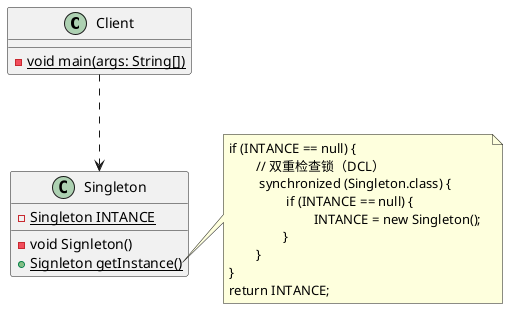

# 单例模式(Singleton)

**单例模式**是一种<span style="background-color: rgb(251, 228, 231);">创建型</span>设计模式，用于确保**一个类任何情况下都绝对只有一个实例**，并提供**一个全局访问点**。

## 类图



## 实现方式

### 饿汉式

所有单例的实现都包含以下两个相同的步骤：

- **将默认构造函数设为私有**，防止其他对象使用单例类的`new`运算符；
- **新建一个静态方法作为全局访问点**，该静态方法会返回一个被<u>`final`</u>修饰的**静态成员变量**（当前类的实例对象）；

特点：饿汉式单例模式在**类加载**的时候就会**创建**一个单例对象并保存在一个静态成员变量中，所以它绝对**线程安全**。<br />优缺点：

- 优点：没有加任何锁，执行效率比较高，用户体验比[懒汉式](#懒汉式)单例模式更好；
- 缺点：类加载的时候就会初始化，不管用不用都会占用空间，浪费内存；

代码实现：

1. 创建一个简单的实体类 HungrySingleton

```java
public class HungrySingleton {
    private static final HungrySingleton INSTANCE = new HungrySingleton();

    private HungrySingleton() {
        // 私有构造函数
    }

    public static HungrySingleton getInstance() {
        return INSTANCE;
    }
}
```

2. 创建一个测试类 ApiTest

```java
class ApiTest {
    private static final Logger LOGGER = LoggerFactory.getLogger(ApiTest.class);

    @Test
    public void test_00() {
        HungrySingleton hungrySingleton1 = HungrySingleton.getInstance();
        HungrySingleton hungrySingleton2 = HungrySingleton.getInstance();
        LOGGER.info("{}", hungrySingleton1);
        LOGGER.info("{}", hungrySingleton2);
    }
}
```

测试结果如下所示：<br /><br />在上面的代码中，

- 使用一个私有的构造函数来限制 HungrySingleton 类被实例化；
- 定义一个被 final 修饰的静态成员变量 INSTANCE，该静态成员变量只在第一次加载 HungrySingleton 类时才被初始化，而且在之后都不会被修改；
- 静态方法 getInstance() 直接返回静态变量 INSTANCE，用于保证该类只会存在一个实例对象；

### 懒汉式

特点：等到第一次被外部类调用的时候才会去创建实例，也就是在`getInstance()`方法里面去判断和创建。

```java
public class LazySingleton {
    private static LazySingleton INSTANCE;

    private LazySingleton() {
        // 私有构造函数
    }

    public static LazySingleton getInstance() {
        if (INSTANCE == null) {
            INSTANCE = new LazySingleton();
        }
        return INSTANCE;
    }
}
```

在测试类 ApiTest 中增加如下测试方法：

```java
@Test
public void test_01() {
    Runnable runnable = () -> {
        LazySingleton instance = LazySingleton.getInstance();
        LOGGER.info("{}：{}", Thread.currentThread().getName(), instance);
    };
    Thread t1 = new Thread(runnable);
    Thread t2 = new Thread(runnable);
    t1.start();
    t2.start();
}
```

在进行多次测试的时候发现两个线程中的 LazySingleton 实例对象并**不相等**，也就意味着使用懒汉式实现的单例模式存在线程安全问题，即**线程不安全**。<br />

### 双重检查锁

🤔 鉴于懒汉式单例模式**线程不安全**，那么该如何优化代码？使得懒汉式单例模式在多线程环境下安全呢！<br />🤓 给`getInstance()`方法加上`synchronized`关键字，使该方法变成线程同步方法。

```java
public class LazySyncSingleton {
    private static LazySyncSingleton INSTANCE;

    private LazySyncSingleton() {
        // 私有构造函数
    }

    public synchronized static LazySyncSingleton getInstance() {
        if (INSTANCE == null) {
            INSTANCE = new LazySyncSingleton();
        }
        return INSTANCE;
    }
}
```

在测试类 ApiTest 中增加如下测试方法：

```java
@Test
public void test_02() {
    Runnable runnable = () -> {
        LazySyncSingleton instance = LazySyncSingleton.getInstance();
        LOGGER.info("{}：{}", Thread.currentThread().getName(), instance);
    };
    Thread t1 = new Thread(runnable);
    Thread t2 = new Thread(runnable);
    t1.start();
    t2.start();
}
```

以 DEBUG 的方式运行测试方法，当执行其中一个线程并调用`getInstance()`方法时，另一个线程再调用`getInstance()`方法，线程的状态由`RUNNING` => `MONITOR`，出现阻塞。直到第一个线程执行完，第二个线程才恢复到`RUNNING`状态并继续调用`getInstance()`方法。如下图所示：<br /><br /><br />上图完美地展现了`synchronized`监视锁的运行状态，线程的安全问题解决了。但是，用`synchronized`加锁时，在线程数量比较多的情况下，如果 CPU 分配压力上升，则会导致大批线程阻塞，从而导致程序性能大幅下降。那么，有没有一种更好的方式呢？既能兼顾线程安全又能提升程序性能呢？答案是肯定的，使用**双重检查锁（DCL）**的方式实现单例模式：

```java
public class LazyDoubleCheckSingleton {
    private static volatile LazyDoubleCheckSingleton INSTANCE;

    private LazyDoubleCheckSingleton() {
        // 私有构造函数
    }

    public static LazyDoubleCheckSingleton getInstance() {
        if (INSTANCE == null) {
            synchronized (LazyDoubleCheckSingleton.class) {
                if (INSTANCE == null) {
                    INSTANCE = new LazyDoubleCheckSingleton();
                }
            }
        }
        return INSTANCE;
    }
}
```

> [!IMPORTANT]
>
> 双重检查锁的实现会使用一个关键字 `volatile`，它的意思是：被 `volatile` 修饰的变量的值，将不会被本地线程缓存，所有对该变量的读写都是直接操作共享内存，从而确保多个线程能正确的处理该变量。
>
> 由于 `volatile` 关键字可能会屏蔽虚拟机中一些必要的代码优化，所以运行效率并不是很高。因此一般建议，没有特别的需要，不要使用。也就是说，虽然可以使用双重检查锁机制来实现线程安全的单例，但并不建议大量采用，可以根据情况来选用。

在测试类 ApiTest 中增加如下测试方法：

```java
@Test
public void test_03() {
    Runnable runnable = () -> {
        LazyDoubleCheckSingleton instance = LazyDoubleCheckSingleton.getInstance();
        LOGGER.info("{}：{}", Thread.currentThread().getName(), instance);
    };
    Thread t1 = new Thread(runnable);
    Thread t2 = new Thread(runnable);
    t1.start();
    t2.start();
}
```

发现不管运行多少次，两个线程中的 LazyDoubleCheckSingleton 实例对象总是同一个，说明使用**双重检查锁（DCL）**的方式实现单例模式可以保障**线程安全**。<br />

### 静态内部类

> [!NOTE|label:相应的基础知识]
>
> 1. 类级内部类：
>    1. 什么是类级内部类？简单点说，类级内部类指的是，由`static`修饰的成员内部类。如果没有`static`修饰的成员内部类被称为对象级内部类；
>    2. 类级内部类相当于其外部类的`static`成分，它的对象与外部类对象间不存在依赖关系，因此可以直接创建。而对象级内部类的实例，是绑定在外部对象实例中的。
>    3. 类级内部类中，可以定义静态的方法。在静态方法中只能够引用外部类中的静态成员方法或者成员变量；
>    4. 类级内部类相当于其外部类的成员，只有在第一次被使用的时候才会被装载；
> 2. 多线程缺省同步锁：大家都知道，在多线程开发中，为了解决并发问题，主要是通过使用`synchronized`关键字来加互斥锁进行同步控制。但是在某些情况下，JVM 已经隐含地为你执行了同步，这些情况就不用自己再来进行同步控制。包括：
>    1. 由静态初始化器（在静态字段上或`static`代码块中的初始化器）初始化数据时；
>    2. 访问`final`字段时
>    3. 在创建线程之前创建对象时
>    4. 线程可以看见它将要处理的对象时

> [!IMPORTANT|label:解决方案思路]
>
> 要想简单地实现线程安全，可以采用静态初始化器的方式，它可以由 JVM 来保证线程的安全性，比如前面的饿汉式实现方式。但是这样一来，不是会浪费一定的空间吗？因为这种实现方式，会在类加载的时候就初始化对象，不管你需不需要。如果现在有一种方法能够让类加载的时候不去初始化对象，那不就解决问题了？一种可行的方式就是采用类级内部类，在这个类级内部类里面去创建对象实例。这样一来，只要不使用到这个类级内部类，那就不会创建对象实例，从而同时实现**延迟加载**和**线程安全**。

细心的小伙伴可能会发现，当我们把鼠标放在**双重检查锁**的第一个 if 上时，会出现如下提示，点击之后代码会自动变成**静态内部类**的这种方式。<br /><br />使用**静态内部类**实现单例模式这种方式，兼顾了**饿汉式浪费内存**和`synchronized`**的性能问题**，完美地屏蔽了这两个缺点。<br />内部类一定会在方法调用之前进行初始化的，用一种非常巧妙的方式避免了线程安全的问题！

```java
public class LazyStaticInnerSingleton implements Serializable {
    private LazyStaticInnerSingleton() {
        // 私有构造函数
    }

    /**
     * static 关键字是为了使单例的空间共享，保证这个方法不会被重写、重载
     *
     * @return LazyStaticInnerSingleton 实例对象
     */
    public static LazyStaticInnerSingleton getInstance() {
        // 在结果返回之前，一定会先加载内部类
        return SingletonHolder.INSTANCE;
    }

    /**
     * 静态内部类，默认不加载
     */
    private static class SingletonHolder {
        private static final LazyStaticInnerSingleton INSTANCE = new LazyStaticInnerSingleton();
    }
}
```

在测试类 ApiTest 中增加如下测试方法：

```java
@Test
public void test_04() {
    Runnable runnable = () -> {
        LazyStaticInnerSingleton instance = LazyStaticInnerSingleton.getInstance();
        LOGGER.info("{}：{}", Thread.currentThread().getName(), instance);
    };
    Thread t1 = new Thread(runnable);
    Thread t2 = new Thread(runnable);
    t1.start();
    t2.start();
}
```

发现不管运行多少次，两个线程中的 LazyStaticInnerSingleton 实例对象总是同一个，说明使用**静态内部类**的方式实现单例模式可以保障**线程安全**。<br />

### 反射破坏单例

上面介绍的所有单例模式中的构造方法除了加上`private`关键字，并没有做其他任何处理！导致通过**反射**的方式获取其私有构造方法来创建出的实例对象与调用`getInstance()`静态方法获取的实例对象并不是同一个对象！测试方式如下所示：

```java
@Test
public void test_05() {
    // 测试反射破坏单例
    Class<LazyStaticInnerSingleton> clazz = LazyStaticInnerSingleton.class;
    try {
        // 通过反射的方式获取私有的构造方法
        Constructor<LazyStaticInnerSingleton> constructor = clazz.getDeclaredConstructor();
        // 强制访问
        constructor.setAccessible(true);
        // 暴力初始化
        LazyStaticInnerSingleton o1 = constructor.newInstance();
        LOGGER.info("{}", o1);

        LazyStaticInnerSingleton o2 = LazyStaticInnerSingleton.getInstance();
        LOGGER.info("{}", o2);
    } catch (Exception e) {
        throw new RuntimeException(e);
    }
}
```

可以发现，的确创建出了两个不同的实例对象！<br /><br />那么该如何优化呢？在私有的构造方法中做一些限制，发现一旦通过反射的方式调用该私有的构造方法来创建实例对象的话，则直接抛出异常！如下所示：

```java
public class LazyStaticInnerSingleton implements Serializable {
    private LazyStaticInnerSingleton() {
        if (SingletonHolder.INSTANCE != null) {
            throw new RuntimeException("实例已经存在，请通过 getInstance() 方法获取实例对象！");
        }
    }

    /**
     * static 关键字是为了使单例的空间共享，保证这个方法不会被重写、重载
     *
     * @return LazyStaticInnerSingleton 实例对象
     */
    public static LazyStaticInnerSingleton getInstance() {
        // 在结果返回之前，一定会先加载内部类
        return SingletonHolder.INSTANCE;
    }

    /**
     * 静态内部类，默认不加载
     */
    private static class SingletonHolder {
        private static final LazyStaticInnerSingleton INSTANCE = new LazyStaticInnerSingleton();
    }
}
```

再次运行测试方法，发现会直接抛出如下异常！这样做可以防止用户通过反射的方式来破坏单例！<br />

### 序列化破坏单例

有时在一个对象被创建好之后，需要将该对象序列化之后写入磁盘中，下次使用时再从磁盘中读取对象并进行反序列化，将其转化为内存对象。反序列化后的对象会重新分配内存，即重新创建一个新的对象。如果序列化的目标对象为一个单例对象的话，就违背了单例模式的初衷，相当于破坏了单例。

- **序列化**：就是把内存中的状态通过转换成字节码的形式，从而转换成一个 I/O 流，写入其他地方（可以是磁盘、网络 I/O），内存中的状态就会被永久保存下来；
- **反序列化**：就是将已经持久化的字节码内容转换为 I/O 流，通过读取 I/O 流，进而将读取的内容转换为 Java 对象，在转换的过程中会**重新创建对象**（new）；

演示测试案例之前先让使用**静态内部类**单例模式的`LazyStaticInnerSingleton`类实现序列化`Serializable`接口，否则的话在进行序列化时会抛出 NotSerializableException 异常！这一步操作只是为了让序列化和反序列化操作能够正常进行，如果不想让单例被序列化破坏的话，则没必要实现序列化`Serializable`接口。<br />在测试类 ApiTest 中增加如下测试方法：

```java
@Test
public void test_06() {
    LazyStaticInnerSingleton o1 = LazyStaticInnerSingleton.getInstance();
    LOGGER.info("{}", o1);
    try (FileOutputStream fos = new FileOutputStream("LazyStaticInnerSingleton.obj");
         ObjectOutputStream oos = new ObjectOutputStream(fos)) {
        oos.writeObject(o1);
        oos.flush();
        try (FileInputStream fis = new FileInputStream("LazyStaticInnerSingleton.obj");
             ObjectInputStream ois = new ObjectInputStream(fis)) {
            LazyStaticInnerSingleton o2 = (LazyStaticInnerSingleton) ois.readObject();
            LOGGER.info("{}", o2);
        } catch (Exception e) {
            throw new RuntimeException(e);
        }
    } catch (Exception e) {
        throw new RuntimeException(e);
    }
}
```

测试结果如下所示：<br /><br />可以发现反序列化后的实例对象与调用`getInstance()`静态方法获取的实例对象并不一致！这样的话就违背了单例模式的设计初衷。那么，如何在序列化与反序列化的情况下也能够保证单例呢？其实很简单，只需要在类中增加一个`readResolve()`方法即可，如下所示：

```java
public class LazyStaticInnerSingleton implements Serializable {
    private LazyStaticInnerSingleton() {
        if (SingletonHolder.INSTANCE != null) {
            throw new RuntimeException("实例已经存在，请通过 getInstance() 方法获取实例对象！");
        }
    }

    /**
     * static 关键字是为了使单例的空间共享，保证这个方法不会被重写、重载
     *
     * @return LazyStaticInnerSingleton 实例对象
     */
    public static LazyStaticInnerSingleton getInstance() {
        // 在结果返回之前，一定会先加载内部类
        return SingletonHolder.INSTANCE;
    }

    private Object readResolve() {
        return SingletonHolder.INSTANCE;
    }

    /**
     * 静态内部类，默认不加载
     */
    private static class SingletonHolder {
        private static final LazyStaticInnerSingleton INSTANCE = new LazyStaticInnerSingleton();
    }
}
```

通过 JDk 源码分析，发现虽然通过增加`readResolve()`方法的方式解决了单例模式被破坏的问题，但是实际上还是实例化了两次，只不过新创建的对象没有被返回而已！如果创建对象的动作发生频率加快，就意味着内存分配开销也会随之增大。难道真的就没办法从根本上解决问题吗？有的，请看下面的注册式单例模式。

### 枚举式单例模式

> [!IMPORTANT]
> 单元素的枚举类型已经成为实现单例模式的最佳方式！出自《Effective Java》
>
> - Java 的枚举类型实质上是功能齐全的类，因为可以有自己的属性和方法；
> - Java 枚举类型的基本思想是通过公有的静态`final`域为每个枚举常量导出实例的类；
> - 从某个角度讲，枚举是单例的泛型化，本质上是单元素的枚举；
>
> 使用枚举来实现单例控制会更加简洁，而且无偿地提供了序列化的机制，并由 JVM 从根本上提供保障，绝对防止多次实例化，是更简洁、高效、安全的实现单例的方式。

```java
public enum EnumSingleton {
    /**
     * 单例对象
     */
    INSTANCE;

    private Object data;

    public Object getData() {
        return data;
    }

    public void setData(Object data) {
        this.data = data;
    }
}
```

咱们先测试一下能否通过反射的方式破坏单例呢？答案是**不能**。在测试类 ApiTest 中增加如下测试方法：

```java
@Test
public void test_07() {
    Class<EnumSingleton> clazz = EnumSingleton.class;
    try {
        Constructor<EnumSingleton> constructor = clazz.getConstructor();
        constructor.setAccessible(true);
        EnumSingleton o1 = constructor.newInstance();
        EnumSingleton o2 = constructor.newInstance();
        LOGGER.info("{}", o1);
        LOGGER.info("{}", o2);
        LOGGER.info("{}", o1 == o2);
    } catch (Exception e) {
        throw new RuntimeException(e);
    }
}
```

测试结果如下所示：抛出 NoSuchMethodException 异常，表示没有找到无参的构造方法。<br /><br />此时，查看 Enum 类中的构造方法，发现只有一个具有两个参数的构造方法，如下所示：

```java
protected Enum(String name, int ordinal) {
    this.name = name;
    this.ordinal = ordinal;
}
```

修改 ApiTest 测试类中的测试方法，如下所示：

```java
@Test
public void test_07() {
    Class<EnumSingleton> clazz = EnumSingleton.class;
    try {
        Constructor<EnumSingleton> constructor = clazz.getDeclaredConstructor(String.class, int.class);
        constructor.setAccessible(true);
        EnumSingleton o1 = constructor.newInstance("instance", 1);
        EnumSingleton o2 = constructor.newInstance("instance", 2);
        LOGGER.info("{}", o1);
        LOGGER.info("{}", o2);
        LOGGER.info("{}", o1 == o2);
    } catch (Exception e) {
        throw new RuntimeException(e);
    }
}
```

再次运行，测试结果如下所示：抛出 IllegalArgumentException 异常，无法通过反射的方式创建枚举对象！<br /><br />这是为什么呢？咱们可以在 Constructor 类中的`newInstance()`方法中找到对应的答案，如下所示：如果是枚举类的话，则直接抛出 IllegalArgumentException 异常！<br /><br />现在来测试一下能否通过序列化的方式破坏单例呢？答案依旧是**不能**。在测试类 ApiTest 中增加如下测试方法：

```java
@Test
public void test_08() {
    Object obj = new Object();
    EnumSingleton o1 = EnumSingleton.INSTANCE;
    o1.setData(obj);
    try (FileOutputStream fos = new FileOutputStream("EnumSingleton.obj");
         ObjectOutputStream oos = new ObjectOutputStream(fos)) {
        oos.writeObject(o1);
        oos.flush();
        try (FileInputStream fis = new FileInputStream("EnumSingleton.obj");
             ObjectInputStream ois = new ObjectInputStream(fis)) {
            EnumSingleton o2 = (EnumSingleton) ois.readObject();

            LOGGER.info("{}", o1.getData());
            LOGGER.info("{}", o2.getData());
            LOGGER.info("{}", o1.getData() == o2.getData());
        } catch (Exception e) {
            throw new RuntimeException(e);
        }
    } catch (Exception e) {
        throw new RuntimeException(e);
    }
}
```

测试结果如下所示：<br /><br />这又是为什么呢？咱们来看下 ObjectInputStream 输入流中的`readObject()`方法，如下所示：<br /><br />反编译 EnumSingleton 枚举类使用 Java 反编译工具 Jad => EnumSingleton.Jad 文件：

```java
static {
	INSTANCE = new EnumSingleton("INSTANCE", 0);
	$VALUES = (new EnumSingleton[] {INSTANCE});
}
```

原来，枚举式单例模式在静态代码块中就给 INSTANCE 进行了赋值，属于饿汉式单例模式的实现。<br />

### 线程单例实现 ThreadLocal

```java
public class ThreadLocalSingleton {
    private static final ThreadLocal<ThreadLocalSingleton> TL = ThreadLocal.withInitial(ThreadLocalSingleton::new);

    private ThreadLocalSingleton() {
        // 私有构造函数
    }

    public static ThreadLocalSingleton getInstance() {
        return TL.get();
    }
}
```

在测试类 ApiTest 中增加如下测试方法：

```java
 @Test
public void test_09() {
    LOGGER.info("{}", ThreadLocalSingleton.getInstance());
    LOGGER.info("{}", ThreadLocalSingleton.getInstance());
    Runnable runnable = () -> {
        ThreadLocalSingleton instance = ThreadLocalSingleton.getInstance();
        LOGGER.info("{}：{}", Thread.currentThread().getName(), instance);
    };
    Thread t1 = new Thread(runnable);
    Thread t2 = new Thread(runnable);
    t1.start();
    t2.start();
}
```

测试结果如下所示：在主线程中无论调用多少次，获取到的实例都是同一个，在两个子线程中分别获取到了不同的实例。<br /><br />ThreadLocal 不能保证其创建的对象是全局唯一的，但是能保证在单个线程中是唯一的，天生就是**线程安全**的。这是如何实现的呢？ThreadLocal 针对每个线程都维护了一个 ThreadLocalMap 集合，然后会将实例化后的对象存到当前线程所维护的集合中。

## 参考资料

- [《研磨设计模式》](https://book.douban.com/subject/5343318/)
- [《深入设计模式》](https://refactoringguru.cn/)
- [Java Singleton Design Pattern Best Practices with Examples | DigitalOcean](https://www.digitalocean.com/community/tutorials/java-singleton-design-pattern-best-practices-examples#8-serialization-and-singleton)
