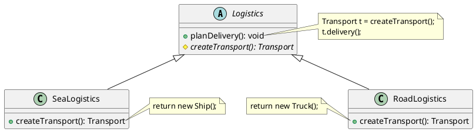
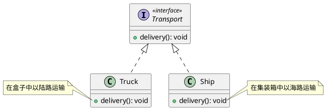
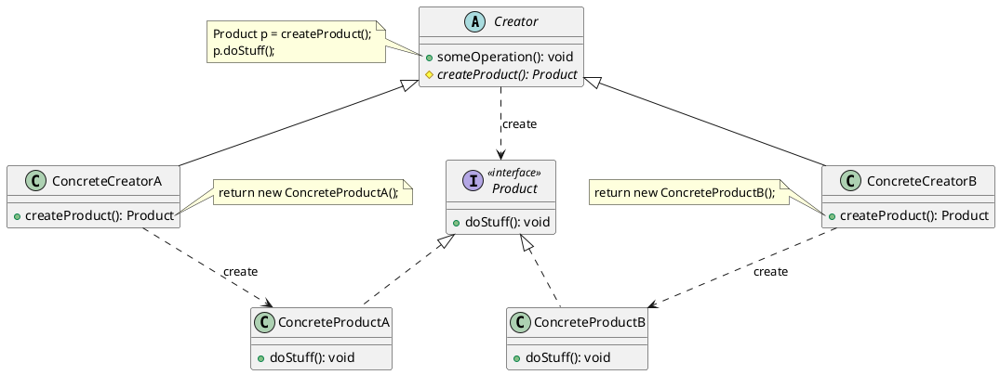
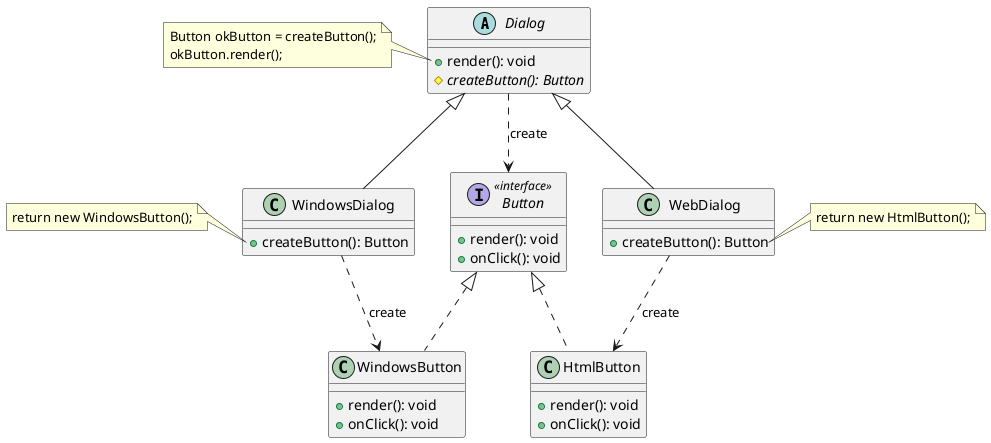

# 工厂方法模式(Factory Method)

## 🎨定义

**工厂方法模式**是一种<span style="background-color: rgb(251, 228, 231);">创建型</span>设计模式。工厂父类负责定义一个创建产品对象的公共接口，而工厂子类则负责生产具体的产品对象，这样做的目的是将产品类的实例化操作延迟到工厂子类中完成，即通过工厂子类来确定究竟要实例化哪一个具体的产品类。

## 🙁问题

假设你正在开发一款物流管理应用。最初的版本只能处理卡车运输，因此大部分代码都在位于 `卡车` 的类中。一段时间后，这款应用变得极受欢迎。你每天都能收到十几次来自海运公司的请求，希望应用能够支持海上物流功能。  


## 🥳解决方案

工厂方法模式建议使用特殊的工厂方法代替对于对象构造函数的直接调用 （即使用 `new` 运算符）。 不用担心， 对象仍将通过 `new` 运算符创建， 只是该运算符改在工厂方法中调用罢了。 工厂方法返回的对象通常被称作 “产品”。  



乍看之下，这种更改可能毫无意义：咱们只是改变了程序中调用构造函数的位置而已。 但是，仔细想一下，现在你可以在**子类中重写工厂方法，从而改变其创建产品的类型**。

> [!NOTE]
>
>  仅当这些产品**具有共同的基类或者接口**时，子类才能返回不同类型的产品， 同时还应将基类中的**工厂方法的返回类型声明为这一共有接口**。  



举例来说，卡车 `Truck` 和轮船 `Ship` 类都必须实现运输 `Transport` 接口，该接口声明了一个名为 `deliver()` 交付的方法。每个类都将以不同的方式实现该方法：卡车走陆路交付货物，轮船走海路交付货物。陆路运输 `RoadLogistics` 类中的工厂方法返回卡车对象，而海路运输 `SeaLogistics` 类则返回轮船对象。


调用工厂方法的代码 （通常被称为*客户端*代码） 无需了解不同子类返回实际对象之间的差别。 客户端将所有产品视为抽象的运输 `Transport`。 客户端知道所有运输对象都提供交付 `deliver()` 方法， 但是并不关心其具体实现方式。

## 🎯结构



- **产品**（Product）将会**对接口进行声明**。对于所有由创建者及其子类构建的对象，这些接口都是通用的；
- **具体产品**（Concrete Prodcuts）是**产品接口的不同实现**；
- **创建者**（Creator）类**声明返回产品对象的工厂方法**。该**方法的返回对象类型必须与产品接口相匹配**。可以**将工厂方法声明为抽象方法**，<u>强制要求</u>每个子类以不同方式实现该方法。或者，也**可以在基础工厂方法中返回默认产品类型**；
- **具体创建者**（Concrete Creators）将会**重写基础工厂方法，使其返回不同类型的产品**。💡**注意**，并**不一定**每次调用工厂方法都会<u>创建</u>**新的实例**。工厂方法也可以返回<u>缓存</u>、<u>对象池</u>或<u>其他来源</u>的**已有对象**。

## 🚀代码示例

[Java 工厂方法模式讲解和代码示例](https://refactoringguru.cn/design-patterns/factory-method/java/example#example-0) 本案例演示如何使用工厂方法模式开发跨平台 UI（用户界面）组件，并同时避免客户端代码与具体 UI 类之间的耦合。

基础对话框类使用不同的 UI 组件渲染窗口。 在不同的操作系统下， 这些组件外观或许略有不同， 但其功能保持一致。 Windows 系统中的按钮在 Linux 系统中仍然是按钮。

如果使用工厂方法， 就不需要为每种操作系统重写对话框逻辑。 如果咱们声明了一个在基本对话框类中生成按钮的工厂方法， 那么咱们就可以创建一个对话框子类， 并使其通过工厂方法返回 Windows 样式按钮。 子类将继承对话框基础类的大部分代码， 同时在屏幕上根据 Windows 样式渲染按钮。

如需该模式正常工作， **基础对话框类必须使用抽象按钮 （例如基类或接口）， 以便将其扩展为具体按钮**。 这样一来， 无论对话框中使用何种类型的按钮， 其代码都可以正常工作。

可以使用此方法开发其他 UI 组件。 不过， 每向对话框中添加一个新的工厂方法 ➡️ <u>**抽象工厂模式**</u>。



在本例中，**按钮担任产品的角色**，**对话框担任创建者的角色**。不同类型的对话框需要其各自类型的元素。因此我们可**为每个对话框类型创建子类并重写其工厂方法**。现在，每种对话框类型都将对合适的按钮类进行初始化。**对话框基类使用其通用接口与对象进行交互**， 因此代码更改后仍能正常工作。

### Button

```java
public interface Button {
    /**
     * 渲染
     */
    void render();

    /**
     * 点击
     */
    void onClick();
}
```

### WindowsButton

```java
public class WindowsButton implements Button {
    private static final JPanel panel = new JPanel();
    private static final JFrame frame = new JFrame();
    private JButton button;

    @Override
    public void render() {
        // 设置默认的关闭操作，点击关闭按钮时退出程序
        frame.setDefaultCloseOperation(JFrame.EXIT_ON_CLOSE);
        // 创建一个标签
        JLabel label = new JLabel("Hello World!");
        // 设置标签是否不透明
        label.setOpaque(true);
        // 设置标签的背景颜色
        label.setBackground(new Color(235, 233, 126));
        // 设置标签的字体
        label.setFont(new Font("Dialog", Font.BOLD, 44));
        // 设置标签水平居中
        label.setHorizontalAlignment(SwingConstants.CENTER);
        // 设置面板布局
        panel.setLayout(new FlowLayout(FlowLayout.CENTER));
        // 添加面板到窗口
        frame.getContentPane().add(panel);
        // 添加标签到面板
        panel.add(label);
        this.onClick();
        // 添加按钮到面板
        panel.add(button);
        // 设置窗口大小
        frame.setSize(320, 200);
        // 窗口居中
        frame.setLocationRelativeTo(null);
        // 显示窗口
        frame.setVisible(true);
    }

    @Override
    public void onClick() {
        button = new JButton("Exit");
        // 设置按钮点击事件
        button.addActionListener(e -> {
            // 隐藏窗口
            frame.setVisible(false);
            // 退出程序
            System.exit(0);
        });
    }
}
```

### HtmlButton

```java
public class HtmlButton implements Button {
    private static final Logger logger = LoggerFactory.getLogger(HtmlButton.class);

    @Override
    public void render() {
        logger.info("<button>Test Button</button>");
        this.onClick();
    }

    @Override
    public void onClick() {
        logger.info("Click! Button says - 'Hello World!'");
    }
}
```

### Dialog

```java
public abstract class Dialog {
    /**
     * 渲染
     */
    public void render() {
        Button okButton = this.createButton();
        okButton.render();
    }

    /**
     * 创建按钮
     *
     * @return Button
     */
    public abstract Button createButton();
}
```

### WindowsDialog

```java
public class WindowsDialog extends Dialog {
    @Override
    public Button createButton() {
        return new WindowsButton();
    }
}
```

### HtmlDialog

```java
public class HtmlDialog extends Dialog {
    @Override
    public Button createButton() {
        return new HtmlButton();
    }
}
```

### Application

```java
public class Application {
    private static Dialog dialog;

    public static void main(String[] args) {
        initialize();
        runBusinessLogic();
    }

    private static void runBusinessLogic() {
        dialog.render();
    }

    /**
     * 根据当前配置或环境设定选择创建者的类型
     */
    private static void initialize() {
        String osName = System.getProperty("os.name").toLowerCase();
        if (osName.contains("windows")) {
            dialog = new WindowsDialog();
        } else if (osName.contains("web")) {
            dialog = new HtmlDialog();
        } else {
            throw new RuntimeException("未知操作系统");
        }
    }
}
```

执行结果如下所示：<br />

## 🎉应用场景

🐞 **当你在编写代码的过程中，如果无法预知对象确切类别及其依赖关系时，可使用工厂方法**。

⚡ 工厂方法**将创建产品的代码与实际使用产品的代码分离**，从而能在不影响其他代码的情况下扩展产品创建部分代码。

例如，如果需要向应用中添加一种新产品，你只需要开发新的创建者子类，然后重写其工厂方法即可。

---

🐞 **如果你希望用户能扩展你软件库或框架的内部组件，可使用工厂方法**。

⚡ 继承可能是扩展软件库或框架默认行为的最简单方法。但是当你使用子类替代标准组件时，框架如何辨识出该子类？解决方案是将各框架中构造组件的代码集中到单个工厂方法中，并在继承该组件之外允许任何人对该方法进行重写。

让我们看看具体是如何实现的。假设你使用开源 UI 框架编写自己的应用。你希望在应用中使用圆形按钮，但是原框架仅支持矩形按钮。你可以使用圆形按钮 `Round­Button` 子类来继承标准的按钮 `Button` 类。 但是，你需要告诉 UI 框架 `UIFramework` 类使用新的子类按钮代替默认按钮。为了实现这个功能，你可以根据基础框架类开发子类圆形按钮 UI `UIWith­Round­Buttons` ，并且重写其 `create­Button()` 创建按钮方法。基类中的该方法返回按钮对象，而你开发的子类返回圆形按钮对象。现在，你就可以使用圆形按钮 UI 类代替 UI 框架类。就是这么简单！

---

🐞 **如果你希望复用现有对象来节省系统资源，而不是每次都重新创建对象，可使用工厂方法**。

⚡ 在处理大型资源密集型对象（比如数据库连接、 文件系统和网络资源）时，你会经常碰到这种资源需求。让我们思考复用现有对象的方法：

1. 首先，你需要创建存储空间来存放所有已经创建的对象；
2. 当他人请求一个对象时，程序将在对象池中搜索可用对象；
3. 然后将其返回给客户端代码；
4. 如果没有可用对象，程序则创建一个新对象（并将其添加到对象池中）。

这些代码可不少！ 而且它们必须位于同一处， 这样才能确保重复代码不会污染程序。

可能最显而易见，也是最方便的方式，就是将这些代码放置在我们试图重用的对象类的构造函数中。 但是从定义上来讲，构造函数始终返回的是**新对象**，其无法返回现有实例。因此，你需要有一个既能够创建新对象，又可以重用现有对象的普通方法。 这听上去和**工厂方法**非常相像。

---

## 📝实现方式

1. **让所有产品都遵循同一接口**。该接口必须声明对所有产品都有意义的方法；
2. **在创建类中添加一个空的（抽象的）工厂方法**。该方法的**返回类型必须遵循通用的产品接口**；
3. 在创建者代码中找到对于产品构造函数的所有引用。将它们依次**替换为对于工厂方法的调用**，同时将创建产品的代码移入工厂方法。你可能需要在工厂方法中添加临时参数来控制返回的产品类型，工厂方法的代码看上去可能非常糟糕。 其中可能会有复杂的 `switch` 分支运算符，用于选择各种需要实例化的产品类。但是不要担心，我们很快就会修复这个问题。
4. 现在，**为工厂方法中的每种产品编写一个创建者子类，然后在子类中重写工厂方法，并将基本方法中的相关创建代码移动到工厂方法中**；
5. 如果应用中的产品类型太多，那么为每个产品创建子类并无太大必要，这时你也可以在子类中复用基类中的控制参数。例如，设想你有以下一些层次结构的类。 基类邮件及其子类航空邮件和陆路邮件；运输及其子类飞机、卡车和火车。航空邮件仅使用飞机对象， 而陆路邮件则会同时使用卡车和火车对象。你可以编写一个新的子类（例如火车邮件）来处理这两种情况，但是还有其他可选的方案。客户端代码可以给陆路邮件类传递一个参数，用于控制其希望获得的产品，此方式感觉有点类似于 [简单工厂模式](./简单工厂模式.md)。
6. 如果代码经过上述移动后，基础工厂方法中已经没有任何代码，你可以将其转变为**抽象类**。如果基础工厂方法中还有其他语句，你可以将其设置为该方法的**默认行为**。

## ⚖︎优缺点

- ✔️ 你可以避免创建者和具体产品之间的紧密耦合；
- ✔️ **单一职责原则**。你可以将产品创建代码放在程序的单一位置，从而使得代码更容易维护；
- ✔️ **开闭原则**。无需更改现有客户端代码，你就可以在程序中引入新的产品类型；
- ❌ 应用工厂方法模式需要引入许多新的子类 代码可能会因此变得更复杂。最好的情况是将该模式引入创建者类的现有层次结构中。
