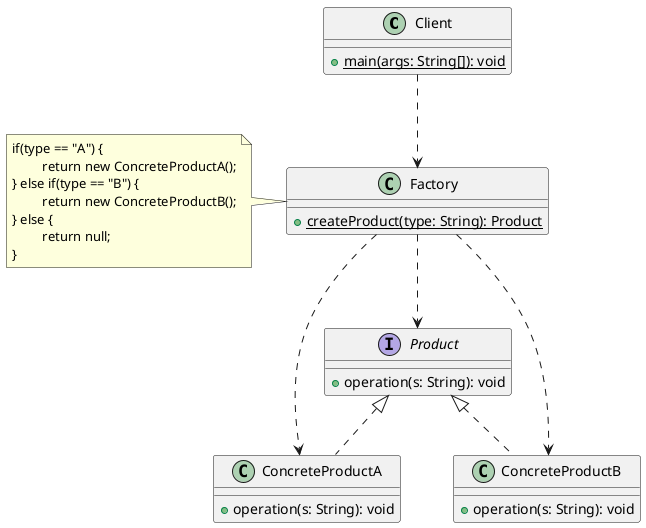

# 简单工厂模式(Simple Factory)

## 定义

专门定义一个工厂类，在其内部有一个静态方法，可以根据参数的不同返回不同类型的实例，这些被创建的实例通常都具有共同的父类。

## 类图



- Factory：工厂角色，它是简单工厂模式的核心，负责实现创建所有实例的内部逻辑；在其内部提供一个静态方法（因此简单工厂模式又被称为静态工厂方法模式），可以根据传入参数的不同返回不同的具体产品类（具体产品角色，ConcreteProduct）的实例，这些实例通常都具有共同的父类（抽象产品角色，Product）；
- Product：抽象产品角色，是所有创建出来的实例对象的父类，负责描述所有实例所共有的公共接口；
- ConcreteProduct：具体产品角色，是简单工厂模式的创建目标。每一个具体产品角色都继承自抽象产品角色，需要实现定义在抽象产品角色中的抽象方法；

## 代码示例

### 基础版

#### 抽象产品角色

某 xx 学院目前已开设有 Java、大数据、人工智能等课程，已然形成一个生态。定义一个课程标准`ICourse`接口：

```java
public interface ICourse {
    /**
     * 录制视频
     */
    public void record();
}
```

#### 具体产品角色

创建一个 Java 课程的实现类`JavaCourse`：

```java
public class JavaCourse implements ICourse {
    @Override
    public void record() {
        System.out.println("录制 Java 课程");
    }
}
```

创建一个 Python 课程的实现类`PythonCourse`：

```java
public class PythonCourse implements ICourse {
    @Override
    public void record() {
        System.out.println("录制 Python 课程");
    }
}
```

#### 工厂角色

- 在使用简单工厂模式的时候，通常不需要创建简单工厂类的实例，没有创建实例的必要。因此可以把简单工厂类当作一个工具类，方法直接定义成**静态方法**即可。
- 如果要防止客户端无谓地创建简单工厂实例，还可以把简单工厂类的**构造方法私有化**。
- 简单工厂命名建议：
  - 类名称建议为"模块名称+Factory"
  - 方法名称通常为"get+接口名称"或者是"create+接口名称"。

```java
public class CourseFactory {
    private CourseFactory() {
    }

    public static ICourse createCourse(String name) {
        if ("java".equals(name)) {
            return new JavaCourse();
        } else if ("python".equals(name)) {
            return new PythonCourse();
        } else {
            return null;
        }
    }
}
```

#### 客户端

```java
class SimpleFactoryTest {
    @Test
    public void test() {
        ICourse course = CourseFactory.createCourse("java");
        if (course != null) {
            course.record();
        }
    }
}
```

### 优化版

> [!important]
> 简单工厂的本质是：<strong style="font-size:19px;">选择实现</strong >

简单工厂方法的内部主要实现的功能是"**选择合适的实现类**"来创建实例对象。既然要实现选择，那么就需要选择的条件或者是选择的参数，选择条件或参数的来源通常又有以下几种。

- 来源于客户端传入的参数
- 来源于配置文件

如果现在想要再增加一种产品，该怎么办？那就需要修改工厂类，加入新的判断和选择，才能把新的产品添加到现有的系统中。这种方式**违反开闭原则**，每次新增加一种产品都不得不修改工厂类的代码逻辑，而且在产品类型较多时，有可能造成工厂逻辑过于复杂，不利于系统的扩展和维护。<br />那么该怎么解决上面的问题呢？使用**配置文件**（properties | xml），当有了新的产品之后，只要在配置文件中配置上新的产品即可。在简单工厂的方法里面可以使用**反射**或者 IOC/DI（控制反转/依赖注入，这个不在这里讨论）来实现。<br />回到代码示例中，比如说新增加一个 Go 课程，代码该如何优化呢？

#### 具体产品角色

创建一个 Go 课程的实现类`GoCourse`：

```java
public class GoCourse implements ICourse{
    @Override
    public void record() {
        System.out.println("录制 Go 课程");
    }
}
```

#### 配置文件

配置文件选用最简单的 properties 文件，实际开发中多是 xml 文件。

```properties
type = fun.xiaorang.designpattern.simplefactory.GoCourse
```

#### 工厂角色

通过读取配置文件 + 反射技术来获取需要创建的实例对象。

```java
public class CourseFactory {
    private CourseFactory() {
    }

    public static ICourse createCourse() {
        try (InputStream in = CourseFactory.class.getResourceAsStream("/simple-factory.properties")) {
            Properties properties = new Properties();
            properties.load(in);
            String type = properties.getProperty("type");
            return (ICourse) Class.forName(type).newInstance();
        } catch (Exception e) {
            throw new RuntimeException(e);
        }
    }
}
```

#### 客户端

此时客户端就变得很简单了，不再需要传入参数。

```java
class SimpleFactoryTest {
    @Test
    public void test() {
        ICourse course = CourseFactory.createCourse();
        course.record();
    }
}
```

## 模式分析

- 优点
  - 工厂**将对象的创建与使用进行分离**，降低耦合。工厂类含有必要的判断逻辑，可以决定在什么时候创建哪一个产品类的实例，客户端可以免除直接创建产品对象的责任，而仅仅“消费”产品。
  - 工厂提供静态方法，参数简单使用方便。客户端无须知道所创建的具体产品类的类名，只需要知道具体产品类所对应的参数即可，对于一些复杂的类名，通过简单工厂模式可以减少使用者的记忆量。
  - 通过引入配置文件，可以在不修改任何客户端代码的情况下更换和增加新的具体产品类，在一定程度上提高了系统的灵活性。
- 缺点：
  - 工厂职责过重，集中了所有产品的创建逻辑，一旦不能正常工作，整个系统都会瘫痪。
  - 使用简单工厂模式将会增加系统中类的个数，在一定程序上增加了系统的复杂度和理解难度。
  - 简单工厂模式由于使用了静态工厂方法，造成工厂角色无法形成基于继承的等级结构。
- 适用场景：
  - 工厂类负责创建的对象比较少；
  - 客户端不关心创建细节，甚至连类名都不需要记住，只需要知道类型所对应的参数。

## 何时选用简单工厂？

- 如果想要<u>**完全封装隔离具体实现**</u>，让外部只能通过接口来操作封装体，那么可以选用简单工厂，让客户端通过工厂来获取相应的接口，而无须关心具体的实现。
- 如果想要把对外创建对象的职责集中管理和控制，可以选用简单工厂，一个简单工厂可以创建很多的、不相关的对象，可以把对外创建对象的职责集中到一个简单工厂来，从而实现集中管理和控制。

## 常见应用

- JDK java.text.DateFormat 用于格式化一个本地日期或时间
  - `public static final DateFormat getDateInstance();`
  - `public static final DateFormat getDateInstance(int style);`
  - `public static final DateFormat getDateInstance(int style, Locale aLocale);`

- JDK java.util.Calendar
  - `public static Calendar getInstance();`
  - `public static Calendar getInstance(TimeZone zone, Locale aLocale);`
  

## 模式总结

- 创建型模式对类的实例化过程进行了抽象，能够将对象的创建与对象的使用过程分离。
- 简单工厂模式又称为<u>静态工厂方法模式</u>，它属于创建型模式，但是由于违反"**开闭原则**"，因此不属于"GoF"提出的 23 种经典设计模式。
- 在简单工厂模式种，可以根据参数的不同返回不同类的实例。简单工厂模式专门定义一个类来负责创建其他类的实例，被创建的实例通常都具有共同的父类。
- 简单工厂模式包含三个角色：
  - 工厂角色负责实现创建所有实例的内部逻辑；
  - 抽象产品角色是所有创建出来的实例对象的父类，负责描述所有实例所共有的公共接口；
  - 具体产品角色是创建目标，每一个具体产品角色都继承自抽象产品角色。
- 简单工厂模式的**本质**：**选择实现**，需要什么，就传入一个正确的参数获取相应的对象，而不需要知道其创建细节。
- 简单工厂模式最大的优点在于**将对象的创建与使用进行分离**，对象的创建交给专门的工厂类负责，但是其最大的缺点在于工厂类不够灵活，增加新的具体产品需要修改工厂类的判断逻辑代码，而且产品较多时，工厂方法代码将会非常复杂。
- 简单工厂模式适用情况：工厂类负责创建的对象比较少；客户端只知道传入工厂类的参数，对于如何创建对象并不关心。
