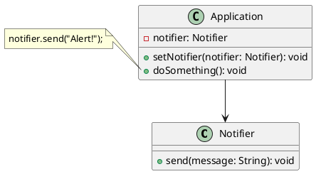
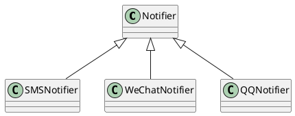
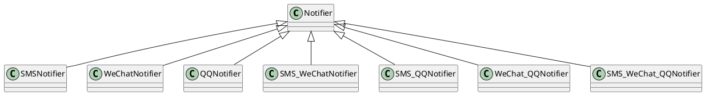
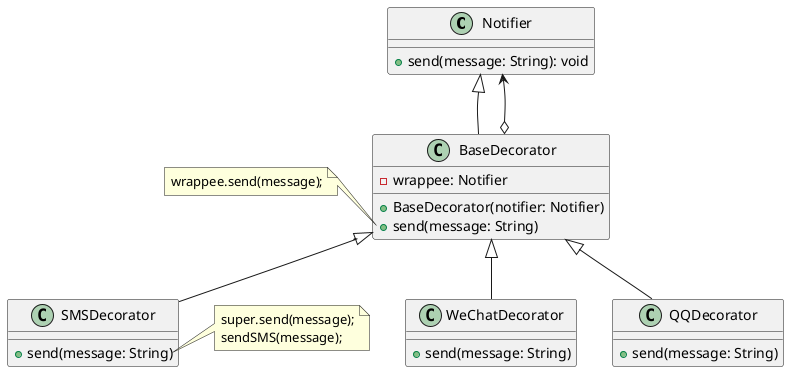
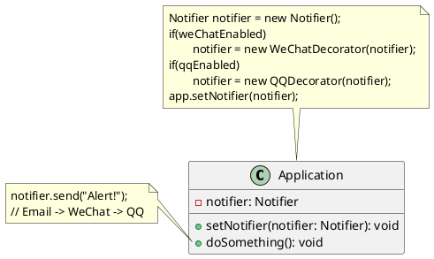
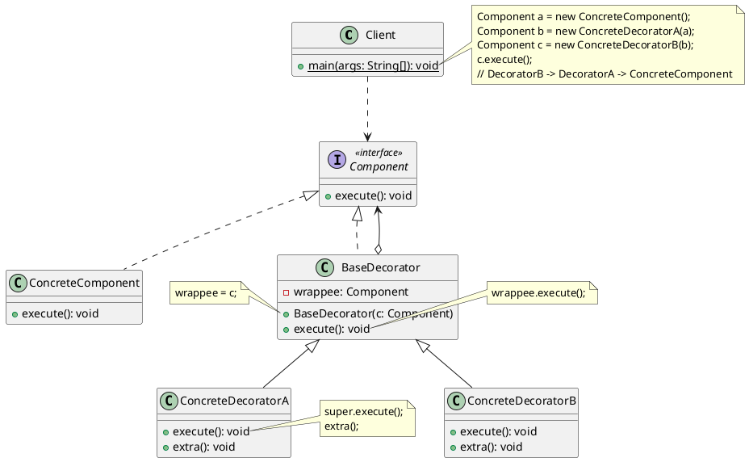

# 装饰器模式 (Decorator)

## 🎨定义

**装饰器模式**是一种<u><span style="background-color: rgb(232, 247, 207);">结构型</span></u>设计模式， 允许你通过将对象放入包含行为的特殊封装对象中来为原对象绑定新的行为。

由于**目标对象和装饰器遵循同一接口**，因此你可用装饰器来对对象进行无限次的装饰，**结果对象将获得所有装饰器叠加而来的行为**。

## 🙁问题

假设你正在开发一个提供通知功能的库，其他程序可使用它向用户发送关于重要事件的通知。

库的最初版本基于通知器 `Notifier` 类，其中只有很少的几个成员变量，一个构造函数和一个核心的 `send()` 发送方法。该方法可以接收来自客户端的消息参数，并将该消息发送给一系列的邮箱， 邮箱列表则是通过构造函数传递给通知器的。作为客户端的第三方程序仅会创建和配置通知器对象一次，然后在有重要事件发生时对其进行调用。



此后某个时刻，你会发现库的用户希望使用除邮件通知之外的功能。许多用户会希望接收关于紧急事件的手机短信，还有些用户希望在微信上接收消息，而公司用户则希望在 QQ 上接收消息。如下所示：将每种通知类型作为通知器的子类得以实现。



这有什么难的呢？首先扩展通知器类，然后在新的子类中加入额外的通知方法。现在客户端要对所需通知形式的对应类进行初始化，然后使用该类发送后续所有的通知消息。

但是很快有人会问：" 为什么不**同时使用多种通知形式**呢？如果房子着火了，你大概会想在所有渠道中都收到相同的消息吧。"

你可以尝试创建一个特殊子类来将多种通知方法组合在一起以解决该问题。但这种方式会使得代码量迅速膨胀，不仅仅是程序库代码，客户端代码也会如此。如下所示：子类组合数量成爆炸式增长。



因此必须找到其他方法来规划通知类的结构，否则它们的数量将会在不经意之间打破吉尼斯纪录！

## 🥳解决方案

当你需要**更改一个对象的行为**时，第一个跳入脑海的想法就是扩展它所属的类。但是，你不能忽视**继承**可能引发的几个严重问题。

- 继承是静态的。你无法在运行时更改已有对象的行为，只能使用由不同子类创建的对象来替代当前的整个对象；
- 子类只能有一个父类。在 Java 不允许一个类同时继承多个类的行为，属于**单继承**；

另外一种方法则是使用**组合（一个对象持有另外一个对象的引用，并将部分工作委派给引用对象）**的方式实现，组合的方式是许多设计模式背后的关键原则（包括装饰器模式在内）。

在装饰器模式中，**装饰器**是一个能与其他**目标对象**连接的对象，**装饰器包含与目标对象相同的一系列方法，即通过实现与目标对象相同的接口，它会将所有接收到的请求委派给目标对象，只不过装饰器可以在将请求委派给目标对象前后对其进行处理**，所以可能会改变最终结果。

因此从客户端的角度来看，这些对象（不管是目标对象还是装饰器对象）是完全一样的。装饰器中的成员变量引用可以是遵循相同接口的任意对象 ➡️ 因此你可以将一个对象放入到多个装饰器中 ➡️ 该对象将具备所有这些装饰器的组合行为。

比如在上面消息通知的示例中，咱们就可以将简单邮件通知行为放在基类 `Notifier` 中，但是将其他的通知方法放入对应不同的装饰器（如 `SMSDecorator`、`WeChatDecorator`、`QQDecorator`）中。



客户端代码必须将基础通知器放入一系列自己所需的装饰器中，因此最后的对象将形成一个<u>**栈（先进后出）**</u>结构。



**实际与客户端进行交互的对象是最后一个进入栈中的装饰器对象**。由于所有的装饰器都实现了与通知基类相同的接口，客户端的其他代码并不在意自己到底是与 " 纯粹 " 的通知器对象，还是与装饰后的通知器对象进行交互。举一反三，咱们可以使用相同方法来实现其他的行为（例如，设置消息格式和创建接收人列表）。只要所有装饰器都遵循相同的接口，客户端就可以使用任意自定义的装饰器来装饰对象。

## 🚗真实世界类比


穿衣服是使用装饰的一个典型例子。当你觉得冷时，你可以穿一件毛衣。如果你穿了毛衣还觉得冷，你可以再套上一件夹克。如果遇到下雨，你还可以再穿上一件雨衣。**所有这些衣物都 " 扩展 " 了你的基本行为，但它们并不是你的一部分，如果你不再需要某件衣物，可以十分方便地随时脱掉**。

## 🎯结构



- 部件（Component）：是所有装饰器和目标对象（即被装饰对象）都需要实现的接口，是整个功能的核心抽象。
- 具体部件（ConcreteComponent）：具体的组件对象，通常就是用来被装饰器进行装饰的目标对象，它实现了 Component 接口最基础、最核心的功能。
- **基础装饰器**（BaseDecorator）：是所有装饰器的抽象父类，与目标对象实现相同的 Component 接口，在该类中持有一个 Component 接口类型的引用，它会将所有接收到的请求委派给引用对象，该引用对象可以是具体的部件或者装饰器，这样设计的话，最终的结果对象将具备所有装饰器以及目标对象的组合行为。
- 具体装饰器（ConcreteDecorator）：定义了可动态添加到部件的额外行为，它会重写父类（基础装饰器）中的方法，并在调用父类方法的前后执行额外的行为。

## 🚀代码示例

[Java 装饰模式讲解和代码示例](https://refactoringguru.cn/design-patterns/decorator/java/example#example-0) 本案例演示如何使用装饰器模式在不改变原有数据读写器代码的前提下，给其增加加解密和解压缩的功能。

最初的业务逻辑类仅能读取和写入纯文本的数据。此后，咱们需要创建两个装饰器，以便在执行标准操作后添加新的行为。其中第一个装饰器负责加密和解密数据，而第二个装饰器则负责压缩和解压数据，甚至可以让这两个装饰器进行嵌套以将它们组合起来。

### 通用数据读写接口

```java
public interface DataSource {
    void writeData(String data);

    String readData();
}
```

### 简单数据读写器

```java
public class FileDataSource implements DataSource {
    private final String fileName;

    public FileDataSource(String fileName) {
        this.fileName = fileName;
    }

    @Override
    public void writeData(String data) {
        try (FileOutputStream fos = new FileOutputStream(fileName)) {
            fos.write(data.getBytes(), 0, data.length());
        } catch (IOException e) {
            throw new RuntimeException(e);
        }
    }

    @Override
    public String readData() {
        try (FileInputStream fis = new FileInputStream(fileName)) {
            byte[] bytes = new byte[fis.available()];
            fis.read(bytes);
            return new String(bytes);
        } catch (IOException e) {
            throw new RuntimeException(e);
        }
    }
}
```

### 基础装饰

```java
public class DataSourceDecorator implements DataSource {
    private final DataSource dataSource;

    public DataSourceDecorator(DataSource dataSource) {
        this.dataSource = dataSource;
    }

    @Override
    public void writeData(String data) {
        dataSource.writeData(data);
    }

    @Override
    public String readData() {
        return dataSource.readData();
    }
}
```

### 加密装饰器

```java
public class EncryptionDecorator extends DataSourceDecorator {
    public EncryptionDecorator(DataSource dataSource) {
        super(dataSource);
    }

    @Override
    public void writeData(String data) {
        super.writeData(encode(data));
    }

    @Override
    public String readData() {
        return decode(super.readData());
    }

    private String encode(String data) {
        byte[] results = data.getBytes();
        for (int i = 0; i < results.length; i++) {
            results[i] += (byte) 1;
        }
        return Base64.getEncoder().encodeToString(results);
    }

    private String decode(String data) {
        byte[] results = Base64.getDecoder().decode(data);
        for (int i = 0; i < results.length; i++) {
            results[i] -= (byte) 1;
        }
        return new String(results);
    }
}
```

### 压缩装饰器

```java
public class CompressionDecorator extends DataSourceDecorator {
    private int compressionLevel = 6;

    public CompressionDecorator(DataSource dataSource) {
        super(dataSource);
    }

    @Override
    public void writeData(String data) {
        super.writeData(compress(data));
    }

    @Override
    public String readData() {
        return decompress(super.readData());
    }

    private String compress(String stringData) {
        byte[] data = stringData.getBytes();
        try (ByteArrayOutputStream bout = new ByteArrayOutputStream(512)) {
            // 此处需要先关闭dos，因为dos是缓冲的，需要先关闭才会将数据写入到bout中
            // 否则的话会因为数据不完整导致解压失败，抛出 EOFException: Unexpected end of ZLIB input stream 异常
            try (DeflaterOutputStream dos = new DeflaterOutputStream(bout, new Deflater(compressionLevel))) {
                dos.write(data);
            }
            return Base64.getEncoder().encodeToString(bout.toByteArray());
        } catch (IOException ex) {
            throw new RuntimeException(ex);
        }
    }

    private String decompress(String stringData) {
        byte[] data = Base64.getDecoder().decode(stringData);
        try (InputStream in = new ByteArrayInputStream(data);
             InflaterInputStream iin = new InflaterInputStream(in);
             ByteArrayOutputStream bout = new ByteArrayOutputStream(512)) {
            int b;
            while ((b = iin.read()) != -1) {
                bout.write(b);
            }
            return bout.toString();
        } catch (IOException ex) {
            throw new RuntimeException(ex);
        }
    }

    public int getCompressionLevel() {
        return compressionLevel;
    }

    public void setCompressionLevel(int compressionLevel) {
        this.compressionLevel = compressionLevel;
    }
}
```

### 测试类

```java
class ApiTest {
    private static final Logger logger = LoggerFactory.getLogger(ApiTest.class);

    @Test
    public void test() {
        String salaryRecords = "Name,Salary\nJohn Smith,100000\nSteven Jobs,912000";
        DataSource plain = new FileDataSource("target/test.txt");
        DataSourceDecorator encoded = new CompressionDecorator(
                new EncryptionDecorator(plain));
        encoded.writeData(salaryRecords);
        logger.info("- Input ----------------");
        logger.info(salaryRecords);
        logger.info("- Encoded --------------");
        logger.info(plain.readData());
        logger.info("- Decoded --------------");
        logger.info(encoded.readData());
    }
}
```

测试结果如下所示：

```
[main] INFO  fun.xiaorang.designpattern.decorator.ApiTest - - Input ----------------
[main] INFO  fun.xiaorang.designpattern.decorator.ApiTest - Name,Salary
John Smith,100000
Steven Jobs,912000
[main] INFO  fun.xiaorang.designpattern.decorator.ApiTest - - Encoded --------------
[main] INFO  fun.xiaorang.designpattern.decorator.ApiTest - Zkt7e1Q5eU8yUm1Qe0ZsdHJ2VXp6dDBKVnhrUHtUe0sxRUYxQkJIdjVLTVZ0dVI5Q2IwOXFISmVUMU5rcENCQmdxRlByaD4+
[main] INFO  fun.xiaorang.designpattern.decorator.ApiTest - - Decoded --------------
[main] INFO  fun.xiaorang.designpattern.decorator.ApiTest - Name,Salary
John Smith,100000
Steven Jobs,912000
```

## 🎉应用场景

🐞 **如果你希望在无需修改代码的情况下即可使用对象，且希望在运行时为对象新增额外的行为，可以使用装饰器模式**。

⚡ 装饰能将业务逻辑组织为层次结构，你可为各层创建一个装饰，在运行时将各种不同逻辑组合成对象。由于这些对象都遵循通用接口，客户端代码能以相同的方式使用这些对象。

---

🐞 **如果用继承来扩展对象行为的方案难以实现或者根本不可行，你可以使用该模式**。

⚡ 在 Java 中会使用 `final` 关键字来限制对某个类的进一步扩展，而复用最终类已有行为的唯一方法就是使用装饰器模式：使用装饰器对其进行装饰。

## 📝实现方式

1. 确保业务逻辑可用一个基本组件及多个额外可选层次表示；
2. 找出基本组件和可选层次的通用方法，然后创建一个**组件（Component）接口**并在其中声明这些方法；
3. 创建一个**具体组件（ConcreteComponent）**类，并定义其基础行为；
4. 创建**基础装饰器（BaseDecorator）**类，使用一个成员变量存储指向被装饰对象的引用，该成员变量必须被声明为**组件（Component）接口**类型，从而能在运行时连接具体组件和装饰。基础装饰器必须将所有工作委派给被封装的对象。
5. 确保所有类实现组件接口；
6. 将基础装饰器扩展为**具体装饰器（ConcreteDecorator）**，具体装饰器必须在调用父类方法 （总是委派给被封装对象） 的前后执行自身的行为。
7. 客户端代码负责创建装饰器以及目标对象并将其组合成客户端所需的形式。

## ⚖︎优缺点

- ✔️ 无需创建新子类即可扩展对象的行为；
- ✔️ 可以在运行时添加或删除对象的功能；
- ✔️ 可以用多个装饰器来装饰对象从而组合多种行为；
- ✔️ **单一职责原则**。可以将实现了许多不同行为的一个大类拆分为多个较小的类；
- ❌ 在封装器栈中删除特定封装器比较困难；
- ❌ 实现行为不受装饰栈顺序影响的装饰比较困难；
- ❌ 各层的初始化配置代码看上去可能会很糟糕；
