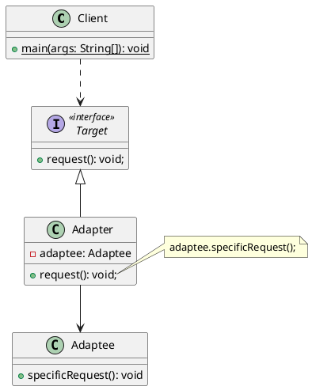
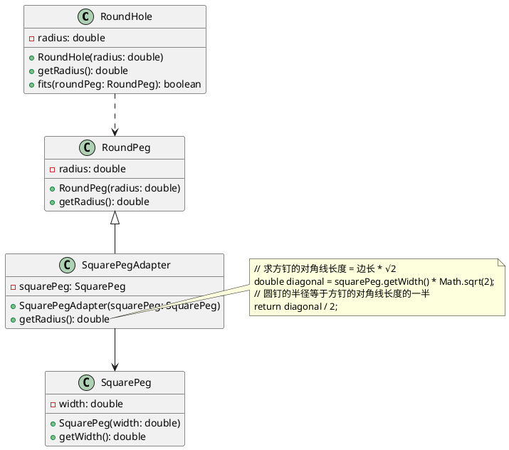

# 适配器模式

## 🎨定义

适配器模式是一种<u><span style="background-color: rgb(232, 247, 207);">结构型</span></u>设计模式，它能使接口不兼容的对象能够相互合作。  

适配器可担任两个对象间的封装器， 它会接收对于一个对象的调用， 并将其转换为另一个对象可识别的格式和接口。

## 🙁问题

假如你正在开发一款股票市场监测程序，它会从不同来源下载 XML 格式的股票数据，然后向用户呈现出美观的图表。

在开发过程中，你决定在程序中整合一个第三方智能分析函数库。但是遇到了一个问题，那就是分析函数库只兼容 JSON 格式的数据。 


你无法 “直接” 使用分析函数库， 因为它所需的输入数据格式与你的程序不兼容。

你可以修改程序库来支持 XML。 但是， 这可能需要修改部分依赖该程序库的现有代码。 甚至还有更糟糕的情况， 你可能根本没有程序库的源代码， 从而无法对其进行修改。

## 🥳解决方案

你可以创建一个**适配器**。这是一个特殊的对象，能够转换对象接口，使其能与其他对象进行交互。 

适配器模式通过封装对象将复杂的转换过程隐藏于幕后。被封装后的对象甚至察觉不到适配器的存在。例如。你可以使用一个将所有数据转换为英制单位（如英尺和英里）的适配器封装运行于米和千米单位制中的对象。  

适配器不仅可以转换不同格式的数据，其还有助于采用不同接口的对象之间的合作。它的运作方式如下所示：

1. 适配器实现与其中一个现有对象兼容的接口；
2. 现有对象可以使用该接口安全地调用适配器方法；
3. 适配器方法被调用后将以另一个对象兼容的格式和顺序将请求传递给该对象；

有时你甚至可以创建一个双向适配器来实现双向转换调用。  


让我们回到股票市场程序。 为了解决数据格式不兼容的问题， 你可以为分析函数库中的每个类创建将 XML 转换为 JSON 格式的适配器， 然后让客户端仅通过这些适配器来与函数库进行交流。 当某个适配器被调用时， 它会将传入的 XML 数据转换为 JSON 结构， 并将其传递给被封装分析对象的相应方法。

## 🚗真实世界类比


如果你是第一次从美国到欧洲旅行， 那么在给笔记本充电时可能会大吃一惊。 不同国家的电源插头和插座标准不同。 美国插头和德国插座不匹配。 同时提供美国标准插座和欧洲标准插头的电源适配器可以解决你的难题。

## 🎯结构

### 对象适配器

实现时使用了构成原则：适配器实现了其中一个对象的接口，并对另一个对象进行封装。类图如下所示：



- Target：目标接口，描述了其他类与客户端代码合作时必须遵循的协议；
- Adaptee：被适配者（aka 服务），存在一些功能类（通常来自第三方或遗留系统）。客户端与其接口不兼容，因此无法直接调用其功能；
- Adapter：适配器，是一个可以同时与客户端和服务交互的类： 它在实现目标接口的同时封装了服务对象。 适配器接受客户端通过适配器接口发起的调用， 并将其转换为适用于被封装服务对象的调用。
- 客户端只需通过目标接口与适配器交互即可，而无需与具体的适配器类耦合。因此，你可以向程序中添加新的适配器类型而无需修改已有代码。这在服务类的接口被更改或替换时很有用：你无需修改客户端代码就可以创建新的适配器类。

### 类适配器

类适配器和对象适配器其实算是同一种思想，只不过实现方式不同。由于 Java 是单继承机制，所以类适配器需要继承自 `src` 类且实现 `dst` 接口。根据**合成复用原则**，使用**组合**的方式替代**继承**的方式，使用对象适配器的方式可以很好的解决类适配器方式局限性的问题。此处就不再对类适配器方式做过多描述，有兴趣的小伙伴可以自行翻阅资料。

### 接口适配器

接口适配器也称**缺省适配器**模式，适用于一个接口不想使用其所有的方法的情况。当不需要全部实现接口提供的方法时，可设计一个抽象类实现接口，并且该接口中每个方法提供一个默认的空实现，那么该抽象类的子类可以有选择性地覆盖父类的某些方法来实现需求。

## 🚀代码示例

[Java 适配器模式讲解和代码示例](https://refactoringguru.cn/design-patterns/adapter/java/example#example-0) 本案例演示如何使用适配器模式解决经典的 " 方钉与圆孔 " 问题，让方钉适配圆孔。



让适配器假扮成一个圆钉（RoundPeg），其半径等于方钉（SquarePeg）横截面对角线的一半（即能够容纳方钉的最小外接圆的半径)。

### 圆孔

```java
public class RoundHole {
    /**
     * 圆孔半径
     */
    private final double radius;

    public RoundHole(double radius) {
        this.radius = radius;
    }

    public double getRadius() {
        return radius;
    }


    /**
     * 判断圆钉是否能放入圆孔
     *
     * @param roundPeg 圆钉
     * @return boolean true:能放入 false:不能放入
     */
    public boolean fits(RoundPeg roundPeg) {
        return this.radius >= roundPeg.getRadius();
    }
}
```

### 圆钉

```java
public class RoundPeg {
    /**
     * 圆钉半径
     */
    private double radius;

    public RoundPeg() {
    }

    public RoundPeg(double radius) {
        this.radius = radius;
    }

    public double getRadius() {
        return radius;
    }
}
```

### 方钉

```java
public class SquarePeg {
    /**
     * 方钉宽度
     */
    private final double width;

    public SquarePeg(double width) {
        this.width = width;
    }

    public double getWidth() {
        return width;
    }

    /**
     * 获取方钉的面积
     *
     * @return double 面积
     */
    public double getSquare() {
        return Math.pow(this.width, 2);
    }
}
```

### 方钉到圆孔的适配器

```java
public class SquarePegAdapter extends RoundPeg {
    private final SquarePeg squarePeg;

    public SquarePegAdapter(SquarePeg squarePeg) {
        this.squarePeg = squarePeg;
    }

    @Override
    public double getRadius() {
        // 求方钉的对角线长度 = 边长 * √2
        double diagonal = squarePeg.getWidth() * Math.sqrt(2);
        // 圆钉的半径等于方钉的对角线长度的一半
        return diagonal / 2;
    }
}
```

### 测试类

```java
public class ApiTest {
    private static final Logger logger = LoggerFactory.getLogger(ApiTest.class);

    @Test
    public void test_00() {
        // 创建圆孔
        RoundHole roundHole = new RoundHole(5);
        // 创建圆钉
        RoundPeg roundPeg = new RoundPeg(5);
        // 判断圆钉是否能放入圆孔
        logger.info("半径为 {} 的圆钉是否能放入半径为 {} 的圆孔中:{}", roundPeg.getRadius(), roundHole.getRadius(), roundHole.fits(roundPeg));

        // 创建方钉
        SquarePeg smallSqPeg = new SquarePeg(2);
        SquarePeg largeSqPeg = new SquarePeg(20);
        // 创建方钉到圆孔的适配器
        SquarePegAdapter smallSqPegAdapter = new SquarePegAdapter(smallSqPeg);
        SquarePegAdapter largeSqPegAdapter = new SquarePegAdapter(largeSqPeg);
        // 判断方钉是否能放入圆孔
        logger.info("宽度为 {} 的方钉是否能放入半径为 {} 的圆孔中:{}", smallSqPeg.getWidth(), roundHole.getRadius(), roundHole.fits(smallSqPegAdapter));
        logger.info("宽度为 {} 的方钉是否能放入半径为 {} 的圆孔中:{}", largeSqPeg.getWidth(), roundHole.getRadius(), roundHole.fits(largeSqPegAdapter));
    }
}
```

测试结果如下所示：<br />

## 🎉应用场景

🐞 **当你希望使用某个类，但是其接口与其他代码不兼容时，可以使用适配器类**。

⚡ 适配器模式允许你创建一个中间层类，其可作为代码与遗留类、第三方或提供怪异接口的类之间的转换器。

---

🐞 **如果您需要复用这样一些类，他们处于同一个继承体系，并且他们又有了额外的一些共同的方法，但是这些共同的方法不是所有在这一继承体系中的子类所具有的共性**。

⚡ 你可以扩展每个子类，将缺少的功能添加到新的子类中。但是，你必须在所有新子类中重复添加这些代码，这样会使得代码有**坏味道**。将缺失功能添加到一个适配器中是一种优雅的解决方案。然后你将可以缺少功能的对象封装到适配器中，从而动态地获取所需功能。如需这一点正常运作，目标类必须要有通用的接口，适配器的成员应当遵循该通用接口。

## 📝实现方式

1. 确保至少有两个类的接口不兼容：
   - 一个无法修改（通常是第三方、遗留系统或者存在众多已有依赖的类）的功能性服务类。
   - 一个或多个将受益于使用服务类的客户端类。
2. 声明客户端接口，描述客户端如何与服务交互。
3. 创建遵循客户端接口的适配器类。所有方法暂时都为空。
4. **在适配器类中添加一个成员变量用于保存对于服务对象的引用**。通常情况下会通过构造函数对该成员变量进行初始化，但有时在调用其方法时将该变量传递给适配器会更方便。
5. 依次使用适配器类客户端接口的所有方法。适配器会将实际工作委派给服务对象，自身只负责接口或数据格式的转换。
6. 客户端必须通过目标接口使用适配器。这样一来，你就可以在不影响客户端代码的情况下修改或扩展适配器。

## ⚖︎优缺点

- ✔️ **单一职责原则**。你可以将接口或数据转换代码从程序主要业务逻辑中分离。
- ✔️ **开闭原则**。只要客户端代码通过客户端接口与适配器进行交互，你就能在不修改现有客户端代码的情况下在程序中添加新类型的适配器。
- ❌ 代码整体复杂度增加，因为你需要新增一系列接口和类。有时直接更改服务类使其与其他代码兼容会更简单。
