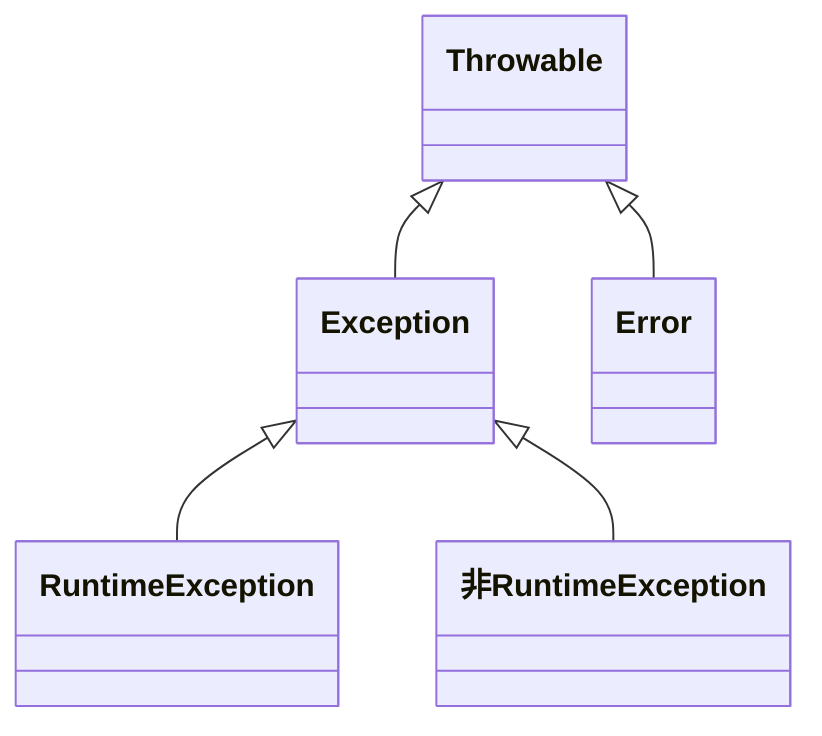

# Java 基础面试题（上）

## 访问修饰符 public、private、protected、以及不写（默认）时的区别？

Java 支持 4 种不同的访问权限。

- **private**：在本类中可见。使用对象：类（不能是外部类）、属性、方法。
- **default**（及默认，什么也不写）：同一个包内可见，不使用任何修饰符。使用对象：类、接口、属性、方法。
- **protected**：对同一个包内的类和所有的子类可见。使用对象：类（不能是外部类）、属性、方法。
- **public**：对所有类都可见。使用对象：类、接口、属性、方法。

| 修饰符    | 本类 | 本包 | 子类 | 其他包 |
| --------- | ---- | ---- | ---- | ------ |
| public    | Y    | Y    | Y    | Y      |
| protected | Y    | Y    | Y    | N      |
| default   | Y    | Y    | N    | N      |
| private   | Y    | N    | N    | N      |

## final、finally、finalize 的区别？

三者并没有任何关系。

- final 是 Java 语言中的一个关键字，使用 final 修饰的对象不允许修改或替换其原始值或定义。final 可以用来修饰类、方法、变量和参数。当 final 修饰类时表示此类不可被继承，所有的方法都不能被重写，表示此类设计的很完美，不需要被修改和扩展；当 final 修饰方法时，表示此方法不允许任何子类重写该方法，表示此方法提供的功能已经满足当前要求，不需要进行扩展；当 final 修饰变量时，通常称被修饰的变量为常量，表示该变量一旦被初始化便不可以被修改；当 final 修饰参数时，表示此参数在整个方法内不允许被修改。
- finally 则是 Java 中保证重点代码一定被执行的一种机制，咱们可以使用 try-finally 或 try-catch-finally 来进行类似关闭 JDBC 连接、释放锁等动作。finally 一定会被执行吗？这是一个有诱导嫌疑的问题，正常情况下，finally 一定是会执行的，但是存在一个特殊情况 finally 是不会执行的，如下：

  ```java
  try{
      LOGGER.debug("执行try中的代码");
      System.exit(0);
  }finally {
      LOGGER.debug("执行finally中的代码");
  }
  ```

  运行之后，便可以发现 finally 中的代码并没有执行到。

- finalize 是 Object 类中的一个基础方法，它的设计目的是用于保证对象在被垃圾收集前完成特定资源的回收，但在 JDK9 中已经被标记为弃用的方法，在实际开发中不推荐使用 finalize 方法，它虽然被创造出来，但无法保证 finalize 方法一定会被执行，所以不要依赖它释放任何资源，因为它的执行极不“稳定”，在 JDK9 中将它废弃也很好的证明了此观点。

## a = a + b 与 a += b 的区别？

首先请看下面这个例子：

```java
public class Test7 {
    public static void main(String[] args) {
        byte a = 127;
        short b = 30000;
        b = a + b; // error : cannot convert from int to byte
		b += a; // ok
    }
}
```

发生以上情况的原因有两点：

- `byte` 或者 `short` 类型的数据在做加法运算的时候 JVM 会帮咱们将数据类型提升为 `int` 类型，这是因为 JVM 的指令集都是跟具体的特定的数据类型绑定的，对于 `byte` 和 `short` 类型的加法运算 JVM 都是不支持的，如果要进行这些类型的加法运算，JVM 的操作是将这些数据类型先转换为 `int` 类型，然后再进行加法运算，此时如果你将运算结果赋给一个 `byte` 类型，那么一定要做强制类型转换，否则编译期就会报错。
- 数学符号和加号连用的时候，编译器会做隐式类型转换。反编译之后的代码如下所示：

  ```java
  public class Test7 {
      public Test7() {
      }
  
      public static void main(String[] args) {
          byte a = 127;
          short b = 30000;
          b = (short)(b + a);
      }
  }
  ```

## 重载与重写的区别？

### 重载（Overload）

存在于同一个类中，指一个方法与已经存在的方法名称相同，但参数类型、个数、顺序至少有一个不同。

需要注意的是，**不能根据返回值类型区分**。

### 重写（Override）

存在于继承体系中，指子类实现了一个与父类在方法声明上完全相同的方法。

为了满足 **里氏替换原则**，重写有如下限制：

- 子类方法的访问修饰符范围必须大于等于父类方法，如果父类方法的访问修饰符为 `private` 则子类无法重写该方法。
- 子类方法的返回值类型必须是父类方法的返回值类型或其子类型（小于等于）。
- 子类方法一定不能抛出新的检查异常或者比被父类方法申明更加宽泛的检查型异常（小于等于）。

使用 `@Override` 注解，可以让编译器帮忙检查是否满足上述的限制条件。

## 接口和抽象类的异同点？

- 共同点：
  - 都无法被实例化。
  - 都可以存在抽象方法。
  - 都可以有默认实现的方法（JDK8 之后可以用 `default` 关键字在接口中定义默认方法实现）。
- 区别：
  - 接口是一种 **规范**，而抽象类主要用于 **代码复用**，将子类中的公共代码抽取到父类中。
  - 一个类可以多个接口，但只能继承一个抽象类。
  - 接口中的成员变量只能是 `public static final` 类型，无法被修改且必须有初始值，而抽象类的成员变量默认为 `default` 类型，可以在子类中被重新定义或重新赋值。

## Java 异常体系




- `Throwable`：Java 异常体系的根类，它是所有异常类的超类，其主要有如下两个子类：

  - `Error`：**错误**表示严重的问题，通常是虚拟机或系统本身的问题，不太可能由程序员处理。错误不应该捕获或处理，通常用于表示系统资源耗尽、虚拟机内部错误等情况。常见的有：
    - `StackOverflowError`：表示方法调用栈溢出，通常是由于无限递归或方法调用引起的；
    - `OutOfMemoryError`：表示应用程序耗尽了可用的内存资源，无法继续执行；

  - `Exception`：是程序本身可以捕获并且可以处理的异常。可以分为如下两类：
    - **运行时异常**（RuntimeException）：aka 不受检异常（Unchecked Exception）
      - 运行时异常是不受编译器强制检查的异常，通常表示**编程错误**、**逻辑错误**或其他无法合理预测或处理的情况；
      - 运行时异常是 `RuntimeException` 类及其子类的实例，通常不需要显式处理；
      - 常见的运行时异常有：`ClassCastException`、`ArithmeticException`、`IndexOutOfBoundsException`、`NullPointerException` 等等；
    - 非运行时异常，aka **受检异常**（Checked Exception）
      - 是指 `Exception` 类中除了 `RuntimeException` 及其子类之外的所有异常；
      - 受检查异常是在**编译时**由编译器强制检查的异常，**必须在代码中明确对该异常进行处理，要么使用 `try-catch` 捕获，要么使用 `throws` 语句抛出，否则的话编译不通过**；
      - 常见的受检异常有：`IOException`、`SQLException`、`ClassNotFoundException`、`NoSuchFieldException` 等等；

