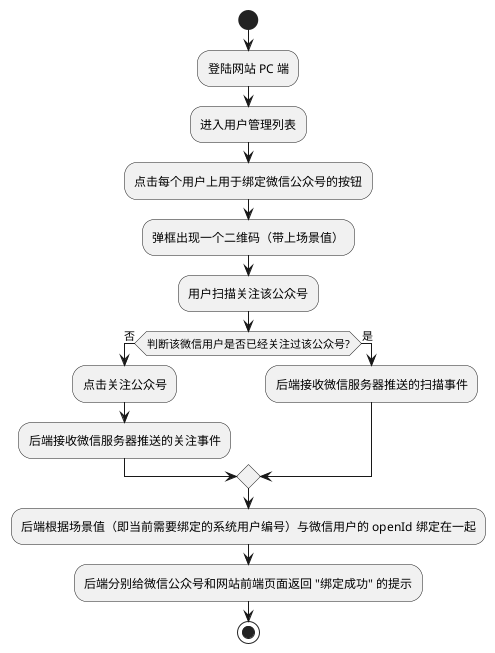

# 微信公众号开发

## 需求

要借助微信公众号给系统中的用户发送通知，其中至关重要的一步就是将公众号用户与系统用户绑定起来。这样在系统需要发送通知给某个用户时，就可以知道应该对哪个关注了公众号的用户发送通知。

## 开发环境搭建

1. 登陆微信公众平台测试号 [微信公众平台](https://mp.weixin.qq.com/debug/cgi-bin/sandbox?t=sandbox/login) <br />

2. 填写测试号中接口配置信息 <br />
      1. 其中 URL `http://e3fnyv.natappfree.cc/wx/mp/portal/appid`中的 appid 整个替换成本人测试号的 appID 即可，如下图所示： <br />
      1. Token 可以随意填写，不做要求。
      1. 点击提交配置，发现没有任何效果！那是因为此时还没有启动后端服务，所以咱们得先去启动后端服务，如果没有后端服务的小伙伴可以参考以下步骤搭建一个后端服务。点击提交配置的时候会把这个 token 发送到微信平台，然后微信平台会请求此 URL 调用开发的微信服务，以便验证服务的可用性和合法性。确保已启动内网穿透 [内网穿透工具](../开发者工具/内网穿透工具.md)，否则不会有任何反应！


3. 引入依赖 `wx-java-mp-spring-boot-starter`

   ```xml
   <dependency>
      <groupId>com.github.binarywang</groupId>
      <artifactId>wx-java-mp-spring-boot-starter</artifactId>
      <version>4.4.0</version>
   </dependency>
   ```

4. 在 application.yml 核心配置文件中增加如下配置信息，其中，appid 和 appsecret 填写本人测试号的，至于 token 与你填写的接口配置信息中的 Token 一致即可。

   ```yaml
   wx:
     mp:
       app-id: xxxxx
       secret: xxxxx
       token: xiaorang
   ```
5. 微信公众号接口回调，参考自 WxJava 关于微信公众号开发的 [示例代码](https://github.com/binarywang/weixin-java-mp-demo/blob/master/src/main/java/com/github/binarywang/demo/wx/mp/controller/WxPortalController.java)

   ```java
   @RestController
   @RequestMapping("/wx/mp/portal/{appid}")
   public class WxPortalController {
       private static final Logger LOGGER = LoggerFactory.getLogger(WxPortalController.class);
       private final WxMpService wxService;
   
       public WxPortalController(WxMpService wxService) {
           this.wxService = wxService;
       }
   
       /**
        * 开发者认证接口
        *
        * @param appid
        * @param signature
        * @param timestamp
        * @param nonce
        * @param echostr
        * @return
        */
       @GetMapping(produces = "text/plain;charset=utf-8")
       public String authGet(@PathVariable String appid,
                             @RequestParam(name = "signature", required = false) String signature,
                             @RequestParam(name = "timestamp", required = false) String timestamp,
                             @RequestParam(name = "nonce", required = false) String nonce,
                             @RequestParam(name = "echostr", required = false) String echostr) {
   
           LOGGER.info("\n接收到来自微信服务器的认证消息：[{}, {}, {}, {}]", signature,
                   timestamp, nonce, echostr);
           if (StringUtils.isAnyBlank(signature, timestamp, nonce, echostr)) {
               throw new IllegalArgumentException("请求参数非法，请核实!");
           }
   
           if (!this.wxService.switchover(appid)) {
               throw new IllegalArgumentException(String.format("未找到对应appid=[%s]的配置，请核实！", appid));
           }
   
           if (wxService.checkSignature(timestamp, nonce, signature)) {
               return echostr;
           }
   
           return "非法请求";
       }
   }
   ```


## 接收与响应消息

### 消息处理器接口

WxJava 针对不同类型的微信消息进行分类处理，用户需要实现不同类型的消息处理器，消息处理器需要实现 `WxMpMessageHandler` 接口。
```java
/**
 * 处理微信推送消息的处理器接口.
 *
 */
public interface WxMpMessageHandler {

  /**
   * 处理微信推送消息.
   *
   * @param wxMessage      微信推送消息
   * @param context        上下文，如果handler或interceptor之间有信息要传递，可以用这个
   * @param wxMpService    服务类
   * @param sessionManager session管理器
   * @return xml格式的消息，如果在异步规则里处理的话，可以返回null
   * @throws WxErrorException 异常
   */
  WxMpXmlOutMessage handle(WxMpXmlMessage wxMessage,
                           Map<String, Object> context,
                           WxMpService wxMpService,
                           WxSessionManager sessionManager) throws WxErrorException;

}
```
### 关注与取消关注事件

1. 实现一个接收关注、取消关注事件推送的消息处理器。首先需要定义关注和取消关注的消息处理器存入 Spring 容器。

   ```java
   @Component
   public class WxMpSubscribeHandler implements WxMpMessageHandler {
       private static final Logger LOGGER = LoggerFactory.getLogger(WxMpSubscribeHandler.class);
   
       @Override
       public WxMpXmlOutMessage handle(WxMpXmlMessage wxMessage, Map<String, Object> context, WxMpService wxMpService, WxSessionManager sessionManager) throws WxErrorException {
           LOGGER.info("新关注用户: {}", wxMessage.getFromUser());
           try {
               // 获取微信用户基本信息
               WxMpUser userWxInfo = wxMpService.getUserService().userInfo(wxMessage.getFromUser(), null);
               if (userWxInfo != null) {
                   // TODO 可以添加关注用户到本地数据库
                   LOGGER.info("用户信息: {}", userWxInfo);
               }
               return WxMpXmlOutMessage.TEXT().fromUser(wxMessage.getToUser()).toUser(wxMessage.getFromUser())
                       .content("欢迎关注！").build();
           } catch (WxErrorException e) {
               if (e.getError().getErrorCode() == 48001) {
                   LOGGER.info("该公众号没有获取用户信息权限！");
               }
           }
           return null;
       }
   }
   ```

   ```java
   @Component
   public class WxMpUnSubscribeHandler implements WxMpMessageHandler {
       private static final Logger LOGGER = LoggerFactory.getLogger(WxMpUnSubscribeHandler.class);
   
       @Override
       public WxMpXmlOutMessage handle(WxMpXmlMessage wxMessage, Map<String, Object> context, WxMpService wxMpService,
                                       WxSessionManager sessionManager) {
           LOGGER.info("用户取消关注: {}", wxMessage.getFromUser());
           // TODO 可以更新本地数据库为取消关注状态
           // 因为已经取消关注，所以即使回复消息也收不到
           return null;
       }
   }
   ```
2. 配置消息路由规则

   ```java
   @Configuration
   public class WeiXinMpConfig {
   	private final WxMpService wxMpService;
   	private final WxMpSubscribeHandler wxMpSubscribeHandler;
   	private final WxMpUnSubscribeHandler wxMpUnSubscribeHandler;
   
   	public WeiXinMpConfig(WxMpService wxMpService, WxMpSubscribeHandler wxMpSubscribeHandler,
   			WxMpUnSubscribeHandler wxMpUnSubscribeHandler) {
   		this.wxMpService = wxMpService;
   		this.wxMpSubscribeHandler = wxMpSubscribeHandler;
   		this.wxMpUnSubscribeHandler = wxMpUnSubscribeHandler;
   	}
   
   	@Bean
   	public WxMpMessageRouter wxMpMessageRouter() {
   		final WxMpMessageRouter router = new WxMpMessageRouter(wxMpService);
   		router.rule().async(false).msgType(WxConsts.XmlMsgType.EVENT).event(WxConsts.EventType.SUBSCRIBE)
   				.handler(wxMpSubscribeHandler).end();
   		router.rule().async(false).msgType(WxConsts.XmlMsgType.EVENT).event(WxConsts.EventType.UNSUBSCRIBE)
   				.handler(wxMpUnSubscribeHandler).end();
   		return router;
   	}
   }
   ```
3. 在 WxPortalController 控制器中增加如下方法用于接收微信请求，参考自 WxJava 关于微信公众号开发的 [示例代码](https://github.com/binarywang/weixin-java-mp-demo/blob/master/src/main/java/com/github/binarywang/demo/wx/mp/controller/WxPortalController.java)

   ```java
   /**
    * 接收事件消息接口
    *
    * @param appid
    * @param requestBody
    * @param signature
    * @param timestamp
    * @param nonce
    * @param openid
    * @param encType
    * @param msgSignature
    * @return
    */
   @PostMapping(produces = "application/xml; charset=UTF-8")
   public String handleMessage(@PathVariable String appid, @RequestBody String requestBody, @RequestParam("signature") String signature, @RequestParam("timestamp") String timestamp, 
                               @RequestParam("nonce") String nonce, @RequestParam("openid") String openid, @RequestParam(name = "encrypt_type", required = false) String encType, 
                               @RequestParam(name = "msg_signature", required = false) String msgSignature) {
       LOGGER.info("\n接收微信请求：[openid=[{}], [signature=[{}], encType=[{}], msgSignature=[{}]," + " timestamp=[{}], nonce=[{}], requestBody=[\n{}\n] ", 
                   openid, signature, encType, msgSignature, timestamp, nonce, requestBody);
   
       if (!wxMpService.switchover(appid)) {
           throw new IllegalArgumentException(String.format("未找到对应appid=[%s]的配置，请核实！", appid));
       }
   
       if (!wxMpService.checkSignature(timestamp, nonce, signature)) {
           throw new IllegalArgumentException("非法请求，可能属于伪造的请求！");
       }
   
       String out = null;
       if (encType == null) {
           // 明文传输的消息
           WxMpXmlMessage inMessage = WxMpXmlMessage.fromXml(requestBody);
           WxMpXmlOutMessage outMessage = this.route(inMessage);
           if (outMessage == null) {
               return "";
           }
   
           out = outMessage.toXml();
       } else if ("aes".equalsIgnoreCase(encType)) {
           // aes加密的消息
           WxMpXmlMessage inMessage = WxMpXmlMessage.fromEncryptedXml(requestBody, wxMpService.getWxMpConfigStorage(), timestamp, nonce, msgSignature);
           LOGGER.debug("\n消息解密后内容为：\n{} ", inMessage.toString());
           WxMpXmlOutMessage outMessage = this.route(inMessage);
           if (outMessage == null) {
               return "";
           }
   
           out = outMessage.toEncryptedXml(wxMpService.getWxMpConfigStorage());
       }
   
       LOGGER.debug("\n组装回复信息：{}", out);
       return out;
   }
   
   private WxMpXmlOutMessage route(WxMpXmlMessage message) {
       try {
           return messageRouter.route(message);
       } catch (Exception e) {
           LOGGER.error("路由消息时出现异常！", e);
       }
       return null;
   }
   ```
4. 测试，当用户扫码关注和取消关注时的情况如下所示：<br /><br />

## 公众号用户与系统用户绑定🎯

其实在 [微信公众号文档](https://developers.weixin.qq.com/doc/offiaccount/Account_Management/Generating_a_Parametric_QR_Code.html) 中已经给出了答案，为了满足用户渠道推广分析和**用户帐号绑定**等场景的需要，公众平台提供了生成带参数二维码的接口。使用该接口可以获得多个带不同场景值的二维码，用户扫描后，公众号可以接收到事件推送。

### 整体流程



一次完整的绑定流程如下：

1. 用户登录网站，进入用户管理列表，点击每个用户上用于绑定微信公众号的按钮；
2. 后端使用微信接口，生成一个二维码链接返回给前端弹框显示，并带上场景值(即当前绑定的用户编号)；
3. 如果用户还未关注公众号，用户扫描二维码，并点击关注微信公众号；后端接收到的是微信服务器推送的**关注事件**，拿到场景值；
4. 如果用户已经关注公众号，用户扫描二维码，直接进入公众号会话；后端接收到的是接收微信服务器推送的**扫描事件**，拿到场景值；
5. 后端将场景值(即当前绑定的用户编号)与微信用户的openId绑定起来；
6. 给微信公众号返回"绑定成功"的提示；
7. 通知网站前台页面，提示"绑定成功"，刷新页面，并返回一些微信用户信息。

### 生成带参数的二维码

> [https://developers.weixin.qq.com/doc/offiaccount/Account_Management/Generating_a_Parametric_QR_Code.html](https://developers.weixin.qq.com/doc/offiaccount/Account_Management/Generating_a_Parametric_QR_Code.html)

为了满足用户渠道推广分析和**用户帐号绑定**等场景的需要，公众平台提供了生成带参数二维码的接口。使用该接口可以获得多个带不同场景值的二维码，用户扫描后，公众号可以接收到事件推送。<br />目前有2种类型的二维码：

1. **临时二维码**，是有过期时间的，最长可以设置为在二维码生成后的**30天**（即2592000秒）后过期，但能够生成较多数量。**临时二维码主要用于帐号绑定等不要求二维码永久保存的业务场景**；
2. **永久二维码**，是无过期时间的，但数量较少（目前为最多10万个）。**永久二维码主要用于适用于帐号绑定、用户来源统计等场景**。

用户扫描带场景值二维码时，可能推送以下两种事件：

1. 如果**用户还未关注公众号**，则用户可以关注公众号，关注后微信会将**带场景值的<u>关注事件</u>推送给开发者**
2. 如果**用户已经关注公众号**，在用户扫描后会自动进入会话，微信也会将**带场景值的<u>扫描事件</u>推送给开发者**

获取带参数（场景值，即当前需要绑定的系统用户编号）的二维码的过程包括两步。首先创建二维码 ticket，然后凭借 ticket 到指定 URL 换取二维码。

#### 创建二维码ticket

每次创建二维码 ticket 需要提供一个开发者自行设定的参数（scene_id），分别介绍临时二维码和永久二维码的创建二维码 ticket 过程。

1. 临时二维码请求说明：

   http请求方式: POST URL: https://api.weixin.qq.com/cgi-bin/qrcode/create?access_token=TOKEN <br />POST数据格式：json POST数据例子：{"expire_seconds": 604800, "action_name": "QR_SCENE", "action_info": {"scene": {"scene_id": 123}}} <br />或者也可以使用以下POST数据创建字符串形式的二维码参数：{"expire_seconds": 604800, "action_name": "QR_STR_SCENE", "action_info": {"scene": {"scene_str": "test"}}}

2. 永久二维码请求说明：

   http请求方式: POST URL: https://api.weixin.qq.com/cgi-bin/qrcode/create?access_token=TOKEN <br />POST数据格式：json POST数据例子：{"action_name": "QR_LIMIT_SCENE", "action_info": {"scene": {"scene_id": 123}}} <br />或者也可以使用以下POST数据创建字符串形式的二维码参数： {"action_name": "QR_LIMIT_STR_SCENE", "action_info": {"scene": {"scene_str": "test"}}}<br />参数说明：

| 参数 | 说明 |
| --- | --- |
| expire_seconds | 该二维码有效时间，以秒为单位。 最大不超过2592000（即30天），此字段如果不填，则默认有效期为30秒。 |
| action_name | 二维码类型，QR_SCENE为临时的整型参数值，QR_STR_SCENE为临时的字符串参数值，QR_LIMIT_SCENE为永久的整型参数值，QR_LIMIT_STR_SCENE为永久的字符串参数值 |
| action_info | 二维码详细信息 |
| scene_id | 场景值ID，临时二维码时为32位非0整型，永久二维码时最大值为100000（目前参数只支持1--100000） |
| scene_str | 场景值ID（字符串形式的ID），字符串类型，长度限制为1到64 |

可以通过 [微信公众平台接口调试工具](https://mp.weixin.qq.com/debug/cgi-bin/apiinfo) 测试一下，先调用获取acess_token的接口获取 token，再调用创建二维码 ticket 接口创建一个带场景值的临时二维码，返回结果如下所示：<br /><br />

参数说明：

| 参数 | 说明 |
| --- | --- |
| ticket | 获取的二维码ticket，凭借此ticket可以在有效时间内换取二维码。 |
| expire_seconds | 该二维码有效时间，以秒为单位。 最大不超过2592000（即30天）。 |
| url | 二维码图片解析后的地址，开发者可根据该地址自行生成需要的二维码图片 |

#### 通过ticket换取二维码

获取二维码ticket后，开发者可用ticket换取二维码图片。请注意，本接口无须登录态即可调用。<br />请求说明：HTTP GET请求（请使用https协议）https://mp.weixin.qq.com/cgi-bin/showqrcode?ticket=TICKET 提醒：TICKET记得进行UrlEncode<br />返回结果：ticket 正确情况下，http 返回码是200，是一张图片，可以直接展示或者下载。<br />再通过 [微信公众平台接口调试工具](https://mp.weixin.qq.com/debug/cgi-bin/apiinfo) 测试一下，二维码图片地址就是下面返回的请求地址。<br /><br />使用微信扫描生成的二维码之后，会跳转到微信公众号（或者开发时用的的测试号)

1. 用户如果没有关注的话，则点击关注时，后端会接收到微信推送过来的**带场景值(系统用户编号)的关注事件**
2. 用户如果已经关注过该公众号，在用户扫描该二维码之后会自动进入会话，后端此时会接收到微信推送过来的**带场景值(系统用户编号)的扫描事件**


### 功能实现

1. 生成带场景值的二维码的接口

   ```java
   @RestController
   @RequestMapping("/wx/mp")
   public class WxMpController {
       private static final Logger LOGGER = LoggerFactory.getLogger(WxMpController.class);
       private final WxMpService wxMpService;
   
       public WxMpController(WxMpService wxMpService) {
           this.wxMpService = wxMpService;
       }
   
       /**
        * 生成带场景值的二维码
        *
        * @param userNo 用户编号
        * @return 二维码URL
        */
       @GetMapping("/qr-code/{userNo}")
       public String createQrCode(@PathVariable String userNo) throws WxErrorException {
           LOGGER.info("当前正在绑定微信公众号的用户编号为: {}", userNo);
           // 获取ticket，时间不填默认30秒，最大30天
           WxMpQrCodeTicket ticket = this.wxMpService.getQrcodeService().qrCodeCreateTmpTicket(userNo, null);
           // 根据ticket创建临时二维码
           return this.wxMpService.getQrcodeService().qrCodePictureUrl(ticket.getTicket());
       }
   }
   ```

   系统用户在点击绑定微信公众号的按钮后，前后发请求调用该接口，返回二维码 URL。咱们使用 ApiFox 测试一下，测试结果如下所示，返回二维码图片地址。<br />

2. 增加用于用于处理已关注用户扫描二维码后微信推送过来的**带场景值的扫描事件**的消息处理器

   ```java
   @Component
   public class WxMpScanHandler implements WxMpMessageHandler {
       private static final Logger LOGGER = LoggerFactory.getLogger(WxMpScanHandler.class);
   
       @Override
       public WxMpXmlOutMessage handle(WxMpXmlMessage wxMessage, Map<String, Object> map, WxMpService wxMpService, WxSessionManager wxSessionManager) throws WxErrorException {
           LOGGER.info("系统用户账号为：{}", wxMessage.getEventKey());
           LOGGER.info("openId: {}", wxMessage.getFromUser());
           return WxMpXmlOutMessage.TEXT().content("绑定系统用户成功！").fromUser(wxMessage.getToUser()).toUser(wxMessage.getFromUser()).build();
       }
   }
   ```

3. 增加消息路由规则

   ```java
   router.rule().async(false).msgType(EVENT).event(SCAN).handler(scanHandler).end();
   ```
4. 更新关注事件消息处理器

   ```java
   @Component
   public class WxMpSubscribeHandler implements WxMpMessageHandler {
       private static final Logger LOGGER = LoggerFactory.getLogger(WxMpSubscribeHandler.class);
   
       @Override
       public WxMpXmlOutMessage handle(WxMpXmlMessage wxMessage, Map<String, Object> context, WxMpService wxMpService, WxSessionManager sessionManager) {
           if (StringUtils.hasText(wxMessage.getEventKey())) {
               // 通过扫描带场景值二维码关注的用户，用于系统绑定用户
               LOGGER.info("用户编号为：{}", wxMessage.getEventKey().split("_")[1]);
           }
           LOGGER.info("新用户关注 OPENID: {}", wxMessage.getFromUser());
           String uri = "http://e3fnyv.natappfree.cc/wx/mp/APPID/callback";
           uri = uri.replace("APPID", wxMpService.getWxMpConfigStorage().getAppId());
           String href = "欢迎关注！<a href=\"" + wxMpService.getOAuth2Service().buildAuthorizationUrl(uri, SNSAPI_USERINFO, wxMpService.getWxMpConfigStorage().getToken()) + "\">请点击此处进行网页授权，测试用！！！</a>";
           return WxMpXmlOutMessage.TEXT().content(href).fromUser(wxMessage.getToUser()).toUser(wxMessage.getFromUser()).build();
       }
   }
   ```
5. 网页授权回调接口

   ```java
   /**
    * 网页授权回调接口
    *
    * @param appid
    * @param code
    * @param state
    * @return
    * @throws WxErrorException
    */
   @GetMapping("/{appid}/callback")
   public WxOAuth2UserInfo callback(@PathVariable String appid, @RequestParam String code, @RequestParam String state) throws WxErrorException {
       LOGGER.info("\n接收微信请求：[appid=[{}], code=[{}], state=[{}]]", appid, code, state);
       if (!Objects.equals(state, wxMpService.getWxMpConfigStorage().getToken())) {
           throw new IllegalArgumentException("非法请求，可能属于伪造的请求！");
       }
       WxOAuth2Service oAuth2Service = wxMpService.getOAuth2Service();
       // 利用code获取accessToken
       WxOAuth2AccessToken accessToken = oAuth2Service.getAccessToken(code);
       // 利用accessToken获取用户信息
       return oAuth2Service.getUserInfo(accessToken, null);
   }
   ```

测试流程：先使用 ApiFox 发送生成带场景值的二维码的请求，获取二维码图片URL，之后用微信扫描该二维码，会出现如下两种情况：

- 如果用户没有关注过该公众号（测试号），则触发关注事件处理器，返回欢迎关注！并在暗中将当前系统用户(userNo)与微信用户(openid)绑定在一起；<br /><br /><br />点击网页授权，出现报错信息， redirect_uri 域名与后台配置不一致，错误码:10003。不用慌，这个东西与本次需求并没有多大的关系，有强迫症的小伙伴可以参考 [网页授权 | 微信开放文档](https://developers.weixin.qq.com/doc/offiaccount/OA_Web_Apps/Wechat_webpage_authorization.html) 找到具体的解决方案。

- 如果用户以前关注过该公众号（测试号），则触发扫描事件处理器，返回绑定系统用户成功！<br /><br /><br />至此，公众号用户与系统用户绑定的整个流程就完成了！

## 模板消息
> [https://developers.weixin.qq.com/doc/offiaccount/Message_Management/Template_Message_Interface.html](https://developers.weixin.qq.com/doc/offiaccount/Message_Management/Template_Message_Interface.html)

模板消息仅用于公众号向用户发送重要的服务通知，只能用于符合其要求的服务场景中，如信用卡刷卡通知，商品购买成功通知等。不支持广告等营销类消息以及其它所有可能对用户造成骚扰的消息。<br />关于使用规则，请注意：

1. 所有服务号都可以在功能->添加功能插件处看到申请模板消息功能的入口，但只有**认证后的服务号才可以申请模板消息的使用权限并获得该权限**；
2. 需要选择公众账号服务所处的2个行业，每月可更改1次所选行业；
3. 在所选择行业的模板库中选用已有的模板进行调用；
4. 每个账号可以同时使用25个模板。
5. 当前每个账号的模板消息的**日调用上限为10万次**，单个模板没有特殊限制。【2014年11月18日将接口调用频率从默认的日1万次提升为日10万次，可在MP登录后的开发者中心查看】。当账号粉丝数超过10W/100W/1000W时，模板消息的日调用上限会相应提升，以公众号MP后台开发者中心页面中标明的数字为准。

关于接口文档，请注意：

1. 模板消息调用时主要需要模板ID和模板中各参数的赋值内容；
2. 模板中参数内容必须以".DATA"结尾，否则视为保留字；
3. 模板保留符号""。

### 发送模板消息

> http请求方式: POST https://api.weixin.qq.com/cgi-bin/message/template/send?access_token=ACCESS_TOKEN

POST数据示例如下：
```json
{
    "touser":"OPENID",
    "template_id":"ngqIpbwh8bUfcSsECmogfXcV14J0tQlEpBO27izEYtY",
    "url":"http://weixin.qq.com/download",  
    "miniprogram":{
        "appid":"xiaochengxuappid12345",
        "pagepath":"index?foo=bar"
        },          
    "data":{
        "first": {
            "value":"恭喜你购买成功！",
            "color":"#173177"
            },
        "keyword1":{
            "value":"巧克力",
            "color":"#173177"
            },
        "keyword2": {
            "value":"39.8元",
            "color":"#173177"
            },
        "keyword3": {
            "value":"2014年9月22日",
            "color":"#173177"
            },
        "remark":{
            "value":"欢迎再次购买！",
            "color":"#173177"
            }
    }
}
```
参数说明：

| 参数 | 是否必填 | 说明 |
| --- | --- | --- |
| touser | **是** | 接收者openid |
| template_id | **是** | 模板ID |
| url | 否 | 模板跳转链接（海外帐号没有跳转能力） |
| miniprogram | 否 | 跳小程序所需数据，不需跳小程序可不用传该数据 |
| appid | **是** | 所需跳转到的小程序appid（该小程序appid必须与发模板消息的公众号是绑定关联关系，暂不支持小游戏） |
| pagepath | 否 | 所需跳转到小程序的具体页面路径，支持带参数,（示例index?foo=bar），要求该小程序已发布，暂不支持小游戏 |
| data | **是** | 模板数据 |
| color | 否 | 模板内容字体颜色，不填默认为黑色 |
| client_msg_id | 否 | 防重入id。对于同一个openid + client_msg_id, 只发送一条消息,10分钟有效,超过10分钟不保证效果。若无防重入需求，可不填 |

**注：url和miniprogram都是非必填字段，若都不传则模板无跳转；若都传，会优先跳转至小程序。开发者可根据实际需要选择其中一种跳转方式即可。当用户的微信客户端版本不支持跳小程序时，将会跳转至url。**
### 添加模板
如果是认证过后的服务号，可以登录微信公众号后台管理，从模板库中添加，如果找不到适合的模板，还可以申请新模板(一个月只可以申请三个模板)；现在测试阶段可以先在测试号中手动添加模板消息，如下所示：
```
{{first.DATA}} 商家名称：{{keyword1.DATA}} 商家电话：{{keyword2.DATA}} 订单号：{{keyword3.DATA}} 状态：{{keyword4.DATA}} 总价：{{keyword5.DATA}} {{remark.DATA}}
```
<br />

### 功能实现

在 WxMpController 控制器中增加发送模板消息接口，其中，接收者openid、模板id、模板跳转链接以及模板数据在此处写死，后续在实际项目中可以根据需要来填写。
```java
/**
 * 发送模板消息
 *
 * @return
 * @throws WxErrorException
 */
@GetMapping("/template-message/send")
public String sendTemplateMessage() throws WxErrorException {
    LOGGER.info(wxMpService.getAccessToken());
    // 发送模板消息接口
    WxMpTemplateMessage templateMessage = WxMpTemplateMessage.builder()
            // 接收者openid
            .toUser("oQeyd6s9Sn8Zp9-OmfZwxgCBEK0E")
            // 模板id
            .templateId("_lHMN4BqWpNlKCZWx7RgNS1bV_SXoYGBxOqUY1bVvRY")
            // 模板跳转链接
            .url("https://www.baidu.com").build();
    // 添加模板数据
    templateMessage
		.addData(new WxMpTemplateData("first", "用餐愉快哦", "#FF00FF"))
		.addData(new WxMpTemplateData("keyword1", "微信点餐", "#A9A9A9"))
		.addData(new WxMpTemplateData("keyword2", "13826913333", "#FF00FF"))
		.addData(new WxMpTemplateData("keyword3", "2021081722150001", "#FF00FF"))
		.addData(new WxMpTemplateData("keyword4", "￥56.5", "#FF00FF"))
		.addData(new WxMpTemplateData("remark", "用餐愉快哦", "#000000"));
    String msgId = null;
    try {
        // 发送模板消息
        msgId = wxMpService.getTemplateMsgService().sendTemplateMsg(templateMessage);
        LOGGER.info(wxMpService.getAccessToken());
        LOGGER.warn("·==++--·推送微信模板信息：{}·--++==·", "成功");
    } catch (WxErrorException e) {
        System.out.println(wxMpService.getAccessToken());
        LOGGER.warn("·==++--·推送微信模板信息：{}·--++==·", "失败");
        e.printStackTrace();
    }
    return msgId;
}
```
其中，接收者openid、模板id以及模板数据都可以在测试号中找到，如下所示：<br /><br />使用 ApiFox 请求发送模板消息，在微信公众号即可收到发送过来的通知信息，如下所示：<br /><br /><br />以上测试结果都是使用测试号调试出来的，那么在实际项目中使用公司服务号的时，该如何配置呢？如下图所示：<br /><br />至此，大功告成！干杯🍺🍺🍺

## 参考资料

- 官方文档
   - [微信公众平台测试号](https://mp.weixin.qq.com/debug/cgi-bin/sandboxinfo?action=showinfo&t=sandbox/index)
   - [公众号文档](https://developers.weixin.qq.com/doc/offiaccount/OA_Web_Apps/Wechat_webpage_authorization.html#0)
   - [公众号后台管理](https://mp.weixin.qq.com/advanced/advanced?action=dev&t=advanced/dev&token=1012990949&lang=zh_CN)
   - [微信公众平台接口调试工具](https://mp.weixin.qq.com/debug/cgi-bin/apiinfo)
- [GitHub - Wechat-Group/WxJava: 微信开发 Java SDK ，支持包括微信支付，开放平台，小程序，企业微信，公众号等的后端开发](https://github.com/Wechat-Group/WxJava)
   - [wx-java-mp-demo](https://github.com/binarywang/weixin-java-mp-demo) 项目实际开发过程中可以参考该示例
   - [比较全面的教程](https://blog.csdn.net/weixin_45070175/article/details/118532572)
   - 微信公众号发送模板消息教程 [1](https://www.cnblogs.com/shouyaya/p/13235897.html) 和 [2](https://www.cnblogs.com/runningA/archive/2020/01/24/12221878.html)

